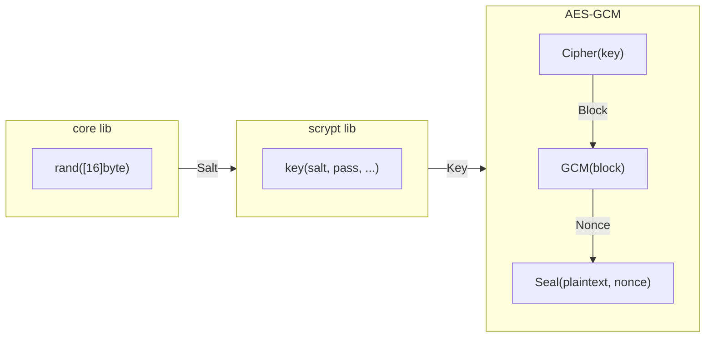
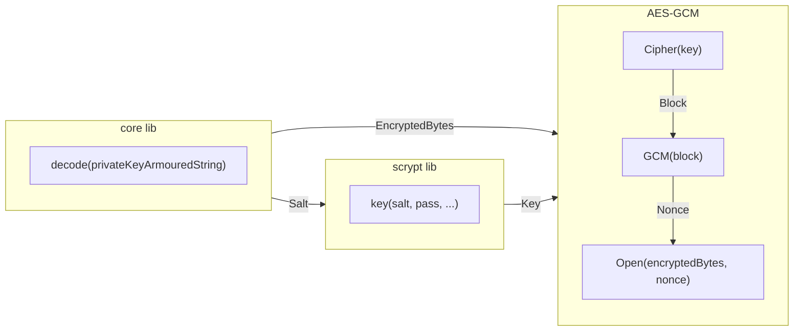

# Keybase

This document is intended to outline the current Keybase implementation used by the V1 client, and is primarily focused on its design and implementation as well as testing.

<!-- TOC -->
* [1. Backend Database](#1-backend-database)
* [2. Keybase Interface](#2-keybase-interface)
  * [2.1. Keybase Code Structure](#21-keybase-code-structure)
  * [2.2. Makefile Helper](#22-makefile-helper)
* [3. KeyPair Interface](#3-keypair-interface)
  * [3.1. KeyPair Code Structure](#31-keypair-code-structure)
* [4. Encryption and Armouring](#4-encryption-and-armouring)
* [5. Testing](#5-testing)
* [6. TODO](#6-todo)
<!-- TOC -->

##  1. Backend Database

The Keybase package uses a filesystem key-value database, `BadgerDB`, as its backend to persistently store keys locally on the client machine.

_The current keybase has not been integrated with any CLI endpoints, and as such is only accessible through the [keybase interface](#keybase-interface); tracked by #150_

The DB stores the local key pairs in `EncKeyPair` structs encoded into `[]byte` using `encoding/gob` this is only used for internal storage in the DB. The `EncKeyPair` struct implements the [KeyPair interface](#keypair-interface) and as such has a number of methods that can be used on it. But relevent to the DB storage of these is the `GetAddressBytes()` function that returns the `[]byte` of the `PublicKey` field's hex address from the struct. The `[]byte` returned by the `GetAddressBytes()` function is used as the key in the key-value store and the value is the `gob` encoded `[]byte` of the `EncKeyPair` struct as a whole - which contains both the `PublicKey` and `PrivKeyArmour` (JSON encoded, encrypted private key string).

The Keybase DB layer then allows for a number of functions to be used which are exposed by the [Keybase interface](#keybase-interface) to fulfill CRUD operations on the DB itself.


##  2. Keybase Interface

The [Keybase interface](./keybase.go) exposes the CRUD operations to operate on keys, and supports the following operations:
- Create password protected private keys
- Export/Import string/json keypairs
- Retrieve public/private keys or keypairs
- List all keys stored
- Check keys exist in the keybase
- Update passphrase on a private key
- Message signing and verification

The `Keybase` interface allows for the import/export of keys between V0<->V1. Meaning any key created in the V0 protocol can be imported in two ways to the V1 protocol.
 1. Via the JSON keyfile
    - This method will take the JSON encoded, encrypted private key, and will import it into the V1 keybase - the `passphrase` supplied must be the same as the one use to encrypt the key in the first place or the key won't be able to be imported
 2. Via the private key hex string
    - This method will directly import the private key from the hex string provided and then encrypt it with the passphrase provided - this does mean than the passphrase can be different from the original as this is a decrypted form of the private key

Although key pairs are stored in the local DB using the `[]byte` of the public key address as the key for retrieval all the accessing methods use the hex string of the public key's address to actually find the key for ease of use.

Keys can be created without the use of any password - in order to do this the `passphrase` supplied to the functions must be `""`. The private key will still be encrypted but will simply use the empty string as the key.


###  2.1. Keybase Code Structure
```
app
└── client
    └── keybase
          ├── README.md
          ├── keybase.go
          ├── keybase_test.go
          └── keystore.go
```

The interface itself is found in [keybase.go](./keybase.go) whereas its implementation can be found in [keystore.go](./keystore.go)


###  2.2. Makefile Helper

To aid in the testing of the local keybase the following `Makefile` command has been exposed `make test_app` which will run the test suites from the `app` module alone, which includes the [keybase_test.go](./keybase_test.go) file which covers the functionality of the `Keybase` implementation


##  3. KeyPair Interface

The [KeyPair interface](../../../shared/crypto/keypair.go) exposes methods related to the operations used on the pairs of `PublicKey` types and JSON encoded, `PrivKeyArmour` strings., such as:
- Retrieve the public key or armoured private key JSON string
- Get Public key address `[]byte` or hex `string`
- Unarmour the private key JSON string
- Export the private key hex string/JSON armoured string

The [KeyPair](../../../shared/crypto/keypair.go) interface is implemented by the `EncKeyPair` struct, which stores the `PublicKey` of the key pair and the JSON encoded, `armoured` key string.

The private key armoured JSON string is created after the [encryption step](#encryption-and-armouring) has encrypted the private key and marshalled it into a JSON string.


###  3.1. KeyPair Code Structure

The KeyPair code is seperated into two files [keypair.go](../../../shared/crypto/keypair.go) and [armour.go](../../../shared/crypto/armour.go)

```
shared
└── crypto
    ├── armour.go
    └── keypair.go
```


##  4. Encryption and Armouring

Whenever a new key is created or imported it is encrypted using the passphrase provided (this can be `""` for no passphrase).



When unarmouring and decrypting the same process is done in reverse.




##  5. Testing

The full test suite can be run with `make test_app` where the [Keybase interface's](#keybase-interface) methods are tested with unit tests.


##  6. TODO

- [ ] Add better error catching and error messages for importing keys with invalid strings/invalid JSON
- [ ] Research and implement threshold signatures and threshold keys
- [ ] Look into a fully feature signature implementation beyond trivial `[]byte` messages
