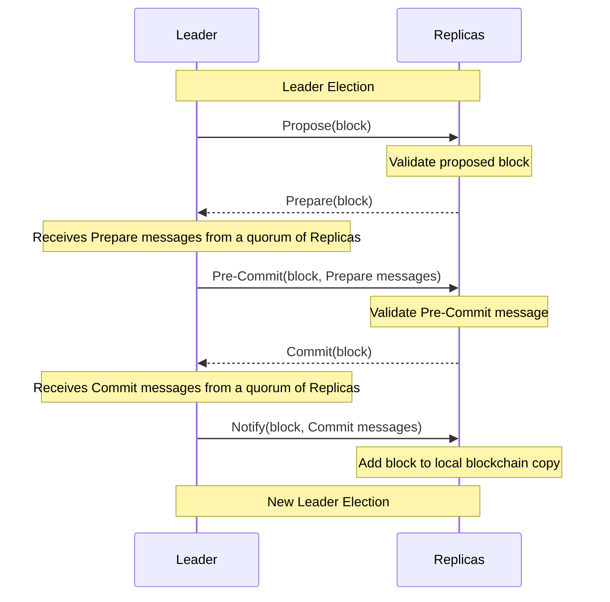
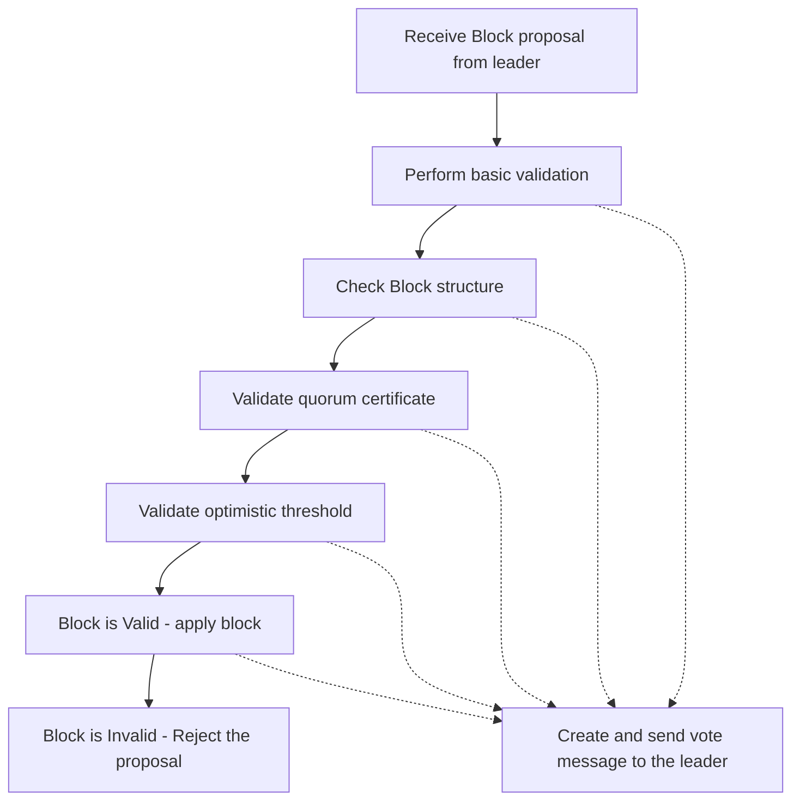
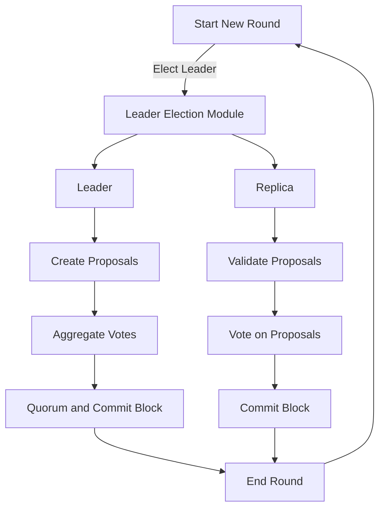
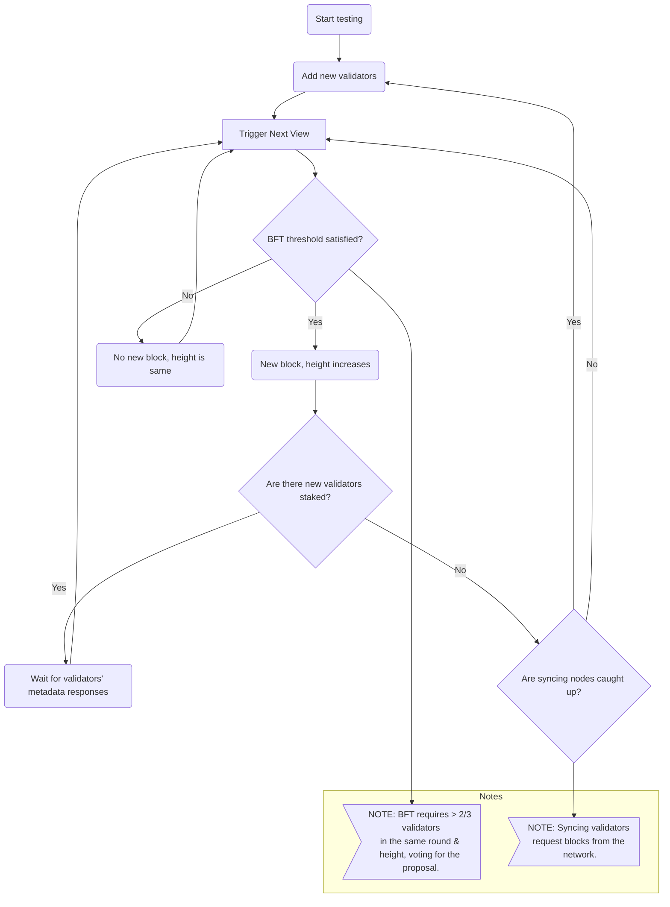

# Consensus Module <!-- omit in toc -->

This README serves as a guide to the implementation of the [1.0 Pocket's Consensus Module Specification](https://github.com/pokt-network/pocket-network-protocol/tree/main/consensus). It is designed to provide insights into the structure and design of the codebase.

## Table of Contents <!-- omit in toc -->

- [Interface](#interface)
- [Consensus Processes](#consensus-processes)
  - [Leader Election](#leader-election)
  - [Consensus Phases](#consensus-phases)
  - [Block Generation](#block-generation)
  - [Block Validation](#block-validation)
  - [Consensus Lifecycle](#consensus-lifecycle)
  - [State Sync](#state-sync)
- [Implementation](#implementation)
  - [Code Organization](#code-organization)
- [Testing](#testing)
  - [Running Unit Tests](#running-unit-tests)

## Interface

This module adheres to the interface outlined in `pocket/shared/modules/consensus_module.go`, which is derived from the above specification.

## Consensus Processes

This repository features an implementation of the HotStuff consensus algorithm. It facilitates the consensus process through a series of rounds. Staked validator nodes participate in the consensus process, with one node serving as the leader and the rest as replicas.

### Leader Election

A dedicated submodule handles the leader election process. The current configuration employs a deterministic round-robin leader election mechanism. We are working towards implementing a randomized leader election mechanism with cryptographic sortition using Verifiable Random Functions (VRFs), see [Algorand's Whitepaper Section 5.1](https://algorandcom.cdn.prismic.io/algorandcom%2Fa26acb80-b80c-46ff-a1ab-a8121f74f3a3_p51-gilad.pdf) for detailed explonation.

### Consensus Phases

The HotStuff consensus algorithm consists of three phases: `Prepare`, `Pre-Commit`, and `Commit`. It is worth to note that recently published [HotStuff 2 research paper](https://eprint.iacr.org/2023/397.pdf) proposes the updated HotStuff consensus algorithm which only needs two phases. 

In each phase of Hotstuff, the leader creates a proposal and broadcasts it to all replica nodes. 

Upon receiving the proposal, each replica node performs a block validation check. If the proposal is valid, the replica node responds to the leader with its signature as a vote.

When the leader collects votes from more than two-thirds of the replicas, it progresses to the next consensus phase. This two-thirds rule is essential to achieve Byzantine Fault Tolerance (BFT), ensuring network resilience against faulty or malicious nodes.

### Block Generation

Block generation in the HotStuff consensus algorithm involves a series of interactive steps between the Leader and the Replica nodes. The steps are as follows:



### Block Validation

Every proposal made by the leader undergo a series of validation steps during the `Prepare` phase, which are carried out by the replicas. However, during the `Pre-commit` and `Commit` phases, the replicas are solely responsible for performing signature validation.



### Consensus Lifecycle

The consensus lifecycle begins with a new round that includes leader election, proposal creation, proposal validation, vote aggregation, and block commitment. The steps are as follows:



### State Sync

State synchronization is crucial to ensure all participating nodes maintain a consistent and up-to-date view of the network state. It is especially important in a dynamic and decentralized network where nodes can join, leave, or experience intermittent connectivity. For an in-depth understanding of the state sync process and its current status, please refer to our [State Sync Protocol Design Specification](https://github.com/pokt-network/pocket/blob/main/consensus/doc/PROTOCOL_STATE_SYNC.md).



## Implementation

### Code Organization

The codebase is organized as follows:

```bash
consensus
├── doc
│   ├── CHANGELOG.md
│   ├── PROTOCOL_STATE_SYNC.md              # State sync protocol definition
├── e2e_tests
│   ├── hotstuff_test.go                    # Hotstuff consensus tests
│   ├── pacemaker_test.go                   # Pacemaker module tests
│   ├── state_sync_test.go                  # State sync tests
│   ├── utils_test.go                       # test utils
├── leader_election
│   ├── sortition
│       └── sortition_test.go               # Sortition tests
│       └── sortition.go                    # Cryptographic sortition implementation
│   ├── vrf
│       └── errors.go
│       └── vrf_test.go                     # VRF tests
│       └── vrf.go                          # VRF implementation
│   ├── module.go                           # Leader election module implementation
├── pacemaker
│   ├── debug.go
│   ├── module.go                           # Pacemaker module implementation
├── state_sync
│   ├── helpers.go
│   ├── interfaces.go
│   ├── module.go                           # State sync module implementation
│   ├── server.go                           # State sync server functions
├── telemetry
│   ├── metrics.go
├── types
│   ├── proto                               # Proto3 messages for generated types
│   ├── actor_mapper_test.go
│   ├── actor_mapper.go
│   ├── messages.go                         # Consensus message definitions
│   ├── types.go                            # Consensus type definitions
├── block.go
├── debugging.go                            # Debug function implementation
├── events.go
├── fsm_handler.go                          # FSM events handler implementation
├── helpers.go
├── hotstuff_handler.go
├── hotstuff_leader.go                      # Hotstuff message handlers for Leader
├── hotstuff_mempool_test.go                # Mempool tests
├── hotstuff_mempool.go                     # Hotstuff transaction mempool implementation
├── hotstuff_replica.go                     # Hotstuff message handlers for Replica
├── messages.go                             # Hotstuff message helpers
├── module_consensus_debugging.go
├── module_consensus_pacemaker.go           # Pacemaker module helpers
├── module_consensus_state_sync.go          # State sync module helpers
├── module.go                               # The implementation of the Consensus Interface
├── README.md                               # Self link to this README
├── state_sync_handler.go                   # State sync message handler
```

## Testing
_TODO: Document the testing framework._

### Running Unit Tests

```bash
make test_consensus
```
