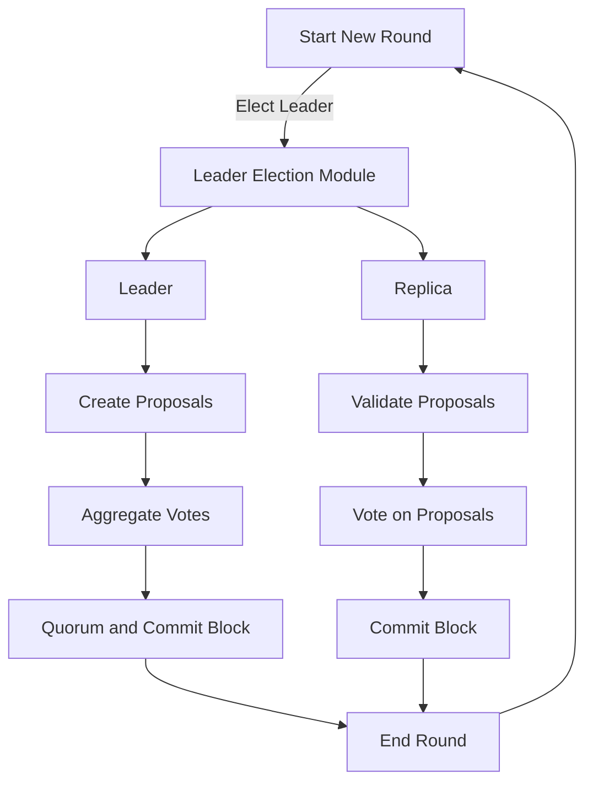

# Consensus Module <!-- omit in toc -->

This document is meant to be a supplement to the living specification of [1.0 Pocket's Consensus Module Specification](https://github.com/pokt-network/pocket-network-protocol/tree/main/consensus) primarily focused on the implementation, and additional details related to the design of the codebase.

## Table of Contents <!-- omit in toc -->

- [Interface](#interface)
- [Consensus Lifecycle](#consensus-lifecycle)
- [Block Validation Process](#block-validation-process)
- [State Sync Process](#state-sync-process)
- [](#)
- [Implementation](#implementation)
  - [Code Architecture](#code-architecture)
  - [Code Organization](#code-organization)
- [Testing](#testing)
  - [Running Unit Tests](#running-unit-tests)

## Interface

This module aims to implement the interface specified in `pocket/shared/modules/consensus_module.go` using the specification above.


## Consensus Lifecycle



## Block Validation Process


## State Sync Process

graph TD
    A(Start testing) --> Z(Add new validators)
    Z --> B[Trigger Next View]
    B --> C{BFT threshold satisfied?}
    C -->|Yes| D(New block, height increases)
    C -->|No| E(No new block, height is same)
    E --> B
    D --> F{Are there new validators staked?}
    F -->|Yes| G(Wait for validators' metadata responses)
    F -->|No| J{Are syncing nodes catched up?}
    J --> |Yes| Z
    J -->|No| B
    G --> B


    subgraph Notes
       note1>NOTE: BFT requires > 2/3 validators<br>in same round & height, voting for proposal.]
       note2>NOTE: Syncing validators request blocks from the network.]
    end

    C --> note1
    J --> note2


## 

## Implementation

### Code Architecture 

```mermaid

```

### Code Organization

```bash
consensus
├── README.md                               # Self link to this README                   
├── module.go                               # The implementation of the Consensus Interface
├── types
│   ├── consensus_genesis.go              # implementation
│   ├── converters.go         
│   ├── errors.go               
│   ├── types.go                          # implementation of the Network interface using RainTree's specification
│   ├── utils.go
│   └── proto
│       └── block.proto
│       └── consensus_config.proto
│       └── consensus_genesis.proto
│       └── hotstuff_types.proto                 
└── utils.go
```

## Testing

_TODO: The work to add the tooling used to help with unit test generation is being tracked in #314._

### Running Unit Tests

```bash
make test_consensus
```