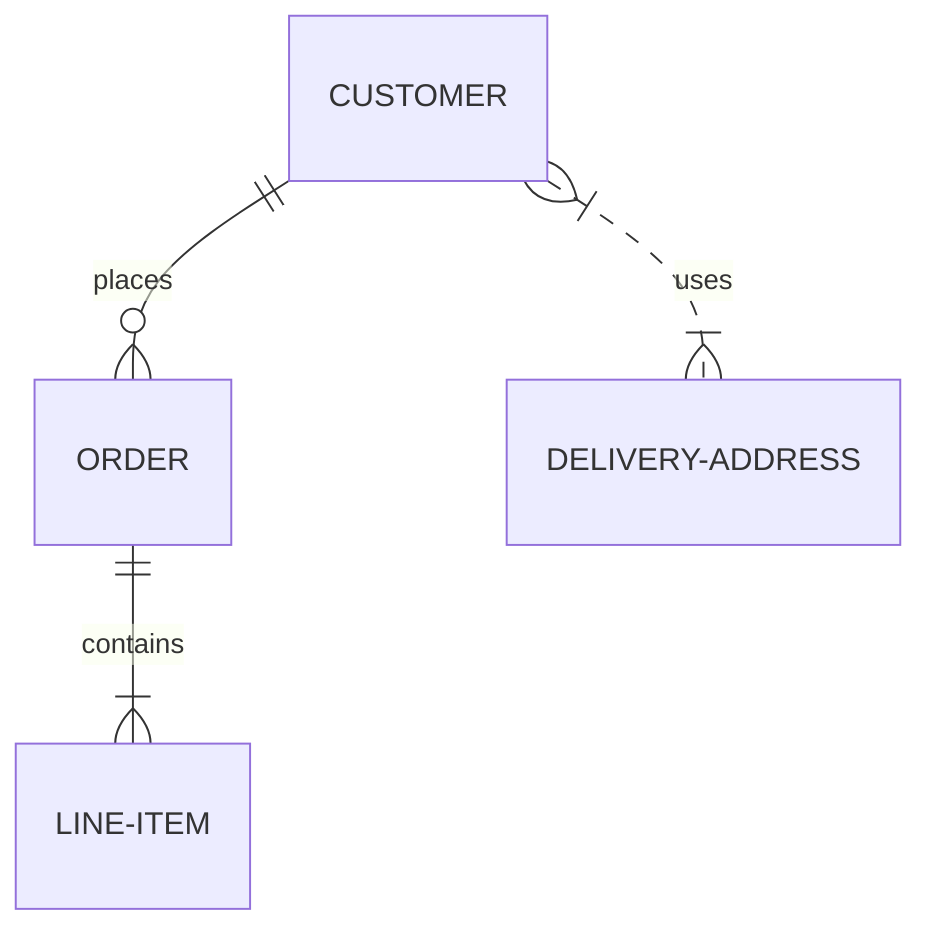
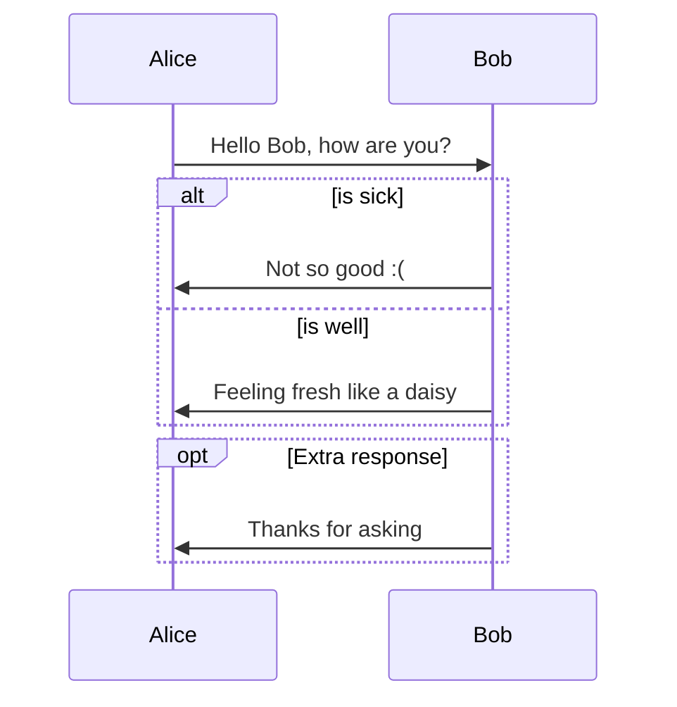
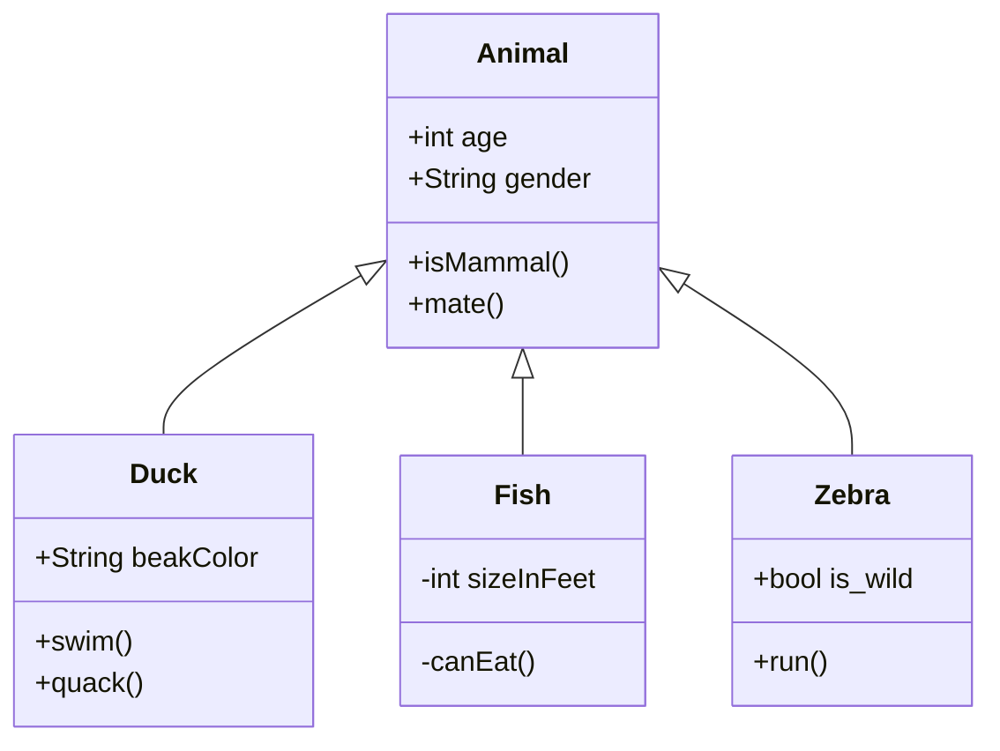
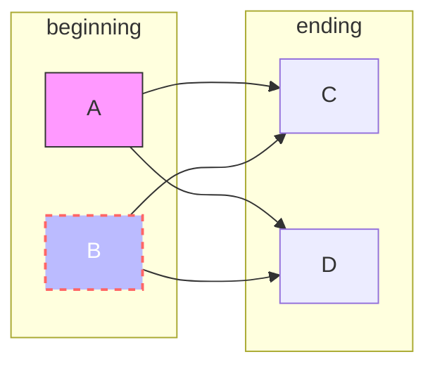
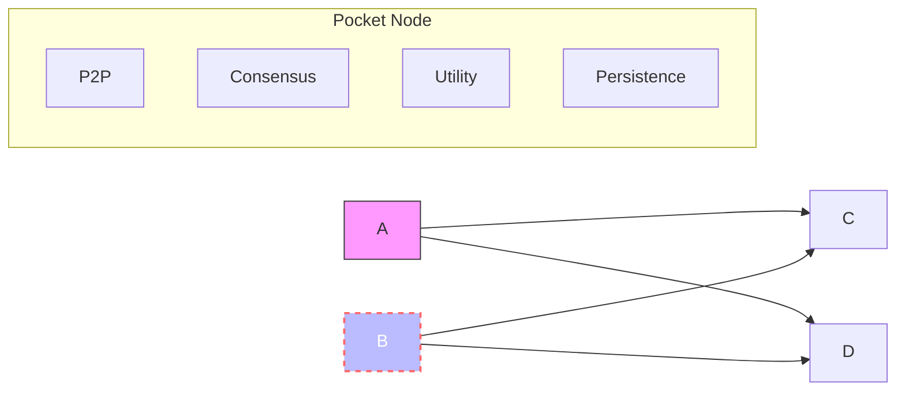

# Consensus Module

The latest version of the consensus spec can be found [here](https://github.com/pokt-network/pocket-network-protocol/tree/main/consensus) and the changelog associated with this specific module can be found [here](./CHANGELOG.md).

## Demo

TODO: Insert video

## Env setup

Since

```
$ make docker_wipe
$ go mod vendor && go mod tidy
$ make mockgen
$ make protogen_local
$ make test_all
```

-     	$ make test_all
- 
-     	@OlshanskyI pulled P2P and the tests fine for me, make sure to run these commands first: $ go mod vendor && go mod tidy $ make mockgen $ make protogen_local $ make test_all

## Testing

### Localnet

First Shell:

```
$ make compose_and_watch
```

Second Shell:

```
$ make client_start
$ make client_connect
> ResetToGenesis
> PrintNodeState # Check committed height is 0
> TriggerNextView
> PrintNodeState # Check committed height is 1
> TriggerNextView
> PrintNodeState # Check committed height is 2
> TogglePacemakerMode # Check that it’s automatic now
> TriggerNextView # Let it rip!
```

## Navigating the code




## Navigating the code





< where do I start>

## Code Structure

< module structure>




