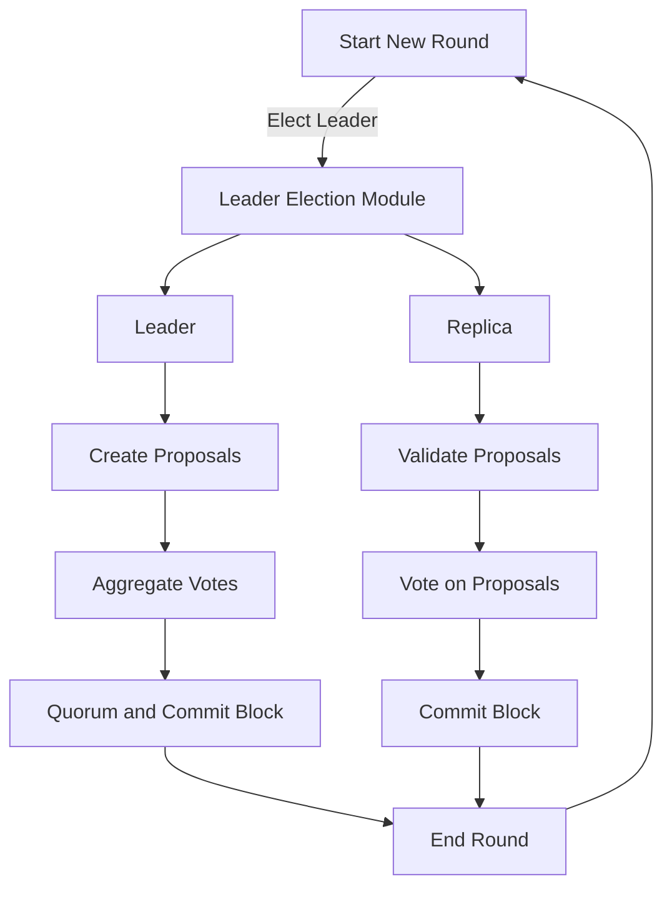

# Consensus Module <!-- omit in toc -->

This document is meant to be a supplement to the living specification of [1.0 Pocket's Consensus Module Specification](https://github.com/pokt-network/pocket-network-protocol/tree/main/consensus) primarily focused on the implementation, and additional details related to the design of the codebase.

## Table of Contents <!-- omit in toc -->

- [Interface](#interface)
- [Implementation](#implementation)
  - [Code Organization](#code-organization)
- [Diagrams](#diagrams)
  - [Consensus Lifecycle](#consensus-lifecycle)
  - [Block Generation Process](#block-generation-process)

## Interface

This module aims to implement the interface specified in `pocket/shared/modules/consensus_module.go` using the specification above.

## Implementation

### Code Organization

```bash
consensus
├── doc
│   ├── CHANGELOG.md                        
│   ├── PROTOCOL_STATE_SYNC.md              # State sync protocol definition
├── e2e_tests
│   ├── hotstuff_test.go                    # Hotstuff consensus tests
│   ├── pacemaker_test.go                   # Pacemaker module tests
│   ├── state_sync_test.go                  # State sync tests
│   ├── utils_test.go                       # test utils
├── leader_election                         
│   ├── sortition                           
│       └── sortition_test.go               # Sortition tests
│       └── sortition.go                    # Cryptographic sortition implementation
│   ├── vrf                                 
│       └── errors.go                       
│       └── vrf_test.go                     # VRF tests
│       └── vrf.go                          # VRF implementation
│   ├── module.go                           # Leader election module implementation
├── pacemaker                                  
│   ├── debug.go                            
│   ├── module.go                           # Pacemaker module implementation
├── state_sync                                 
│   ├── helpers.go                          
│   ├── interfaces.go                       
│   ├── module.go                           # State sync module implementation
│   ├── server.go                           # State sync server functions
├── telemetry   
│   ├── metrics.go                          
├── types
│   ├── proto                               # Proto3 messages for generated types
│   ├── actor_mapper_test.go
│   ├── actor_mapper.go           
│   ├── messages.go                         # Consensus message definitions 
│   ├── types.go                            # Consensus type definitions
├── block.go                                 
├── debugging.go                            # Debug function implementation
├── events.go                                
├── fsm_handler.go                          # FSM events handler implementation
├── helpers.go                              
├── hotstuff_handler.go                     
├── hotstuff_leader.go                      # Hotstuff message handlers for Leader
├── hotstuff_mempool_test.go                # Mempool tests
├── hotstuff_mempool.go                     # Hotstuff transaction mempool implementation
├── hotstuff_replica.go                     # Hotstuff message handlers for Replica
├── messages.go                             # Hotstuff message helpers
├── module_consensus_debugging.go            
├── module_consensus_pacemaker.go           # Pacemaker module helpers
├── module_consensus_state_sync.go          # State sync module helpers
├── module.go                               # The implementation of the Consensus Interface
├── README.md                               # Self link to this README
├── state_sync_handler.go                   # State sync message handler
```

## Diagrams
### Consensus Lifecycle



### Block Generation Process
```mermaid
sequenceDiagram
    participant Leader
    participant Replicas
    Note over Leader,Replicas: Leader Election
    Leader->>Replicas: Propose(block)
    Note over Replicas: Validate proposed block
    Replicas-->>Leader: Prepare(block)
    Note over Leader: Receives Prepare messages from a quorum of Replicas
    Leader->>Replicas: Pre-Commit(block, Prepare messages)
    Note over Replicas: Validate Pre-Commit message
    Replicas-->>Leader: Commit(block)
    Note over Leader: Receives Commit messages from a quorum of Replicas
    Leader->>Replicas: Notify(block, Commit messages)
    Note over Replicas: Add block to local blockchain copy
    Note over Leader,Replicas: New Leader Election
```mermaid


### State Sync Process
```mermaid
graph TD
    A(Start testing) --> Z(Add new validators)
    Z --> B[Trigger Next View]
    B --> C{BFT threshold satisfied?}
    C -->|Yes| D(New block, height increases)
    C -->|No| E(No new block, height is same)
    E --> B
    D --> F{Are there new validators staked?}
    F -->|Yes| G(Wait for validators' metadata responses)
    F -->|No| J{Are syncing nodes catched up?}
    J --> |Yes| Z
    J -->|No| B
    G --> B

    subgraph Notes
       note1>NOTE: BFT requires > 2/3 validators<br>in same round & height, voting for proposal.]
       note2>NOTE: Syncing validators request blocks from the network.]
    end

    C --> note1
    J --> note2
```mermaid

## Testing

_TODO: The work to add the tooling used to help with unit test generation is being tracked in #314._

### Running Unit Tests

```bash
make test_consensus
```