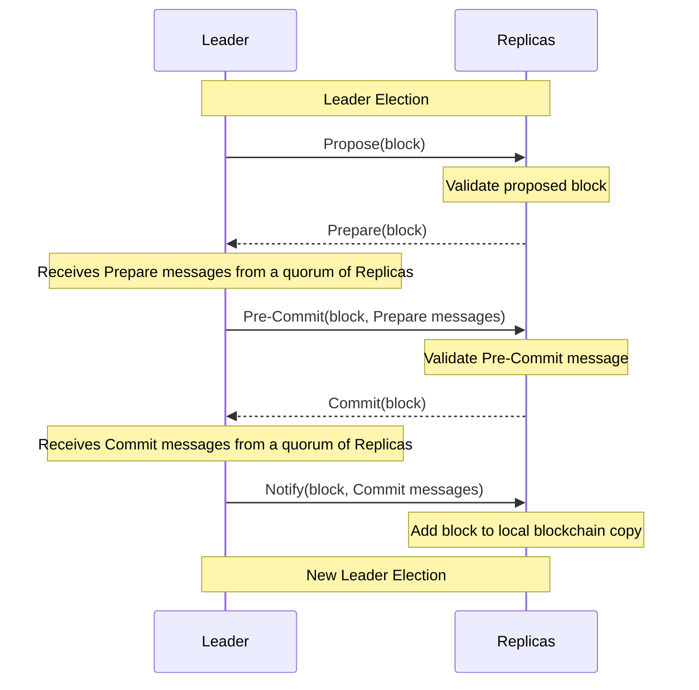
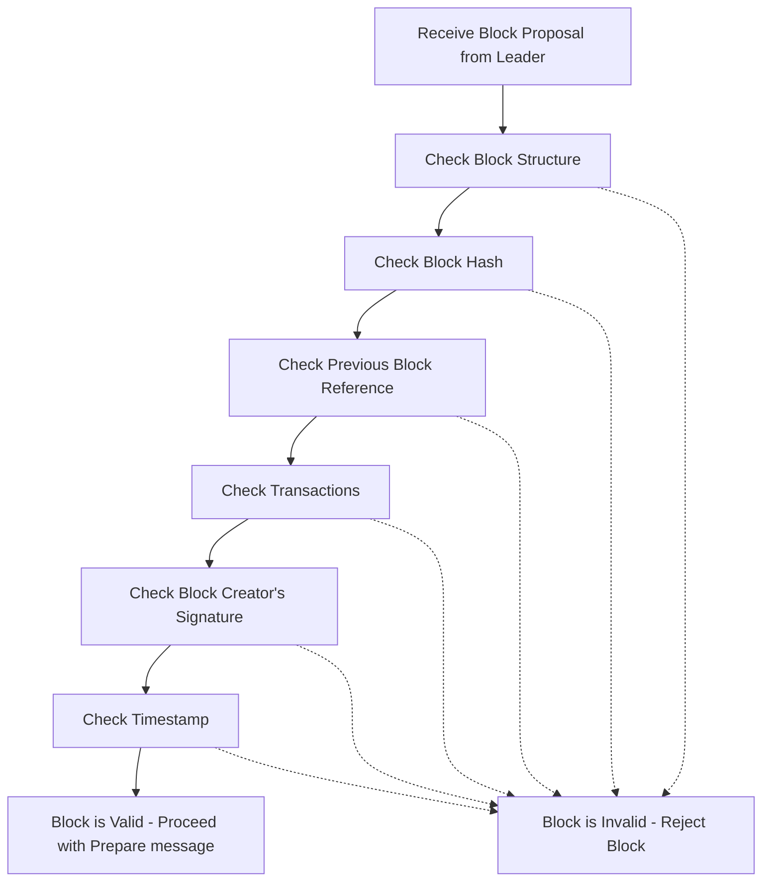
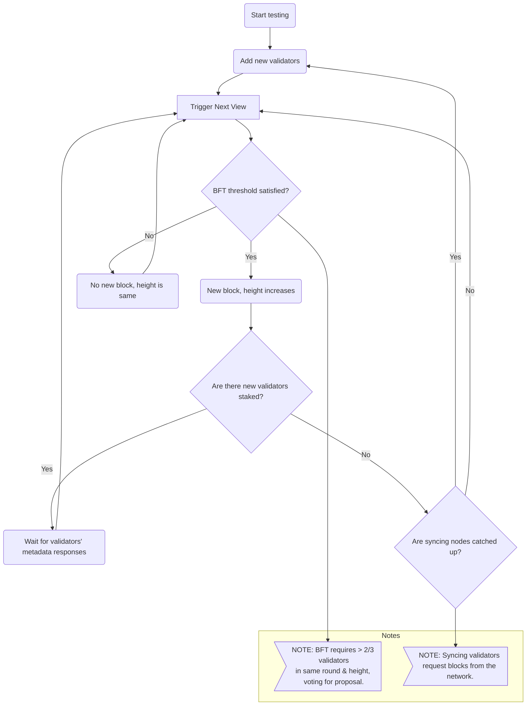
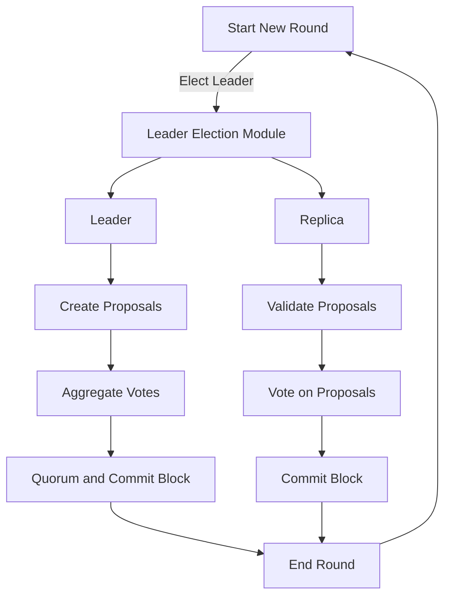

# Consensus Module <!-- omit in toc -->

This document is meant to be a supplement to the living specification of [1.0 Pocket's Consensus Module Specification](https://github.com/pokt-network/pocket-network-protocol/tree/main/consensus) primarily focused on the implementation, and additional details related to the design of the codebase.

## Table of Contents <!-- omit in toc -->

- [Interface](#interface)
- [Consensus Module Lifecycle](#consensus-module-lifecycle)
  - [Leader Election](#leader-election)
  - [Block Generation Process](#consensus-phases)
  - [Block Validation Process](#block-validation-process)
  - [State Sync Process](#state-sync-process)
- [Implementation](#implementation)
  - [Code Organization](#code-organization)
- [Testing](#testing)
  - [Running Unit Tests](#running-unit-tests)

## Interface

This module aims to implement the interface specified in `pocket/shared/modules/consensus_module.go` using the specification above.


## Consensus Module Overview

This repository features an implementation of the HotStuff consensus algorithm. Consensus process is facilitated through a series of rounds. Staked validator nodes participate in the consensus process, where one node is elected as the leader, and the others act as replicas.

### Leader Election

Leader election is handled by a dedicated submodule. In our current configuration, we utilize a deterministic round-robin leader election mechanism as the primary leader election method.

### Consensus Phases

The HotStuff consensus algorithm has three phases: `Prepare`, `Pre-Commit`, and `Commit`. In each phase, the leader creates a proposal and broadcasts it to all replica nodes.

Upon receiving the proposal, each replica node performs block validation check. If the proposal is valid, the replica node responds to the leader with its signature, which acts as its vote.

Once the leader collects votes from more than two-thirds of the replicas, it moves on to the next consensus phase. This two-thirds rule is critical for satisfying the Byzantine Fault Tolerance (BFT) requirement, ensuring the network's resilience against faulty or malicious nodes.


### Block Generation Process


### Block Validation Process



### State Syncronisation

State synchronization is an essential process in our consensus module to ensure that all participating nodes maintain an up-to-date and consistent view of the network state. It is particularly important in a dynamic and decentralized network environment where nodes can join or leave, or might be intermittently offline. For in-depth understanding of the state sync and current status check out our [State Sync Protocol Design Specification](https://github.com/pokt-network/pocket/blob/main/consensus/doc/PROTOCOL_STATE_SYNC.md).





### Consensus Lifecycle




## Implementation

### Code Organization

```bash
consensus
├── doc
│   ├── CHANGELOG.md                        
│   ├── PROTOCOL_STATE_SYNC.md              # State sync protocol definition
├── e2e_tests
│   ├── hotstuff_test.go                    # Hotstuff consensus tests
│   ├── pacemaker_test.go                   # Pacemaker module tests
│   ├── state_sync_test.go                  # State sync tests
│   ├── utils_test.go                       # test utils
├── leader_election                         
│   ├── sortition                           
│       └── sortition_test.go               # Sortition tests
│       └── sortition.go                    # Cryptographic sortition implementation
│   ├── vrf                                 
│       └── errors.go                       
│       └── vrf_test.go                     # VRF tests
│       └── vrf.go                          # VRF implementation
│   ├── module.go                           # Leader election module implementation
├── pacemaker                                  
│   ├── debug.go                            
│   ├── module.go                           # Pacemaker module implementation
├── state_sync                                 
│   ├── helpers.go                          
│   ├── interfaces.go                       
│   ├── module.go                           # State sync module implementation
│   ├── server.go                           # State sync server functions
├── telemetry   
│   ├── metrics.go                          
├── types
│   ├── proto                               # Proto3 messages for generated types
│   ├── actor_mapper_test.go
│   ├── actor_mapper.go           
│   ├── messages.go                         # Consensus message definitions 
│   ├── types.go                            # Consensus type definitions
├── block.go                                 
├── debugging.go                            # Debug function implementation
├── events.go                                
├── fsm_handler.go                          # FSM events handler implementation
├── helpers.go                              
├── hotstuff_handler.go                     
├── hotstuff_leader.go                      # Hotstuff message handlers for Leader
├── hotstuff_mempool_test.go                # Mempool tests
├── hotstuff_mempool.go                     # Hotstuff transaction mempool implementation
├── hotstuff_replica.go                     # Hotstuff message handlers for Replica
├── messages.go                             # Hotstuff message helpers
├── module_consensus_debugging.go            
├── module_consensus_pacemaker.go           # Pacemaker module helpers
├── module_consensus_state_sync.go          # State sync module helpers
├── module.go                               # The implementation of the Consensus Interface
├── README.md                               # Self link to this README
├── state_sync_handler.go                   # State sync message handler
```

## Testing

### Running Unit Tests

```bash
make test_consensus
```