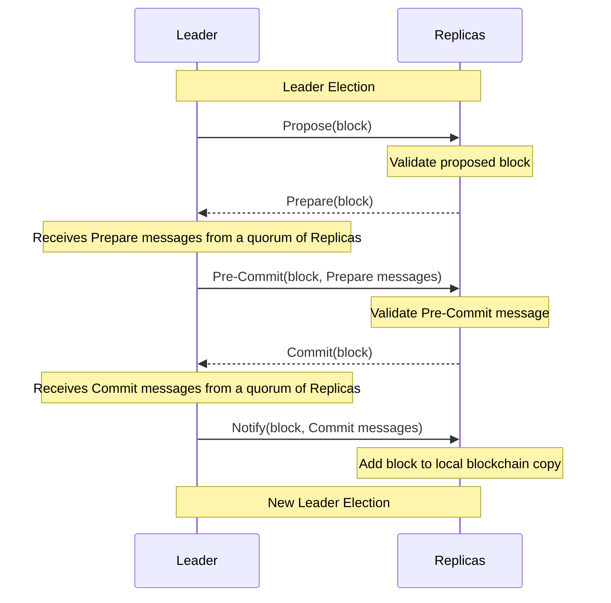
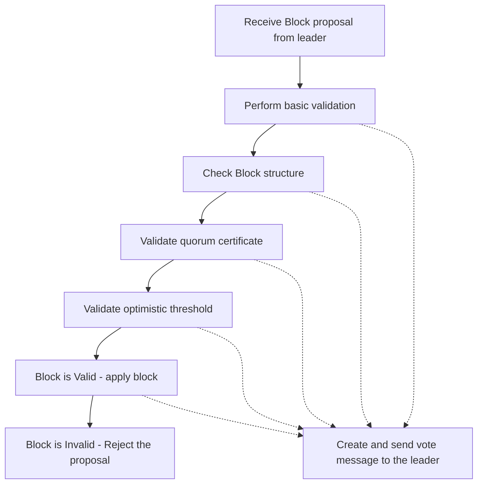
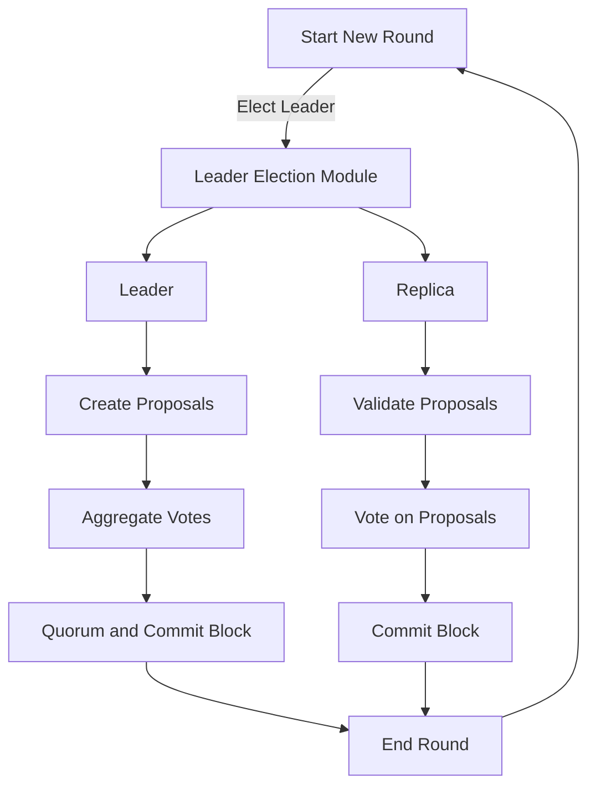
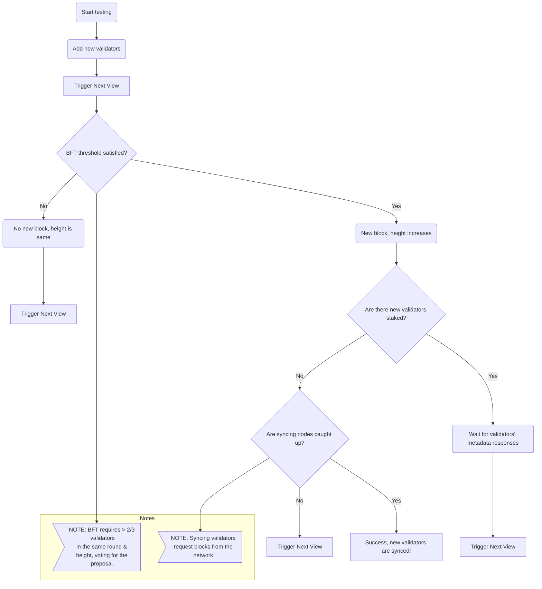
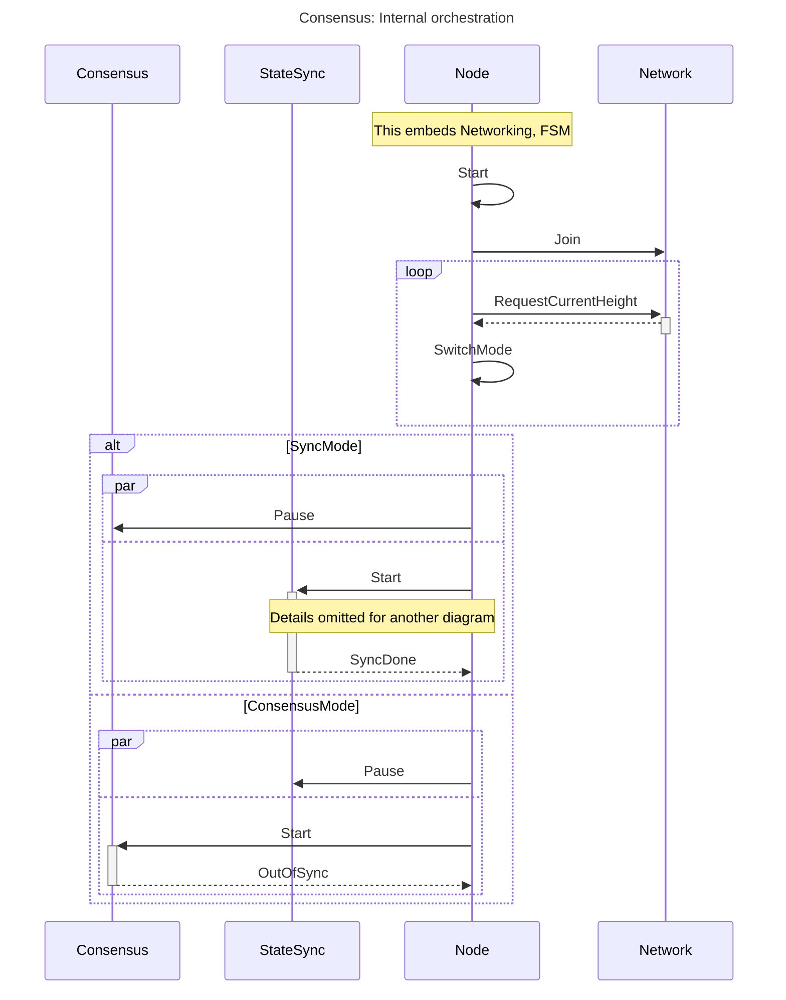
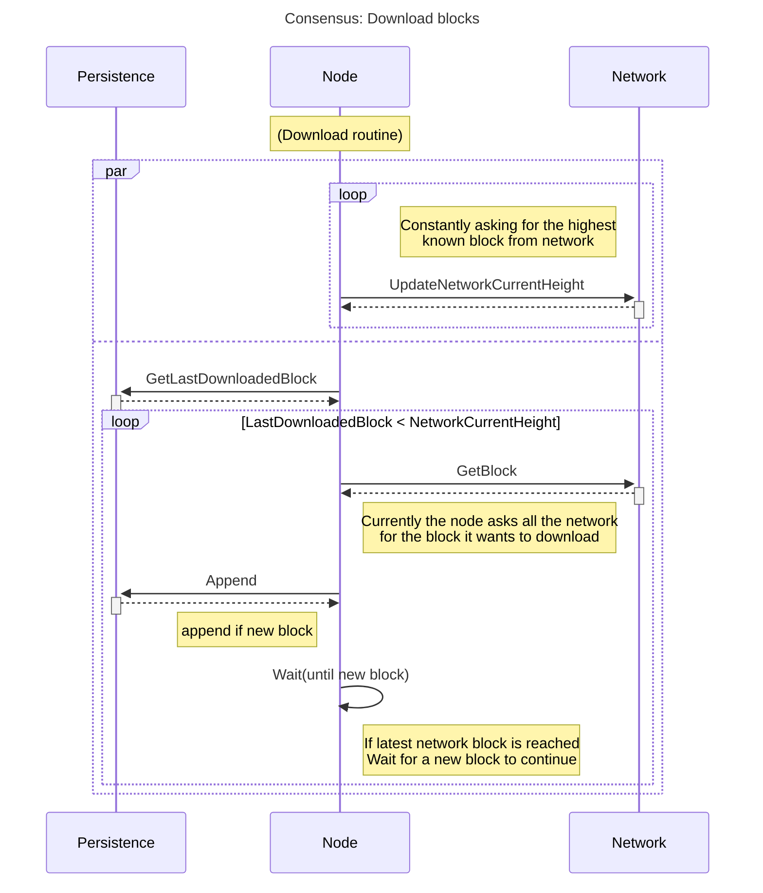
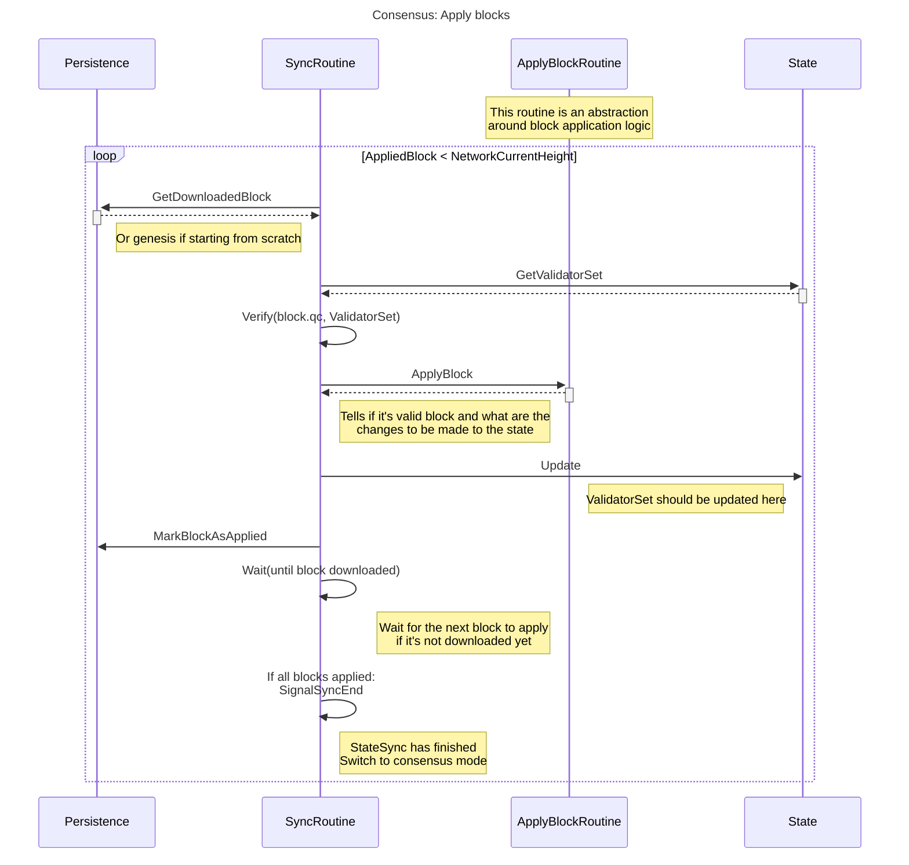
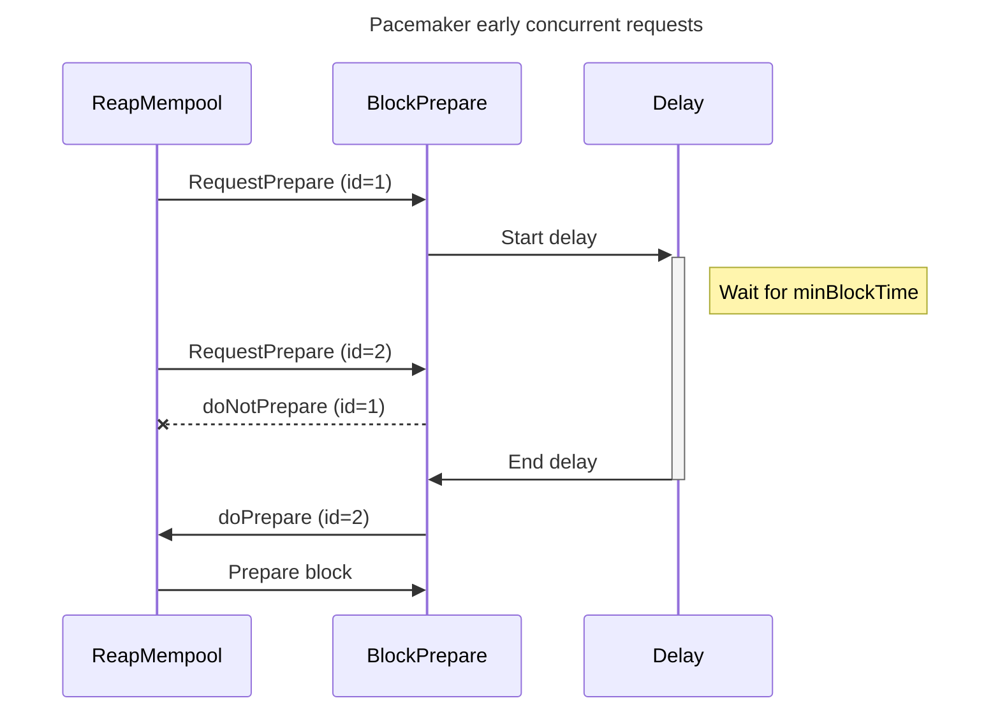
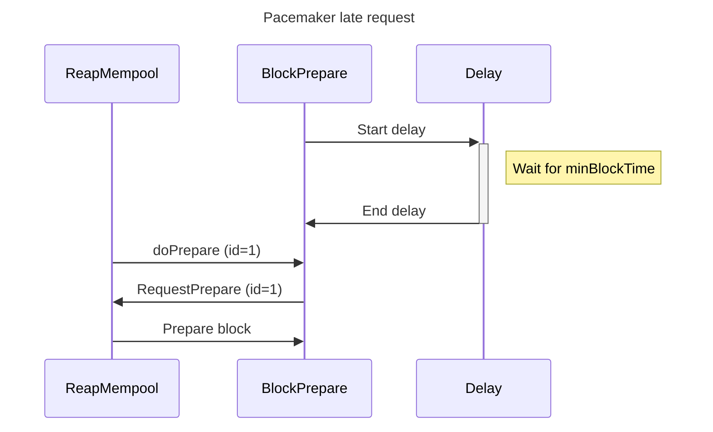

# Consensus Module <!-- omit in toc -->

This README serves as a guide to the implementation of the [1.0 Pocket's Consensus Module Specification](https://github.com/pokt-network/pocket-network-protocol/tree/main/consensus). It is designed to provide insights into the structure and design of the codebase.

## Table of Contents <!-- omit in toc -->

- [Interface](#interface)
- [Consensus Processes](#consensus-processes)
  - [Leader Election](#leader-election)
  - [Consensus Phases](#consensus-phases)
  - [Block Generation](#block-generation)
  - [Block Validation](#block-validation)
  - [Consensus Lifecycle](#consensus-lifecycle)
  - [State Sync](#state-sync)
- [Synchronization between the consensus processes](#synchronization-between-the-consensus-processes)
  - [StateSync Mode](#statesync-mode)
    - [Download routine](#download-routine)
  - [Apply routine](#apply-routine)
- [Consensus Mode](#consensus-mode)
  - [PaceMaker block proposal delaying](#pacemaker-block-proposal-delaying)
    - [Concurrent requests](#concurrent-requests)
    - [Late requests](#late-requests)
  - [Example height,round,step increment](#example-heightroundstep-increment)
    - [Example invalid increments](#example-invalid-increments)
- [Implementation](#implementation)
  - [Code Organization](#code-organization)
- [Testing](#testing)
  - [Running Unit Tests](#running-unit-tests)

## Interface

This module adheres to the interface outlined in `pocket/shared/modules/consensus_module.go`, which is derived from the above specification.

## Consensus Processes

This repository features an implementation of the HotStuff consensus algorithm. It facilitates the consensus process through a series of rounds. Staked validator nodes participate in the consensus process, with one node serving as the leader and the rest as replicas.

### Leader Election

A dedicated submodule handles the leader election process. The current configuration employs a deterministic round-robin leader election mechanism. We are working on a randomized leader election mechanism with cryptographic sortition using Verifiable Random Functions (VRFs), see [Algorand's Whitepaper Section 5.1](https://algorandcom.cdn.prismic.io/algorandcom%2Fa26acb80-b80c-46ff-a1ab-a8121f74f3a3_p51-gilad.pdf) for detailed explanation. Upon its' completion, round-robin leader election will be 

### Consensus Phases

The HotStuff consensus algorithm consists of three phases: `Prepare`, `Pre-Commit`, and `Commit`. It is worth to note that recently published [HotStuff 2 research paper](https://eprint.iacr.org/2023/397.pdf) proposes the updated HotStuff consensus algorithm which only needs two phases. 

In each phase of Hotstuff, the leader creates a proposal and broadcasts it to all replica nodes. 

Upon receiving the proposal, each replica node performs a block validation check. If the proposal is valid, the replica node responds to the leader with its signature as a vote.

When the leader collects votes from more than two-thirds of the replicas, it progresses to the next consensus phase. This two-thirds rule is essential to achieve Byzantine Fault Tolerance (BFT), ensuring network resilience against faulty or malicious nodes.

### Block Generation

Block generation in the HotStuff consensus algorithm involves a series of interactive steps between the Leader and the Replica nodes. The steps are as follows:



### Block Validation

Every proposal made by the leader undergo a series of validation steps during the `Prepare` phase, which are carried out by the replicas. However, during the `Pre-commit` and `Commit` phases, the replicas are solely responsible for performing signature validation.



### Consensus Lifecycle

The consensus lifecycle begins with a new round that includes leader election, proposal creation, proposal validation, vote aggregation, and block commitment. The steps are as follows:



### State Sync

State synchronization is crucial to ensure all participating nodes maintain a consistent and up-to-date view of the network state. It is especially important in a dynamic and decentralized network where nodes can join, leave, or experience intermittent connectivity. For an in-depth understanding of the state sync process and its current status, please refer to our [State Sync Protocol Design Specification](https://github.com/pokt-network/pocket/blob/main/consensus/doc/PROTOCOL_STATE_SYNC.md).



## Synchronization between the consensus processes

The consensus module currently depends on the `PaceMaker`, `StateSync`, `LeaderElection` and `Networking`.
It has a bootstrapping state where it:
  * Initializes connections to the network through a bootstrap node
  * Keeps an updated current height (the greatest block height seen on the network)
  * Compares network and local current heights, before switching to one of two mutually exclusive modes: `sync` or `consensus`



### StateSync Mode

In this mode the node is behind the latest known-to-network height and will try to catchup by downloading then applying the downloaded blocks (sequentially) to its local state.

The `download` and `apply` routines may run in parallel, but `apply` may be blocked by the former if the needed block is missing, it will wait until the needed blocks are downloaded.

#### Download routine

* The `download` routine is alive as long as `sync` mode is on
* It checks in its persistence for the latest downloaded block and tries to get and add to its persistence all the blocks; up to the network current height
* After downloading, and before inserting the block, basic (stateless) verification is made to the block
* A downloaded and inserted block is a structurally valid block but should by no mean considered valid w.r.t. its validators signatures or transactions within



### Apply routine

_Note: We do not detail how individual transactions are applied or how state is derived from them. Just assume that the state (specifically validator set) may be mutated after each block application._

* The `apply` routine remains alive as long as `sync` mode is on
* It needs a starting state (genesis, or loaded local state) to build blocks from
* Each block is validated and applied before moving to the next one
* The block application begins at the genesis block (1) and sequentially processes additional blocks until it arrives at the head of the chain (i.e the most recent block or highest block height)
* Since basic validation is done at the download step and assumes that the Pocket node trusts its persistence layer, it is safe to skip basic re-validation
* The `apply` mechanism needs to maintain a chain of trust while applying blocks by performing the following:
  * Before applying block at height `h`, verify that it is signed by a quorum from the validator set at height `h-1`; note that the genesis validator set is used for block `1`
  * By applying each block, the validator set is updated (validators joining or leaving), starting from genesis validator set for any new node
* With this chain of trust form a total of `3t+1` validators, where at least `2t+1` validators are honest and live. A synching node systematically detects invalid blocks
  * No malicious or faulty node could inject an alternative block without making at least `2t+1` validators sign it
  * The persistence layer is mainly a cache for the block application, so a node won't restart block application from genesis each time it's rebooted
* When the routine applies `NetworkCurrentHeight`, it signals it so the node could switch to `consensus` mode. Meanwhile, it waits to apply a new downloaded block



## Consensus Mode

In this mode, the current node is up to date w.r.t. the latest block applied by the network and can start now participating to the consensus process.

This process is driven by:
* A pace maker, that alerts the consensus flow about key timings in the block production process
  * `MinBlockTime`: The earliest time a leader node should reap the mempool and start proposing a new block
  * `RoundTimeout`: The amount time a replicas wait before starting a new round
* A random but deterministic process to elect the leader of each round
  * Given a unique random seed known to all validators and information about the current (height, round) being validated, any validator is able to know who is the leader without needing to communicate with others
  * The leader election strategy aims to give validators a chance of leading the round proportional to their stake
  * Fallback to a round robin strategy if probabilistic election doesn't work
* A consensus flow that aims to increment the height (thus block production) of the chain
  * See [Block Generation](#block-generation)

### PaceMaker block proposal delaying

The pace maker ensures minimum block production time with the aim to have a constant production pace.
* Adding a delay instead of directly proposing a block makes the the process concurrent.
  * It ensures that the block proposal is done only once after each `NewRound` step
* When the leader gathers enough `NewRound` messages from replicas to propose a block, a first call to propose a block is made
  * The proposal attempt may happen before `MinBlockTime` which the `PaceMaker` will delay.
  * While delayed, more `NewRound` messages may come-in and the node will use the higher QC obtained by these late messages to propose the block (discards the previous QC).
  * If the timer expires before having any block proposal attempt, any call (with enough signatures) will trigger the block proposal without delay
  * If a late message is received after a block has already been proposed by another call, the late message is discarded

#### Concurrent requests


#### Late requests



### Example height,round,step increment

| Height | Round | Step | Comment                                  |
|--------|-------|------|------------------------------------------|
| 1      | 0     | 1    | Initial round, initial block,            |
| 1      | 0     | 2    | Enter Prepare step                       |
| 1      | 0     | 3    | Enter Pre-Commit step                    |
| 1      | 1     | 1    | Round interrupted, reset step            |
| 1      | 1     | 2    | Enter Prepare step again                 |
| 1      | 1     | 3    | Enter Pre-Commit step again              |
| 1      | 1     | 4    | Enter Commit step for the first time     |
| 2      | 0     | 1    | Incremented height, reset round and step |

#### Example invalid increments

| Height | Round | Step | Comment                                                        |
|--------|-------|------|----------------------------------------------------------------|
| 1      | 1     | 3    | Enter Pre-Commit step                                          |
| 1      | 2     | 3    | **Invalid**: If `Round` increments, `Step` has to reset to `1` |

| Height | Round | Step | Comment                                                            |
|--------|-------|------|--------------------------------------------------------------------|
| 1      | 1     | 3    | Enter Pre-Commit step                                              |
| 2      | 0     | 4    | **Invalid**: `Height` only increments when previous Step is at `4` |

| Height | Round | Step | Comment                                                                       |
|--------|-------|------|-------------------------------------------------------------------------------|
| 1      | 2     | 4    | Enter Commit step                                                             |
| 2      | 2     | 4    | **Invalid**: When `Height` increments, reset `Round` to `0` and `Step` to `1` |

## Implementation

### Code Organization

The codebase is organized as follows:

```bash
consensus
├── doc
│   ├── CHANGELOG.md
│   ├── PROTOCOL_STATE_SYNC.md              # State sync protocol definition
├── e2e_tests
│   ├── hotstuff_test.go                    # Hotstuff consensus tests
│   ├── pacemaker_test.go                   # Pacemaker module tests
│   ├── state_sync_test.go                  # State sync tests
│   ├── utils_test.go                       # test utils
├── leader_election
│   ├── sortition
│       └── sortition_test.go               # Sortition tests
│       └── sortition.go                    # Cryptographic sortition implementation
│   ├── vrf
│       └── errors.go
│       └── vrf_test.go                     # VRF tests
│       └── vrf.go                          # VRF implementation
│   ├── module.go                           # Leader election module implementation
├── pacemaker
│   ├── debug.go
│   ├── module.go                           # Pacemaker module implementation
├── state_sync
│   ├── helpers.go
│   ├── interfaces.go
│   ├── module.go                           # State sync module implementation
│   ├── server.go                           # State sync server functions
├── telemetry
│   ├── metrics.go
├── types
│   ├── proto                               # Proto3 messages for generated types
│   ├── actor_mapper_test.go
│   ├── actor_mapper.go
│   ├── messages.go                         # Consensus message definitions
│   ├── types.go                            # Consensus type definitions
├── block.go
├── debugging.go                            # Debug function implementation
├── events.go
├── fsm_handler.go                          # FSM events handler implementation
├── helpers.go
├── hotstuff_handler.go
├── hotstuff_leader.go                      # Hotstuff message handlers for Leader
├── hotstuff_mempool_test.go                # Mempool tests
├── hotstuff_mempool.go                     # Hotstuff transaction mempool implementation
├── hotstuff_replica.go                     # Hotstuff message handlers for Replica
├── messages.go                             # Hotstuff message helpers
├── module_consensus_debugging.go
├── module_consensus_pacemaker.go           # Pacemaker module helpers
├── module_consensus_state_sync.go          # State sync module helpers
├── module.go                               # The implementation of the Consensus Interface
├── README.md                               # Self link to this README
├── state_sync_handler.go                   # State sync message handler
```

## Testing
_TODO: Document the testing framework._

### Running Unit Tests

```bash
make test_consensus
```
