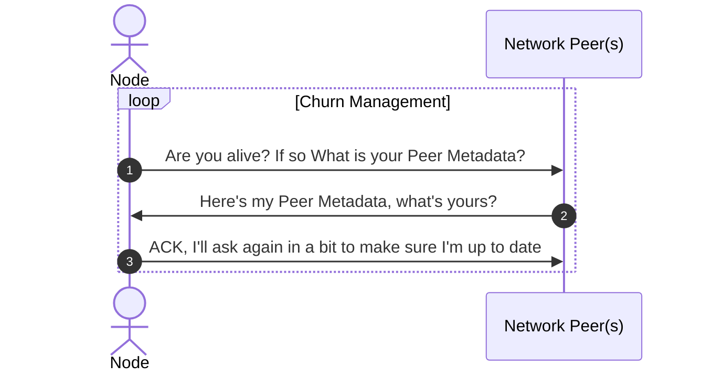

# # State Sync: `BLOCK BY BLOCK` Design

## Context

State Sync is a protocol within a `Pocket` node that enables the download and maintenance of the latest network-wide state. This protocol enables network actors to participate in network activities (like Consensus and Web3 provisioning and access) in present time, by ensuring the synchronization of the individual node with the collective.

## Core Protocol

A node participating in the State Sync protocol will act as both a server and a client to its `Network Peers`. A pre-requisite of the State Sync protocol is for the `P2P` module to maintain a metadata state of the active network peers.

Example of Peer Metadata:

```golang
type PeerSyncMeta struct {
  PeerID string   // The Public Key associated with the peer
  MaxHeight int64 // The maximum height the peer has in the blockstore
  MinHeight int64 // The minimum height the peer has in the blockstore
  ...
}
```
This data is collected through the P2P protocol during the `Churn Management Protocol`, but for the sake of demonstration and simplicity, it may be abstracted to an `ask-response` cycle where the node continuously asks this meta-information of its active peers.


The aggregation and consumption of this peer-meta information enables the State Sync protocol by enabling the node to understand the globalized network state by sampling Peer Metadata through its local peer list.

```golang
type PeerSyncAggregate struct {
  Peers []PeerSyncMeta // The current list of peers and the known metadata
  MaxPeerHeight int64  // The maximum height associated with all known peers
  ...
}
```
Using the `PeerSyncAggregate`, a Node is able to understand its local `SyncState` against that of the Global Network.

### Pacemaker Mode
If the Node is `Synced` or `localSyncState.Height == globalNetworkSyncState.Height` then the `StateSync` protocol is in `PacemakerMode`.

In `PacemakerMode`, the Node is caught up to the latest block and relies on the Consensus Module's Pacemaker to maintain a synchronous state with the global `SyncState`.

### Sync Mode
If the Node is `Syncing` or `localSyncState.Height < globalNetworkSyncState.Height` then the `StateSync` protocol is in `SyncMode`.

In `SyncMode`, the Node is catching up to the latest block by making `BlockRequests` to its fellow eligible peers. A peer is eligible for a `BlockRequest` if `PeerMeta.MinHeight` <= `BlockHeight` <= `PeerMeta.MaxHeight`.

Though it is `unspecified` whether or not a Node may make the `BlockRequests` in order or parallelize, due to the cryptographic restraints of block processing, the Node must process the blocks sequentially by `ApplyingBlock` 1 by 1 until it is `Synced`.

It is important to note, if any blocks processed result in an invalid `AppHash` during `ApplyBlock`, a new `BlockRequest` must be issued until a valid block is found.

### Server Mode

In the `StateSync` protocol, the Node fields valid `BlockRequests` from its peers to help them `CatchUp` to be `Synced`. This sub-protocol is continuous throughout the lifecycle of StateSync.

```mermaid
graph  TD

A[StateSync]  -->|IsCaughtUp|  B(Pacemaker Mode)

B  -->  |Consensus Messages|  C(ConsensusModule.Pacemaker)

A  -->|IsSyncing|  E(Sync Mode)

E  -->|Request Block|  G[Peers]

G-->  |ApplyBlock|  A

A  -->  D[Server Mode]

D  -->  |Serve Blocks Upon Request|  G
```

## Follow up tasks

`Fast Sync Design` - Sync only the last `N` blocks from `Latest Network Height`

`Parallel Sync Design` - Optimize the State Sync protocol by parallelizing requests and computation

## Research Items

How the persistence layer design of `pruning` the Merkle Tree affects `StateSync`.

How DB Pruning of the `SQL DB` might affect fast sync.

How the Churn Management operations of RainTree might provide opportunities and obstacles with StateSync.

## Glossary

`ApplyingBlock`: The process of playing block parts and its subsequent transactions against the Node's world state using the Utility Module and Validating the `AppHash` contained in the block against the produced `AppHash` from the local state.

`BlockRequests`: A message from an active peer, requesting a block to sync the chain to the Global Network State.

`Churn Management Protocol`: The protocol in Pocket's P2P Module that ensures the most updated and valid Network Peer list possible.

`Network Peer`: A node that is directly connected and sharing resources without going through a third party server. Peers may start the connection through an `inbound` or `outbound` initialization.

`SyncState`: The local block state of the node vs the global network block state.