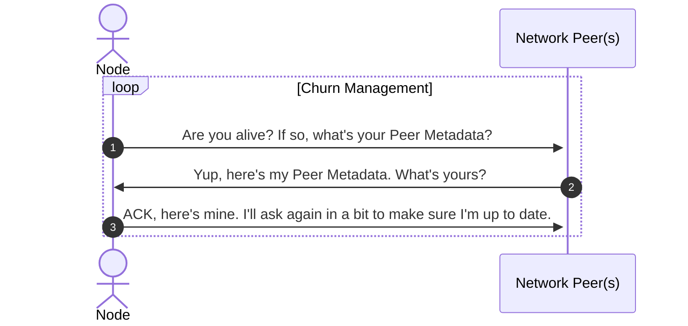

# State Sync Protocol Design <!-- omit in toc -->

_NOTE: This document makes some assumption of P2P implementation details, so please see [p2p](../../p2p/README.md) for the latest source of truth._

- [Background](#background)
- [State Sync - Peer Metadata](#state-sync---peer-metadata)
- [State Sync - Operation Modes](#state-sync---operation-modes)
  - [Sync Mode](#sync-mode)
  - [Synced Mode](#synced-mode)
  - [Pacemaker Mode](#pacemaker-mode)
  - [Server Mode](#server-mode)
  - [Operation Modes Lifecycle](#operation-modes-lifecycle)
- [State Sync Designs](#state-sync-designs)
  - [Block by Block](#block-by-block)
    - [Synchronous](#synchronous)
    - [Asynchronous](#asynchronous)
  - [Future Design Work](#future-design-work)
- [Research Items](#research-items)
- [Glossary](#glossary)
- [References](#references)
  - [Tendermint](#tendermint)
  - [Cosmos](#cosmos)
  - [Celestia](#celestia)
  - [Aptos](#aptos)
  - [Chia](#chia)

## Background

State Sync is a protocol within a `Pocket` node that enables the download and maintenance of the latest world state. This protocol enables network actors to participate in network activities (like _Consensus_ or _Web3 Provisioning & Access_) in present time, by ensuring the synchronization of the individual node with the collective network.

## State Sync - Peer Metadata

A node participating in the `State Sync` protocol can act as both a _server_ and/or a _client_ to its `Network Peers`. A pre-requisite of the State Sync protocol is for the `P2P` module to maintain an active set of network peers, along with metadata corresponding to the persistence data they have available.

Illustrative example of Peer Metadata related to State Sync (not a production interface):

```golang
type PeerSyncMetadata interface {
  // ...
  GetPeerID() string   // An ID (e.g. a derivative of a PublicKey) associated with the Peer
  GetMaxHeight() int64 // The maximum height the peer has in its BlockStore
  GetMinHeight() int64 // The minimum height the peer has in the BlockStore
  // ...
}
```

This data can be collected through the `P2P` module during the `Churn Management Protocol`. It can also be abstracted to an `ask-response` cycle where the node continuously asks this meta-information of its active peers.

The following is an illustrative example for a high-level understanding:



The aggregation and consumption of this peer-meta information enables the State Sync protocol by enabling the node to understand the globalized network state through sampling Peer Metadata in its local peer list.

This gives a view into the data availability layer, with details of what data can be consumed from which peer (not a production interface):

```golang
type PeerSyncAggregateMetadata interface {
  // ...
  GetPeerMetadata() []PeerSyncMeta // The current list of Peers and their known metadata
  GetMaxPeerHeight() uint64  // The maximum height associated with all known Peers
  // ...
}
```

Using the `PeerSyncAggregateMetadata`, a Node is able to compare its local `SyncState` against that of the Global Network that is visible to it (i.e. the world state).

## State Sync - Operation Modes

State sync can be viewed as a state machine that transverses various modes the node can be in, including:

1. Sync Mode
2. Synced Mode
3. Pacemaker Mode
4. Server Mode

The functionality of the node depends on the mode it is operating it. Note that `Server Mode` is not mutually exclusive to the others.

For illustrative purposes below assume:

- `localSyncState` is an object instance complying with the `PeerSyncMetadata` interface for the local node
- `globalSyncMeta` is an object instance complying with the `PeerSyncAggregateMetadata` interface for the global network

### Sync Mode

The Node is in `Sync` Mode if `localSyncState.MaxHeight < GlobalSyncMeta.Height`.

In `Sync` Mode, the Node is catching up to the latest block by making `GetBlock` requests to eligible peers in its address book. A peer can handle a `GetBlock` request if `PeerSyncMetadata.MinHeight` <= `localSyncState.MaxHeight` <= `PeerSyncMetadata.MaxHeight`.

Though it is unspecified whether or not a Node may make `GetBlock` requests in order or in parallel, the cryptographic restraints of block processing require the Node to call `ApplyBlock` sequentially until it is `Synced`.

### Synced Mode

The Node is in `Synced` mode if `localSyncState.Height == globalSyncMeta.MaxHeight`.

In `SyncedMode`, the Node is caught up to the latest block (based on the visible view of the network) and relies on new blocks to be propagated via the P2P network every time the Validators finalize a new block during the consensus lifecycle.

### Pacemaker Mode

The Node is in `Pacemaker` mode if the Node is in `Synced` mode **and** is an active Validator at the current height.

In `Pacemaker` mode, the Node is actively participating in the HotPOKT lifecycle.

### Server Mode

The Node can serve data to other nodes, upon request, if `ServerMode` is enabled. This sub-protocol runs in parallel to the node's own state sync in order to enable other peers to catch up.

### Operation Modes Lifecycle


_IMPORTANT: `ApplyBlock` is implicit in the diagram above. If any blocks processed result in an invalid `AppHash` during `ApplyBlock`, a new `BlockRequest` must be issued until a valid block is found._

## State Sync Designs

### Block by Block

The block-by-block involves a node requesting a single block from its peers, one at a time, and apply them as they are received. Internal implementation details related to local caching and ordering are omitted from the diagram below.

#### Synchronous


#### Asynchronous


### Future Design Work

- `Fast Sync Design` - Sync only the last `N` blocks from a _snapshot_ containing a network state

- `Optimistic Sync Design` - Optimize the State Sync protocol by parallelling requests and computation with pre-fetching and local caching

- `Block Chunk Design` - Update the single block-by-block to be able to receive and provide multiple blocks per request.

- `Block Stream Design` - Update the Block by Block design to stream blocks via a WebSocket from a single connectable peer.

## Research Items

_TODO(M5): Create issues to track and discuss these work items in the future_

- Investigate how does the persistence layer design of `pruning` Merkle Tree affects `StateSync`.
- Investigate how DB Pruning of the `SQL DB` might affect fast sync.
- Investigate how churn management in relation to `RainTree` could provide opportunities or obstacles with StateSync.

## Glossary

- `ApplyingBlock`: The process of transitioning the Node's state by applying the transactions within a block using the Utility module.
- `GetBlock`: A network message one peer can send to another requesting a specific Block from its local store.
- `Churn Management`: A protocol in Pocket's P2P Module that ensures the most updated view of the network peer list is available.
- `Network Peer`: Another node on the network that this node can directly communicate with, without going through a third-party server. Peers may start the connection through an `inbound` or `outbound` initialization to share & transmit data.
- `SyncState`: The state of a network w.r.t to where it is relative to the world state (height, blocks available, etc).

## References

State Sync, also known as Block Sync, is a well researched problem and we referenced various sources in our thinking process.

### Tendermint

**Example:**

Tendermint follow an **async "fire-and-forget"** pattern as can be seen [here](https://github.com/tendermint/tendermint/blob/main/blocksync/reactor.go#L176):

```go
// respondToPeer loads a block and sends it to the requesting peer,
// if we have it. Otherwise, we'll respond saying we don't have it.
func (bcR *Reactor) respondToPeer(msg *bcproto.BlockRequest,
 src p2p.Peer) (queued bool) {

 block := bcR.store.LoadBlock(msg.Height)
 if block != nil {
  bl, err := block.ToProto()
  if err != nil {
   bcR.Logger.Error("could not convert msg to protobuf", "err", err)
   return false
  }

  return src.TrySend(p2p.Envelope{
   ChannelID: BlocksyncChannel,
   Message:   &bcproto.BlockResponse{Block: bl},
  })
 }

 bcR.Logger.Info("Peer asking for a block we don't have", "src", src, "height", msg.Height)
 return src.TrySend(p2p.Envelope{
  ChannelID: BlocksyncChannel,
  Message:   &bcproto.NoBlockResponse{Height: msg.Height},
 })
}
```

**Links:**

- [https://docs.tendermint.com/v0.34/tendermint-core/state-sync.html](https://docs.tendermint.com/v0.34/tendermint-core/state-sync.html)
  - A short high-level page containing state sync configurations
- [https://github.com/tendermint/tendermint/blob/main/spec/README.md](https://github.com/tendermint/tendermint/blob/main/spec/README.md)
  - A very long README in the Tendermint Source code

### Cosmos

**Links:**

- [https://blog.cosmos.network/cosmos-sdk-state-sync-guide-99e4cf43be2f](https://blog.cosmos.network/cosmos-sdk-state-sync-guide-99e4cf43be2f)
  - A short and easy to understand blog post on how the Cosmos SDK configures and manages State Sync

### Celestia

**Example:**

Celestia uses a synchronous request-response pattern as seen [here](https://github.com/celestiaorg/celestia-node/blob/main/header/sync/sync.go#L268).

```go
// PubSub - [from:to]
func (s *Syncer) findHeaders(ctx context.Context, from, to uint64) ([]*header.ExtendedHeader, error) {
 amount := to - from + 1 // + 1 to include 'to' height as well
 if amount > requestSize {
  to, amount = from+requestSize, requestSize
 }

 out := make([]*header.ExtendedHeader, 0, amount)
 for from < to {
  // if we have some range cached - use it
  r, ok := s.pending.FirstRangeWithin(from, to)
  if !ok {
   hs, err := s.exchange.GetRangeByHeight(ctx, from, amount)
   return append(out, hs...), err
  }

  // first, request everything between from and start of the found range
  hs, err := s.exchange.GetRangeByHeight(ctx, from, r.start-from)
  if err != nil {
   return nil, err
  }
  out = append(out, hs...)
  from += uint64(len(hs))

  // then, apply cached range if any
  cached, ln := r.Before(to)
  out = append(out, cached...)
  from += ln
 }

 return out, nil
}
```

**Links:**

- [https://docs.celestia.org/nodes/config-toml#p2p](https://docs.celestia.org/nodes/config-toml#p2p)
  - A short high-level page containing the most important Celestia State Sync configs
- [https://github.com/celestiaorg/celestia-node/blob/main/docs/adr/adr-011-blocksync-overhaul-part-1.md](https://github.com/celestiaorg/celestia-node/blob/main/docs/adr/adr-011-blocksync-overhaul-part-1.md)
  - A very long and difficult to read ADR on an overhaul in Celestia's State Sync

### Aptos

**Example:**

Aptos follow an **async "fire-and-forget"** pattern as can be seen [here](https://github.com/diem/diem/blob/906353ebd9515e44276c7595c6bce699a7cb9ebe/state-sync/src/request_manager.rs#L258)

```rust
    pub fn send_chunk_request(&mut self, req: GetChunkRequest) -> Result<(), Error> {
        let log = LogSchema::new(LogEntry::SendChunkRequest).chunk_request(req.clone());

        let peers = self.pick_peers();
        if peers.is_empty() {
            warn!(log.event(LogEvent::MissingPeers));
            return Err(Error::NoAvailablePeers(
                "No peers to send chunk request to".into(),
            ));
        }

        let req_info = self.add_request(req.known_version, peers.clone());
        debug!(log
            .clone()
            .event(LogEvent::ChunkRequestInfo)
            .chunk_req_info(&req_info));

        let msg = StateSyncMessage::GetChunkRequest(Box::new(req));
        let mut failed_peer_sends = vec![];

        for peer in peers {
            let mut sender = self.get_network_sender(&peer);
            let peer_id = peer.peer_id();
            let send_result = sender.send_to(peer_id, msg.clone());
            let curr_log = log.clone().peer(&peer);
            let result_label = if let Err(e) = send_result {
                failed_peer_sends.push(peer.clone());
                error!(curr_log.event(LogEvent::NetworkSendError).error(&e));
                counters::SEND_FAIL_LABEL
            } else {
                debug!(curr_log.event(LogEvent::Success));
                counters::SEND_SUCCESS_LABEL
            };
            counters::REQUESTS_SENT
                .with_label_values(&[
                    &peer.raw_network_id().to_string(),
                    &peer_id.to_string(),
                    result_label,
                ])
                .inc();
        }

        if failed_peer_sends.is_empty() {
            Ok(())
        } else {
            Err(Error::UnexpectedError(format!(
                "Failed to send chunk request to: {:?}",
                failed_peer_sends
            )))
        }
    }
```

**Links:**

- [https://github.com/diem/diem/tree/main/specifications/state_sync](https://github.com/diem/diem/tree/main/specifications/state_sync)
  - A fantastic resource from Aptos on state sync. Medium-length, easy to read, and just detailed enough.
- [https://medium.com/aptoslabs/the-evolution-of-state-sync-the-path-to-100k-transactions-per-second-with-sub-second-latency-at-52e25a2c6f10](https://medium.com/aptoslabs/the-evolution-of-state-sync-the-path-to-100k-transactions-per-second-with-sub-second-latency-at-52e25a2c6f10)
  - A great and easy-to-read blog post about the challenges and solutions Aptos came up with for state sync
- [https://aptos.dev/guides/state-sync/](https://aptos.dev/guides/state-sync/)
  - A short high-level set of configurations in Aptos w.r.t state sync

### Chia

**Links:**

- [https://docs.chia.net/peer-protocol](https://docs.chia.net/peer-protocol)
  - A detailed list of the type of requests Chia uses for communication between peers
- [https://docs.chia.net/node-syncing](https://docs.chia.net/node-syncing)
  - An explanation of the configurations Chia exposes for node synching

<!-- GITHUB_WIKI: consensus/state_sync_protocol -->
