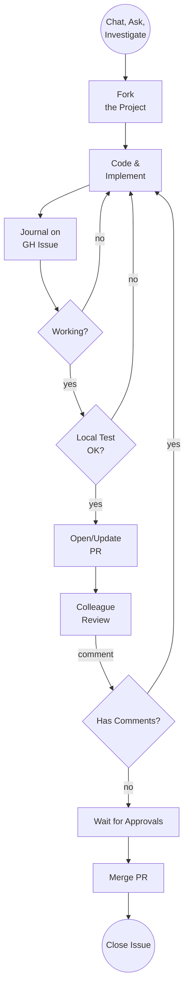
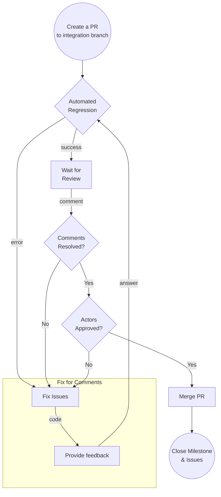

# Community Developer Guide

## How to begin

The first step is to find how to contribute. The best way to do so is to open the [issues section](https://github.com/pokt-network/pocket/issues) and find any open issue that you feel you can contribute to. Issues without assignees are more likely to be available, although you can still contribute to any open and already assigned issue as well. Feel free to ask!

## Don't jump to the code yet

Before jumping to the code, a crucial step is talking with others, especially with the issue creator. **Make sure you have this information before starting work. We value your time. We want your contribution to be valuable.**

Questions to ask:
- Is there anyone working on this issue?
- Is this issue blocked by something else?
- Is this issue fully described and ready to be worked on?
- Do I have a full understanding of what needs to be done?
- Does everyone agree that I'm the right person for the job?
- Where are these issues integrated (integration branch, milestone branch, main, etc)?
- Where should I branch from (integration branch, milestone branch, main, etc)?

Join [Pocket Forum](https://forum.pokt.network/), discuss with other contributors, share ideas, check if someone else is already working on that issue. Analyze the feasibility of your implementation with other members of the community. Try to get consensus across the community of your implementation idea before starting any work.

If you have answered the questions above, move forward with assigning the issue to yourself and start working on it.

## Fork the project

It's essential to fork the project and work out of your own repository. We want to keep the project lean and ensure the history represents concrete steps moving forward.

Go to the [home of the repo](https://github.com/pokt-network/pocket) and click fork in the top right corrne. You will be able to create a local fork on your account very quickly.

Depending on the specific case, create a branch out of one of the following:
- Integration Branch
- main

Make sure the branch name follows this convention: `issue/[issue name, in snake_case]`

## Coding style
- Code must adhere to the official Go formatting guidelines (i.e. uses gofmt).
- (Optional) Use editor config to help your text editor keep the same formatting throughout the entire project.
- Code must be well documented and adhere to the official Go commentary guidelines.

## Journaling and asks for help

You can use issue comments to follow up on the progress of your work and ask the community for any help. Make sure that you are not blocked too much. It is probable that another community member may have the answer to your problem. Regular journaling is important for the issue creator to keep track of your progress, and it's good to give others visibility of the progress you've been making so they can participate and propose better solutions down the road.

**TODO: Add link to guide for creating test suite for the feature.**

## Test your code

Before pushing your code to the integration or milestone branches, make sure you ran all the tests locally following the **local testing guide**. It's critical to keep integration branches as healthy as possible since other developers will work on the project out of the same branch. If your work delivers partially breaking code, make sure to coordinate and communicate these details in the PR prior to merging it in.

## Create a PR to the Integration Branch

You can follow this guide to create a PR from a fork to the integration branch. **Take in consideration that the integration branch could be in a fork as well.**

[https://docs.github.com/en/pull-requests/collaborating-with-pull-requests/proposing-changes-to-your-work-with-pull-requests/creating-a-pull-request-from-a-fork](https://docs.github.com/en/pull-requests/collaborating-with-pull-requests/proposing-changes-to-your-work-with-pull-requests/creating-a-pull-request-from-a-fork)

On the PR, please include any details related to the task that you pushed. Proof of your local tests passing is a good practice in order to help other developers know that the code is tested. Any screenshot or screencast is welcome to help others understand the impact of your work.

Be as detailed as you can, since this will help get a faster review of the PR. If the PR is not being reviewed, make sure to tag the issue creator from time to time, and even propose a review meeting to make it faster.

If the issue had extra deliverables, make sure to include them as part of your PR to get the approvals.

Every PR should follow this template,

* [PULL\_REQUEST\_TEMPLATE.md](../../../.github/PULL_REQUEST_TEMPLATE.md)

Make sure to complete all required fields with the following information:
- **Reviewers**: Provide at least 2 reviewers to ensure you get enough approvals
- **Milestone**: Link the PR to the corresponding Milestone
- **Linked Issues**: Link the PR to the corresponding Issue

## Testing Phase

After a PR has been created, wait for the automation test suite to complete. it is desirable to have some community members review and test locally the PR, by providing feedback on the PR comments.

## Review Phase

Wait a couple of days to collect comments from other contributors. Make sure to respond, eventually fix, and mark all the comments as done.
Wait for the commenter to acknowledge the answer or the fix of its comment.

## Actors Approvals

Ping the required actors on a PR comment to call their attention after this step has been fulfilled to ask for their final review. Take into consideration that these actors are busy and will ignore any PRs that do not have the previous checks. Follow the actor's comments and provide feedback for the fix. Make sure to mention them on any change related to their comments.

## Merge Blockers

- Issue PRs will be selected for running a subset of the Testing Regression suite and require all test to be green before being merged.
- Issue PRs will require having all the comments reviewed and checked by both commenter and developer.
- Issues PRs will require at lease 2 approvals from any contributor to unblock merging to the integration branch.

## Merge and Issue Close

Once the PR has been reviewed, and all the PR blockers are green, go ahead and merge the PR to the integration branch. After the PR is merged, make sure that the issue is marked as closed and some comments related to the final result are included.
