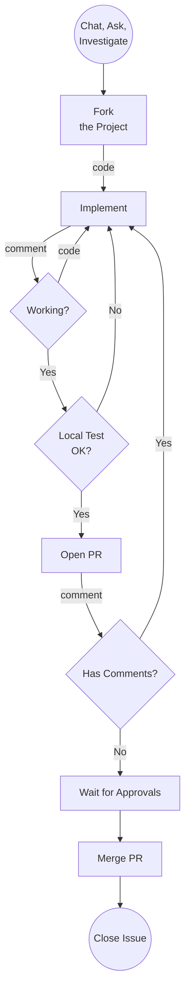
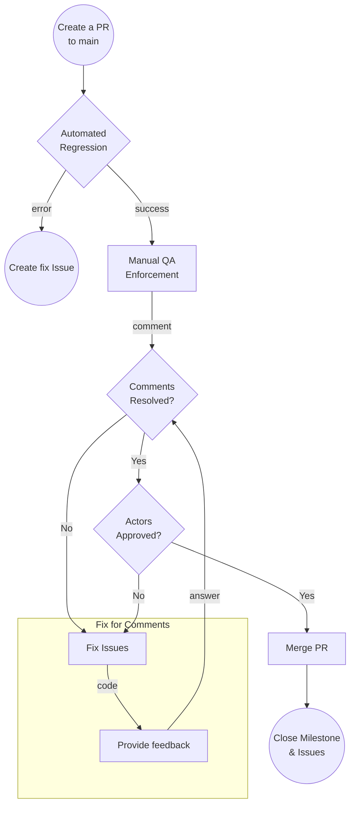

# Community Developer Guide



## How to begin

The first step is to find how to contribute, the best on do that is to open the [issues section](https://github.com/pokt-network/pocket/issues) and find any open issue that you feel you can contribute somehow, issues without assignee are more likely to be available, although you can possibly contribute on any open already assigned issue as well. Feel free to ask!

## Don’t jump to the code yet

A crucial step before jumping to the code is talking with others and especially with the issue creator. **Make sure you have this information before even start working. We value your time. We want your contribution to be valuable.**

- Is there anyone working on this issue?
- Is this issue blocked by something else?
- Is this issue fully described and ready to be worked on?
- Do I understand correctly what needs to be done?
- Does everyone agree that I’m the right person for the job?
- Where are these issues integrated? Integration Branch, Milestone Branch?
- Where should I branch from? Integration Branch, Milestone Branch, main?

Join [Pocket Forum](https://forum.pokt.network/), discuss with other contributors, share ideas, check if something else is already working on that issue. Analyze the feasibility of your implementation with other members of the community. Try to get consensus across the community on your implementation idea before even start working.

If you have all the answers, then assign the issue to you and start working on it.

## Fork the project

It’s important to fork the project and work on your own repository, we want to keep the project lean and make sure the project history represents solid steps moving forward.

Go to the [home of the repo](https://github.com/pokt-network/pocket) and click fork on the top right corner, you will be able to create a local fork on your account very quickly.

Depending on the case, create a branch out of,

- Integration Branch
- main

make sure the branch name follows this convention

`issue/[issue name, in lowercase, with an underscore as space]`

## Coding style
- Code must adhere to the official Go formatting guidelines (i.e. uses gofmt).
- (Optional) Use Editor Config to help your Text Editor keep the same formatting used throughout the project.
- Code must be documented adhering to the official Go commentary guidelines.

## Journaling and Ask for help

You can use issue comments to follow up on the progress of your work and ask the community for any help, make sure that you are not blocked too much, it’s probable that other community member have the answer to your problem. Regular journaling it’s important for the issue creator to keep track of your progress and its good for others to know the progress of the issue and be able to participate and propose better solutions down the road.

**Add link to guide for creating test suite for the feature.**

## Test your code

Before pushing your code to the integration or milestone branch, make sure you run all the tests locally following the **local testing guide**, it’s important to keep integration branches as healthy as possible since other developers will work on the same project. If your work is delivering a partial breaking code, make sure to coordinate and detail this on the PR before doing the final merge.

## Create a PR to the Integration Branch



You can follow this guide to create a PR from the fork to the integration branch, **take in consideration that the integration branch could be in a fork as well.**

[https://docs.github.com/en/pull-requests/collaborating-with-pull-requests/proposing-changes-to-your-work-with-pull-requests/creating-a-pull-request-from-a-fork](https://docs.github.com/en/pull-requests/collaborating-with-pull-requests/proposing-changes-to-your-work-with-pull-requests/creating-a-pull-request-from-a-fork)

On the PR, please include any details related to the job that you pushed. Proof of your local tests passing is a good practice, to help other developers know that the code is tested. Any screenshot or screencast is welcome to help others understand the impact of your work.

Be as detailed as you can, since this will help get a faster review of the PR. If the PR is not being reviewed, make sure to tag the issue creator from time to time, and even propose a review meeting to make this faster.

If the issue had extra deliverables, make sure to include them as part of your PR, to get the approvals.

Every PR should follow this template,

```jsx
# Description

Please include a summary of the change and which issue is fixed. Please also include relevant motivation and context. List any dependencies that are required for this change.

Fixes # (issue)

## Type of change

Please mark the options that are relevant.

- [ ] Bug fix (non-breaking change which fixes an issue)
- [ ] New feature (non-breaking change which adds functionality)
- [ ] Breaking change (fix or feature that would cause existing functionality to not work as expected)
- [ ] This change requires a documentation update

# How Has This Been Tested?

Please describe the tests that you ran to verify your changes. Provide instructions so we can reproduce. Please also list any relevant details for your test configuration

- [ ] Test A
- [ ] Test B

For bugs provide the following information, if available, link to the reporting issue
**How to reproduce**
- Reporter Name: 
- Reported Date:  
- Steps to reproduce: As specific as possible
- Release/Build Version: 
- Environment: OS, framework version

# Checklist:

- [ ] My code follows the style guidelines of this project
- [ ] I have performed a self-review of my own code
- [ ] I have commented on my code, particularly in hard-to-understand areas
- [ ] I have made corresponding changes to the documentation
- [ ] My changes generate no new warnings
- [ ] I have added tests that prove my fix is effective or that my feature works
- [ ] New and existing unit tests pass locally with my changes
- [ ] Any dependent changes have been merged and published in downstream modules
```

## Testing Phase

After a PR has been created, wait for the automation test suite to complete. it is desirable to have some community members review and test locally the PR, by providing feedback on the PR comments.

## Review Phase

Wait a couple of days to collect comments from other contributors. Make sure to respond, eventually fix, and mark all the comments as done.
Wait for the commenter to acknowledge the answer or the fix of its comment.

- Commenter mask as resolved

## Actors Approvals

Ping the required actors on a PR comment to call their attention after this step has been fulfilled to ask for their final review. Take into consideration that these actors are busy and will ignore any PR that doesn’t have the previous checks. Follow the actor's comments and provide feedback for the fix. make sure to mention them on any change related to their comments.

## Merge Blockers

- Issues PRs will be selected for running a subset of the Testing Regression and requires all test to be green before being merged.
- Issues PRs will require having all the comments reviewed and checked by both commenter and developer.
- Issues PRs will require at these approvals to unblock the merge,
    - 2 approvals from any contributor

## Merge and Issue Close

Once the PR has been reviewed, and all the PR blockers are green, go ahead and merge the PR to the integration branch. After the PR is merged, make sure that the issue is marked as closed and some comments related to the final result are included.