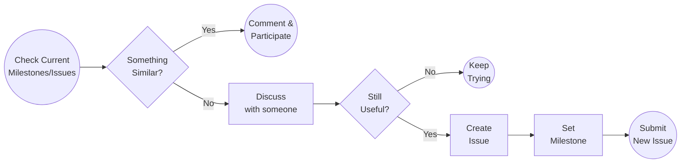

# Issue Creation Guide

## What is an issue?

Issues are a unity of work of a milestone. Issues are the minimum unit of work that can be done by a developer in order to make the milestone progress. Every issue should be attached to a milestone, and every milestone should have at least one issue. Several developers can work on an issue, although issues will have one assignee responsible.

## Check before you go

Before creating a new issue, it’s important to check if there's another issue already in the project.

## Discuss with someone

Discuss with people on the project the best way to organize the milestone. Those discussions are also important to identify duplicated efforts and discuss the best implementation before jumping to the code.

Join [Pocket Forum](https://forum.pokt.network/), discuss with other contributors, share ideas, check if something else is encapsulating your proposal. Analyze the feasibility of your proposal with other members of the community. Try to get consensus across the community before adding Issues.

## Issue Creation

You can follow GitHub guides to create the issue

* [https://docs.github.com/en/issues/tracking-your-work-with-issues/about-issues](https://docs.github.com/en/issues/tracking-your-work-with-issues/about-issues)

* [https://docs.github.com/en/issues/tracking-your-work-with-issues/creating-an-issue](https://docs.github.com/en/issues/tracking-your-work-with-issues/creating-an-issue)

It’s important to provide the following information for the issue. Issues not properly formatted can be deleted.

- **Title:** A descriptive title representing the goal of the issue.
- **Description:** What this issue will be for? It’s important that the description provides enough feedback for anyone to understand the motivation and deliverables of this issue.
- **Assignee:** (Optional for Creation) must be assigned before anyone starts to work. It’s important for other developers to identify available issues to work on, or who to reach to participate in the development of that issue.
- **Labels:** (Optional) You can use labels to identify issue types and goals.
    - E.g. `Integration` label is reserved for integration issues.
- **Projects:** (Optional) The project to which this issue is linked to.
- **Milestone:** Issues must have a milestone, milestone must have at least one issue.

Description can be provided in the form of a document link, although a summary is always required.

This template can be used for the description section,

* [issue.md](../../../.github/ISSUE_TEMPLATE/issue.md)

## Issue Branching Model

Every Issue will be merged to the milestone integration branch before reaching the main branch. During this face, testing should be run manually and a small subset of tests will be executed once the PR is merged into the milestone branch.

Issue branches will have the following format: `issue/[issue name, in lowercase, with an underscore as space]`
