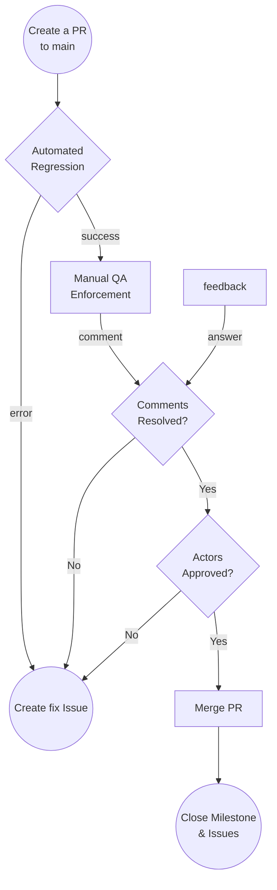

# Integration Branch (Milestone) Merge Guide



Once all the issues are finalized, and the milestone integration branch is ready and tested, a PR has to be open against the `main` branch. You can follow this guide to create the PR,

- **From a fork:** [https://docs.github.com/en/pull-requests/collaborating-with-pull-requests/proposing-changes-to-your-work-with-pull-requests/creating-a-pull-request-from-a-fork](https://docs.github.com/en/pull-requests/collaborating-with-pull-requests/proposing-changes-to-your-work-with-pull-requests/creating-a-pull-request-from-a-fork)
- **From a branch:** [https://docs.github.com/en/pull-requests/collaborating-with-pull-requests/proposing-changes-to-your-work-with-pull-requests/creating-a-pull-request](https://docs.github.com/en/pull-requests/collaborating-with-pull-requests/proposing-changes-to-your-work-with-pull-requests/creating-a-pull-request)

On the PR, please include any details related to the job that you pushed. Proof of your local tests passing is a good practice, to help other developers know that the code is tested. Any screenshot or screencast is welcome to help others understand the impact of your work.

Be as detailed as you can, since this will help get a faster review of the PR. If the PR is not being reviewed, make sure to tag the issue creator from time to time, and even propose a review meeting to make this faster.

If the issue had extra deliverables, make sure to include them as part of your PR, to get the approvals.

Every PR should follow this template,

```jsx
# Description

Please include a summary of the change and which issue is fixed. Please also include relevant motivation and context. List any dependencies that are required for this change.

Fixes # (integration issue)

## Type of change

Please mark the options that are relevant.

- [ ] Bug fix (non-breaking change which fixes an issue)
- [ ] New feature (non-breaking change which adds functionality)
- [ ] Breaking change (fix or feature that would cause existing functionality to not work as expected)
- [ ] This change requires a documentation update

# Checklist:

- [ ] Every PR Merged to the integration branch followed the tests specifications
- [ ] My code follows the style guidelines of this project
- [ ] I have performed a self-review of my own code
- [ ] I have commented on my code, particularly in hard-to-understand areas
- [ ] I have made corresponding changes to the documentation
- [ ] My changes generate no new warnings
- [ ] I have added tests that prove my fix is effective or that my feature works
- [ ] New and existing unit tests pass locally with my changes
- [ ] Any dependent changes have been merged and published in downstream modules
```

Make sure to complete all required fields with the following information,
- Reviewers: Provide at least 2 reviewers to ensure you get enough approvals, in this case, at least 2 reviewers from Pocket Network Core team should be provided
- Labels: Add `integration` label to the list and any other label you want
- Milestone: Link the PR to the corresponding Milestone
- Linked Issues: Link the PR to the corresponding Integration Issue


## Testing Phase

After a PR has been created, wait for the automation test suite to complete. it is desirable to have some community members review and test locally the PR, by providing feedback on the PR comments.

Integration PR should have no testing issues ideally, since previous PR should have proper testing passing. If something is found, a new Fix Issue should be created and once done, merged back to the integration PR.

## Review Phase

Wait a couple of days to collect comments from other contributors. Make sure to respond, eventually fix, and mark all the comments as done.

Integration PR should have no comments ideally, since previous PR should have proper review passing. If something is found, a new Fix Issue should be created and once done, merged back to the integration PR.

Wait for the commenter to acknowledge the answer or the fix of its comment.

- Commenter mask as resolved

## Actors Approvals

Ping the required actors on a PR comment to call their attention after this step has been fulfilled to ask for their final review. Take into consideration that these actors are busy and will ignore any PR that doesn’t have the previous checks. Follow the actor's comments and provide feedback for the fix. make sure to mention them on any change related to their comments.

Integration PR should have no comments ideally, since previous PR should have proper review passing. If something is found, a new Fix Issue should be created and once done, merged back to the integration PR.

## Merge Blockers

- Milestone PRs will be selected for running the full Testing Regression and requires all test to be green before being merged.
- Milestone PRs will require to have all the comments reviewed and checked by both commenter and developer.
- Milestone PRs will require these approvals to unblock the merge,
    - 2 approvals from PNI Developers
- Milestone PRs should provide a working protocol, no pending work should be part of the milestone PR.

## Merge and Milestone Close

Once the PR has been reviewed, and all the PR blockers are green, go ahead and merge the PR to the `main` branch. After the PR is merged, make sure that the milestone is marked as closed and some comments related to the final result are included on the main milestone issue.