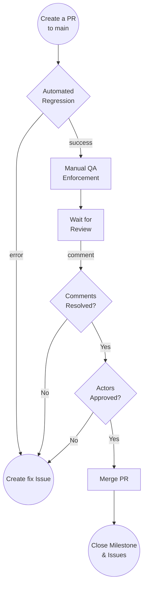

# Integration Branch (Milestone) Merge Guide

Once all the issues are finalized, and the milestone integration branch is ready and tested, a PR has to be open against the `main` branch. You can follow this guide to create the PR,

- **From a fork:** [How to create a Pull Request from a Fork](https://docs.github.com/en/pull-requests/collaborating-with-pull-requests/proposing-changes-to-your-work-with-pull-requests/creating-a-pull-request-from-a-fork)
- **From a branch:** [How to create a Pull Request](https://docs.github.com/en/pull-requests/collaborating-with-pull-requests/proposing-changes-to-your-work-with-pull-requests/creating-a-pull-request)

On the PR, please include any details related to the work that you pushed. Proof of your local tests passing is a good practice, in order to help other developers know that the code is tested. Any screenshot or screencast is welcome to help others understand the impact of your work.

Be as detailed as you can, since this will help get a faster review of the PR. If the PR is not being reviewed, make sure to tag the issue creator from time to time, and even propose a review meeting to make this faster.

If the issue had extra deliverables, make sure to include them as part of your PR, to get the approvals.

Every PR should follow this template,

* [PULL\_REQUEST\_TEMPLATE.md](../../../.github/PULL_REQUEST_TEMPLATE.md)

Make sure to complete all required fields with the following information:
- **Reviewers**: Provide at least 2 reviewers to ensure you get enough approvals. In this case, at least 2 reviewers from Pocket Network Core team must be provided.
- **Labels**: Add the `integration` label to the list, along with any other related labels.
- **Milestone**: Link the PR to the corresponding Milestone.
- **Linked Issues**: Link the PR to the corresponding Integration Issue.

## Testing Phase

After a PR has been created, wait for the automated test suite to complete. it is desirable to have some community members review and test the PR locally and provide feedback via comments.

Ideally, the integration PR should have no testing issues because the previous PR should have validated everything. However, if something is found, a new _Fix Issue_ should be created, and once complete, merged back to the integration PR.

## Review Phase

Wait a couple of days to collect comments from other contributors. Make sure to respond, eventually fix, and mark all the comments as resolved.

Ideally, the integration PR should have no comments because the previous PR should have been properly reviewed. However, if something is found, a new _Fix Issue_ should be created, and once complete, merged back to the integration PR.

Wait for the commenter to acknowledge the answer or the fix of its comment.

## Actors Approvals

Ping the required actors on a PR comment to call their attention after this step has been fulfilled to ask for their final review. Take into consideration that these actors are busy and will ignore any PR that doesn’t have the previous checks. Follow the actor's comments and provide feedback for the fix. Make sure to mention them on any change related to their comments.

Ideally, the integration PR should have no comments because the previous PR should have been properly reviewed. However, if something is found, a new _Fix Issue_ should be created, and once complete, merged back to the integration PR.

## Merge Blockers

- Milestone PRs will be selected for running the full Testing Regression Suite and requires all tests to be green before merging.
- Milestone PRs will require to have all the comments reviewed and checked by both commenter and developer.
- Milestone PRs will require at least 2 approvals from Core Pocket Network Developers to unblock merging.
- Milestone PRs should provide a fully functional protocol, with no pending work that could cause regressions.

## Merge and Milestone Close

Once the PR has been reviewed, and all the PR blockers are green, go ahead and merge the PR to the `main` branch. After the PR is merged, make sure that the milestone is marked as closed and some comments related to the final result are included on the main milestone issue.
