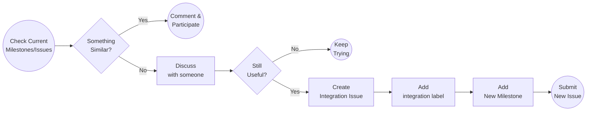

# Milestone Creation Guide



## What is a milestone?

A milestone it’s a requested feature or fix that will be integrated to the project when all the required work and testing is done. Milestones changes should make the project go from a stable state to another stable state while incorporating the new feature or fix. Milestones will group a set of issues to split the work on smaller tasks or developers.

## Check before you go

Before creating a new milestone, is important to check if there’s another milestone already in the project. Take in consideration that the feature or fix you are requesting, could be part of another milestone. Make sure that this milestone won’t duplicate efforts on the project.

## Discuss with someone

It’s important that the new feature or fix request is discussed with someone, in particular with someone from the core team or with big contributions to the project. With this previous discussion you need to find out if theres already a pending milestone that encapsulate the request and if what you are requesting is necessary and correct.

Join [Pocket Forum](https://forum.pokt.network/), discuss with other contributors, share ideas, check if something else is encapsulating your proposal. Analyze the feasibility of your proposal with other members of the community. Try to get consensus across the community before pushing a proposal.

## Integration Issues

Every milestone needs to be accompanied by an Integration Issue. Integration issue is the joining and entry point for the whole milestone. 

Integration Issues will have an integration branch, to integrate all milestone issues before reaching to `main` branch.

Integration Branches simplify sync and journaling on milestones with many developers involved. Integration branches help keeping the `main` branch healthy.

Integration issues should have the `integration` tag on its labels. Make sure to tag only integration issues as `integration`.

## Integration Issue and Milestone Creation

You can follow GitHub guides to create the integration issue

[https://docs.github.com/en/issues/tracking-your-work-with-issues/about-issues](https://docs.github.com/en/issues/tracking-your-work-with-issues/about-issues)

[https://docs.github.com/en/issues/tracking-your-work-with-issues/creating-an-issue](https://docs.github.com/en/issues/tracking-your-work-with-issues/creating-an-issue)

It’s important to provide the following information for the issue. Issues not properly formatted can be deleted.

- Title: A descriptive title representing the goal of the issue
- Description: What this issue will be for. It’s important that the description provides enough feedback to anyone to understand the motivation and deliverables of this issue.
- Assignee: (Optional for Creation) must be assigned before anyone starting to work. It’s important for other developers to identify available issues to work on, or who to reach to participate on the development of that issue.
- Labels: (Optional) you can use labels to identify issue types and goals
- Projects: (Optional) the project which this issue is linked to
- Milestone: The new milestone to be created

Description can be provided in the form on a document link, although a summary is required.

This template can be used for the description section,

```
# Objective
[ Milestone description - What]

# Origin Document
[ Description of the origin or link to a document]

# Goals
## Deliverables
- [ ] List of deliverables

## [Optional] Testing Methodology
How to proper test this issue

## Non-goals
- List of goals that this issue won't address

Owner: [github username of the owner]
Co-Owners: [github usernames of the owner - Optional]
Deliverables: [List of deliverables besides the PR - Optional]
```

### Milestone

A new milestone needs to be created as part of this Integration Issue. All work related issues will use the same milestone to group the work that needs to be deployed. Milestone description will have a backlink to the integration Issue.

```
**Origin Document:** [Link to the Integration Issue]
```

## Integration Branching Model

Milestones will have an integration branch, this branch will be the connection point of all the issues and provide a single testing point and single merging point.

All milestone work should be merged to this single branch prior to the final merge to the main branch. Milestone branch will have a deeper review and testing process and will require approvals from different actors in order to be approved.

Milestone PRs will evolve the protocol into a new version, they should provide a fully working version of the protocol without any pending work.

Milestone PR must be connected to the integration issue.

Milestone branches will have the following format,

`milestone/[milestone name, in lowercase, with underscore as space]`
