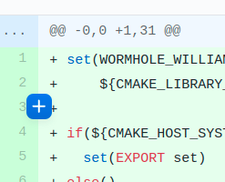
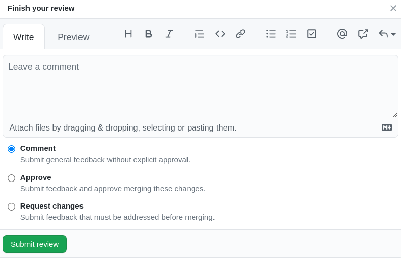

# Pocket's Code Development & Review Guidelines <!-- omit in toc -->

_This document is a living document and will be updated as the team learns and grows._

## Table of Contents <!-- omit in toc -->

- [Code Quality](#code-quality)
- [Code Reviews](#code-reviews)
  - [Code Review Guidelines](#code-review-guidelines)
  - [Expectations](#expectations)
  - [Best Practices](#best-practices)
    - [Smaller PRs](#smaller-prs)
    - [Ordering Commits](#ordering-commits)
    - [Approving PRs](#approving-prs)
  - [Review Comments](#review-comments)
  - [Figure 1: Inline Github Comment](#figure-1-inline-github-comment)
  - [Figure 2: Line Comment Dialog](#figure-2-line-comment-dialog)
  - [Finishing a Review](#finishing-a-review)
  - [Figure 3: Submitting A Review](#figure-3-submitting-a-review)
  - [Merging](#merging)

## Code Quality

_tl;dr Code Quality is an art moreso than a science._

`Code Quality` can be a vague concept, as it usually addresses what is more the `art` side (vs. the `science` side) of software development. In this document, we outline a framework to guide that human judgement towards -- collectively -- `better code`.

There are often several _technically correct_ ways to address a problem -- that is, the correct answer or behavior is produced.
Selecting the "_best_" solution is often a matter of style. Sometimes, the best solution is one that fits the surrounding code in the most cohesive way.

Terms like `maintainability` or `readability` are used; these address the ability of other contributors to understand and improve the code. Unlike correctness or performance concepts, there's no single metric or mathematical solution that can be optimized to achieve better code quality. Thus, we rely on human judgement.

For decades, the `IETF` (Internet Engineering Task Force) has used the motto `rough consensus and running code`. This motto encapsulates (`running code`) that developers' core output is still software: if there is no code that runs and produces correct results, we have nothing. It also encapsulates (`rough consensus`) that we may not always precisely agree and that's okay.

## Code Reviews

_tl;dr Code Reviews are a necessary evil, and there are no specific guidelines that will university apply everywhere all the time._

One tactic often employed to produce `maintainable` or `more-readable` code is a `code review`. These can take many shapes and forms and often have goals beyond simply `code quality``.

Broadly speaking, code reviews involve developers looking at some proposed new code (or code changes). This is _usually_ developers other than the author (although a `self-review` can also be employed). In many projects, such attention is a scarce commodity: most programmers would rather write code than read someone else's.

Remember, writing code is the **fun part** but reading code is **work part**, so try to make it as easy for the reviewer as possible.

### Code Review Guidelines

All participants must adhere to the overall idea that the review is an attempt to achieve `better`` code. This is a vague statement on purpose.

Participants must be cautious in their criticism and generous with praise.

Participants must remember the scarcity of another developer's attention.

### Expectations

**Pull Request Authors:** The author is responsible for tracking up-to-date next actions for a Pull Request to progress towards being merged.

**Reviewers:** Reviewers should prefer engaging in code review over starting new work (i.e. taking planned work items that haven't been started yet).

**Reviewers (and prospective reviewers)** are encouraged to engage in reviews of codebases outside the projects and technologies they use on a day-to-day basis (but not expected to provide an approving review).

### Best Practices

#### Smaller PRs

Consider if it could be broken into smaller Pull Requests. If it is clear that it can be, summarize your thinking on how in your Review.

#### Ordering Commits

If the commits be (re)organized (i.e. reordered and/or amended) such that there is a commit at which the tests are passing prior to the conclusion of the main change, that's a signal that there's likely a logic split which can be made at that point in such a (re)arrangement.

#### Approving PRs

Use the following guidelines to evaluate whether a Pull Request should be approved:

- _Every_ Pull Request should have tests or justification otherwise; esp. bug fixes.
- _Every_ Pull Request should have at least 1 approval from a team member internal or external to the project. Exceptions made by repository maintainer(s), as necessary, on a case-by-case basis.

### Review Comments

_tl;dr Use `SOS`, `TECHDEBT`, `TECHDEBT(XXX)`, `NIT` if you think it'll help the author get context on the next steps._

When leaving review comments, consider if any of the following characterizations applies and prefix the comment, respectively:

- `NIT`: Comment is a nitpick
- `TECHDEBT`: Comment should have a TECHDEBT comment w/o a ticket
- `TECHDEBT(XXX)`: Comment should have a TECHDEBT comment but imporant enough that it requires a ticket to track the work in the near future
- `SOS`: Show Stopper. You feel strongly enought that it needs to be addressed now.

During review, submit feedback using line comments (Fig1); prefer `Add\[ing a\] single comment` over `Start[ing] a review` (Fi2). Once a review has been started, the option to add single comments is removed. Preferring single comments allows feedback to happen even in the event of an interrupted review.

### Figure 1: Inline Github Comment

### Figure 2: Line Comment Dialog

**Referencing Issues Across Repositories:** When referencing issues from one repository, in another's Issues and Pull Requests, GitHub supports automatic links in markdown using the following format: `<org name>/<repo name>#<issue or PR number>`.

### Finishing a Review

Write a summary of your observations and consider including positive remarks in addition to any constructive criticism.

If you observe a deviation from these practices or another reason that this change should not be merged, select `request changes` and include a summary of the observation(s), as well as any practice(s) you find them to be in conflict with, in the review body (Fig3).

If you don't feel comfortable giving approval or requesting changes but want to share a summary or observations of larger patterns in the codebase or the company, select "Comment" and submit your review (C).

Confirm that all items in the `required checklist` are checked or not applicable.

If you believe the Pull Request looks good to merge, select "Approve" and submit your review (Fig3).

### Figure 3: Submitting A Review

### Merging

1. Utilize the `Squash & Merge` feature (maintain a clean history)
2. Copy the `Github PR Description` into the commit message (add sufficient detail)

**Authors are core members or regular external contributors:**

- Core member needs to approve PR
- Author should merge in the PR themselves (following instructions above)

**Authors are non-regular external contributors:**

- Core member needs to approve PR
- Core member can merge PR on behalf of contributor (following instructions above)
