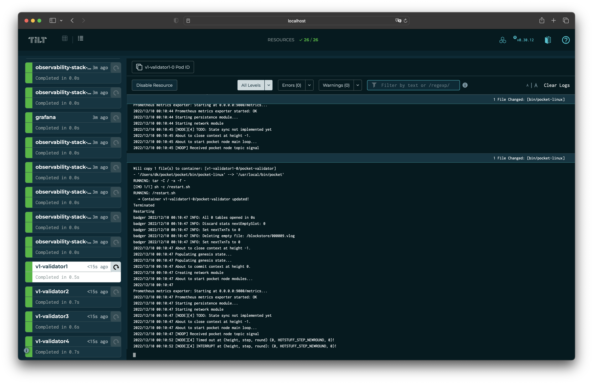

# LocalNet on Kubernetes <!-- omit in toc -->

This guide shows how to deploy a LocalNet using [pocket-operator](https://github.com/pokt-network/pocket-operator).

- [Dependencies](#dependencies)
- [Running the LocalNet](#running-the-localnet)
- [Stopping and cleaning up the resources](#stopping-and-cleaning-up-the-resources)
- [Interaction with the LocalNet](#interaction-with-the-localnet)
- [How does it work?](#how-does-it-work)
- [Troubleshooting](#troubleshooting)
- [How to change configuration files](#how-to-change-configuration-files)

### Dependencies

* [tilt](https://docs.tilt.dev/install.html) - installed automatically on `make install_cli_deps` command.
* Kubernetes cluster ([different options available](https://docs.tilt.dev/choosing_clusters.html)).
  * `kubectl` CLI is required and should be configured to access the cluster. That should happen automatically if you're using Docker Desktop, Rancher Desktop, k3s, k3d, minikube, etc.
  * `helm` - required to template the yaml manifests for the observability stack. Installation instructions: https://helm.sh/docs/intro/install/.
* pocket kubernetes operator codebase in `../pocket-operator` directory, relative to the pocket v1 codebase. If you don't have this repo, tilt will try to pull it from the `main` branch on first launch.
  * Having this codebase available on your computer allows you to iterate/change the operator code while running the localnet.

### Running the LocalNet

```
make localnet_up
```

The developer can then view the logs of all the services running (including the operator, observability stack, etc.) by either:
- Pressing `space` in the terminal where you started tilt
- Going to [localhost:10350](http://localhost:10350/)



### Stopping and cleaning up the resources

```
make localnet_down
```

The command stops LocalNet and cleans up all the resources, except the postgres operator (in case you have other databases provisioned with it, the validators database itself will be destroyed).

### Interaction with the LocalNet

As the workloads run in Kubernetes, you can see and modify any resources on your local kubernetes by a tool of your choice (k9s, Lens, VSCode extension, etc.) - just be mindful that tilt and pocket-operator will change the resources back eventually, so you might want to disable tilt or turn off pocket-operator to make changes that you want to test.

We provide following make targets:
`make localnet_shell` - opens a shell in the pod that has `client` cli available. It gets updated automatically whenever the code changes.
`make localnet_client_debug` - opens a `client debug` cli. It allows to interact with blockchain, e.g. change pace maker mode, reset to genesis, etc. It gets updated automatically whenever the code changes.

### How does it work?

`tilt` reads the `Tiltfile` in the root of the project, and based on the configuration in it, it will start the services defined in the `Tiltfile` and will monitor the files for changes. `Tiltfile` is written in Starlark, which is a dialect of Python.

Currently, the services defined in the `Tiltfile` are:
- [pocket-operator](https://github.com/pokt-network/pocket-operator) - the operator that manages the v1 workloads;
  - once operator is available, `tilt` pushes a set of Custom Resource Definitions (CRDs) to the cluster to provision the genesis file (localnet configuration), and [validators](../../build/localnet/validators.yaml);
- [postgres-operator](https://github.com/zalando/postgres-operator) - the operator to manage postgres lifecycle in kubernetes;
  - once operator is available, `tilt` pushes a [Postgres CRD](../../build/localnet/postgres-database.yaml) to the cluster to provision a postgres database;
- [obeservability-stack](../../build/localnet/observability-stack/) - a helm chart that installs the observability stack (prometheus, grafana, etc.) that is used to gather metrics and logs from localnet services.
- v1 cli client - this is a binary that can be used to perform operations on testnet, e.g. you can run `make localnet_client_debug` to execute commands such as `ResetToGenesis`, or `TogglePacemakerMode`. This binary is also automatically updated when you make changes to the codebase.

Tilt continuously monitors files on local filesystem, and when it detects a change, it will rebuild the binary once and distribute it to all the pods that are running. This allows you to iterate on the code and see the changes immediately.
This works for both - pocket v1 codebase, and pocket-operator codebase that lives in a separate repo/directory.

The workloads however are not managed by Tilt directly, but by the pocket-operator. Tilt instructs pocket-operator by pushing the CRDs to the cluster, and the operator takes care of the rest. This allows us to test and validate pocket-operator, however if we notice this set up introduces too much friction - we will modify the `Tiltfile` to manage the workloads on kubernetes directly.

### Troubleshooting

Sometimes you might experience issues running localnet on Kubernetes. They might be related to the fact different people run different clusters/OS/environments, and sometimes our laptops can go to sleep and that might not play well with virtual machines, postgres or pocket client.

- Check tilt web UI by pressing a space in the terminal where you started tilt or going to [this page](http://localhost:10350/) in your browser. If you see any errors, you can click "Trigger Update" on a resource that has issues to restart the service or retry a command.
- If triggering an update didn't help, please try to run `make localnet_down` and then `make localnet_up` again. This will clean up most of the resources and start the localnet from scratch.
- If `make localnet_down` didn't help, we suggest to rebuild local kubernetes cluster using the tool you're managing your cluster with - it could be Docker Desktop, Rancher Desktop, k3s, k3d, minikube, etc.
- Open an issue in this repo if you're still experiencing issues with running localnet using this guide.

### How to change configuration files

LocalNet resources are managed by pocket-operator, so if you'd like to change a config file (e.g. genesis file), you can do it by modifying the corresponding CRD in `pocket-operator` repo.
