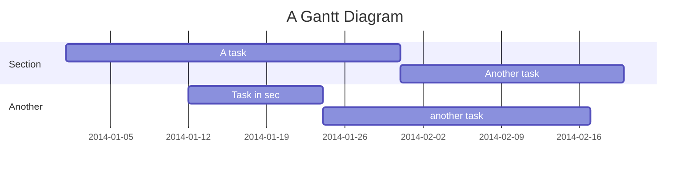

# Pocket V1 Roadmap <!-- omit in toc -->

- [Milestones](#milestones)
  - [M1. Pocket PoS (Proof of Stake)](#m1-pocket-pos-proof-of-stake)
  - [M2. Pocket DoS (Devnet of Servicers)](#m2-pocket-dos-devnet-of-servicers)
  - [M3. Pocket RoS (Relay or Slash)](#m3-pocket-ros-relay-or-slash)
  - [M4. Pocket CoS (Cloud of Services)](#m4-pocket-cos-cloud-of-services)
  - [M5. Pocket IoS (Innovate or Skip)](#m5-pocket-ios-innovate-or-skip)
  - [M6. Pocket FoS (Finish or Serve)](#m6-pocket-fos-finish-or-serve)

## Milestones

### M1. Pocket PoS (Proof of Stake)

Goals:

- LocalNet equivalent of Tendermint Core for a proof of stake blockchain custom built for Pocket, but without Pocket specific utility.

### M2. Pocket DoS (Devnet of Servicers)

Goals:

- Build supporting infrastructure & automation in conjucntion to Milestones 1 & 3
- Deploy Pocket V1 to DevNet
- Build services to enable visiblity and benchmarking via telemetry and logging

### M3. Pocket RoS (Relay or Slash)

Goals:

- Focus on Pocket Network utility specific business logic
- DevNet supporting ETH get balance relays
- Preliminary implementation of report cards & reward distribution will still be nacent

### M4. Pocket CoS (Cloud of Services)

Goals:

- Launch an incentivized TestNet
- Load test and attack TestNet
- Drive automation from community contributions

### M5. Pocket IoS (Innovate or Skip)

Goals:

- General purpose relay support
- Allocate some time to R&D that make Pocket unique and performant
- Cut any features that are important but not urgent for the launch of V1 mainnet

### M6. Pocket FoS (Finish or Serve)
