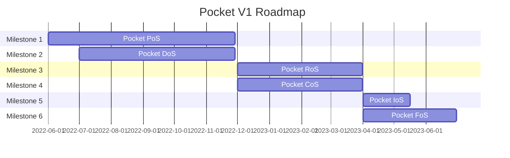

# Roadmap & Milestones <!-- omit in toc -->

This document was last updated on 09-15-2022.

- [V1 Roadmap](#v1-roadmap)
- [Milestones](#milestones)
  - [M1. Pocket PoS (Proof of Stake)](#m1-pocket-pos-proof-of-stake)
  - [M2. Pocket DoS (Devnet of Servicers)](#m2-pocket-dos-devnet-of-servicers)
  - [M3. Pocket RoS (Relay or Slash)](#m3-pocket-ros-relay-or-slash)
  - [M4. Pocket CoS (Cloud of Services)](#m4-pocket-cos-cloud-of-services)
  - [M5. Pocket IoS (Innovate or Skip)](#m5-pocket-ios-innovate-or-skip)
  - [M6. Pocket FoS (Finish or Serve)](#m6-pocket-fos-finish-or-serve)
  - [M7. Pocket NoS (North Star)](#m7-pocket-nos-north-star)

Note that this is a live document and is subject to change. It is managed by the Core team to provide a high-level idea for the community on the team's current plans.

This Github repo will be updated to reflect all the Milestones listed here, and smaller milestones, projects, tasks are going to be created and updated on an ongoing basis.

## V1 Roadmap

## Milestones

### M1. Pocket PoS (Proof of Stake)

#### Goals:

- Basic LocalNet development environment
- Tendermint Core equivalent for a proof-of-stake blockchain custom-built for Pocket

#### Non-goals:

- Pocket specific utility
- Devnet infrastructure

#### Deliverables

##### General Tooling
  - [ ] Keybase functionality to import/create/export keys
  - [ ] Base CLI 
  - [ ] Base RPC
  - [ ] Logging infrastructure

##### Validator-only logic
  - [ ] Stake
  - [ ] Unstake
  - [ ] Pause
  - [ ] Unpause

##### Validator slashing & rewards
  - [ ] Slashing & jailing for not signing blocks
  - [ ] Slashing & jailing for for double signing blocks
  - [ ] Reward Validators for producing a block

##### Consensus
  - [ ] BFT Hotstuff Consensus implementation
  - [ ] Consistency and liveness guarentees satisfied to the specification
  - [ ] Pacemaker module  
  - [ ] Replica block validation

##### Mempool
  - [ ] Mempool reaping and block production
  - [ ] Mempool and TxIndexer  

##### State sync:
  - [ ] Block by block
  - [ ] Block replay  

### M2. Pocket DoS (Devnet of Servicers)

#### Goals

- [ ] Build supporting infrastructure & automation in conjunction to Milestones 1 & 3
- [ ] Deploy Pocket V1 to DevNet
- [ ] Build services to enable visiblity and benchmarking via telemetry and logging

#### Deliverables

##### Logging

- [ ] Log dashboards namespaced & filterable by source & target module
- [ ] Log dashboards namespaced & filterable by log level (error, debug, etc…)

##### Telemetry

- [ ] Visibility and insight into HotPOKT algorithm
- [ ] Visibility and insight into RainTree algorithm
- [ ] Standard services benchmarking & telemetry
- [ ] A spec / document / list of metrics being tracked

##### Guides

- [ ] Instructions on how to run a LocalNet for development
- [ ] Instructions on how to run a DevNet for development
- [ ] Personalized DevNet
- [ ] Automated build/tag based DevNet

### M3. Pocket RoS (Relay or Slash)

#### Goals:

- Pocket Network utility-specific business logic including:
  - Devnet supporting ETH relays
  - Initial implementation of reward distribution, report cards, etc...

#### Deliverables

##### Session Protocol
  - [ ] GeoZone support
  - [ ] RelayChains implementation

##### Service Node Protocol
  - [ ] Report Cards
  - [ ] Salary Protocol
  - [ ] Pause & Unpause

##### Relay Protocol
  - [ ] In process servicing / validation
  - [ ] Storage and submission of relays

##### Fisherman Protocol
  - [ ] Report Cards
  - [ ] Sampling Protocol
  - [ ] Pause & Unpause

##### App Protocol
  - [ ] Application Authentication Tokens
  - [ ] Pause & Unpause

##### Gov Protocol
  - [ ] DAO approved Fish

### M4. Pocket CoS (Cloud of Services)

#### Goals:

*Note: more details will be added to this milestone in the future*

- Launch an incentivized Testnet
- Testnet load testing, chaos testing, identification of attack vectors, etc...
- Drive automation from community contributions

### M5. Pocket IoS (Innovate or Skip)

#### Goals:

*Note: more details will be added to this milestone in the future*

- Feature cuts and realignment on V1 Mainnet launch
- R&D for Pocket specific use cases, as well as sources of innovation and optimization
- General-purpose relay support

### M6. Pocket FoS (Finish or Serve)

#### Goals:

*Note: more details will be added to this milestone in the future*

- Resolve critical launch blocking bugs
- Identify and/or resolve tech debt
- Prepare a post-Mainnet launch set of plans
- Launch V1 Mainnet

## M7. Pocket NoS (North Star)

Shoot for the ✨ and we will land on the 🌕
