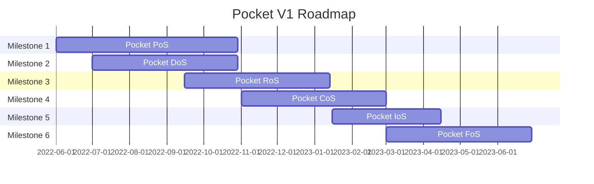

# Roadmap & Milestones <!-- omit in toc -->

This document was last updated on 06-10-2022.

- [V1 Roadmap](#v1-roadmap)
- [Milestones](#milestones)
  - [M1. Pocket PoS (Proof of Stake)](#m1-pocket-pos-proof-of-stake)
  - [M2. Pocket DoS (Devnet of Servicers)](#m2-pocket-dos-devnet-of-servicers)
  - [M3. Pocket RoS (Relay or Slash)](#m3-pocket-ros-relay-or-slash)
  - [M4. Pocket CoS (Cloud of Services)](#m4-pocket-cos-cloud-of-services)
  - [M5. Pocket IoS (Innovate or Skip)](#m5-pocket-ios-innovate-or-skip)
  - [M6. Pocket FoS (Finish or Serve)](#m6-pocket-fos-finish-or-serve)
  - [M7. Pocket NoS (North Star)](#m7-pocket-nos-north-star)

Note that this is a live document and is subject to change. It is managed by the Core team to provide a high-level idea for the community on the team's current plans.

This Github repo will be updated to reflect all the Milestones listed here, and smaller milestones, projects, tasks are going to be created and updated on an ongoing basis.

## V1 Roadmap

## Milestones

### M1. Pocket PoS (Proof of Stake)

Goals:

- Basic LocalNet development environment
- Tendermint Core equivalent for a proof-of-stake blockchain custom-built for Pocket

Non-goals:

- Pocket specific utility
- Devnet infrastructure

### M2. Pocket DoS (Devnet of Servicers)

Goals:

- Pocket V1 to Devnet deployment
- Supporting infrastructure & automation for Milestones 1 & 3
- Auxiliary services to enable visibility and benchmarking via telemetry and logging

### M3. Pocket RoS (Relay or Slash)

Goals:

- Pocket Network utility-specific business logic including:
  - Devnet supporting ETH relays
  - Initial implementation of reward distribution, report cards, etc...

### M4. Pocket CoS (Cloud of Services)

Goals:

- Launch an incentivized Testnet
- Testnet load testing, chaos testing, identification of attack vectors, etc...
- Drive automation from community contributions

### M5. Pocket IoS (Innovate or Skip)

Goals:

- Feature cuts and realignment on V1 Mainnet launch
- R&D for Pocket specific use cases, as well as sources of innovation and optimization
- General-purpose relay support

### M6. Pocket FoS (Finish or Serve)

Goals:

- Resolve critical launch blocking bugs
- Identify and/or resolve tech debt
- Prepare a post-Mainnet launch set of plans
- Launch V1 Mainnet

### M7. Pocket NoS (North Star)

Shoot for the ✨ and we will land on the 🌕
