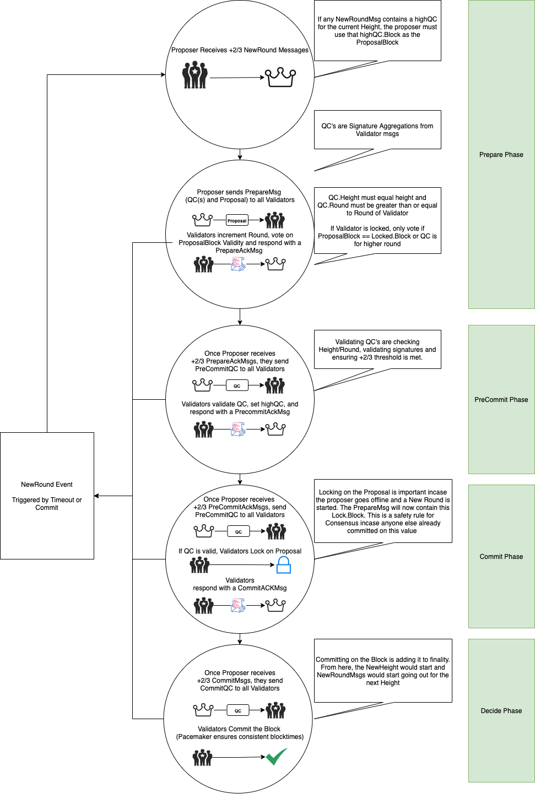
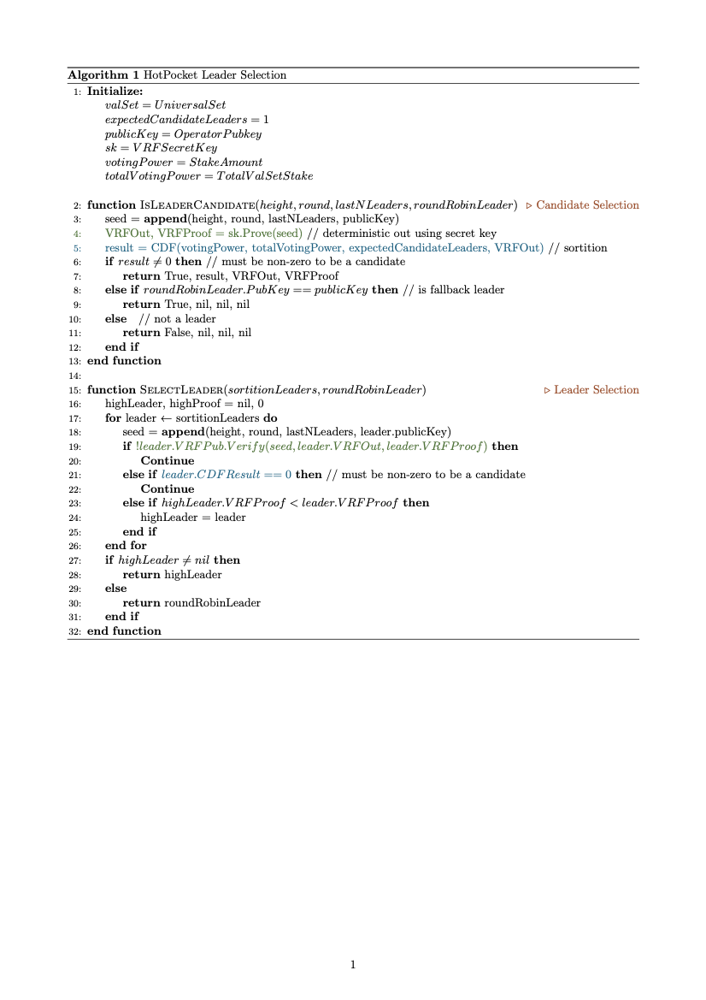
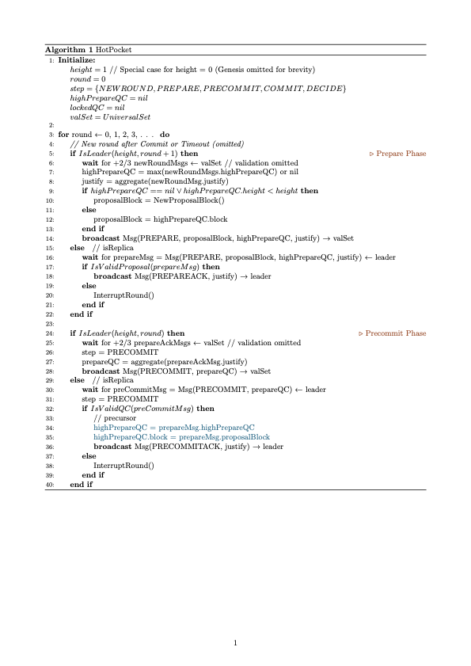
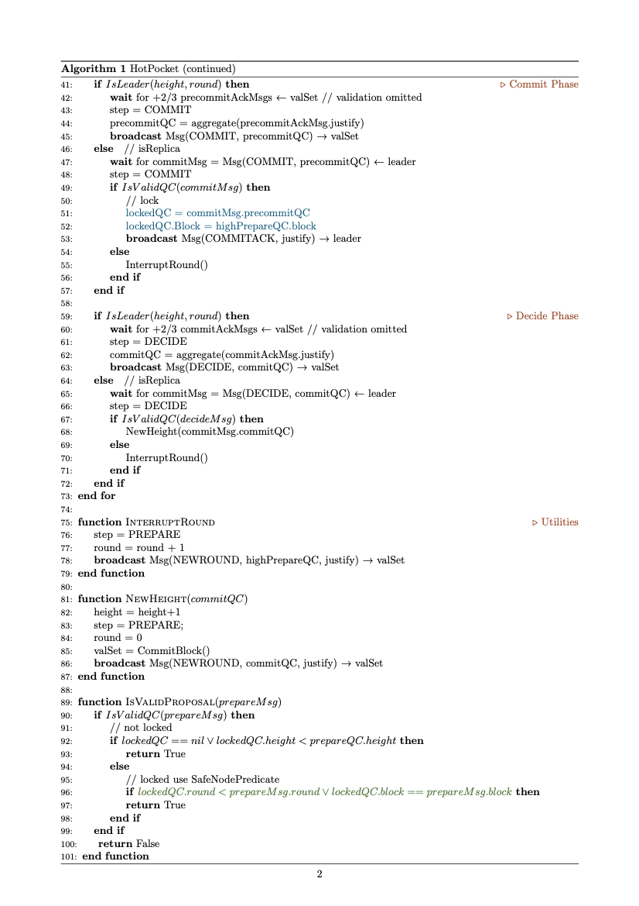

# HotPocket - Pocket 1.0 Consensus Module Specification

<p align="center">
    Andrew Nguyen<br>
    @andrewnguyen22<br>
    Version 1.0.1
</p>

## 1. Overview

This document describes Pocket Network's Consensus Module, including Pocket Network's **Consensus Protocol**: a leader-based Byzantine fault-tolerant replication protocol for the partially synchronous model, and the **Blockchain protocol**: the logical orchestration of the block and transaction data. In practice, Pocket Network's Consensus Module enables deterministic state machine replication and ensures finality across the universal set of Pocket Network Validators.

_NOTE A: This document is subject to change. Continued research and development by the Pocket Core team, in collaboration with the Pocket Network community, will shape the specification over time until a final version is published._

_NOTE B: This document does not attempt to prove HotPocket formally, rather specify Pocket's Implementation of Basic HotStuff & Leader Selection._

## 2 Requirements

- The consensus algorithm must allow a configurable set of validators to reach a byzantine agreement after some arbitrary Global Synchronization Time;
- The consensus algorithm must allow for a secure rotation of the Leader;
- The consensus algorithm must guarantee safety always;
- The consensus algorithm must have immediate consistency/finality between blocks;
- The consensus algorithm should perform well in the following environments: synchronous and partially synchronous;
- The consensus algorithm's performance and capacity can be reasoned theoretically;
- The consensus algorithm should be fault-tolerant and self-healing;
- The consensus algorithm must scale to a minimum of 1 thousand replicas with 1-second blocks;
- The consensus algorithm must be minimally battle-tested;
- The consensus algorithm must be able to be implemented within the 1.0 timeline with the current Pocket Network Core Engineering team;
- The consensus algorithm must guarantee liveness in a network of _3f+1_ nodes with at most _f_ byzantine nodes.

## 3 Specification

## 3.1 Consensus Protocol Specification

Conceptually speaking, Pocket Network's Consensus Protocol enables a set of replicas to agree on a single data set in a distributed fashion. The core development team decided Hotstuff BFT will be used as the base blueprint that Pocket Network Inc. will build its Consensus Protocol on top off. The team evaluated several alternatives, but in short, Hotstuff is:

- Most battle-tested with multiple projects & open benchmarks;
- Well peer-reviewed and formally verified;
- Most performant with linear communication complexity in a happy-path;
- Easiest to implement with a simple protocol and multiple reference implementations
- Most fitting with immediate consistency & finality
- Most reputable (relatively speaking) consensus algorithm

### 3.1.1 Consensus Protocol

HotPocket is [Basic Hotstuff](https://arxiv.org/abs/1803.05069) with the addition of a defined (3.1.3) VRF leader selection algorithm and a custom (3.1.9) pacemaker mechanism for synchronization during rounds. The HotPocket algorithm is executed once per BlockHeight to Commit a single Block into finality. Each height is logically broken into rounds and each round into multiple steps. In ideal conditions, each height consists of exactly 1 round made of 4 steps. However, in faulty scenarios, multiple rounds may elapse before a Block is decided into finality, and a round will be interrupted before executing all four steps. In order for a block to be successfully decided on, a leader must collect Signatures for +⅔ of Validators in the Prepare, PreCommit, and Commit steps. A representative collection of +⅔ Signatures for any of the three phases is known as a QuorumCertificate. HotPocket is illustrated with the following state machine:

<p align="center">

</p>

### 3.1.2 Consensus Primitives

- **BlockHeight**: Current superior view of the Pocket Blockchain.
- **Round**: A sequence of communication steps that represents one cycle of HotPocket. A non-zero round is considered the 'recovery path'.
- **Step**: The smallest logical unit in HotPocket consensus. At least 4 steps are required to increment the BlockHeight.
- **VRF**: Verifiable Random Function: Non-malleable deterministic digital signatures.
- **CDF**: Cumulative Distribution Function: Binomial distribution simulations.
- **ProposalBlock**: Value created by a Proposer to add to the Blockchain if committed.
- **NewRoundMsg**: From Validators to a new Proposer indicating a new round has begun containing any HighPrepareQC & TimeoutQC or CommitQC.
- **PrepareQC**: +⅔ aggregated Validator Signatures, containing the associated ProposalBlock and created by a Proposer from NewRoundMsgs. This QC comes in 2 flavors: TimeoutQC or CommitQC from the previous height.
- **HighPrepareQC**: Nullified on every successful commit; represents the highest PrepareQC and valid ProposalBlock associated with the current height.
- **PrepareMsg**: From Proposer to Validators indicating that the ValidatorSet decided to start a new round. This includes the ProposalBlock, a HighPrepareQC for justification of the ProposalBlock value, and the TimeoutQC or CommitQC justifying the new round.
- **PrepareAckMsg**: From Validators to Proposer indicating the ProposalBlock is valid containing their partial signature.
- **PreCommitQC**: +⅔ aggregated Validator Signatures, associated with a PrepareQC; Proposer creates from PrepareAckMsg.
- **PreCommitMsg**: From Proposer to Validators indicating that the ValidatorSet decided the ProposalBlock was valid using the PrepareQC. Includes a PreCommitQC for justification.
- **PreCommitAckMsg**: From Validators to the Proposer indicating the PrepareQC is valid and is locked on the ProposalBlock; contains the validator's partial signature.
- **LockedQC**: The value and round at which a HighPrepareQC was seen by the Validator.
- **CommitQC**: +⅔ aggregated Validator Signatures, associated with a PreCommitQC created by a Proposer creates from PreCommitAckMsg.
- **CommitMsg**: From Proposer to Validators indicating that the ValidatorSet decided it is locked on the ProposalBlock value and it is now safe to Commit the ProposalBlock; contains a CommitQC for justification.
- **StepTimeout**: Each step is bounded by time T specific to each step. If T elapses before the step completes, a StepTimeout event is triggered and a TimeoutQC is gossiped throughout the network.
- **GST**: Global Synchronization/Stabilization Time: the time after which every consensus participant must be in sync.

### 3.1.3 Leader Selection

Pocket Network 1.0's Leader Selection leverages a Verifiable Random Function to ensure a secure pseudo-random selection that is unpredictable before the block production, yet deterministic and computationally cheap to verify afterwards.

A Validator participating in the Leader Selection protocol uses a pre-registered VRF Keypair to calculate a deterministic OutputValue and Proof from seed input. It is important to note that Validator VRF keys expire after a certain number of blocks and require a period key refresh.

The VRF seed input is simple: the hash of the most recent N Leaders Addresses (or seed from genesis), the Validator's Operator Public Key, BlockHeight, and the Round number. The participating Validator then executes a deterministic Cumulative Distribution Function using the VRF OutputValue, StakeAmount, and the global ValidatorTotalStake as input. If the CDF Output is 'success','he Validator is a Candidate Leader and may produce a block.

In practice, this means there can be multiple or zero Leaders selected for any round. If multiple Candidate Leaders continue to exist, Validators will choose to participate in core consensus execution with the candidate Leader with the highest VRF Proof. If no VRF Candidate Leaders exist, the algorithm falls back to a simple Weighted Round-Robin algorithm. This secondary execution runs in parallel and always produces exactly one candidate with a VRF proof value of zero.

<p align="center">

</p>

### 3.1.4 Prepare Step

Upon entering the Prepare Phase, the Leader receives NewRoundMessages from +⅔ Validators. NewRoundMessages contain a HighPrepareQC variable representing the highest PrepareQC that any Validator witnessed. The HighPrepareQC formally dictates whether or not a lock could exist for the specified round.

If HighPrepareQC is null or for the previous height for all NewRoundMessages, the Leader reaps the Mempool for a bounded set of valid transactions and forms a novel ProposalBlock. If HighPrepareQC is non-null, and is for the current height, the Leader must use the Block value associated with the HighPrepareQC and attach the HighPrepareQC for justification in case there exist Validators with a LockedQC from a lower round. The Leader then directly broadcasts the Proposal to all of the registered Validators.

When a Validator receives the PrepareMsg, it votes with a signature according to the following protocol:

- Proposal.Height must be Height+1
- LeaderSelection() returns Proposer
- Proposal.Round is greater than or equal to round and has not voted on this round
- If Proposal.Round is 0:
  - The Proposal must contain a valid CommitQC for the previous height
- Else:
  - Proposal must contain a valid TimeoutCertificate for the previous round
- If LockedQC != nil:
  - LockedQC.Block must equal Proposal.Block or Proposal contains a justification Proposal.HighPrepareQC.Height/Round greater than LockedQC.Height/Round
- The ProposalBlock is valid according to the State Machine (UtilityModule)

A Validator casts a vote by broadcasting a partial signature (part of a threshold signature) of the PrepareMessage directly to the Leader in a PrepareAckMessage. A Validator then moves into the PreCommit Step.

### 3.1.5 PreCommit Step

When the Leader receives +⅔ valid signatures for the PrepareMessage (Proposal), it aggregates them into a PrepareQC. The Leader then directly broadcasts the PrepareQC in a PreCommitMessage to all registered Validators, proving that +⅔ nodes have confirmed the Block Proposal.

A Validator receives a PreCommitMessage from the Leader. If the PrepareQC is valid, it stores the PrepareQC in HighPrepareQC. A Validator casts a vote by broadcasting a partial signature (part of a threshold signature) of the PreCommitMessage directly to the Leader in a PreCommitAckMessage. A Validator moves into the Commit Step.

### 3.1.6 Commit Step

When the Leader receives +⅔ valid signatures for the PreCommitMessage, it aggregates them into a PreCommitQC. The Leader then directly broadcasts the PreCommitQC in a CommitMessage to all registered Validators, proving that +⅔ nodes have confirmed the PreCommitMessage and it is safe to lock.

A Validator receives a CommitMessage from the Leader. If the PreCommitQC is valid, it stores the HighPrepareQC.Block in LockedQC.Block and the HighPrepareQC.Height/Round in the LockedQC.Round effectively locking the value. A Validator casts a vote by broadcasting a partial signature (part of a threshold signature) of the CommitMessage directly to the Leader in a CommitAckMessage. A Validator then moves into the Decide Step.

### 3.1.7 Decide Step

When the Leader receives +⅔ valid signatures for the CommitMessage, it aggregates them into a CommitQC. The Leader then directly broadcasts the CommitQC in a DecideMessage to all registered Validators, proving enough nodes have confirmed the CommitMessage.

A Validator receives a DecideMessage from the Leader. If the CommitQC is valid, it commits the LockedQC.Block into finality. A Validator casts a vote for a NewHeight by executing VRF-LeaderSelection, gossiping a partial signature (part of a threshold signature) of the DecideMessage and VRF proof to the entire Validator Set in a NewRoundMessage. A Validator moves to the Prepare Step and the core execution restarts.

### 3.1.8 Incomplete Round:

A round may be interrupted and considered incomplete if any validation checks fail or a StepTimeout event occurs. In the case of an incomplete round, a Validator updates their step to Prepare and their Round to Round+1, executes VRF-LeaderSelection and broadcasts a NewRoundMessage to all Validators. The NewRoundMessage contains their HighPrepareQC and an indicator that a specific Height/Round StepTimeout occurred to justify the NewRound. The next Leader collects +⅔ NewRoundMessages in the Prepare step and continues the core execution.

### 3.1.9 Pacemaker Protocol:

The Pacemaker Protocol achieves Round synchronization through exponential StepTimeouts and QuorumCertificate processing. Specifically, if a Validator witnesses a QuorumCertificates Round/Step higher than Round/Step, the Pacemaker advances the Validator to QuorumCertificate.Round/Step. In addition to the automatic round advancing, the Pacemaker increases StepTimeouts exponentially: StepTimeouts = StepTimeout^(Round+1). This mechanism ensures an eventual collision of Rounds among Validators. An aspect of HotPocket that differs from other implementations is that Pocket Network's 1.0 Utility Module much prefers consistent Commit times in order to most accurately uphold the SLA with the network's Applications. The Pacemaker Protocol attempts to satisfy the consistent Commit time requirement with a combination of an awareness of the last successful Commit time and a dynamic balancing of StepTimeouts.

<p align="center">


</p>

## 3.2 Blockchain Protocol Specification

The blockchain protocol can be conceptually broken down into lifecycle events that enable the formation of the Blockchain and the execution of the state machine. Specifically, the blockchain protocol is responsible for the following sub-protocols (defined in greater detail within the specification): Block Protocol, Genesis Protocol, and Syncing Protocol.

### 3.2.1 Block Protocol

The Block Protocol is responsible for orchestrating the creation, propagation, application, and finalization of the data forming the Pocket Network 1.0 Blockchain. The data structure of a Block includes a BlockHeader, Transactions, and Consensus Evidence. The BlockHeader structure contains metadata necessary to ensure the security and validity of the Block and the overarching Blockchain.

Specifically, the Header includes the hash of the previous Block, cryptographically chaining the Blocks together, the hash returned by the State Machine after the application of the Block, ensuring Consensus on the State Machine execution, the QuorumCertificate of the ValidatorSet, certifying the data into the Blockchain, the address of the Proposer, and the BFT Timestamp.

BlockTransactions are arbitrary bytes limited to a maximum size that apply to the underlying State Machine. Transaction data can be interpreted by the State Machine resulting in discrete state changes when a Block is applied. Any network client may create a Transaction and propagate the data through the network using the P2P Module. When Network clients receive transactions, the data is checked against the State Machine for stateless minimum validity and are considered unconfirmed. Unconfirmed Transactions are stored in a cache memory pool identified as the Mempool limited up to MaxMempoolBytes. During the Consensus Protocol, a Leader reaps the Mempool for a limited number of Transactions and batches them into a Block. It is important to note that Mempool reaping is not an arbitrary process. Transactions selected are prioritized and incentivized by the Utility Module.

The Evidence contained within a block is on-chain proof of Byzantine behavior during the Consensus Protocol. Evidence is automatically generated by participants of the ValidatorSet and is propagated through the network using the P2P Protocol. Like Transactions, Evidence is minimally verified, stored in the Mempool, reaped from the Mempool by a Proposer, and batched into a Block. However, unlike Transactions, Evidence production and effects are solely limited to Validator actors. The application and structure of Consensus Evidence is further detailed in the Pocket Network 1.0 Utility Specification.

During the Proposal validation step of the Consensus Protocol, each Validator will apply a ProposalBlock against the state machine and maintain an ephemeral ProposedState in anticipation of Block Finalization. A Block is applied in three lifecycle phases: BeginBlock, DeliverTxs, and EndBlock. The lifecycle phases of Block execution allow for autonomous state change operations that are event-driven rather than Transaction or Evidence driven. As the names suggest, the BeginBlock lifecycle event occurs at the beginning of the Block application, followed by the delivery of all Transactions contained in the Block, and finishing with the EndBlock event. The result of a complete Block Application lifecycle is the AppHash contained within the block header, verifying proper State Machine Replication at every height.

Upon the successful execution of the Consensus Protocol, the ephemeral ProposalState is irreversibly Committed into finality, the Storage Module indexes the Block and its contents, and the new Block is propagated to the network through the P2P Module. Any network client may cryptographically validate a block by executing the ApplyBlock lifecycle and validating the BlockHeader.

#### Block Interface

```go
type Block interface {
    GetBlockHeader() BlockHeader # the metadata of the block
    GetTxs() Transactions # the transactions contained within the block
    GetEvidence() Evidence # consensus evidence contained within a block
}
```

#### BlockHeader Interface

```go
type BlockHeader interface {
    GetLastBlockHash() Hash # the hash of the previous block
    GetAppHash() Hash # hash returned from the utility module ensuring
    GetQC() QuorumCertificate # votes from the ValSet finalizing the block
    ProposerAddress() Address # identifier of the proposer
    GetTime() Timestamp # time of block produced
}
```

```go
func ApplyBlock(Block) (newValidatorSet, appHash) {
    utility.BeginBlock(Block.Header, Block.Evidence)
    for \_, tx := each Block.Txs {
        if !isValid = utility.DeliverTx(tx) {
            # INVALID PROPOSAL
        }
    }
    Return utility.EndBlock()
}

func IsValidBlock(Block, PreviousFinalBlock, valSet, proposer) bool {
    if !Block.ValidateBasic() {
        return False
    }
    # Validate QC, Proposer, LastBlockHash
    if !Block.Header.Validate(PreviousFinalBlock, valSet, proposer) {
        return False
    }
    _, appHash = ApplyBlock(Block)
    if Block.Header.AppHash != appHash {
        return False
    }
    return True
    }
}
```

### 3.2.2 Genesis Protocol

A 'Genesis Block' is applied as seed input in the form of the JSON file `Genesis.json`. This Block represents the inception state of the Blockchain and is socially distributed to all participating Genesis Validators prior to the Genesis Start Time. Conceptually speaking, the execution of the Genesis Protocol is the completion of the bootstrapping process, BlockHeight 0 increments to BlockHeight 1 and Pocket Consensus core execution begins. It is important to note, any node attempting to maintain a synced copy of the Pocket Blockchain requires the proper `Genesis.json` file.

#### Genesis File Interface

```go
type GenesisFile interface {
    GetChainID() String # the unique identity of the network
    GetInitialState() State # the genesis state of the network, bootstrapped from v0
    GetGenesisTime() Timestamp # time of bootstrapping, used to coordinate consensus
}
```

### 3.2.3 Syncing Protocol

The Syncing Protocol enables a secure P2P download of the Blockchain data by network clients from peers. At a minimum, syncing the Pocket Blockchain involves retrieving blocks from peers, validating, and applying the blocks in chronological order against state data. Syncing the Blockchain in Pocket Network 1.0 comes in two flavors: Full Sync and Fast Sync.

- Full Sync is the traditional synchronization path where a node generates the initial state of the Blockchain through the Genesis Protocol, downloads and applies all of the blocks from BlockHeight 1 until 'synced' with the current LatestHeight.

- Fast Sync is a light method of synchronization where a node retrieves the State of the Blockchain at LatestHeight - N from peers, downloads and applies all of the blocks until 'synced' from LatestHeight - N to the current LatestHeight.

Regardless of type of sync, once fully synced, the syncing process continues at the speed of block finalization. It is important to note, due to the P2P nature of Pocket Network, a node may act as both a client and a server within the Syncing Protocol. The Syncing Protocol offloads the responsibility of discovery, pairing, and state of applicable peers to the P2P Module.

## 4 Attack Vectors

### 4.1 Forking-Attack: Short-Range

Pocket Network 1.0 Utility Module requires all Validators to be bonded during active participation. When a Validator attempts to unbound, they are subject to a freeze period, where the related tokens are still available to be slashed for economic penalty. Additionally, when a Forking-Attack occurs, it is identified through Consensus Evidence (conflicting blocks signed by the same Validator) and a proportional amount of their stake is slashed/burned.

### 4.2 Forking-Attack: Long-Range

In Pocket Network 1.0's Consensus Protocol, Long-Range attacks are limited to nodes who have not joined the network for the duration of ValidatorUnstakingPeriod. In this case, the attack is mitigated through Weak Subjectivity and social Consensus. See [Ethereum's reasoning](https://eth.wiki/en/concepts/proof-of-stake-faqs#what-is-weak-subjectivity).

### 4.3 Sybil-Attack

Sybil Attacks are mitigated in Pocket Network 1.0 by using StakeAmount as VotingPower. Commonly referred to as Proof of Stake, Sybil attacks are considered infeasible due to the sheer expense of the attack. An attacker must control +33% of all StakedValidatorTokens to halt the execution and +66% of all StakedValidatorTokens to control the production of Blocks.

### 4.4 Leader DDOS

Given the Pocket Leader Selection and core Consensus Algorithm, Pocket Network 1.0 is reasonably DDOS resistant. An adversary does not know the Leader of any height/round until the maximum network delay bound is exceeded for the LeaderSelection Phase. Once the Pre-Commit Phase is completed, correct replicas will remember a BlockProposal so DDOS for censorship is futile. While the Consensus algorithm is vulnerable to Leader DDOS for between the end of LeaderSelection and the end of Decide Phase, the short window of time between these two phases and the addition of proper Validator deployment practices mitigates a feasible execution.

### 4.5 Bribery Attack

[​​From Algorand](https://medium.com/algorand/various-questions-about-the-algorand-blockchain-ef8bf719f1f):

> [This attack] conducted on a large scale is quite unrealistic, as it essentially assumes that the majority of stake-holders do not have any value about the security of the system and can be bought cheaply. In reality, it's quite the opposite. Most people understand that if they are bribed to work against the system, they will lose all the value of their stake in the system. Thus bribing 1/3 of the total stake would cost at least 1/3 of the total value of the system, a costly mission to achieve.

### 4.6 Leader Grinding-Attack

Much like other blockchains that use VRF + Sortition for their leader selection, Grinding Attacks on Pocket Network 1.0 Leader Selection are limited to the inputs of the CDF and, by extension, the VRF. The only chance of manipulating the inputs where the VRF inputs are: (LastNLeadersPKs, OperatorPK, Height, Round) is by omitting the chance to be a leader in the case where you have the lowest proof. However, even by manipulating this input, without knowing the VRF secret keys of the other Validators in the ValSet, it is impossible to derive any definitive information to bias the results of the next Leaders in the attackers favor.

## 5 Open Questions / Candidate Features

5.1 If we don't use highPrepareQC as part of the safe node predicate, how can we be sure a malicious proposer isn't using a lowerPrepareQC and forcing a hidden lock? Too niche of an attack to care at this point?

```
    if HighPrepareQC != nil && HighPrepareQC.Height == Height
        Proposal.HighPrepareQC != nil
        Proposal.HighPrepareQC.Round >= HighPrepareQC.Round
```

See [Ethereum.StackExchange Discussion](https://ethereum.stackexchange.com/questions/109629/can-a-malicious-proposer-cause-an-infinite-non-deciding-scenario-in-basic-hotst) discussion and [hot-stuff/libhotstuff Issue](https://github.com/hot-stuff/libhotstuff/issues/20).

5.2 Can we switch the 'happy-path' view-change protocol communication complexity to be linear by simply executing the Leader Selection Algorithm pre-emptively in the Decide Phase?

5.3 Is it possible/desirablee to leverage the QC voting process such that malfunctioning or self-paused validators can "vote" via signature to remove themselves from the quorum count on the upcoming round(s)?

5.4 Elaborate on the details Pacemaker protocl on a situation-by-situation basis to guarantee liveness and safety in all scenarios.

5.5 A reliable and widely crypto library providing threshold signatures with minimal communication complexity. Not implemented in the [original hotstuff whitepaper](https://github.com/hot-stuff/libhotstuff/issues/4).

## 6 Dissenting Opinions / FAQ

**Opinion**: Pocket 1.0 should be using a Nakamoto consensus algorithm and not BFT.

**Response**: Pocket Network's Utility module relies on immediate rather than probabilistic finality. By design, Nakamoto Consensus by design, incurs ephemeral short-term forks, resulting in a split state. A split state in Pocket Network implies a temporary 'non-deterministic state until a certain number of confirmations occur. Considering the security and functional properties of the Utility specification, this is an unacceptable alternative.
