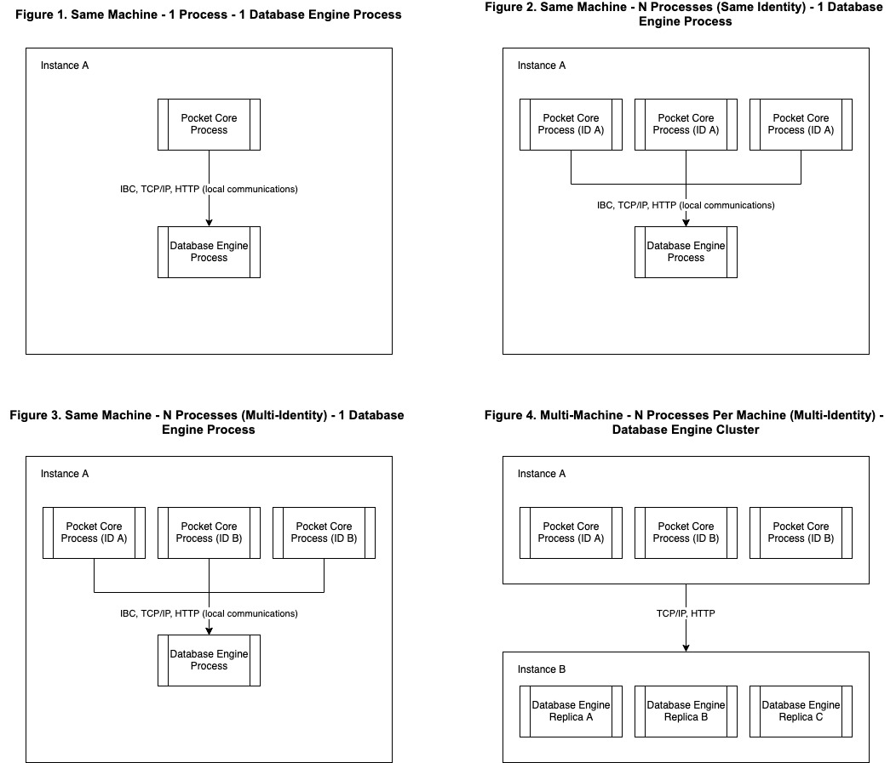
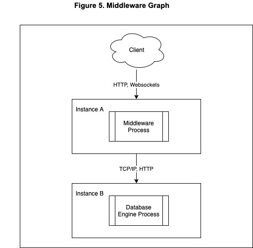
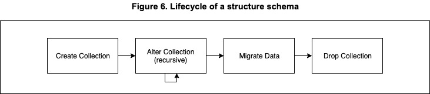
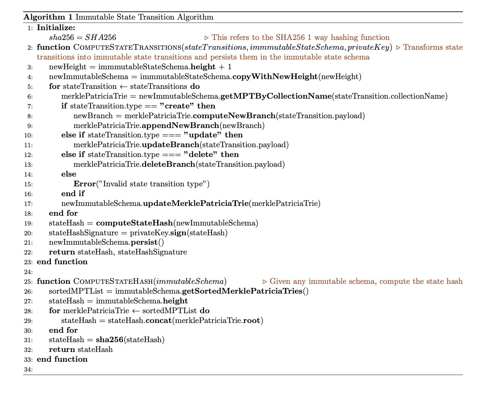

# Pocket Network 1.0 Persistence Module Pre-Planning Specification: Tamper Proof Hybrid Mutable Database Persistence Model

<p align="center">
    Luis Correa de León<br> 
    @luyzdeleon<br>
    Version 1.0.1
</p>

# Overview

Historically blockchain clients have been developed with two use cases in mind: **Validators** and **Full Nodes**. Validators are actors in the network who occasionally, given a certain condition indicated by the consensus protocol, get to propose and commit a block with transactions to the blockchain.  Full nodes synchronize these blocks, validate them and maintain copies of them to be accessed by applications who want to query or send transactions to the blockchain system. Even though **Full Nodes** are constructed after **Validators**, their use case being mission critical infrastructure for production applications is not realized. We can really see this is the case when centralized blockchain infrastructure providers had to develop their own production paradigms like [Alchemy's Supernode Architecture](https://www.alchemy.com/supernode) and [Infura’s Cloud Architecture](https://blog.infura.io/building-better-ethereum-infrastructure-48e76c94724b/) highlighting the limitations of Blockchain Clients as production-grade infrastructure.

This document presents a specification for the Persistence Module of the Pocket Network 1.0, which aims to tackle the persistence needs of Pocket Network 1.0 nodes: scalability, robustness, data integrity and security. This specification is composed of 3 pillars: A **Client-Server architecture** separating middleware processes from a generic database-engine where the persistent data will live, a **Persistence Client Middleware specification** that will dictate how clients of that generic database-engine will behave in order to persist, update and query the datasets that are necessary for participating in the Pocket Network and finally a **Blockchain State Validation architecture** which will fulfill the tamper-proof requirements of blockchain databases and allow nodes to achieve consensus with the rest of the nodes after every migration of the persistence datasets.


# Requirements


<table>
  <tr>
   <td>Requirement
   </td>
   <td>Pillar
   </td>
  </tr>
  <tr>
   <td><strong>Portability</strong>: The persistent data is portable across different node operations, in a backup and restore fashion.
   </td>
   <td>Client-Server Architecture
   </td>
  </tr>
  <tr>
   <td><strong>Individual Scalability</strong>: Can the middleware be independently scaled from the database engine.
   </td>
   <td>Client-Server Architecture
   </td>
  </tr>
  <tr>
   <td><strong>Fault Tolerance</strong>: Can failures be isolated between the middleware and database engine?
   </td>
   <td>Client-Server Architecture
   </td>
  </tr>
  <tr>
   <td><strong>Multi-Process Concurrency</strong>: Multiple processes access the database engine concurrently.
   </td>
   <td>Client-Server Architecture
   </td>
  </tr>
  <tr>
   <td><strong>State Dataset</strong> <strong>Versioning</strong>: Every version of the State dataset has to be versioned.
   </td>
   <td>Persistence Client Middleware specification
   </td>
  </tr>
  <tr>
   <td><strong>“Byte-perfect consistency” data encoding</strong>: The data has to be encoded in a format that allows for byte-perfect comparison of data. 
   </td>
   <td>Persistence Client Middleware specification
   </td>
  </tr>
  <tr>
   <td><strong>Schema Definition Mechanism</strong>: Dataset structures must be schematized and these schemas can change only in between versions of any dataset.
   </td>
   <td>Persistence Client Middleware specification
   </td>
  </tr>
  <tr>
   <td><strong>Deterministic Write Mechanism</strong>: A Mechanism that allows to roll-back faulty writes that might compromise the data integrity of any given dataset.
   </td>
   <td>Persistence Client Middleware specification
   </td>
  </tr>
  <tr>
   <td><strong>Idempotent Dataset Updates</strong>: The same update operation to a dataset, applied multiple times, must yield the same dataset state.
   </td>
   <td>Persistence Client Middleware specification
   </td>
  </tr>
  <tr>
   <td><strong>Cumulative State Versioning</strong>: Each new version of the state must be cumulative by adding only the deltas of the state changes and not recalculating the entire state.
   </td>
   <td>Blockchain State Validation architecture
   </td>
  </tr>
  <tr>
   <td><strong>Dataset Integrity Verification</strong>: Any element in any given state dataset can be verified as to whether or not it belongs in a particular version of a given state dataset.
   </td>
   <td>Blockchain State Validation architecture
   </td>
  </tr>
</table>


# **Specification**


## 1. Client-Server Architecture


### 1.1. Overview

In the context of the Persistence Module, a client-server architecture indicates a separation between the **middleware** and the **database engine**. In practice this allows for multiple types of system deployments which are illustrated in the graphs below:



### 1.2. Database Engine 

The selected **Database Engine** which will be referred to as “**the database engine**” will be [PostgreSQL](https://www.postgresql.org/). The accompanying research document to this Pre-Planning Specification contains the research by which this decision was made. Postgresql contains multiple desirable properties that satisfy requirements such as **Schema Definition Mechanism, Deterministic Write Mechanism **and** Idempotent Dataset Updates**.

### 1.2.1. Configuration

When implementing a client-server architecture, several approaches can be used to establish communication between the middleware and the database engine. Below we describe a data-structure that contains the necessary attributes:


```
type DBConfiguration interface {
  Host() URL           # host url where to contact the database engine e.g. 1.2.3.4, localhost
  Username() String    # the username of the system user the middleware will use to access
  Password() String    # the password of the system user the middleware will use to access
}
```

On the database engine the following configurations need to be made:

1. User roles: **Servicer**, **Validator**, and **Full Nodes**.
2. Schemas: **Consensus**, **State**, **Mempool** and **Local**.

Throughout this specification these configurations will be referenced to satisfy requirements and as complementary to other mechanisms in different layers of the module.

### 1.3. Error Handling

Because of the separation of concerns between middleware and database engine, an error handling architecture at the system deployment level must be established to allow fault tolerance strategies in the execution of the system.

#### 1.3.1 Database Engine Error Handling

There are 3 main use cases of error handling when the database engine is the one at fault:

1. **Configuration Errors**: In the case of configuration errors, the middleware must clearly return to the user any given errors by the database engine and surface them via logs or other system wide notifications. This is a **critical **error and must stop the execution of the system until resolved.
2. **Read/Write Errors** or **Database Engine Unavailable**: In the case of any of these errors being returned from the database engine, the middleware can opt to provision an in-memory database, a secondary replica to point to or a queue of operations to be applied on top of the database once normal operations are restored. In addition to these fallback mechanisms, the middleware must surface the issue via logs or other system wide notifications. This is a **critical **error and must stop the execution of the system until resolved, unless a fallback mechanism is provided in which the continuation of operations can be prioritized.

#### 1.3.2 Middleware Error Handling

The database engine will be configured to handle the following middleware error scenarios:

1. **Invalid data format writes**: In the case of the middleware trying to write data in unsupported formats, the database engine must be equipped to reject these requests with a valid error message to be surfaced by the middleware client via logs or other system wide notifications.
2. **Long-running queries**: All queries to the database engine must be capped at maximum query length and maximum data output, all hard set to ensure homogeneous operations, in the case of the middleware trying to request for a query that goes out of these bounds, the database engine must be equipped to reject these requests with a valid error message to be surfaced by the middleware client via logs or other system wide notifications.

## 2. Persistence Client Middleware

### 2.1. Overview

A middleware, by definition is software that sits between the client and the database engine, hence “in the middle” as shown the in the graphic below:



In the case of the persistence client middleware for the Pocket Network, we need to define a set of expected behaviours and attributes this middleware needs to have in order to ensure all the requirements described in this document.


### 2.2. Persistence Datasets 

A **dataset **is a group of collections that is logically related. For Pocket Network 1.0, we are proposing the following datasets:

1. **Consensus dataset**: Contains all the blocks, transactions and quorum certificates of the Pocket Network blockchain.
2. **Mempool dataset**: Contains a list of all transactions submitted to the Pocket Network, but not yet finalized on the blockchain.
3. **State dataset**: Contains the specific Pocket Network state (nodes, apps, params, accounts, etc). The state dataset has the particularity that each copy of the dataset is versioned at each **height **of the **Block store dataset. **The proof of the copy of each version of this dataset is what we will call from now on the **state hash**, in reference to a hashed version that’s included in each height of the **Block store dataset.**
4. **Local dataset**: Contains all the utility specific data needed for the different actors of the network to achieve their functions. This dataset is local and only affects an individual node operation.

Each dataset can be individually accessed by a particular middleware instance, which allows re-usability of the data in multi-node and multi-process operations.


### 2.2.1. Schema Definition Mechanism

Each of the aforementioned datasets contains 1 or many collections, a collection is a tabulated list defined in a **structure schema. **For Pocket Network 1.0, since we are choosing a SQL database engine, we can morph the schema using a **migrations architecture**. Migrations are a series of phases in a structure schema lifecycle, explained in the graph below:



### 2.2.1.1. Schema definition of the State Dataset

The state dataset presents a unique challenge, given the fact that it requires appropriate manipulation, and is a requirement for consensus (see more in section 3 of this specification). For this reason we are proposing a special **migration structure.** Migrations are going to be tied to specific heights, which will ensure that nodes across different state heights (and during syncing) can recreate previous a **state schema** and be able to reproduce the necessary representations of the data at any particular height to produce the immutability proofs which will be included in the blocks and will be checked against in block validation. See below a graph explaining the lifecycle of the state schema.


#### 2.2.1.3. State Versions Deduplication Strategy

Given the fact that the selected database engine describes collections in a **tabular schema**, and that the **state dataset **has to be versioned every time it changes, a deduplication strategy is needed in order to avoid data redundancy and decrease lookup and scan overhead when operating against any given **state collection**. For this reason we are proposing the following fields in every state collection:


* **Created At (created_at): **Indicates the height at which the structure is **added to the dataset.**
* **Deleted At (deleted_at): **Indicates the height at which the structure was **removed from the dataset.**

By leveraging these properties we can define the **Create, Update **and** Delete **operations of the [CRUD](https://en.wikipedia.org/wiki/Create,_read,_update_and_delete) set:


* **Create**: Insert a new structure into the collection with the given **Created At (created_at) **indicating at which height the structure is being inserted.
* **Update: **Update the **Deleted At (deleted_at) **of the structure to the given update height at which the update is happening, and subsequently insert a new record of the updated structure with the given **Created At (created_at) **indicating at which height the structure is being updated.
* **Delete**: Update the **Deleted At (deleted_at) **of the structure to the given update height at which the deletion is happening.

These attributes and operations allows us to fulfill the different requirements of a state dataset:


* **Historical querying: **Query the same structure throughout any given height by filtering by the **Created At (created_at) **and** Deleted At (deleted_at).**
* **Atomic state transitions: **Every state transition is logged atomically without impacting previous state versions.


#### 2.2.3. Idempotent Writes and Updates

In order to implement idempotency to our persistence layer, we need to define the following set of rules when doing **Create**, **Update** or **Delete** operations over collections and structures:


* When inserting a brand new structure, the operation must include all the uniquely-identified fields of the structure. This will help avoid collisions between existing structures and brand new structures.
* When performing an update operation, all uniquely-identified fields must be indicated in the operation with no room for inference, as well as any timestamp or indicator fields such as **Created At (created_at) **and **Deleted At (deleted_at). **This helps avoid collisions on updating the contents of a structure and not their associated **tracking** **metadata.**
* When performing delete operations, all uniquely-identified fields must be indicated in the operation, and the use of deletion by filtering or by **“all” **will not be permitted on the system.


### 2.3. Deterministic Write mechanism

Most modern SQL DBMS (database management system) implementations utilize the **Transaction model **to indicate a transaction as a group of operations to be performed sequentially and logically grouped. This is called [ACID](https://en.wikipedia.org/wiki/ACID) (atomicity, consistency, isolation, durability), which are the properties that allow the dataset to stay consistent across operations, by allowing capabilities such as the rollbacks in case one of the operations in the transaction fails or yields an inconsistent dataset state.

Our chosen database engine, Postgresql, defines a transaction model in their official documentation [here](https://www.postgresql.org/docs/current/tutorial-transactions.html). On top of that the capacity to rollback transactions is described [here](https://www.postgresql.org/docs/current/sql-rollback-prepared.html). In combination these 2 mechanisms allow us to establish deterministic writes, which will allow the handling of datasets such as **state **in a fail-safe manner avoiding issues like data corruption and race conditions. 


## 3. Blockchain State Validation Architecture


### 3.1. Overview

The **state dataset **contains the result of each set of state transitions indicated by the transactions of any given height. This makes **immutability** of the **state dataset** a desired property, because the resulting state at any given height is one of the most important inputs of the consensus process of the Pocket Network. This specification contains a mechanism that leverages [Merkle Patricia Tries](https://eth.wiki/en/fundamentals/patricia-tree) as a data-structure that helps prove the integrity of the state dataset at any given height, sans 1 modification, the change of the RLP encoding scheme, for the [Protobuf](https://developers.google.com/protocol-buffers) encoding scheme. 


### 3.2. Immutable State Schema

We will refer to the **state dataset** as a group of collections that will conform to the immutable state schema. Every structure in the collection will become a leaf in a Merkle Patricia Trie, yielding a Merkle Root. Every merkle root in the dataset will be concatenated in lexicographical order based on the collection identifier and hashed using **SHA256 **function to produce what we will refer to as the **state hash**.

Every computed state hash will be persisted, alongside a signature computed from a designated private key, which will serve as a local proof of state computation. This proof will be utilized to avoid recalculation of previous states, and will allow the system, provided the same private key, will have a high degree of confidence in their computed state. In the case of any proof of tampering, state can be recalculated using the state hash algorithm. This proof will be called a **state computation proof.**


### 3.2.1. Data Encoding

In order to provide a uniform dataset for each leaf in every of the trees of the immutable state schema, which will be deterministic in it’s computation, we need to use a generic data encoding format. For this task we have chosen the [Protobuf](https://developers.google.com/protocol-buffers) implementation, which as outlined in the accompanying research document that supports this document, fulfills all the requirements and performance benchmarks to allow for this implementation. Find below an example usage of leaf creation function for the merkle patricia tries used in the immutable state hash algorithm.


### 3.2.2. Cumulative Versioning

As specified in the Merkle Patricia Tries, every subsequent operation for a given tree doesn’t require the recomputation of the entire trie, rather only the **branch elements** that are being updated, satisfying our requirement of **Cumulative State Versioning**. This allows us to either persist a delta or the entire trie structure across versions in order to avoid recalculating every time an operation needs to be done on the latest version of the immutable state schema.


### 3.2.3. State Structure Verification

To verify any given structure state in a Merkle Patricia Trie, we just need to provide a merkle proof and the computed **leaf node **we are trying to prove. No necessary changes to the specification are needed other than the already mentioned replacement of [RLP](https://eth.wiki/fundamentals/rlp) for Protobuf. 


### 3.2.4. Patricia Merkle Trie Persistence

A key-value store schema will be required in order to persist the immutable state schema. We can persist this as part of the **state dataset. **


### 3.2.4. Immutable State Transition Algorithm

Now in order to be able to compute transitions of the** state dataset** to the ** immutable schema** we present an algorithm that given a series of **state transitions**, the **current immutable schema** and a **private key** is able to compute the new **state hash** and the **state computation proof**.





# Dissenting Opinions / Attack Vectors / FAQ


### <span style="text-decoration:underline;">1. Why not just store the state in a tree like every other blockchain?</span>

Pocket Network has one main difference with most blockchains in the market right now, and it’s the fact that it’s an **application specific blockchain**. No set of arbitrary data can be uploaded by the users, as that would break the immutable state schema based on predefined collections of structures. Having said this, this specification provides a Blockchain State Validation architecture, which leverages Patricia Merkle Trees to create a tamper proof representation of the blockchain state at any version, getting the best of both worlds (mutable and immutable database schemas), with the tradeoff of the data replication of the immutable database schema, which can be solved by a combination of hashing the data using 1-way functions and pruning.


### <span style="text-decoration:underline;">2. Can an attacker just modify the mutable database and make a node commit to an invalid state?</span>

This attack vector can exist even if we were to persist all datasets using trees, however this would break functionality as at the moment of provisioning proof of computation, this data would vary yielding an invalid subsequent state version. 


### <span style="text-decoration:underline;">3. Isn’t this approach more susceptible to errors as there are more moving parts?</span>

The only additional step this architecture includes is computing the leaf nodes as a result of the operations that happen on the mutable database. We believe that this is a valid trade-off as it can be easily managed as a separate sub-module of the persistence layer. 


# Candidate Features / Would Like to Haves / Open Questions


#### <span style="text-decoration:underline;">1. Have a key/value store for caching data that won’t make sense in a relational database due to performance or data replication.</span>

An interface to implementations such as [Redis](https://redis.io/) and [ElasticSearch](https://www.elastic.co/) as a cache layer which can store specific, optimized schemas or views to the persistent mutable and immutable schemas of the persistence layer. This is an optimization that can be tackled in future versions of this specification. 


# References

[Persistence Spec Research Document](RESEARCH.md)

[https://en.wikipedia.org/wiki/Create,_read,_update_and_delete](https://en.wikipedia.org/wiki/Create,_read,_update_and_delete)

[https://en.wikipedia.org/wiki/ACID](https://en.wikipedia.org/wiki/ACID)

[https://www.postgresql.org/docs/current/tutorial-transactions.html](https://www.postgresql.org/docs/current/tutorial-transactions.html)

[https://developers.google.com/protocol-buffers](https://developers.google.com/protocol-buffers)

[https://eth.wiki/fundamentals/rlp](https://eth.wiki/fundamentals/rlp)
