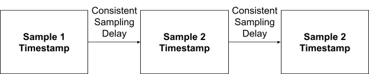
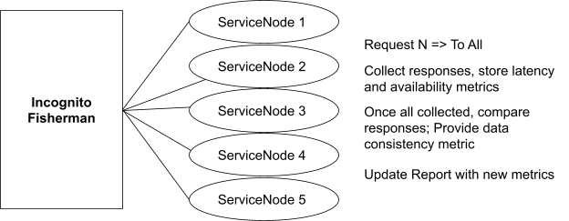
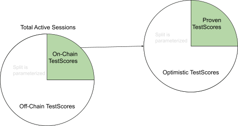
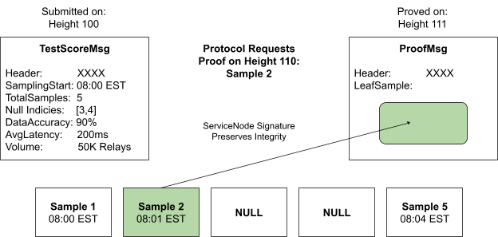

# Pocket 1.0 Utility Module Pre-Planning Specification

Andrew Nguyen and Shawn Regan


# 1 Overview

This document describes Pocket Network’s Utility Module: an account based, state machine protocol that enables Applications to leverage decentralized Web3 access and proportionally incentivizes the corresponding infrastructure providers based on the quality of the service. Specifically, the protocol defines a utilitarian economy composed of registered Applications that purchase Web3 access over a function of volume and time, registered ServiceNodes that provide said Web3 access, Fishermen who sample the Web3 access and report quality metrics based on the sampling completed, and Validators who are responsible for maintaining the safety of the native blockchain.

_NOTE: This document is currently living and subject to rapid and drastic changes. Continued research and development will shape the pre-planning specification until it can be deemed formalized and finished._

_NOTE: This document represents <span style="text-decoration:underline;">one stage</span>: ‘Fishermen’ of the Progressive Decentralization Sequencing plan and should not be treated as the ‘end-all’. It is highly encouraged for readers to understand the sequencing in its entirety before reading._


# 2 Requirements


1. The system enables Web3 access through a utilitarian economy by providing native cryptocurrency capabilities.
2. Actors within the utility module are secured by economic penalty and competing incentives
3. ServiceNodes are rewarded by a combination of demand, capacity to serve, and the quality of that corpus of service
4. The Utility Module must contemplate inflationary and deflationary economic scenarios
5. Service capacity is constrained by time, volume or a combination
6. Gamification, collusion, and attack vectors are considered and mitigated


# 3 Specification

The logical abstraction of the system is comprised of multiple sub-protocols including: Account Protocol, Application Protocol, ServiceNode Protocol, Fisherman Protocol, Session Protocol, Validator Protocol, Gov Protocol, and State Change Protocol, which are defined in greater detail within the specification section.


## 3.1 Session Protocol

A Session is the mechanism the Utility Module uses to regulate the interactions between Applications, Nodes, and Fisherman, to enable the Utilitarian economy in a fair and secure manner.  The idea around the Session Protocol is to connect these three categories of actors for a specified amount of time, such that anyone with the proper seed data would be able to construct the Session deterministically. The existence of Sessions in Pocket Network is linked to the architectural constraint of ensuring a relatively uniform distribution of Web3 provisioning, access, and monitoring. The Session Protocol also guarantees an unpredictable assignment of actors which is leveraged by the Network as a security mechanism against a variety of attack vectors possible when actor assignments are known in advance. Specifically, the property of LatestBlockHash being unpredictable before creation, yet deterministic after finalization is a good fit for seed input to satisfy the above security requirement. Naturally, Pocket Network adopts the concept of Session duration to be measured in units of finalized Blocks, and SessionTumbling events, where Sessions are regenerated using new seed data, occur every SessionBlockFrequency. An additional security requirement for Session participants is for all to be time-synced within 1 minute, using the NTP protocol and Validator Quorum Certificates as the source of truth. The Session Protocol is also responsible for connecting actors with applicable and meaningful pairings. Explicitly, actor interactions are limited by subgroups depending on the flavor of Web3 and the physical geolocation zones they are registered in. A RelayChain is the representation of the specified Web3 flavor and a GeoZone is the general physical geolocation of the actor. Both RelayChain and GeoZone applicable meanings are determined by the Network’s governing body known formally as the DAO (Ex. Relay Chain 0021 = Ethereum Mainnet and GeoZone 0001 = US East). If a participant prematurely exits a Session on-chain for any reason, a replacement actor is assigned and any information about that actor for that Session including potential rewards are invalidated. To further illustrate the Session Protocol, pseudocode is provided below. 


```
type Session interface {
  GetServiceNodes() Nodes[]       # the ServiceNodes providing Web3 to the application
  GetFishermen() Fisherman[]      # the Fisherman monitoring the serviceNodes
  GetApplication() Application    # the Application consuming the web3 access
  GetRelayChain() RelayChain      # the chain identifier of the web3
  GetGeoZone() LocationIdentifier # the geolocation zone where all are registered
  GetSessionHeight() int64        # the block height when the session started
}

func NewSession(SessionHeight, BlockHash, GeoZone, RelayChain, AppPubKey) Session {
  Key = hashOf(SessionHeight + BlockHash + GeoZone + RelayChain + AppPubKey)
  Nodes = getClosestXServiceNodes(Key, GeoZone)
  Fishermen = getClosesYFishermen(Key, GeoZone)
  Return constructor(SessionHeight, GeoZone, RelayChain, AppPubKey, Nodes, Fishermen)
}
```


## 3.2 ServiceNode Protocol

ServiceNodes are a category of actors who provision Web3 access for Pocket Network Applications to consume. Effectively, ServiceNodes are the ‘supply’ end of the Utilitarian Economy, who are compensated in the native cryptographic token, POKT, for their provided service. In order to participate as a ServiceNode in Pocket Network, each actor is required to bond a certain amount of tokens in escrow while they are providing the Web3 access. These tokens may be burned or removed from the actor as a result of breaking the Protocol’s Service Level Agreement, a DAO defined contract that defines the minimum quality of service requirements. Upon registration, the ServiceNode is required to provide the network information necessary to create applicable Sessions including the GeoZone, RelayChain(s), and the Pocket API endpoint known as the ServiceURL, where the consumable service is exposed. In addition to the required information, an optional OperatorPublicKey may be provided for non-custodial operation of the ServiceNodes. This registration message is formally known as the StakeMsg and is represented below in pseudocode:


```
# ServiceNodeStakeMsg Interface
type ServiceNodeStakeMsg interface {
  GetPublicKey()  PublicKey       # The public cryptographic id of the custodial account
  GetStakeAmount() BigInt         # The amount of uPOKT put in escrow, like a security deposit
  GetServiceURL() ServiceURL      # The API endpoint where the web3 service is provided
  GetRelayChains() RelayChain[]   # The flavor(s) of Web3 hosted by this servicer
  GetGeoZone() LocationIdentifier # The general geolocation identifier of the servicer
  GetOperatorPubKey() PublicKey   # OPTIONAL; The non-custodial pubKey operating this node
}
```


Once successfully staked and a new SessionBlock is created, a ServiceNode is officially registered and may receive Web3 queries from Applications and Fishermen that are assigned through the Session Protocol. It is important to note, Web3 queries are abstracted into a request/response cycle known as a Relay and as a security prerequisite, each request and response must be signed by the responsible party. ServiceNodes are paid proportional to how well their Relay responses meet the standards of the Network SLA. Specifically, the quality of a ServiceNode is measured by availability, data accuracy, and latency metrics of Relay responses collected periodically during certain Sessions by the Fishermen. The collection of these samples into a single report is known as a TestScore and is defined in greater detail in the Fisherman Protocol section. 

The overall quality of a ServiceNode is represented by the accumulation of these TestScores in a logical structure known as a ReportCard. ReportCards are the primary factor used to derive an individual ServiceNodeSalary, which is distributed periodically every SalaryBlockFrequency. It is noted that salaries are allocated from a pool of tokens known as the TotalAvailableReward, which is directly linked to the total volume usage for the specific RelayChain, GeoZone combination by the UsageToRewardCoefficient in any given pay period. Volume usage of Applications is estimated through probabilistic hash collisions that are derived from a ServiceNode’s Verifiable Random Function output of the Session data and the Relay request. For an illustrative example, imagine a Nonce that represents a volume of 10K Relays is a ServiceNode VRF output that ends in four consecutive zeros when the message is SessionData+RelayHash. This mechanism allows a concise proof of probabilistic volume, without an actual aggregation of relays completed. These Nonces are sent by the ServiceNode to the Public Fishermen endpoint who verifies the claim and ultimately reports the volume usage to the network. The calculation is simple, TotalVolumeUsage is multiplied against reward coefficient parameters for the specific RelayChain/Geozone and is evenly divided into buckets per ServiceNode that is above the MinimumReportCardThreshold. This value is known as the MaxServiceNodeReward, and is decreased (burned) proportional to ReportCard scores. For instance, a 100% ReportCard results in zero burning of the MaxServiceNodeReward and an 80% ReportCard results in 20% burning of the MaxServiceNodeReward. The rate of decrease continues linearly until the MinimumReportCardThreshold. Below the MinimumReportCardThreshold no reward is given to prevent cheap Sybil attacks and freeloading nodes. In addition to the ReportCard weight, the ServiceNode reward is also scaled linearly based on the amount they stake between MinimumServiceNodeStake and MaximumServiceNodeStake. For safety and adaptability, the weight of ReportCardBasedDistribution vs StakeBasedDistribution is parameterized. It is important to note that a MinimumTestScoresThreshold of TestScores must be accumulated before a ServiceNode is even eligible for a salary distribution and the oldest TestScores are removed in a FIFO fashion once MaxTestScores is reached or TestScoreExpiration is passed. The resulting final amount after the decrease is the net ServiceNodeSalary, which is sent directly to the custodial account. Similar to real world paychecks, First and Final Salaries of ServiceNodes are decreased further relative to the time served vs the full pay period. To further clarify, ServiceNodeSalary pseudocode is provided below:


```
func IsSalaryEligible(ReportCard, RCThreshold, TSThreshold) Bool {
  If ReportCard.Score < RCThreshold { Return False } 
  If ReportCard.Samples < TSThreshold { Return False }
  Return True
} 

func GetSalary(ReportCard, StakeAmountScore, TotalAvailReward, EligibleNodesCount) Salary {
  # calculate max reward per ServiceNode
  maxServiceNodeReward = perfectDivide(TotalAvailReward, EligibleNodesCount)
  # calculate decrease (NOTE: likely will weight each score with a coefficient param)
  burnPercent = (100-ReportCard.Score + 100-StakeAmountScore)/200
  burnAmount = burnPercent * maxServiceNodeReward
  netServiceNodeReward = maxServiceNodeReward - burnAmount
  burnTokensFromTotalAvailableRewardPool(burnAmount)
  Return netServiceNodeReward
} 
```


In Pocket 1.0 ServiceNodes are able to use a PauseMsg to gracefully remove them from service. This feature allows for greater UX for Node Runners, enabling scheduled periods of maintenance or damage control in faulty situations. In addition to an Operator initiated PauseMsg, Fishermen are able to pause a ServiceNode if a faulty or malicious process is detected during sampling, the details, limitations, and incentives of which are described in the Fisherman Protocol section. If a ServiceNode is ‘paused’, they are able to reverse the paused state by submitting an UnpauseMsg after the MinSNPauseTime has elapsed. After a successful UnpauseMsg, the ServiceNode is once again eligible to receive Web3 traffic from Applications and Fisherman. 


```
# ServiceNodePause Interface
type ServiceNodePauseMsg interface {
  GetAddress()  Address       # The address of the ServiceNode being paused
}
# ServiceNodeUnpause Interface
type ServiceNodeUnpauseMsg interface {
  GetAddress()  Address       # The address of the ServiceNode being unpaused
}
```


A ServiceNode is able to modify their initial staking values including GeoZone, RelayChain(s), ServiceURL, and StakeAmount by submitting a StakeMsg while already staked. It is important to note, that if the GeoZone or RelayChain values are modified, the ReportCard is reset for the ServiceNode effectively pruning historical QOS data. In addition to that restriction, a StakeAmount is only able to be modified greater than or equal to the current value. This allows the protocol to not have to track pieces of stake from any ServiceNode and enables an overall simpler implementation. 


```
# ServiceNode(Edit)StakeMsg Interface
type ServiceNodeStakeMsg interface {
  GetPublicKey()  PublicKey       # the public cryptographic id of the ServiceNode being edited
  GetStakeAmount() BigInt         # must be greater than or equal to the current value
  GetServiceURL() ServiceURL      # may be modified, does not reset ReportCard
  GetRelayChains() RelayChain[]   # may be modified, but removal resets ReportCard
  GetGeoZone() LocationIdentifier # may be modified, but resets ReportCard
  GetOperatorPubKey() PublicKey   # may be modified, does not reset ReportCard
}
```


A ServiceNode is able to submit an UnstakeMsg to exit the network and remove themself from service. After a successful UnstakeMsg, the ServiceNode is no longer eligible to receive Web3 traffic from ServiceNodes and Fisherman. After ServiceNodeUnstakingTime elapses, any Stake amount left is returned to the custodial account.


```
# ServiceNodeUnstake Interface
type ServiceNodeUnstake interface {
  GetAddress()  Address       # The address of the ServiceNode unstaking
}
```


A ServiceNode stake is only able to be burned in two situations: A TestScore below the TestScoreBurnThreshold or a Fisherman initiated PauseMsg. If a ServiceNode stake amount ever falls below the MinimumServiceNode stake, the protocol automatically executes an UnstakeMsg for that node, subjecting the Servicer to the unstaking process described above. 


## 3.3 Fisherman Protocol

Fishermen are a category of actor whose responsibility is to monitor and report the behavior of ServiceNodes. The fundamental unit of Fishermen work is to periodically sample the ServiceNode’s Web3 service, record the quality of the service in a TestScore, and succinctly report the TestScore to the network. In Pocket Network 1.0, Fishermen are not permissionless actors, rather there is a strict eligibility requirement for the DAO to vote in each participant. Furthermore, one explicit requirement of Fishermen is to advertise their identity, using their reputation as collateral against faulty and malicious behavior. In addition to the Proof of Authority process, Fishermen are required to bond a certain amount of tokens in escrow while they are providing the Fishermen services. The requirement of POA/POS Fishermen is to filter madmen adversaries who defy economic incentives in order to attack the network. Upon registration, a Fishermen must provide the network necessary information to interact with the protocol including StakeAmount, GeoZone, optional OperatorPubKey, and the Pocket API endpoint where the Fishermen conduct public services. In addition to the public ServiceURL, the Fishermen are bound by SLA to have a dedicated server to conduct incognito sampling services of the ServiceNodes. Detailed requirements and conditions must be defined in the Fisherman SLA document to create an acceptable level of secrecy from the sampling server to ensure accuracy of sample collection. It is important to note that the Fisherman StakeMsg message differs from other permissionless actors in Pocket Network because it is only valid if permissioned through the DAO Access Control List.


```
# FishermanStakeMsg Interface
type FishermanStakeMsg interface {
  GetPublicKey()  PublicKey       # The public cryptographic id of the Fisherman
  GetStakeAmount() BigInt         # The amount of uPOKT put in escrow, like a security deposit
  GetServiceURL() ServiceURL      # The API endpoint for public Fisherman services
  GetGeoZone() LocationIdentifier # The general geolocation identifier of the Fisherman
  GetOperatorPubKey() PublicKey   # (Optional) The non-custodial operator of the Fisherman
}
```


Once successfully staked in the network, Fishermen are eligible to receive monitoring requests from Applications. Within a monitoring request, a limited ApplicationAuthenticationToken and Ephemeral Private key is provided to Fishermen which enables them to make sampling requests to all of the ServiceNodes in the Session on the Application’s behalf. In addition to the AAT, the Application may optionally provide the Fishermen a list of acceptable monitoring requests to test the ServiceNodes with during the sampling. Once the Application handshake is complete, the Fisherman is effectively a monitoring client of the Application and will execute periodic sampling inline with the Sampling Protocol. 

The purpose of the Sampling Protocol is to define a method of testing such that the network can accurately monitor ServiceNodes’ availability, data accuracy, and latency through the Fishermen actors. The first requirement of the Sampling Protocol is for Fishermen to adhere to strict time based sampling events to make their requests. For example, a mock sampling strategy would be for the Fisherman to execute a sampling request every minute until the Session elapses. As described in the Session Protocol, all actors participating in Sessions must be time synced using the NTP protocol, enabling safety and security between ServiceNodes and Fishermen during the time based sampling events. 




In addition to the time based requirement, it is mandatory for the Fisherman to make any sampling request to all of the ServiceNodes in the Session at once. This strategy enables the Fishermen to make data accuracy assessments by directly comparing responses of each ServiceNode without actually hosting any Web3 service. If no signed response is able to be collected from any given ServiceNode, a null sample is recorded for the sample time slot. It is important to understand the number of Null Samples is inversely proportional to a ServiceNode’s availability metric for that TestScore. Lastly, relative RTT latency metrics are collected by the Fishermen for each request made. Due to wide variances of latency metrics, these statistics inform the network of general latency expectations in any GeoZone and are primarily used to disincentivize high average latency ServiceNodes rather than rewarding any high performing nodes. 




Fishermen incentive design is an important factor in Pocket 1.0’s security model, as wrongly aligned incentives can lead to systemic breakdowns of actor roles. Contrary to ServiceNodes, Fishermen rewards are not affected by the content of the samples and TestScoreMsgs as long as they are not null. However, similar to ServiceNodes, Fishermen salaries are generated from Application usage data. Exactly like the ServiceNodeSalaryPool, the FishermenSalaryPool inflation is based on the Volume metrics reported by the ServiceNodes. However, Fishermen salary distribution is only based on the quantity and completeness of TestScoreMsgs and are designed to be agnostic to latency, data consistency, and volume metrics. The completeness of any report is based on the number of non-null samples limited up to the MaxSamplesPerSession upper bound. A non-null sample is abstracted as a signed Web3 response from the assigned ServiceNode in the Session. Given sampling is a time based strategy, the number of samples possible in any given session is upper bounded by the duration of the Session and the timing of the Application handshake. Fishermen incentives are oriented such that they will exhaust attempts to retrieve a non null sample before the sampling time slot expires, meaning an offline sample penalizes both the Fisherman and the ServiceNode. If a threshold of null samples are collected, Fishermen will opt to submit a PauseMsg for the non-responsive ServiceNode, replacing them with a new ServiceNode, in order to salvage any potential reward out of a Session. The PauseMsg action is limited up to MaxFishermenPauses per Session to prevent faulty Fishermen behavior. Individual Fishermen salaries are then calculated by taking the quantity of samples reported in a certain pay period compared to the total number of samples reported during that time. 


```
# FishermanTestScoreMsg Interface
type FishermanTestScoreMsg interface {
  GetSessionHeader() SessionHeader # The AppPubKey, the SessionHeight, geozone, and relaychain
  GetFirstSampleTime() Timestamp   # The timestamp of the first sample
  GetNumberOfSamples() int8        # The number of total samples completed, limited to Max
  GetNullIndicies() [] int8        # Indices of null samples
}
```


Fishermen TestScoreMsgs operate under a probabilistic submission and proof model. In order to reduce blockchain bloat but maintain sampling security, Fishermen TestScoreMsgs are only able to be submitted every ProbablisticTestScoreSubmissionFrequency and are required to be proven every ProbablisticTestScoreProofFrequency times. In practice and depending on the param values, this means that though all Sessions are monitored, only some make it on chain and even fewer are proven. 




Furthermore, due to alignment of Fisherman incentives and desired brevity of on-chain Proof data, ProofTxs only require the Fisherman to prove they executed the sampling by verifying a single non-null sample. The specific sample required to prove the TestScore is determined by the ‘claimed’ TestScoreMsg and the BlockHash after ProofTestScoreDelay blocks elapse and is required to be submitted before MaxProofMsgDelay. This reveal mechanism allows for an unpredictable assignment of the required sample but is deterministic once the BlockHash is finalized. Using the timing requirement of the sampling strategy, the protocol can easily verify the sample index when submitted in the ProofMsg. It is important to note, that all Web3 requests and responses are signed by the requester (Fisherman or Application) and the responder (ServiceNode). This cryptographic mechanism ensures the integrity of a timestamp, as without the signature from the particular ServiceNode PrivateKey, a Fisherman would be able to falsify the timestamp. Though a successful ProofMsg has no effect on the reward of any Fishermen, an unsuccessful ProofMsg burn is severe to make up for the probabilistic nature of the proof requirement.





```
# FishermanProofMsg Interface
type FishermanProofMsg interface {
  GetSessionHeader() SessionHeader # The AppPubKey, the SessionHeight, geozone, and relaychain
  GetProofLeaf() Timestamp         # Actual sample containing the proper timestamp
}
```


In Pocket 1.0 Fishermen are able to use a PauseMsg to gracefully remove themselves from service. This feature allows for greater UX for Fishermen, enabling scheduled periods of maintenance or damage control in faulty situations. In addition to an Operator initiated PauseMsg, the DAO is able to pause a Fishermen if a faulty or malicious process is detected during testing, the details, limitations, and incentives of which are described in the Pocket 1.0 Constitution. If a Fishermen is ‘paused’, they are able to reverse the paused state by submitting an UnpauseMsg after the MinPauseTime has elapsed. After a successful UnpauseMsg, the Fisherman is once again able to perform testing and receive payment for work.. 


```
# Fishermen Interface
type FishermenPauseMsg interface {
  GetAddress()  Address       # The address of the Fishermen being paused
}
# FishermenUnpauseMsg Interface
type FishermenUnpauseMsg interface {
  GetAddress()  Address       # The address of the Fishermen being unpaused
}
```


A Fisherman is able to modify their initial staking values including GeoZone, ServiceURL, and StakeAmount by submitting a StakeMsg while already staked. It is important to note that contrary to ServiceNodes, Fishermen GeoZone changes must be permissioned through the DAO ACL. In addition to that restriction, a StakeAmount is only able to be modified greater than or equal to the current value. This allows the protocol to not have to track pieces of stake from any Fisherman and enables an overall simpler implementation. 


```
# FishermenNode(Edit)StakeMsg Interface
type FishermenStakeMsg interface {
  GetPublicKey()  PublicKey       # identity of edited Fishermen
  GetStakeAmount() BigInt         # must be greater than or equal to the current value
  GetServiceURL() ServiceURL      # may be modified
  GetGeoZone() LocationIdentifier # may be modified
  GetOperatorPubKey() PublicKey   # may be modified
}
```


A Fishermen is able to submit an UnstakeMsg to exit the network and remove themself from service. After a successful UnstakeMsg, the Fishermen is no longer eligible to receive monitoring requests. It is important to note, a Fisherman is permissioned to unstake if removed from the DAO ACL parameter. After FishermenUnstakingTime elapses, any Stake amount left is returned to the custodial account.


```
# FishermenUnstakeMsg Interface
type FishermenUnstake interface {
  GetAddress()  Address       # The address of the Fishermen unstaking
}
```


In Pocket 1.0, Fishermen monitoring is an off-chain endeavor undertaken by the DAO and crowdsourced through the Good Citizens protocol of each ServiceNode and Application. DAO monitoring consists of Fishermen audits, statistical analysis of Fishermen behaviors, and incognito network actors that police interactions of Fishermen. The details, conditions, and limitations of DAO monitoring are defined further in the 1.0 Constitution. In practice, the Good Citizens Protocol is sanity checks for the network actors, the community, and the software developers, but it ultimately is the crowd sourced monitoring solution for the Fishermen. Specifically, the Good Citizens Protocol is an opt-in, configurable module that checks individual interactions against resulting finality data and automatically reports suspicious, faulty, or malicious behavior of the Fishermen to offchain data sites which are analyzed and filtered up to the DAO and to the public. Individual Fishermen burns and Good Citizen bounties are determined by the DAO and defined in the 1.0 Constitution. 


## 3.4 Application Protocol

Applications are a category of actors who consume Web3 access from Pocket Network ServiceNodes. Effectively, Applications are the ‘demand’ end of the Utilitarian Economy, who purchase access in the native cryptographic token, POKT, to use the decentralized service. In order to participate as a Application in Pocket Network, each actor is required to bond a certain amount of tokens in escrow while they are consuming the Web3 access. Upon registration, the Application is required to provide the network information necessary to create applicable Sessions including the GeoZone, the RelayChain(s), the bond amount, and the number of ServiceNodes per Session limited by the MinimumServiceNodesPerSession and MaximumServiceNodesPerSession parameters. It is important to note, the bond amount of Applications is directly proportional to the MaxRelaysPerSession which rate-limits Application usage per ServiceNode per Session. In Pocket 1.0, Relay cost is discounted the higher amount an Application stakes to incentivize consolidation up to MaximumApplicationStakeAmount. This registration message is formally known as the StakeMsg and is represented below in pseudocode:


```
# ApplicationStakeMsg Interface
type ApplicationStakeMsg interface {
  GetPublicKey()  PublicKey       # The public cryptographic id of the custodial account
  GetStakeAmount() BigInt         # The amount of uPOKT put in escrow
  GetRelayChains() RelayChain[]   # The flavor(s) of Web3 consumed by this application
  GetGeoZone() LocationIdentifier # The general geolocation identifier of the application
  GetNumOfNodes() int8            # The number of ServiceNodes per session
}
```


Once successfully staked and a new SessionBlock is created, an Application is officially registered and may consume Web3 access from ServiceNodes that are assigned through the Session Protocol in the form of a request/response cycle known as a Relay. In order for an Application to get Session information, i.e. their assigned Fisherman and ServiceNodes, they may query a public Dispatch endpoint of any full node. To ensure Pocket Network SLA backed service, the Application executes a handshake with the assigned Fishermen. The Application provides the Fisherman with a temporary and limited Application Authentication Token and a matching Ephemeral Private Key that is used by the Fisherman to sample the service of the Session in real time. Once the Application handshake is executed, the Application may use up to MaxRelaysPerSession/NumberOfServiceNodes per ServiceNode during a Session. If the Application maxes out the usage of all of its ServiceNodes, it is unable to Relay any further until the Session elapses.

An Application is able to modify their initial staking values including GeoZone, RelayChain(s), NumberOfNodes, and StakeAmount by submitting a StakeMsg while already staked. It is important to note, a StakeAmount is only able to be modified greater than or equal to the current value. This allows the protocol to not have to track pieces of stake from any Application and enables an overall simpler implementation. 


```
# Application(Edit)StakeMsg Interface
type ApplicationStakeMsg interface {
  GetPublicKey()  PublicKey       # identity of edited ServiceNode
  GetStakeAmount() BigInt         # must be greater than or equal to the current value
  GetRelayChains() RelayChain[]   # may be modified
  GetGeoZone() LocationIdentifier # may be modified
  GetNumOfNodes() int8            # may be modified
}
```


An Application is able to submit an UnstakeMsg to exit the network and remove themself from the network. After a successful UnstakeMsg, the Application is no longer eligible to consume Web3 traffic from ServiceNodes. After ApplicationUnstakingTime elapses, any Stake amount left is returned to the custodial account.


```
# ApplicationUnstake Interface
type ApplicationUnstake interface {
  GetAddress()  Address       # The address of the Application unstaking
}
```


Application Stake burn is a necessary mechanism to ensure an equilibratory economy at network maturity. Given the timeline for network maturity is approximated to be a decade from the time of publication, this document does not detail a non-inflationary economic scenario. In the inflationary phase of Pocket Network, Application Stake burn rate is able to be controlled through the AppBurnPerSession parameter which is expected to be set near zero. In practice, though the burn value is expected to be negligible, Application stake is able to be burned over a function of time. As described above, MaxRelaysPerSession is generated by the StakeAmount of the Application and the Application burn will affect this value as the StakeAmount changes. 


## 3.5 Validator Protocol

Validators are a category of actor whose responsibility is to securely process transactions and blocks using the Pocket Network 1.0 Consensus Protocol. Though most of their functional behavior is described in the external 1.0 Consensus Protocol specification and the Transaction Protocol section, a state specific Validator Protocol is needed to allow a dynamic Validator set and provide the necessary incentive layer for their operations. In order to participate in the network as a Validator, each actor is required to bond a certain amount of tokens in escrow while they are providing the Validator services. These tokens are used as collateral to disincentivize byzantine behavior. Upon registration, a Validator must inform the network of how many tokens they are staking and the public endpoint where the Validator API is securely exposed.  In addition to the required information, an optional OperatorPublicKey may be provided for non-custodial operation of the Validator. This registration message is formally known as the StakeMsg and is represented below in pseudocode:


```
# ValidatorStakeMsg Interface
type ValidatorStakeMsg interface {
  GetPublicKey()  PublicKey       # The public cryptographic id of the custodial account
  GetStakeAmount() BigInt         # The amount of uPOKT put in escrow, like a security deposit
  GetServiceURL() ServiceURL      # The API endpoint where the validator service is provided
  GetOperatorPubKey() PublicKey   # OPTIONAL; The non-custodial pubKey operating this node
}
```


Pocket Network 1.0 adopts a traditional Validator reward process such that only the Block Producer for each height is rewarded proportional to the total Transaction Fees + RelayRewards held in the produced block. Though the Block Producer selection mechanism is described in greater detail in the external Consensus Specification document, it is important to understand that the percentage of stake relative to the total stake is directly proportional to the likelihood of being the block producer. The net BlockProducerReward is derived from the TotalBlockReward by simply subtracting the DAOBlockReward amount. Once a proposal block is finalized into the blockchain, the BlockProducerReward amount of tokens is sent to the custodial account.


```
func CalculateBlockReward(TotalTxFees, DAOCutPercent) (blockProducerReward, daoBlockReward) {
  # calculate the DAO's cut of the block reward
  daoBlockReward = perfectMult(TotalTxFees, DAOCutPercent)
  # calculate the block producer reward
  blockProducerReward = TotalTxFees - daoBlockReward
  return
} 
```


In Pocket 1.0 Validators are able to use a PauseMsg to gracefully remove them from Validator operations. This feature allows for greater UX for Operators, enabling scheduled periods of maintenance or damage control in faulty situations. In addition to an Operator initiated PauseMsg, Validators are removed from service automatically by the network if byzantine behaviors are detected. Not signing blocks, signing against the majority, not producing blocks, and double signing blocks are byzantine behaviors reported to the Utility Module by the Consensus Module through the Evidence Mechanism. Anytime an automatic removal of service occurs for Validators, a burn proportional to the violation is applied against the Validator stake. The conditions, limitations, and severity of the Byzantine Valdiator burns are proposed and voted on by the DAO. If a Validator is ‘paused’, they are able to reverse the paused state by submitting an UnpauseMsg after the MinPauseTime has elapsed. After a successful UnpauseMsg, the Validator is once again eligible to execute Validator operations. 


```
# ValidatorPause Interface
type ValidatorPauseMsg interface {
  GetAddress()  Address       # The address of the Validator being paused
}

# ValidatorUnpause Interface
type ValidatorUnpauseMsg interface {
  GetAddress()  Address       # The address of the Validator being unpaused
}
```


A Validator is able to modify their initial staking values including the ServiceURL, OperatorPubKey, and StakeAmount by submitting a StakeMsg while already staked. It is important to note, that a StakeAmount is only able to be modified greater than or equal to the current value. This allows the protocol to not have to track pieces of stake from any Validator and enables an overall simpler implementation. 


```
# Validator(Edit)StakeMsg Interface
type ValidatorStakeMsg interface {
  GetPublicKey()  PublicKey       # which Validator stake data is being edited?
  GetStakeAmount() BigInt         # must be greater than or equal to the current value
  GetServiceURL() ServiceURL      # may be modified
  GetOperatorPubKey() PublicKey   # may be modified
}
```


A Validator is able to submit an UnstakeMsg to exit the network and remove itself from Validator Operations. After a successful UnstakeMsg, the Validator is no longer eligible to participate in the Consensus protocol. After ValidatorUnstakingTime elapses, any Stake amount left is returned to the custodial account. If a Validator stake amount ever falls below the MinimumValidator stake, the protocol automatically executes an UnstakeMsg for that node, subjecting the Validator to the unstaking process. 


```
# ValidatorUnstake Interface
type ValidatorUnstake interface {
  GetAddress()  Address       # The address of the Validator unstaking
}
```


## 3.6 Account Protocol

An account is the structure where liquid tokens are maintained. The summation of the value of all the accounts in the network would equal the TotalSupply - StakedTokens. The structure is simply an identifier address and the value of the account. The only state modification operation accounts may execute is a transactional SendMsg, transferring tokens from one account to another.


```
# Account Interface
type Account interface {
  GetAddress()  Address       # The cryptographic identifier of the account
  GetValue() Big.Int          # The number of Tokens (uPOKT)
}

# Send Interface
type SendMsg interface {
  GetFromAddress()  Address       # Address of sender account; Must be the signer
  GetToAddress() Address          # Address of receiver account
  GetAmount() Big.Int             # The number of Tokens transferred (uPOKT)
}
```


A ModulePool is a particular type that though similar in structure to an Account, the functionality of each is quite specialized to its use case. These pools are maintained by the protocol and are completely autonomous, owned by no actor on the network. Unlike Accounts, tokens are able to be directly minted to and burned from ModulePools. Examples of ModuleAccounts include StakingPools and the FeeCollector.


```
# ModulePool Interface
type ModulePool interface {
  GetAddress()  Address       # The cryptographic identifier of the account
  GetValue() Big.Int          # The number of Tokens (uPOKT)
}
```


## 3.7 State Change Protocol

There are two categories of state changes in Pocket Network 1.0 that may be included in a block: Transactions and Evidence. The third and final category of state changes in Pocket Network is autonomous operations that are completed based on the lifecycle of block execution orchestrated by the Consensus Module.

By far the most publicly familiar of the three categories of state changes are Transactions: discrete state change operations executed by actors. The structure of a Transaction includes a payload, a dynamic fee, a corresponding authenticator, and a random number Nonce. The payload of any Transactions is a command that is structured in the form of a Message. Examples of these Messages include StakeMsg, PauseMsg, and SendMsg which all have individual handler functions that are executed within the Pocket Network state machine. A digital signature and public key combination is required for proper authentication of the sender, the dedicated fee incentivizes a block producer to include the transaction into finality and deter spam attacks, and the Nonce is a replay protection mechanism that ensures safe transaction execution. 


```
# Transaction Interface
type Transaction interface {
  GetPublicKey()  PublicKey       # Identifier of sender account; Must be the signer
  GetSignature() Signature        # Digital signature of the transaction
  GetMsg() Message                # The payload of the transaction; Unstake, TestScore, etc.
  GetFee() Big.Int                # The number of Tokens used to incentivize the execution
  GetNonce() String               # Entropy used to prevent replay attacks; upper bounded
}
```


Evidence is a category of state change operation derived from byzantine consensus information. Evidence is similar to Transactions in creation, structure, and handling, but its production and affects are limited to Validators. Evidence is largely a protection mechanism against faulty or malicious consensus participants and will often result in the burning of Validator stake. 


```
# Evidence Interface
type Evidence interface {
   GetMsg() Message                # Payload of the evidence; DoubleSign, timeoutCert, etc.
   GetHeight() Big.Int             # Height of the infraction
   GetAuth() Authenticator         # Authentication of evidence, can be Signature or Certif
}
```


Autonomous state change operations are performed by the protocol according to specific lifecycle triggers linked to consensus. Examples of these events are BeginBlock and EndBlock which occur at the beginning and ending of each height respectively. Rewarding the block producer, processing QuorumCertificates, and automatic unstaking are all illustrative instances of these autonomous state change commands. 


## 3.8 Governance Protocol

Though most off-chain governance specification is included in the DAO 1.0 Constitution document, the Utility Module’s Governance Protocol defines how the DAO is able to interact with the on-chain protocol on a technical level. 

The Access Control List or ACL is the primary mechanism that enables live parameterization of Pocket Network 1.0. Specifically, the ACL maintains the knobs that allow active modification of the behavior of the protocol without any forking. As the name suggests, the ACL also maintains the account(s) permissioned to modify any of the parameters. A value is able to be modified by a ParamChangeMsg from the permissioned owner of that parameter. 


```
# ParamChange Interface
type ParamChangeMsg interface {
  GetAddress()  Address           # Address of sender account; Must be permissioned on ACL
  GetParamName() String           # The identifier of the knob
  GetValue() Big.Int              # The modified value of the parameter
}
```


In addition to the ParamChange message, the DAO is able to burn or transfer from a specified DAO Module Account. In practice, this Module Account is used as the on-chain Treasury of the DAO, the limitations and specifics of which are maintained in the DAO 1.0 Constitution document. 


```
# DAOTreasury Interface
type DAOTreasuryMsg interface {
  GetAddress() Address           # Address of sender account; Must be permissioned on ACL
  GetToAddress() *Address        # (Optional) receiver of the funds if applicable; nil otherwise
  Operation() DAOOp              # The identifier of the operation; burn or send
  GetAmount() Big.Int            # The operation is executed on this amount of tokens
}
```


As the only permissioned actors in the network, Fishermen are subject to individual burns, pauses, or removals initiated by the DAO. Usages of this message type are a result of the off-chain monitoring mechanisms described in the Fisherman Protocol section of the document. The specifics and limitations of usage of this message type is detailed in the DAO 1.0 Constitution.


```
# Policing Interface
type PolicingMsg interface {
  GetAddress() Address           # Address of sender account; Must be permissioned on ACL
  GetPoliced() Address           # Address of the policed actor
  Operation() DAOOp              # Identifier of the operation; burn, pause, remove
  GetAmount() Big.Int            # Amount of tokens (if applicable)
}
```


# 4 Sequence

In order to fully understand Pocket Network 1.0 and its place in the project's maturity, a rollout context is a prerequisite. 


## 4.1 Proto-Fish:  


* A single, Publicly known, DAO owned, PNI operated Proto-Type Fisherman is to be deployed physically proximate to the current gateway.  All aspects of the eventual Fisherman functionality can be live tested here on top of the VO platform.
* The DAO allocation percentage of rewards will be increased from 10% to 11% and the node reward percentage decreased accordingly.  This 1% will then be allocated to ServiceNodes according to their QOS score on a monthly basis - after approval by the DAO vote.  In effect, a walled garden where the measuring, scoring and incentive system can be tested and tuned in a low-risk, supervised environment.
* After sufficient testing and acceptance of the Proto-Fish, the reward % may be increased over time to allow the node running economic environment time to adapt to the new payment allocation.


## 4.2 Castaway:


* The DAO approves the Foundation to control the sole Fisherman.
* Enables permissionless Applications and inflation
* No self dealing, reward for the SLA
* Removes known scalability problems.


## 4.2 Fishermen:


* DAO approved Fisherman, paycheck model, DAO determined parameters, DAO override ability. Covered in the Specification Section of the document.


## 4.3 Cast-Net:


* Off-chain Fishermen monitoring is moved On-Chain. 
* Fishermen duties are offloaded to completely permissionless actors
* See V2 Pre-specification at the end of this document.


# 5 Attack Vectors

_NOTE: This section does not exhaust all attack vectors considered, rather details the ones that were deemed important._


## 5.1 Categories

**Profit Seeking Passive**: 

The primary goal of the attack is to increase the total value of the attacker’s assets.  Secondary goals of: avoiding detection, avoiding damage to personal or network reputation, AKA: Don’t kill the goose that lays the golden eggs.

**Profit Seeking Active**: Primary goal is short term increase in quantity of POKT accessible.  This attacker is trying to grab a bunch of POKT and  sell it before the network notices or the DAO has a chance to react..  AKA Take the Money and Run.

**Collusion Passive**:  Only one active attacker, but relying on tacit cooperation from a second party who receives some type of benefit from not reporting the attack AKA Don’t ask. Don’t tell.

**Collusion Active**:  Two players in two different parts of the economic system seek to circumvent the system by actively submitting fraudulent information and/or blocking attempts to punish, penalize or burn the malfeasant actor(s)

**Network, Communication, DDOS, Isolation Targeted**:  These are profit seeking attacks which seek to reduce the number and/or effectiveness of competitors, thereby increasing the share of rewards received.   AKA Kill The Competition.

**Hacker**:  An attack which requires creation, modification and upkeep of the core software in a private repository.

**Inflation, Deflation**:  Attacks whose net effect is an increase or decrease in the rate of production of new POKT tokens.  In most cases, these are Mad Man attacks because any benefit that they create will be distributed more in favor of other network actors than to themselves.  AKA: Make It Rain.

**Mad Man Attacks**:  All non-profit seeking attacks or behaviors which cost more to perform than can reasonably be expected to benefit the attacker. 


* <span style="text-decoration:underline;">Mad Man Lazy</span>.  An attack which does not require significant time, energy or resources.  AKA:  What happens when I push this button?
* <span style="text-decoration:underline;">Mad Man Hacker:</span> A non-profit seeking  attack which requires creation, modification and upkeep of the core software in a private repository.
* <span style="text-decoration:underline;">Masochistic Mad Man</span>: Any attack which, although possible, makes no sense because you could accomplish the same thing without doing all that work.


## 5.2 Specifics

**Fisherman collusion with ServiceNodes (Profit seeking passive, Collusion active, Hacker)**

If a Fisherman is colluding with one or more ServiceNodes and is in possession of the private key(s) of those nodes, he is able to falsify all aspects of that node’s report card.  Therefore, all of his colluding node partners get A+ report cards and resultantly larger paychecks.

This is the “big one”.  It is the primary reason that Fishermen are (at this stage) DAO Approval is required.  It is why off chain data logs, good-citizen reporting and DAO oversight exist. It is also the reason that Fishermen require large stake/deposit, as well as increased destaking period and delayed payments  (See attached spreadsheet of projected collusion ROI based on such factors as Node Percentage, Risk Rate, etc.)

The attack is easy to describe, but not easy to perform because a rather large body of work has gone into making sure that it is extremely difficult to perform, a very small payoff, and extremely costly to get caught.

** **

**Fisherman attacking ServiceNodes through TestScores (Collusion passive, Hacker, Mad Man Lazy, Inflation/Deflation)**

If a Fisherman falsifies certain aspects of a node’s report card, he can lower that node’s proper payment share (direct attack) and increase the relative profit of all non-attacked nodes (indirect benefit if Fisherman is also a ServiceNode owner)

This attack is a lot of work with very little reward.  The “excess” POKT does not get distributed to the non-attacked nodes.  It gets burned. Therefore the benefit to non-attacked nodes is only a relative gain in terms of the overall network inflation rate.  This is a highly detectable attack and the victims are highly motivated to report it.  Bottom line here is: We’re talking about a highly motivated hacker, who is also Mad Man Lazy.

**Fisherman false reporting Application volume metrics (Mad Man Lazy)**

There is no financial incentive for a Fisherman to report Application volume higher or lower than actual.  ServiceNodes are incentivised to check for under reporting.  There is no specific disincentive for over reporting.  Other than (of course) losing all of your stake and reputation.

**Fisherman using AAT to get free Web3 access (Masochistic Mad Man)**

WOW.. a Lazy Mad Man with too much money and too much free time.  Sorry, I can’t take this attack seriously.  It’s like stealing a car so that you can plug in your phone and charge it up for free.

**Fisherman DDOS (Mad Man)**

No one benefits by DDOSing a Fisherman.  The relay, dispatch, service and blockchain processes are not dependent on Fishermen.  The attack does not change node report cards.  It only makes less forof them and less overall network inflation.  The Fisherman loses money, but no one gets the excess.

**Fisherman incognito identified (Lazy Mad Man, Hacker)**

Fishermen act in “incognito” fashion purely as a deterrent to a particular theoretical publicity seeking attack called Mad Man Blogger.  Neither honest, nor dishonest nodes gain any advantage by identifying a particular relay request as belonging to a Fisherman.  You can only provide your best service, it’s not possible to provide “better” service to a Fisherman than you already provide.  However, the Mad Man Blogger could (if he chose to and if he successfully identified all Fishermen) provide service to only Fishermen and not to applications.  We consider this an edge case attack in which the attacker has made a significant investment in POKT and in backend node infrastructure solely for the purpose of “proving” that the system can be gamed.  Therefore, the contract with the DAO which Fishermen agree to, requires periodic changing of IP address and reasonable efforts to keep it unknown by other actors in the ecosystem.

**Fisherman or ServiceNode will register spam applications for selfish economic benefit (Inflation Attack, Mad Man Lazy)**

As to Fishermen spamming via owned app:

There is no economic benefit to Fishermen from this activity as their payment is independent of application usage.  One could argue that the Fisherman will benefit from the increase in supply caused by spamming the network this way.  However, any inflation attack which benefits the majority of the network to a greater degree than the person who pays for and performs the attack is non-profit seeking.

As to ServiceNode spamming via owned app:

V1 addresses and eliminates the financial incentive of targeted service attacks (self-dealing).  Therefore this activity becomes an inflation attack which is not profitable to the attacker.

**Actors intentionally staking in “wrong” geo-zone to gain some advantage/attack.**

It is economically advantageous for actors to stake within their true GeoZone as Session actor pairings are generated specifically for the GeoZone registered. Specifically, Applications will receive worse QOS and worse fidelity of Fishermen QOS monitoring by proxy as the ServiceNodes are farther away but still within the same GeoZone as the Fishermen. ServiceNodes are the same way, as once a GeoZone is mature the ServiceNodes in other GeoZones are no longer competitive. 


# 6 Dissenting Opinions/FAQ

**There’s nothing wrong with Pocket Network V0 (Utility Module), V1 is unnecessary.**


<table>
  <tr>
   <td>Details
   </td>
   <td>V0
   </td>
   <td>V1
   </td>
  </tr>
  <tr>
   <td>Scalability Of Utility
   </td>
   <td>Millions of Daily Relays Per Node (Capped by Merkle Tree Building)
<p>
Total network capacity 100 Million bottlenecked by P2P and Consensus
<p>
ServiceNode Capacity 10K bottlenecked by P2P and Consensus
<p>
Apps 5K bottlenecked by P2P and Consensus
   </td>
   <td>Billions of Daily Relays Per Node (Capped by rate limiting)
<p>
Total Network Capacity Trillions of Relays bottlenecked by P2P and Consensus
<p>
ServiceNode Capacity (minimum) 1 Million bottlenecked by Transactions and state size
<p>
Apps (minimum) 1 Million bottlenecked by Transactions and state size
   </td>
  </tr>
  <tr>
   <td>Architecture Of Utility
   </td>
   <td>ServiceNodes: 
<ul>

<li>Stake in the network to provide access

<li>Must be a validator

<li>Compensated by volume

<li>Store the work done

<li>Claim the work done

<li>Prove the work done

<p>
Clients/Applications: 
<ul>

<li>Stake in network infinite contract 

<li>Request work

<li>Client side validation / challenges for data consistency

<li>Permissioned usage
</li>
</ul>
</li>
</ul>
   </td>
   <td>ServiceNodes:
<ul>

<li>Stake in the network to provide access

<li>Compensated by time and adhering to Decentralised SLA

<p>
Clients/Applications:
<ul>

<li>Stake in network finite contract 

<li>Request work

<li>Permissionless

<p>
Monitoring:
<ul>

<li>Validation mechanism to enforce the DSLA 
<ul>
 
<li>Latency
 
<li>Data Consistency
 
<li>Availability
 
<li>Volume
</li> 
</ul>
</li> 
</ul>
</li> 
</ul>
</li> 
</ul>
   </td>
  </tr>
  <tr>
   <td>Q/A Of Utility
   </td>
   <td>Weak | Manual Functional tests | Partially covered unit tests | broken CI/CD | No working simulation / No load tests
   </td>
   <td>Strong | Auto functional tests | Total Coverage | CI/CD | Simulations | Load Tests | Enhanced Test Playground for everyone at any purpose | Specific test/play environment, very similar (to not say equal) to mainnet.
   </td>
  </tr>
  <tr>
   <td>Security Of Utility
   </td>
   <td>Totally gameable with `Self Dealing Attack` a fundamental issue that cannot be solved when using Volume (# of Relays) as a direct form of compensation in an inflationary model
   </td>
   <td>Sound and economically feasible
   </td>
  </tr>
</table>


**Pocket Network V1 requires POA Fishermen. Hence, it is not permissionless as Pocket Network V0. This breaks credible neutrality as a guiding principle.**

At the time of publication, Pocket Network is currently pre-release, what is commonly known as Pocket Network V0. Currently, V0 is using a centralized gateway and KYC permissioned applications to maintain security and usable quality throughout the network. These two mechanisms are completely mission critical, without them the Network would undoubtedly be unreliable and architecturally gameable. The current state of the network is far less credibly neutral than the proposed V1.

Additionally, it is relevant to note that although Fishermen play an important role in the assurance of high quality of service to applications and influencing ServiceNode payments, they do not have autonomy of action.  They must perform their role in accordance with the protocol defined rules and according to DAO defined parameters.

A note about “credible neutrality”:  This principle and its definition source from a [blog post](https://nakamoto.com/credible-neutrality/) by V.B. in which Simplicity and Understandability are given approximately equal value with the actual neutrality.  Although both of those concepts are desirable in any system they are not necessarily the optimum solution and placing them on equal footing to “actual neutrality” can lead to very easy to understand solutions which don’t work.  Neither relativity nor quantum uncertainty are credible, but they are both entirely neutral. Flat Earth however is extremely credible and entirely useless.

**Public facing Fisherman is a vulnerability for censorship and defeats the purpose of decentralized infra.**

Public facing Fishermen are no more subject to censorship than the DAO is. Just like the DAO voters, the more Fishermen participating in the network, the safer the mechanism they control is. The true difference between the DAO voters and Fishermen is the Fishermen’s scope of control is limited only to the quality of service enforcement and the DAO’s control spans the entirety of the system. If the DAO were to ever be compromised by an adversary, the Validators are able to fork the chain and install a new governing body through a social consensus of the ACL. In a parallel situation, if the Fishermen were ever compromised, the DAO would be able to modify the actors without forking the chain and halting service. The architectural separation of powers between Validators, ServiceNodes, Fishermen, and the DAO is what truly ensures the safety of Pocket Network.

**Quality of Service is a second order metric thus it is not a good criteria for salaries of ServiceNodes.**

Quality of Service is harder to measure than Quantity of Service, but it is not a second order metric.  Total value of anything is measured as:  (How Much X How Pure) minus the cost of making it pure.  

**The DAO is not a silver bullet, it’s not trustless, it’s a potential attack vector.**

A powerful government might be able to temporarily stop quality of service metrics but the chain continues. There's no realism in thinking that an overtaking of the DAO isn't a catastrophic event for any version of Pocket Network. As long as there are params like 'MaxValidators' or 'RewardForRelays' the DAO may stop Pocket Network until a social fork happens. Fishermen are the same way. Stop the Fishermen, the DAO will instill new ones. Stop the DAO, the Validators will add a new DAO.

**Publicly identifying fishermen puts them at risk of attacks in the real world.**

Sure, this is a concern that all people in public office deal with.

**Relying on the DAO for a core protocol function undermines our case for sufficient decentralization**

The DAO is already a core part of our protocol. They can stop all service and functionality with 1 transaction. Just like any type of actor in our network, the more decentralized - the more resistant to these sorts of things. Fishermen are no different

**Fishermen are not truly Applications, rather a proxy, so the accuracy of their TestScores is questionable and not a valid criteria for salaries of ServiceNodes.**

From a ServiceNode’s perspective, Fishermen are indistinguishable from applications and therefore are not only valid criteria, but - in fact - preferable sources of information because they are financially incentivised to collect honest and complete reports.  Experience with V0 has shown that although applications have the ability to enforce some aspects of ServiceNode quality, they do not avail themselves of this opportunity.

**The requirements of Fishermen actors are too high. The incentives are oriented properly so POA/POS is overkill.**

If the requirements are too high, the DAO can choose to lower them.  Better to start high and lower the bar than to start low and risk flooding the initial system with actors who have little to lose.

**The off-chain monitoring of Fishermen is not secure enough for the duties they are responsible for.**

Off-chain data monitoring and reporting for some aspects of Fishermen activities serves three purposes:

1. It reduces blockchain bloat which is one of the key goals of V1 and an absolute necessity if Pocket network is to grow successfully.
2. It provides a method by which “mad man” actors and Fisherman/ServiceNode collusion can be detected and punished.
3. Very importantly, it creates a testable, modifiable, tunable environment where large portions of the action and incentive system can be studied without risk of chain state errors.  This tested and tuned incentive system is considered a prerequisite for the eventual codification of the system and translation into a fully self-enforced, decentralized solution (Phase II, AKA CastNet)

Keep in mind that good actors by definition do not need to be incentivized to maintain the rules of the system. +2/3 of the network is assumed to want the network to run. Examples of this is how there's no incentive for Validators to propagate Byzantine Evidence in Tendermint and no incentive for Validators to destroy their ephemeral private keys in Algorand's BA. Or even in Hotstuff, there's no incentive for Validators to uphold the integrity of their 'LockedQC' values.

In this case, the people monitoring the Fishermen are the DAO who's largely invested in Network security and integrity and the other network actors who are interacting with the fishermen and are highly incentivized to keep them in-check, like Apps and ServiceNodes. Apps rely on fishermen to enforce the network's decentralized Service Level Agreement. Nodes rely on fishermen to accurately shape their report cards against their peers.

Vitalik on Social Coordination argument:

_'This security assumption, the idea of “getting a block hash from a friend”, may seem unrigorous to many; Bitcoin developers often make the point that if the solution to long-range attacks is some alternative deciding mechanism X, then the security of the blockchain ultimately depends on X, and so the algorithm is in reality no more secure than using X directly - implying that most X, including our social-consensus-driven approach, are insecure._

_However, this logic ignores why consensus algorithms exist in the first place. Consensus is a social process, and human beings are fairly good at engaging in consensus on our own without any help from algorithms; perhaps the best example is the Rai stones, where a tribe in Yap essentially maintained a blockchain recording changes to the ownership of stones (used as a Bitcoin-like zero-intrinsic-value asset) as part of its collective memory. The reason why consensus algorithms are needed is, quite simply, because humans do not have infinite computational power, and prefer to rely on software agents to maintain consensus for us. Software agents are very smart, in the sense that they can maintain consensus on extremely large states with extremely complex rulesets with perfect precision, but they are also very ignorant, in the sense that they have very little social information, and the challenge of consensus algorithms is that of creating an algorithm that requires as little input of social information as possible.'_

**Applications handshaking with Fishermen is more burdensome than V0’s requirements for Applications.**

The only additional requirement of V1 for Applications is to provide the Fisherman a limited AAT/Key combination. V1 also removes the difficult decision of Applications configuring for Quality or Throughput. V1 comes with QOS out of the box so the burden of challenging ServiceNodes is completely eliminated.

**Applications granting an AAT to a Fishermen is completely insecure as they are providing the Fishermen access to their authenticator.**

The Fisherman receives a one-time, one-session token which allows the Fisherman to do only one thing: request relays.  The Fishermen have no incentive to overuse that ability.  Even a mad-man Fisherman is limited in its ability to cause harm if it wished to.

**By ‘unburdening’ Applications from monitoring QOS you have effectively removed their ability to challenge their servicers. This is a downgrade from V0.**

Applications are and will remain free to report bad service.  Unfortunately, even with automated assistance and easy to use SDKs, it is deemed highly likely that applications will continue to act in the future as they have in the past.  IE: They don’t spend time and energy fixing our product for us.  They just walk away.  Self-monitored and Self-enforced QOS is seen as the most viable path forward.

**Only requiring Fishermen to prove they executed the (availability) sampling and not produce on-chain evidence of their data accuracy, latency, and volume claims is an exploitable vulnerability which Fishermen can/will take advantage of.**

Each and every metric which is sampled is collected and verifiable on the off-chain systems.  Storing that data on- chain is one of the current V0 problems that V1 seeks to solve.  As to the exploitability of this particular aspect… (see.. Madman and Collusion in the attack vectors section) the incentive structure of V1 Fisherman rewards is such that there is no economic gain from this activity and the potential loss is quite significant.

**The optimistic submission of TestScore and Proof transactions degrade the overall security and quality of the network.**

Optimistic Submission:

We imagine that an argument could be put together which tries to demonstrate a security reduction because of optimistic submission. However, since the only aspect of security which is being affected is the amount of payment that ServiceNodes receive, the argument would have to restrict itself to only that single aspect of V1 and (in our opinion, at this time) we do not see such an argument as being valid.  However, we look forward to review and discussion of any such argument if and when someone presents it.  

Quality:

Since V0 has one and only one quality measurement (latency to the gateway) and that measurement is 100% off chain and unverified.  We do not imagine that any believable argument could be formulated which shows V1 to be a degradation.

**The approximation of MaxRelays through hash collisions is probabilistic and will always have inaccuracies. Thus, it is an unfit method to determine Application usage and TotalAvailableReward inflation.**

Although the first statement (probabilistic=inaccurate) is true, the conclusion (=unfit) does not follow from the premise.  V0 is currently probabilistic in selection of ServiceNodes as well as quantity of relays per session.  As they apply to node payments, V1 removes the probabilistic components of both node selection and quantity of relays, and replaces them with an amalgamated pool from which they are then distributed in a transparent and protocol enforced manner.

We do see (and are working to mitigate) potential “bad luck” sessions where an application might receive less than an appropriate minimum relay amount.  This is not seen as a hard problem to overcome.  “Good Luck” sessions will also happen on occasion.  This is not seen as a problem at all.

**The name of the actor ‘Fishermen’ has other meanings for other projects and should be changed.**

Traditionally, Fishermen are monitoring actors in other Web3 projects. They allow minimum on-chain information by providing off-chain double-checks on the participants who make ‘claims’. Similar to Validators, though our flavor of Fishermen is different and unique, the core functionality of the actor remains the same.

**Ability of Fishermen to replace servicers mid session makes it necessary that the size of the dispatch list for any given session cannot be fixed.**  (Open question)

Newly “recruited” nodes need the freedom to respond to application requests even though they are outside of the calculated list for that session.  We may be able to limit dispatch list growth to 2 X the computed size however since the Fisherman cannot replace more than the entire original list.  This opens a door for applications to double their effective dispatch list but does not allow abuse of relay usage.

**Memos might be important (open question)**

If people want to keep memos (which are helpful in the case of traceability/auditability), a compromise between the full content of the memos and nothing might be the signature of the text that “would be” on the memo using the private key. Of course, this begs the question of how big is too big, and what’s the average and mean sizes for memos in our current chain.


# 7 Candidate Features and Fixes 

_NOTE: While such items may or may not make it into V1 or V1.N or V2 releases in the future, it is important to be reminded that in the context of the resource situation and the V0 timeline, V1 is only taking low-hanging features._

1 ) The existence of non-custodial node operations (scheduled for V0.7) may open the possibility for on-chain delegation of stake for node running.  It may or may not prove easier to accomplish this goal by securitized lending of tokens via Wrapped POKT.  Further investigation is needed.

2.a) Modifying the formula(s) around how MaxRelaysPerSession is calculated such that applications can receive some benefit or credit for unused access.  This is already envisioned to some degree by the non-inflationary stage of the network evolution, but it appears to be a current issue which is being mitigated in an off chain, centralized manner. (The gateway is providing “excess” service to under-staked apps during this bootstrapping phase) 

2.b) Allowing application excess usage to be paid for by stake reduction.  Also something that is envisioned to be needed when the network reaches the non-inflationary stage.  But perhaps needed sooner.

2.c) Optimistic Payments (in addition to Optimistic Rewards): Rather than the protocol strictly enforcing rate limits, which requires the protocol to track relays, we treat the app as innocent until proven guilty. We assume that the app will adhere to the allowance they’ve staked for, we don’t strictly enforce rate limits in the protocol, then we burn the app’s stake if other actors (e.g. fishermen) can prove they lied. Due to the session structure, just as we monitor servicers, we could also monitor apps. And if we’re monitoring the volume of work that apps request, these volume proofs can be the input to determining inflation. This model has the added benefit of enabling more flexibility in how apps use their allowance. If an app has spiky traffic (e.g. GoodDollar), they can exceed their permitted throughput temporarily along as they average out within their long-term rate limits.

3 ) Possibility of somehow “overlapping” geo-zones such that a service node with very good latency/performance might be included in nearby zones if it is capable of providing service at an acceptable level.

4 ) Feasibility of “loosening” the parameters around application staking such that an application may access multiple relayChains with a single ATT using a % allocation or aggregation among relayChain usage.

5) Harberger Tax on ServiceNode Selection: What if apps could choose the nodes they want to receive service from? If multiple apps choose a node, the node gets re-assigned to the highest-staked app (Harberger Tax style), and the losing app gets nodes subbed in according to QoS, where highest-TestScore nodes are priority-assigned to the highest-staked apps. This way we have an on-chain continuous auction mechanism for maximizing the value captured of an app’s willingness-to-pay for high quality service. This also feeds into my other suggestions about not having staking requirements for “trial period” ServiceNodes, because it is another mechanism that ensures the highest-staked apps don’t have quality degraded by trial ServiceNodes.

X ) CastNet:  AKA Phase 2

The initial and final goal of V1 was and is: “To build what we would have built from the beginning if we had the time, resources and experience needed”.  V0 has been a long, hard and extremely successful balancing act of Just-Good-Enough product and Just-In-Time delivery.  The distance between V0 and the final goal is simply  too large to safely traverse in a single revision. There are too many unknown and unproven steps.  Nonetheless, the goal remains in sight and the path to its achievement is visible.

At this time we have two possible versions of CastNet which pass initial logical review, and it’s expected that the final version will contain elements of both.

Candidate #1:  The Evolution path

V1 brings off chain data verification checks via time stamped and tamper proof log files, which are checked by ServiceNodes who forward potentially actionable enfractions to the DAO for review and action if needed.  The evolution path envisions condensing and hashing those logs and reports into a verifiable “side chain” and automating the review and action process to something that happens without a DAO vote.  Although (at least at first) DAO override ability is expected.


* Pro:  Step by Step logical conversion of existing processes
* Pro:  Little or no overhead to main-chain.
* Pro:  Easy to revert to prior step(s) if needed.
* Con: Kinda “Old School Hacky”
* Con: Leaves an echo, or skeleton of the fisherman behind, but no KYC or oversight needed.

Candidate #2:  The Byzantine Revolution 

This path sees the direct conversion of Fishermen functionality into a multi member quorum of deterministic non-predictable validator nodes.  Log checks and review are not needed in this model, however some degree of logging will likely exist during development and early deployment as a sanity check.  In this model the reward for quorum verification process is based on degree of consensus overlap with the other quorum members.


* Pro: Modern On-chain solution
* Pro:  Logically verifiable both on paper and on chain.
* Con: Increase in on-chain data, and transactions (How much? That’s the 64 POKT question)
* Con: Single step, consensus breaking change
* Con: Greater complexity of design.

4. AAT specification: We need the AAT specification as part of the entire protocol.
