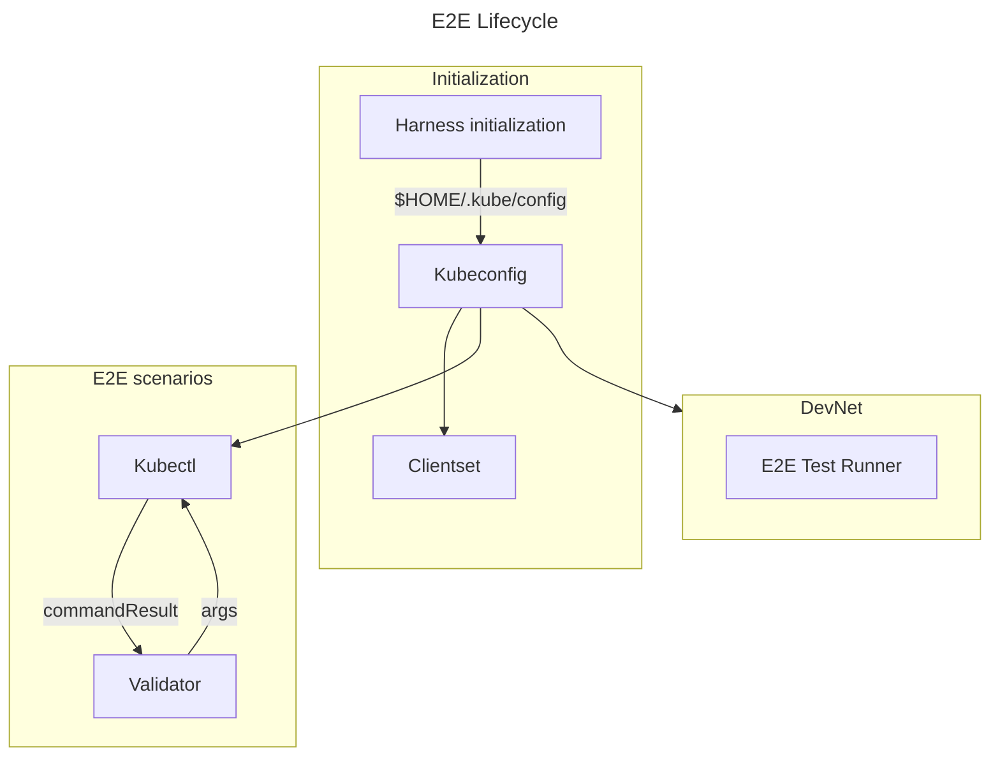

# POKT E2E Testing Document <!-- omit in toc -->

## Table of Contents <!-- omit in toc -->

- [Development](#development)
  - [Typical Development Workflow](#typical-development-workflow)
  - [Build Tags](#build-tags)
  - [Issue templates](#issue-templates)
- [Implementation](#implementation)

> tl; dr - `make localnet_up` and then `make test_e2e`


You can also click the `e2e-tests` button in the Tilt UI, which is handy during development.

## Development

`make localnet_up` to start a LocalNet. `make test_e2e` after it's up to run the end to end test suite.

The code depends on a Kube config located at the `$HOME/.kube/config` default path for retrieving a `Clientset`.

### Typical Development Workflow

`godog run e2e/tests/` generates error stubs based on the detected feature files. This speeds up writing tests because you can copy & paste over the stubbed-out Go step definitions of new steps that need writing.

### Build Tags

Because the E2E tests depend on a Kubernetes environment to be available, the E2E tests package gets a build tag so the E2E tests are ignored unless the test command is run with -tags=e2e. Issue #581 covers running the E2E tests in the delivery pipeline. This also means the `develop_test` Make target won't run E2E tests.

### Issue templates

Issues can formally define features by attaching an erroring `feature` file to bug or feature requests. A complete example feature is provided below.

```gherkin
Feature: Example Namespace

  Scenario: User Needs Example 
    Given the user has a validator
    When the user runs the command "example"
    Then the user should be able to see standard output containing "Example Output"
    And the pocket client should have exited without error
```

## Implementation

The test suite is located in `e2e/tests` and it contains a set of Cucumber feature files and the associated Go tests to run them. `make test_e2e` sees any files named with the pattern `*.feature` in `e2e/tests` and runs them with [godog](https://github.com/cucumber/godog), the Go test runner for Cucumber tests. The LocalNet must be up and running for the E2E test suite to run.

The Validator issues RPC commands on the container by calling `kubectl exec` and targeting the pod in the cluster by name. It records the results of the command including stdout and stderr, allowing for assertions about the results of the command.


