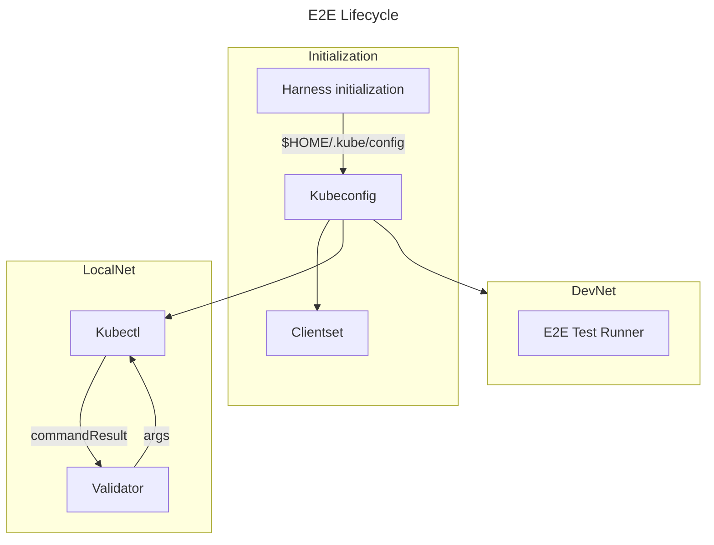

# Pocket 1.0 Architecture Decision Record - E2E Testing Framework <!-- omit in toc -->

## Table of Contents <!-- omit in toc -->

- [Problem Statement](#problem-statement)
- [Purpose](#purpose)
- [Goals](#goals)
- [Non-Goals](#non-goals)
- [Key Terms](#key-terms)
- [Proposed Solution](#proposed-solution)
  - [Root Feature Example](#root-feature-example)
  - [Structure](#structure)
  - [PocketClient Interface](#pocketclient-interface)
  - [Dependencies](#dependencies)
- [Rollout Plan](#rollout-plan)
- [Decomposition](#decomposition)
  - [Step 0: E2E Test Harness with LocalNet](#step-0-e2e-test-harness-with-localnet)
  - [Step 1.1: CI/CD Integration](#step-11-cicd-integration)
  - [Step 1.2: DevNet Integration](#step-12-devnet-integration)
  - [Step 1.3 E2E Test Coverage](#step-13-e2e-test-coverage)
  - [Step 2.1: Byzantine Network Simulator](#step-21-byzantine-network-simulator)
- [Success Criteria](#success-criteria)

## Problem Statement

As the POKT network scales, it will become increasingly important to test its technical aspects and security guarantees. Starting that growth with a solid foundation of end-to-end tests will have long-term gains in code quality and confidence. However, building a stable (read: not flaky) and extensible end-to-end test suite is a difficult endeavor reaching across several layers of abstraction. This document outlines the details of implementing a behavior-driven development harness for POKT V1.

## Purpose

The purpose of this set of tests is to aid development efforts going forward with V1. This test suite should develop in lockstep with DevNet. Rapid iteration on DevNet will be crucial for a smooth TestNet launch.

## Goals

Stated goals from the original Github issue #466:

- Create the foundation for a framework on which ALL future E2E automation will be built (e.g. including relays, state sync, etc...)
  - The current umbrella ticket will be used to link tickets expanding on this one’s features.
- Enable both application-level automation (e.g. sending a transaction or staking an actor)
- Determine if there is a need/benefit in using [https://github.com/testcontainers/testcontainers-go](https://github.com/testcontainers/testcontainers-go)
  - Decision: No. The E2E suite is focusing on building around the LocalNet. Test containers don’t offer the right level of abstraction that best fits our plans.

## Non-Goals

- Changing any core functionality. The E2E tests should assume the node as a black box for test purposes.
- Writing a network simulator, load tester, or stress tester.

## Key Terms

**LocalNet** - a local development environment that is maintained by Tilt.

**DevNet** - development network that acts as a rough staging environment.

**TestNet** - a production-like test network targeted for launch by the end of the summer of 2023 that is more permanent on principle.

**Gherkin** - a syntax for writing behavior tests that match to function handlers allowing declarative behavioral tests to be written for a given piece of software. They follow the `Given/When/Then` format.

**Cucumber** - Gherkin syntax (above) is used to write Cucumber tests.

**B.D.D.** - Behavior-driven development. A type of testing that asserts on the behavior the user should experience when interacting with the program under test. It is typically used in close relationship with a product development team for this reason.

**Kubernetes** - a container orchestration platform that LocalNet uses to manage the development environment for POKT.

**Tilt** - allows for fine-grained container scripting in Kubernetes environments including automatic restarts and rebuilds of Docker resources.

## Proposed Solution

The proposed solution is to run Cucumber behavior tests against the LocalNet.

1. Run a LocalNet instance
2. Take control of the `v1-client` pod
3. Feed that pod RPC messages via `kubectl`
4. Evaluate the success or error and subsequent network conditions.

### Root Feature Example

Below is an example of testing the `help` command of the Pocket binary.

```gherkin
Feature: Root Namespace

  Scenario: User Needs Help
    Given the user has a validator
    When the user runs the command "help"
    Then the user should be able to see standard output containing "Available Commands"
    And the pocket client should have exited without error
```

Scenarios are specific sets of `Given When Then` step definitions and are composable to some degree. [Step definitions](https://cucumber.io/docs/cucumber/step-definitions/) are functions with a regular expression that links it to a Gherkin step.

The goal is to specify a handful of basic but flexible step definitions that are composed into more complex scenarios with only Gherkin tests being written to define functionality.

Adaptability of the `RunCommand` method is the crux of this design.

```go
// the step regex is registered in the beginning of the tests.
ctx.Step(`^the user runs the command "([^"]*)"$`, theUserRunsTheCommand)
// and the associated Go function that it targets and the cmd arg it takes
func theUserRunsTheCommand(cmd string) error {
    cmds := strings.Split(cmd, " ")
    result, err := validator.RunCommand(cmds...)
    validator.result = result
    if err != nil {
        return err
    }
    return nil
}
```

- The above step definition function is incredibly powerful in that it allows the `Validator` to compose and execute commands on the `Pod`. The tests form this into a step definition for staking, unstaking, & help command validation, etc…
- A developer define custom step definitions for specific behavior, but Gherkin tests can also invoke `theUserRunsTheCommand` to achieve almost any behavior. Test syntax can thus be highly flexible and scenarios should be designed with this in mind.

### Structure

- The `e2e` directory is created and includes the feature files and test architecture inside. There should be no other necessary adaptations to the code, however.
- A new `make` target is introduced for `test_e2e` that runs the E2E test suite.

### PocketClient Interface

```go
// PocketClient is a single function interface for interacting with a node.
type PocketClient interface {
    RunCommand(...string) (*commandResult, error)
}
```

- The `PocketClient` interface is included in the test suite and defines a single function interface with the `RunCommand` method.
- The `validatorPod` adapter fulfills the `PocketClient` interface and lets us call commands through Kubernetes. This is the main way that tests assemble the environment for later assertions.

```go
// validatorPod holds the connection information to pod validator-001 for testing
type validatorPod struct {
    result *commandResult // stores the result of the last command that was run
}

// RunCommand runs a command on the pocket binary
func (v *validatorPod) RunCommand(args ...string) (*commandResult, error) {
    base := []string{
        "exec", "-i", "deploy/pocket-v1-cli-client",
        "--container", "pocket",
        "--", cliPath,
        "--non_interactive=true",
        "--remote_cli_url=" + rpcURL,
    }
    args = append(base, args...)
    cmd := exec.Command("kubectl", args...)
    r := &commandResult{}
    out, err := cmd.Output()
    v.result = r
    r.Stdout = string(out)
    if err != nil {
        return r, err
    }
    return r, nil
}
```



- E2E scenarios only run once Kubectl is loaded. Multiple scenarios are run against the same cluster.

### Dependencies

- The `godog` dependency is added to the `go.mod`. It is used to run the Cucumber tests defined in `e2e/tests`.
- E2E suite indirectly relies on specific pod names in the LocalNet configuration that will break tests if they’re changed.

## Rollout Plan

To implement the current proposed solution, issue #466 is decomposed into a multi-step plan that can be parallelized if necessary. The bare requirements of #466 focus around automating the end-to-end testing of the CLI, which will be achieved in the first ticket, but planning for and accomplishing the goals of the spirit of the ticket requires subsequent tickets to define.

- Step 0 merges in a minimal test harness and the supporting documentation.
- Support for the E2E suite is built into CI/CD and DevNet in step 1.X. Other developers can start adding tests as soon as Step 0 is merged.
- Specific feature coverage is tracked in Step 1.3.
- Step 2 uses the existing LocalNet integration to build a flexible test environment capable of simulating complex Byzantine conditions and behaviors, faulty and chaotic network conditions, and load.

## Decomposition

This plan involves a phased approach to adding an end-to-end test suite. The parts can be broken down into smaller tasks that can be done in parallel in two places. The DevNet integration and Simulation network are not dependent on each other, nor are they dependent on CI/CD integration. Each step has a corresponding issue in Github with more detailed scope of work and acceptance criteria.

### Step 0: E2E Test Harness with LocalNet

Issue #580

This step covers the minimum acceptance criteria to run E2E tests against a LocalNet and documents how to work them into a development flow for the rest of the team.

### Step 1.1: CI/CD Integration

Issue #581

Running the E2E tests regularly and for each new change is a large part of the value of these tests. This step explores adding E2E test runs on DevNet to an ArgoCD action that fires on merges to main and optional labels to PRs.

### Step 1.2: DevNet Integration

Issue #582

DevNet integration is a key point towards rapid iteration in the larger work towards TestNet launch. This step is concerned with making the E2E tests run on DevNet.

### Step 1.3 E2E Test Coverage

Issue #602

Specific features laid out in issue #602 are detailed here. Measuring test coverage of the E2E suite as a whole is also explored.

### Step 2.1: Byzantine Network Simulator

Issue #583

All of the above items set the ground work for a full network simulator that allows a configurable number of nodes or actor types (byzantine, validator, rational, liveness issues, etc…) and can spin up a network with them and run scenarios.

## Success Criteria

`make test_e2e` should automate the demo from #466 and send a transaction in the LocalNet.
