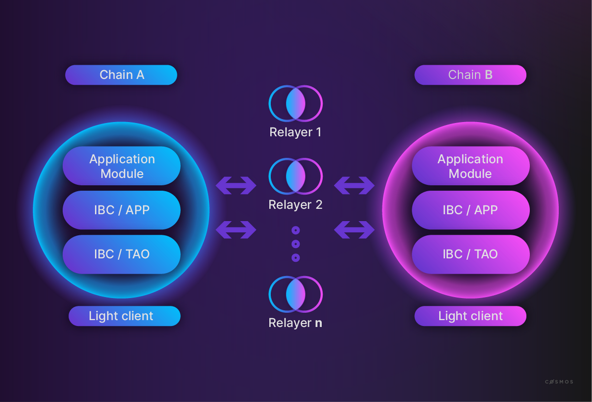
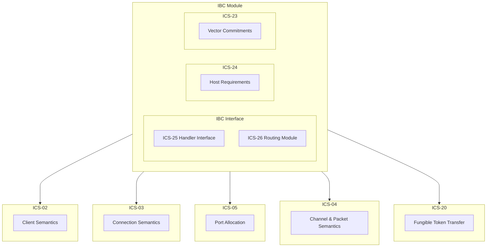

# IBC <!-- omit in toc -->

- [Overview](#overview)
- [IBC Module](#ibc-module)
  - [Host Configuration](#host-configuration)
- [Components](#components)
  - [ICS-24 Host Requirements](#ics-24-host-requirements)

## Overview



Inter-Blockchain Communication (IBC) is a protocol that facilitates the trustless communication between two chains. This allows them to interact with each other via the relaying of IBC packets. This works by having two IBC enabled chains: **chain A** and **chain B**; both of which will have a light client for the other running on their network. In order for **chain A** to transfer some of their native token to **chain B** a few things must be in place: a connection between the two chains, a channel and port must be opened between them on this connection, a light client for the opposing chain on each end of the connection and finally a relayer is needed to actually transfer the packet. Once all these are in place, **chain A** can commit an IBC packet to its state containing the information around the transaction, and generate a proof detailing its inclusion in the state at the specified height. The relayer will then submit this proof to **chain B** which will verify the proof and if valid **chain B** can then react to this packet in an appropriate fashion (ie. sending an IBC **chain A** token to the specified address on **chain B**).

## IBC Module

Pocket's IBC module is split into numerous components detailed below. The overall module layout is as follows:

**Note:** Not all of the different ICS components have been fully implemented yet, this is a work in progress.



### Host Configuration

Part of the node configurations relating to the IBC module is as follows:

```json
"ibc": {
    "enabled": bool,
}
```

If a node enables the IBC module, and is a validator, then the IBC module will automatically create an IBC host on startup. As the host defines the connections, channels and ports - which must stay persistent, the node should be a validator with little risk of suddenly closing any of these while open. As any tokens transferred over a connection/channel/port are unique to that combination they can only be returned over the same combination. If the channel is to close without warning then tokens will be unable to be returned to their source. It is for this reason that only validators are able to become IBC hosts.

## Components

The [IBC specification][ibc-spec] details numerous Interchain Standards (ICSs) that together form the IBC protocol. The following gives an overview of the different components implemented in Pocket's IBC module.

### ICS-24 Host Requirements

[ICS-24][ics24] defines the requirements for a host chain to be IBC compatible. This includes the definition of a store system to hold IBC related data in a provable (and also a private) fashion. This implementation uses the [SMT](https://github.com/pokt-network/smt) rather than the IAVL tree used by `cosmos-sdk` for its provable stores. ICS-24 also defines the Event Logging system that is used to store and query IBC related events for the relayers to read packet data and timeouts, as only the proofs of these are stored in the chain state.

More details on the specifics of the ICS-24 implementation for Pocket can be found [here](./ics24.md).
