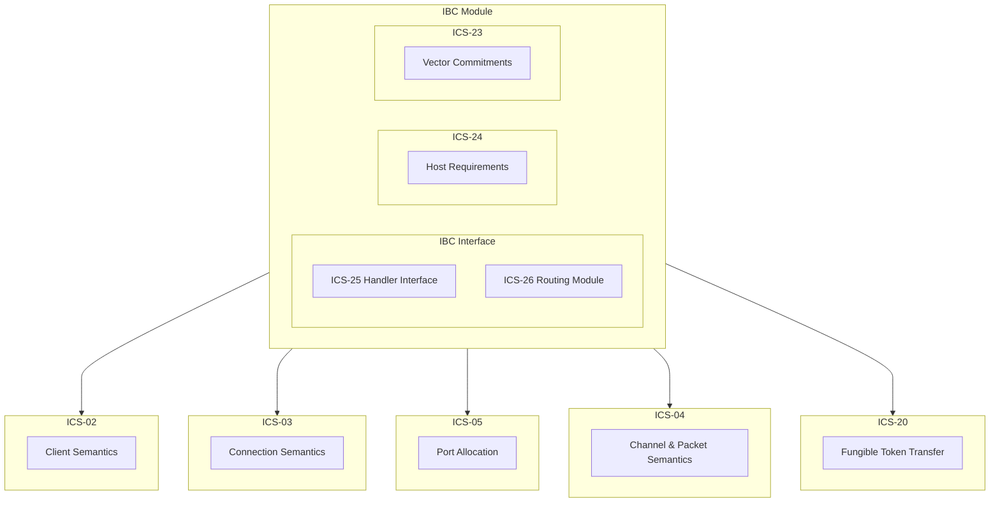

# IBC <!-- omit in toc -->

- [Overview](#overview)
- [IBC Module](#ibc-module)
  - [Node Configuration](#node-configuration)
- [Components](#components)
  - [ICS-24 Host Requirements](#ics-24-host-requirements)

## Overview


Inter-Blockchain Communication (IBC) is a protocol that enables trustless communication between two chains. It allows these chains to interact by relaying IBC packets. The process involves two IBC-enabled chains, referred to as **chain A** and **chain B**, each running a light client for the other chain on their network.

To transfer native tokens from **chain A** to **chain B**, certain prerequisites must be met. First, a connection between the two chains must be established. Then, a channel and port need to be opened on this connection. Additionally, a light client for the opposing chain should be set up on both ends of the connection. Finally, a relayer is required to facilitate the actual transfer of the packet.

Once these components are in place, **chain A** can commit an IBC packet to its state, which contains transaction information. It also generates a proof that specifies the inclusion of the packet in the state at a particular height. The relayer submits this proof to **chain B**, where it is verified. If the proof is valid, **chain B** can respond accordingly, such as by sending an IBC token from **chain A** to the designated address on **chain B**.

## IBC Module

Pocket's IBC module is split into numerous components detailed below. The overall module layout is as follows:

**Note:** Not all of the different ICS components have been fully implemented yet, this is a work in progress.



### Node Configuration

Part of the node configurations relating to the IBC module is as follows:

```json
"ibc": {
    "enabled": bool,
}
```

If a node enables the IBC module, and is a validator, then the IBC module will automatically create an IBC host on startup. As the host defines the connections, channels and ports - which must stay persistent, the node should be a validator with little risk of suddenly closing any of these while open. Any tokens transferred over a connection/channel/port are unique to that combination they can only be returned over the same combination.

**If the channel is to close without warning then tokens will be unable to be returned to their source. It is for this reason that only validators are able to become IBC hosts.**

_Note_: Connections, Channels and Ports in IBC are not the same as networking connections, channels and ports. They are stored in the chain state and are used by relayers to signify where each IBC packet should go when being relayed. When closing a channel the IBC host must submit to the state a `ChanCloseInit` IBC packet. If this happens without warning, the funds transferred on this channel will become unrecoverable.

## Components

The [IBC specification][ibc-spec] details numerous Interchain Standards (ICSs) that together form the IBC protocol. The following gives an overview of the different components implemented in Pocket's IBC module.

### ICS-24 Host Requirements

[ICS-24][ics24] defines the requirements for a host chain to be IBC compatible. This includes the definition of a store system to hold IBC related data in a provable (and also a private) fashion. This implementation uses the [SMT][smt] rather than the IAVL tree used by `cosmos-sdk` for its provable stores. ICS-24 also defines the Event Logging system that is used to store and query IBC related events for the relayers to read packet data and timeouts, as only the proofs of these are stored in the chain state.

See: [ICS-24](./ics24.md) for more details on the specifics of the ICS-24 implementation for Pocket.

[ics24]: https://github.com/cosmos/ibc/blob/main/spec/core/ics-024-host-requirements/README.md
[smt]: https://github.com/pokt-network/smt
