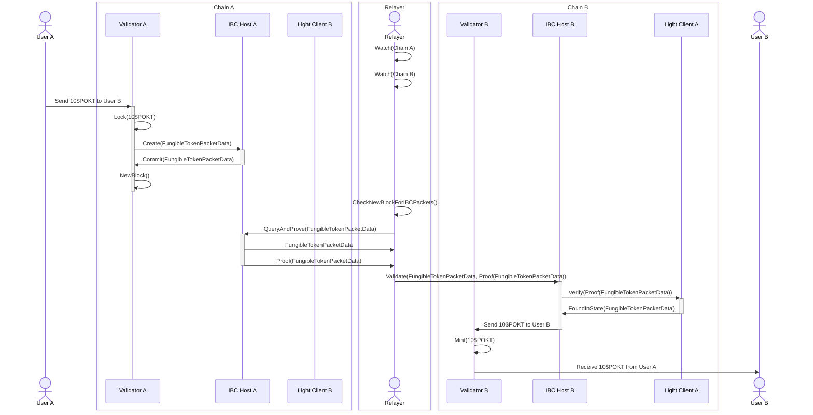
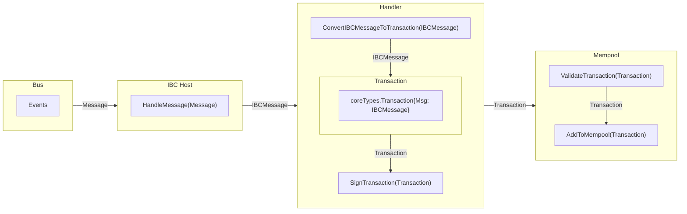

# ICS-24 Host Requirements <!-- omit in toc -->

- [Overview](#overview)
- [Host Configuration](#host-configuration)
- [Implementation](#implementation)
  - [Persistence](#persistence)
  - [Paths and Identifiers](#paths-and-identifiers)
  - [Timestamps](#timestamps)
- [IBC State](#ibc-state)
  - [IBC State Tree](#ibc-state-tree)
  - [Data Retrieval](#data-retrieval)
  - [IBC Messages](#ibc-messages)
  - [IBC Message Handling](#ibc-message-handling)
  - [Mempool](#mempool)
  - [State Transition](#state-transition)
- [Provable Stores](#provable-stores)
  - [Caching](#caching)

## Overview

[ICS-24][ics24] details the requirements of the host chain, in order for it to be compatible with IBC. A host is defined as a node on a chain that runs the IBC software. A host has the ability to create connections with counterparty chains, open channels, expose ports, and commit proofs to the consensus state of its own chain for the relayer to submit to another chain. The host is responsible to managing and creating clients and all other aspects of the IBC module.

As token transfers as defined in [ICS-20][ics20] work on a lock and mint pattern, any tokens sent from **chain A** to **chain B** will have a denomination unique to the connection/channel/port combination that the packet was sent over. This means that if a host where to shutdown a connection or channel without warning any tokens yet to be returned to the host chain would be lost. For this reason, only validator nodes are able to become hosts, as they provide the most reliability out of the different node types.

## Host Configuration

Only validators can be configured to be IBC hosts. If the IBC module, during its creation, detects the node is a validator (and the IBC `enabled` field in the config is `true`) it will automatically create a host.

```json
"ibc": {
    "enabled": bool,
    "private_key": string,
    "stores_dir": string
}
```

The `PrivateKey` field of the configuration is used to sign IBC store related messages and state transitions for inclusion in the block.

## Implementation

**Note**: The ICS-24 implementation is still a work in progress and is not yet fully implemented.

ICS-24 has numerous sub components that must be implemented in order for the host to be fully functional. These range from type definitions for identifiers, paths and stores as well as the methods to interact with them. Alongside these ICS-24 also defines the Event Logging system which is used to store the packet data and timeouts for the relayers to read, as only the `CommitmentProof` objects are committed to the chain state. In addition to these numerous other features are part of ICS-24 that are closely linked to other ICS components such as consensus state introspection and client state validation.

### Persistence

The IBC stores must be included in the networks consensus state as one of the many state trees. This is to ensure the IBC light clients verifying Pocket network's state can verify the inclusion or exclusion of IBC related information from the block headers.

The following is a simplified sequence diagram of an IBC fungible token transfer. This requires **Chain A** to commit to its state the packet data related to the transfer, so that **Chain B** can verify the inclusion of this packet data with the light client of **Chain A** it runs.



As the IBC host will make changes to the IBC store locally, in response to functions being called by relayers, they require these changes to be propagated throughout the network (i.e. the mempool) and included in all other node's IBC stores so that during block production these changes are reflected in the state transition. This is done by utilizing the existing transaction workflow, adding the IBC store change messages to the mempool and then handling them as a new message type in block production/application logic.

See: [IBC State](#ibc-state) below for more details on the IBC state transition process.

### Paths and Identifiers

Paths are defined as bytestrings that are used to access the elements in the different stores. They are built with the function `ApplyPrefix()` which takes a store key as a prefix and a path string and will return the key to access an element in the specific store. The logic for paths can be found in [path/keys.go](../path/keys.go) and [path/prefix.go](../path/prefix.go)

Identifiers are bytestrings constrained to specific characters and lengths depending on their usages. They are used to identify: channels, clients, connections and ports. Although the minimum length of the identifiers is much less we use a minimum length of 32 bytes and a maximum length that varies depending on the use case to randomly generate identifiers. This allows for an extremely low chance of collision between identifiers. Identifiers have no significance beyond their use to store different elements in the IBC stores and as such there is no need for non-random identifiers. The logic for identifiers can be found in [path/identifiers.go](../path/identifiers.go).

### Timestamps

The `GetTimestamp()` function returns the current unix timestamp of the host machine and is used to calculate timeout periods for packets

## IBC State

As mentioned [above](#persistence) the IBC store **MUST** be included in the consensus state of the network. As such the IBC store as defined in [ICS-24][ics24] has been implemented as a single IBC state tree.

### IBC State Tree

The IBC state tree is an `SMT` backed by a persistent `KVStore`, this is used for proof generation/verification. Data retrieval uses the `peristence` layer, see the [data retrieval](#data-retrieval) section below for more details.

The root hash of the IBC state tree is included in the `rootTree` which computes the network's state hash for any given block. This allows verifiers to not only verify the inclusion/exclusion of any element in the IBC state tree itself but also that the IBC state tree was used to compute the network's state hash, by utilising the `CommitmentProof` object defined in [ICS-23][ics23].

### Data Retrieval

In order to query the IBC store the `persistence` layer is leveraged. All local changes to the IBC store are broadcasted as [IBC messages](#ibc-messages) and ultimately stored in each node's `peristence` layer. This allows for the efficient querying of the IBC store instead of having to query the IBC state tree directly.

When attempting to generate a proof for a specific `key` in the IBC state tree the IBC host will import a local copy of the IBC state tree and use this to generate the proof. Otherwise all queries are handled by the `peristence` layer's underlying database.

### IBC Messages

Hosts maintain uncommitted changes in a local ephemeral IBC store while messages propagate through the mempool.

These messages enable a variety of IBC related state changes such as creating light clients, opening connections, sending packets, etc... This is enabled by propagating `IBCMessage` types defined in [ibc/types/proto/messages.proto](../types/proto/messages.proto). This type acts as an enum representing two possible state transition events:

- `UpdateIBCStore`: Updating the store with a key-value pair; adding a new or updating an existing element
- `PruneIBCStore`: Pruning the store via its key; removal of an existing element

_Note: In both types described above the `key` field **must** already be prefixed with the `CommitmentPrefix` and should be a valid path in the store._

When changes are made locally they are not committed to the IBC store itself but are instead used to create an `IBCMessage` which is broadcasted to the network. This is akin to a simple send transaction that has been propagated throughout the mempool but has not been committed to the on-chain state.

### IBC Message Handling

Upon a node receiving an `IBCMessage` from the event bus it will use the `HandleMessage()` method of the `IBCModule` to add this message to the transactions mempool via the following steps:

1. Wrap the `IBCMessage` within a `Transaction`
2. Sign the `Transaction` using the `IBCModule`'s private key
3. Broadcast the `Transaction` throughout the mempool



See: [ibc/module.go](../module.go) for the specific implementation details.

### Mempool

With the `IBCMessage` now propagated through the network's mempool, when it is reaped (by the block proposer) the message's validity will be handled by first determining the type of the `IBCMessage`:

- `UpdateIBCStore`: The `key` and `value` fields are tracked by persistence and used to update the `ibc` store state tree
- `PruneIBCStore`: The `key` field is tracked by persistence and marked for removal in the `ibc` store state tree

### State Transition

See: [PROTOCOL_STATE_HASH.md](../../persistence/docs/PROTOCOL_STATE_HASH.md#ibc-state-tree) for more information on how the persistence module uses the data it has tracked from the `IBCMessage` objects, in order to update the actual state trees and in turn the root hash.

## Provable Stores

The `ProvableStore` interface defined in [shared/modules/ibc_module.go](../../shared/modules/ibc_module.go) is implemented by the [`provableStore`](../store/provable_store.go) type and managed by the [`StoreManager`](../store/store_manager.go).

The provable stores are each assigned a `prefix`. This represents the specific sub-store that they are able to access and interact with in the IBC state tree. When doing any operation `get`/`set`/`delete` the `prefix` is applied to the `key` provided to generate the `CommitmentPath` to the element in the IBC state tree.

The provable stores do not directly interface with the IBC state tree but instead utliise the `peristence` layer to query the data locally. This allows for the efficient querying of the IBC store instead of having to query the IBC state tree directly. Any changes made by the `ProvableStore` instance are broadcasted to the network for inclusion in the next block, being stored in their mempools.

### Caching

Every local change made to the IBC store (`update`/`delete`) is stored in an in-memory cache. These caches are written to disk by the [`StoreManager`](../store/store_manager.go).

In the event of a node failure, or local changes not being propagated correctly. Any changes stored in the cache can be "replayed" by the node and broadcasted to the network for inclusion in the next block.

_TODO: Implement this functionality_

[ics24]: https://github.com/cosmos/ibc/blob/main/spec/core/ics-024-host-requirements/README.md
[ics20]: https://github.com/cosmos/ibc/blob/main/spec/app/ics-020-fungible-token-transfer/README.md
[smt]: https://github.com/pokt-network/smt
