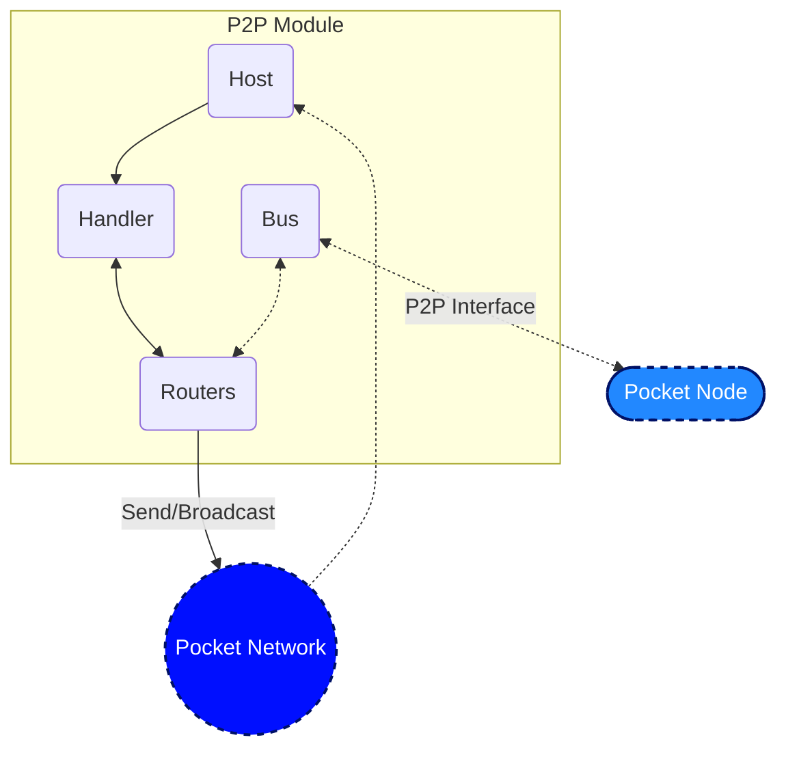
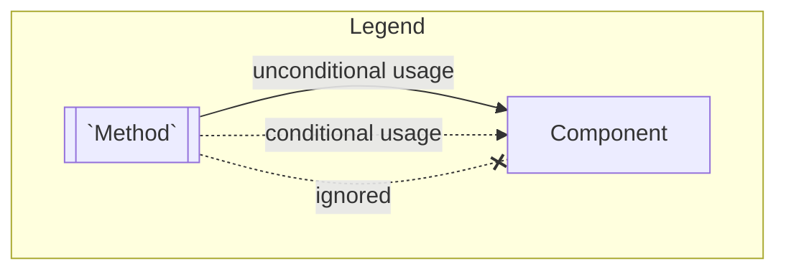
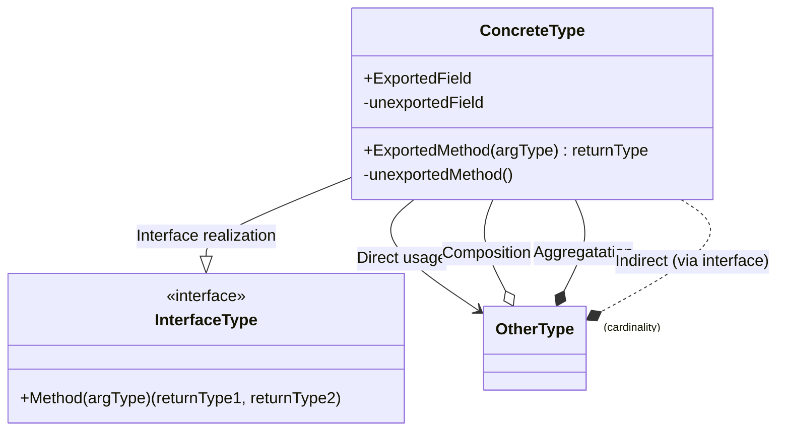
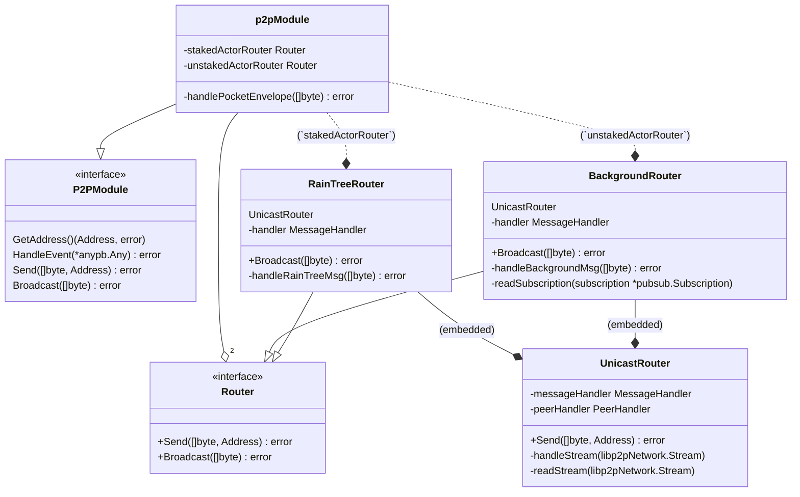
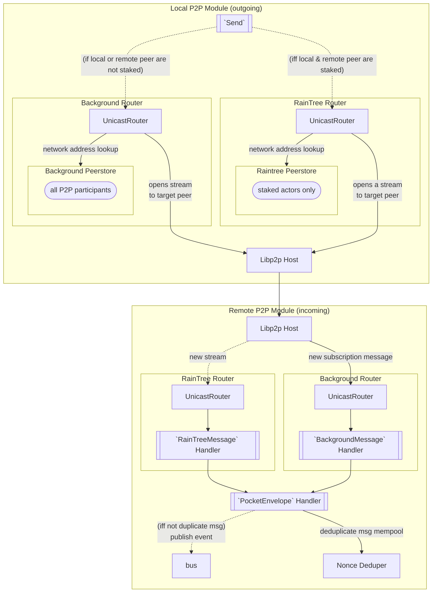
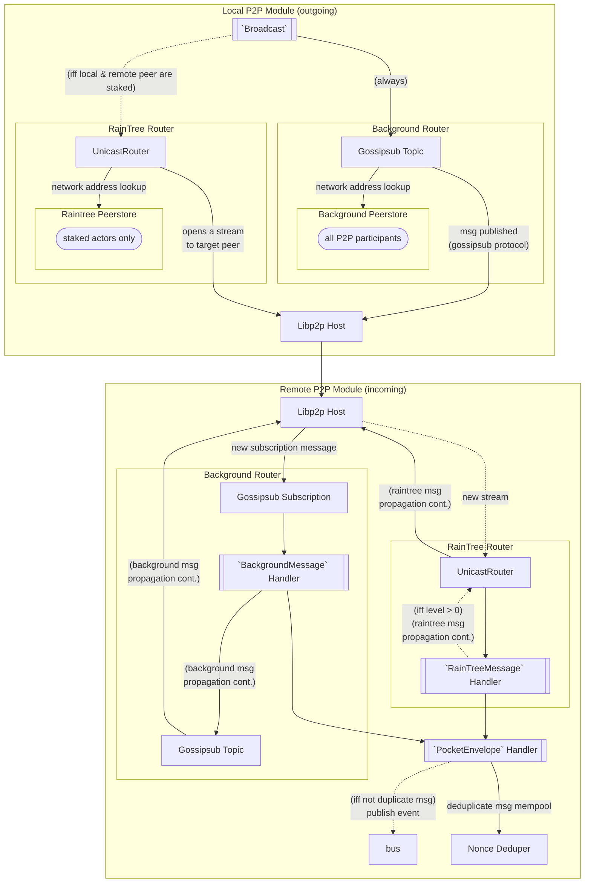
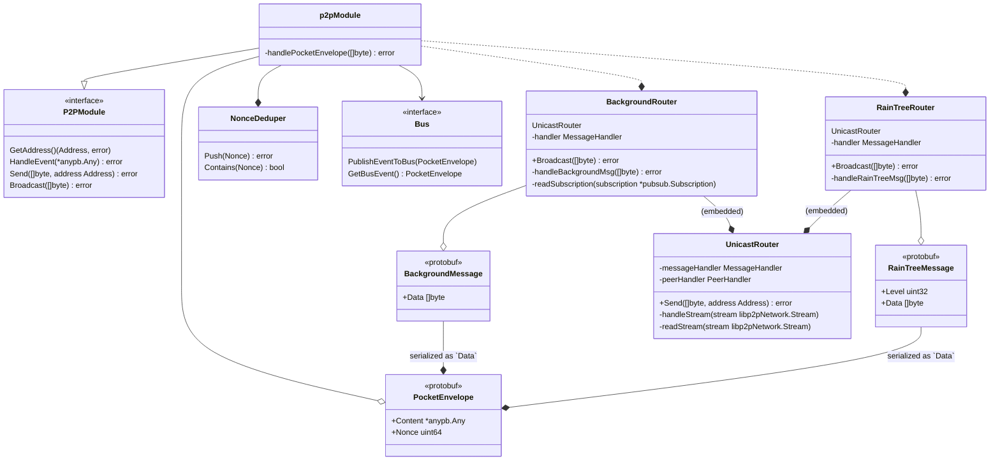
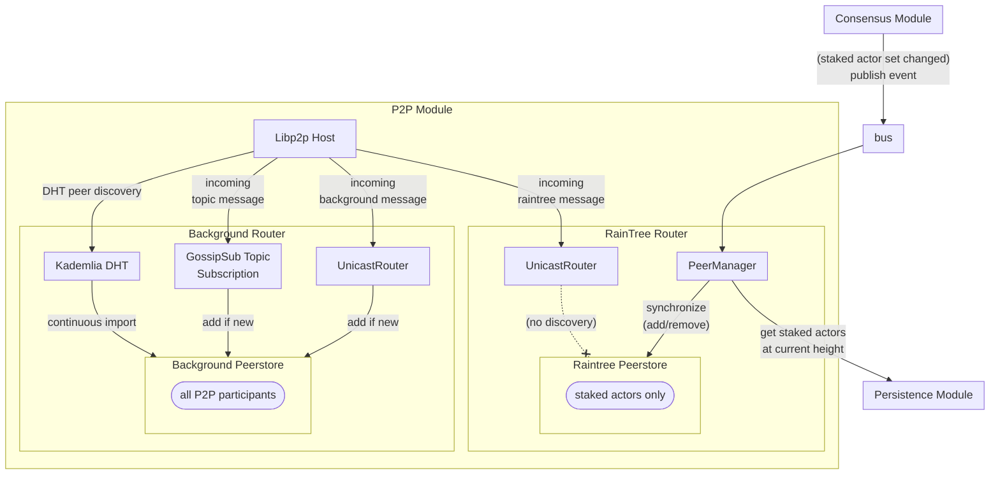

# P2P Module <!-- omit in toc -->

This document is meant to be a supplement to the living specification of [1.0 Pocket's P2P Specification](https://github.com/pokt-network/pocket-network-protocol/tree/main/p2p) primarily focused on the implementation, and additional details related to the design of the codebase and information related to development.

## Table of Contents <!-- omit in toc -->

- [Definitions](#definitions)
- [Interface](#interface)
- [Implementation](#implementation)
  - [Code Architecture - P2P Module](#code-architecture---p2p-module)
  - [Code Architecture - Network Module](#code-architecture---network-module)
  - [Code Organization](#code-organization)
- [Testing](#testing)
  - [Running Unit Tests](#running-unit-tests)
  - [RainTree testing framework](#raintree-testing-framework)
    - [Helpers](#helpers)
    - [Test Generators](#test-generators)

## Definitions

### "gossip"

When used generally, shorthand for "message propogation"; **not to be confused with "gossipsub"**.

### "gossipsub"

A specific ["pubsub"](https://pkg.go.dev/github.com/libp2p/go-libp2p-pubsub) router implementation/protocol which uses information (referred to internally as 'gossip' by LibP2P, **distinct from our definition**) about which peers have seen which messages to facilitate "gossip" (as per our definition).

### "raintree gossip"

A structured "gossip" protocol (and implementation) which uses the raintree algorithm for peer selection. Used between all staked actors to optimize for "gossip" speed.

### "background gossip"

A "gossip" protocol (implementation TBD) which facilitates "gossip" to all P2P participants, including non-staked actors (e.g. full-nodes).

## Interface & Integration

This module aims to implement the interface specified in [`pocket/shared/modules/p2p_module.go`](../shared/modules/p2p_module.go).

_(TODO: diagram legend)_


`Routers` is where [RainTree](https://github.com/pokt-network/pocket/files/9853354/raintree.pdf) is implemented.
See [`raintree/router.go`](./raintree/router.go) for the specific implementation of RainTree, but please refer to the [specifications](https://github.com/pokt-network/pocket-network-protocol/tree/main/p2p) for more details.

## Module Architecture

### Legends




### P2P Module / Router Decoupling

The P2P module encapsulates the `RaiTreeRouter` and `BackgroundRouter` submodules.
The P2P module internally refers to these as the `stakedActorRouter` and `unstakedActorRouter`, respectively.

Depending on the necessary routing scheme (unicast / broadcast) and whether the peers involved are staked actors, a node will use one or both of these routers.

**Unicast**

| Sender         | Receiver       | Router          | Example Usage                                        |
|----------------|----------------|-----------------|------------------------------------------------------|
| Staked Actor   | Staked Actor   | Raintree only   | Consensus (state sync) messages (to validators only) |
| Unstaked Actor | Staked Actor   | Background only | Consensus (state sync) messages (to validators only) |
| Unstaked Actor | Unstaked Actor | Background only | Debug messages (debug CLI)                           |

**Broadcast**

| Broadcaster    | Receiver       | Router                | Example Usage                              |
|----------------|----------------|-----------------------|--------------------------------------------|
| Staked Actor   | Staked Actor   | Raintree + Background | Utility tx messages                        |
| Unstaked Actor | Staked Actor   | Background only       | Utility tx messages (gossipsub redundancy) |
| Unstaked Actor | Unstaked Actor | Background only       | Utility tx messages                        |

Both router submodule implementations embed a `UnicastRouter` which enables them to send and receive messages directly to/from a single peer.

**Class Diagram**



### Message Propagation & Handling

**Unicast**



**Broadcast**



### Message Deduplication

Messages MUST be deduplicated before broadcasting their respective event over the bus since it is expected that nodes will receive duplicate messages (for multiple reasons).

The responsibility of deduplication is encapsulated by the P2P module, As such duplicate messages may come from multiple routers in some of these scenarios.



### Peer Discovery
Peer discovery involves pairing peer IDs to their network addresses (multiaddr).
This pairing always has an associated TTL (time-to-live), near the end of which it must
be refreshed.

In the background gossip overlay network (`backgroundRouter`), peers will re-advertise themselves 7/8th through their TTL.
This refreshes the libp2p peerstore automatically.

In the raintree gossip overlay network (`raintreeRouter`), the libp2p peerstore is **NOT** currently refreshed _(TODO: [#859](https://github.com/pokt-network/network/isues/859))_.



### Raintree Router Architecture

_DISCUSS(team): If you feel this needs a diagram, please reach out to the team for additional details._
_TODO(olshansky, BenVan): Link to RainTree visualizations once it is complete._

### Code Organization

```bash
p2p
├── background
│   ├── kad_discovery_baseline_test.go  # Libp2p peer discovery via kademalia baseline example
│   ├── router.go                       # `BackgroundRouter` implementation of `Router` interface
│   └── router_test.go                  # `BackgroundRouter` functional tests
├── bootstrap.go                              # `p2pModule` bootstrap related method(s)
├── CHANGELOG.md
├── config
│   └── config.go
├── event_handler.go
├── module.go                                 # `p2pModule` definition
├── module_raintree_test.go                   # `p2pModule` & `RainTreeRouter` functional tests (routing)
├── module_test.go                            # `p2pModule` & `RainTreeRouter` integration tests
├── peer_test.go                              # `PeerList` unit test(s)
├── protocol
│   └── protocol.go                     # Common, pokt protocol-specific constants
├── providers
│   ├── current_height_provider
│   ├── peerstore_provider
│   └── providers.go
├── raintree
│   ├── peers_manager.go              # `rainTreePeersManager` implementation of `PeersManager` interface
│   ├── peers_manager_test.go
│   ├── peerstore_utils.go            # Raintree routing helpers
│   ├── router.go                     # `RainTreeRouter` implementation of `Router` interface
│   ├── router_test.go                # `RainTreeRouter` functional tests
│   ├── target.go                     # `target` definition
│   ├── testutil.go
│   └── utils_test.go
├── testutil.go
├── transport_encryption_test.go            # Libp2p transport security integration test
├── types
│   ├── background.pb.go
│   ├── errors.go
│   ├── libp2p_mocks.go
│   ├── mocks
│   ├── network_peer.go               # `NetworkPeer` implementation of `Peer` interface
│   ├── peer.go                       # `Peer` interface & `PeerList` definitions
│   ├── peer_manager.go               # `PeerManager` interface & `SortedPeerManager` implementation definitions
│   ├── peerstore.go                  # `Peerstore` interface & `PeerAddrMap` implementation definitions
│   ├── peers_view.go                 # `PeersView` interface & `sortedPeersView` implementation definitions
│   ├── peers_view_test.go
│   ├── proto
│   ├── raintree.pb.go
│   └── router.go                     # `Router` interface definition
├── unicast
│   ├── logging.go
│   ├── router.go
│   └── testutil.go
├── utils
│   ├── host.go                       # Helpers for working with libp2p hosts
│   ├── logging.go                    # Helpers for logging
│   ├── nonce_deduper.go
│   ├── nonce_deduper_test.go
│   ├── peer_conversion.go            # Helpers for converting between "native" and libp2p peer representations
│   ├── url_conversion.go             # Helpers for converting between  "native" and libp2p network address representations
│   └── url_conversion_test.go
└── utils_test.go
```

## Testing

_TODO: The work to add the tooling used to help with unit test generation is being tracked in #314._

### Running Unit Tests

```bash
make test_p2p
```

### RainTree testing framework

The testing framework for RainTree is a work-in-progress and can be found in `module_raintree_test.go`.

The `TestRainTreeCommConfig` struct contains a mapping of `validatorId` to the number of messages it expects to process during a RainTree broadcast:

- `numNetworkReads`: the # of asynchronous reads the node's P2P listener made (i.e. # of messages it received over the network)
- `numNetworkWrites`: the # of asynchronous writes the node's P2P listener made (i.e. # of messages it tried to send over the network)
- NOTE: A `demote` does not go over the network and is therefore not considered a `read`.

#### Helpers

Given a specific `originatorNode` which initiates the broadcast, the `testRainTreeCalls` helper function can be used to configure all the nodes and simulate a broadcast.

#### Test Generators

The [rain-tree-simulator](https://github.com/pokt-network/rain-tree-sim/blob/main/python) library contains an example Golang implementation and a Python implementation of RainTree simulators.

You can read the documentation in the [python simulator](https://github.com/pokt-network/rain-tree-sim/blob/main/python) on how it can be used to generate the unit tests found in `module_raintree_test.go`.

<!-- GITHUB_WIKI: p2p/readme -->
