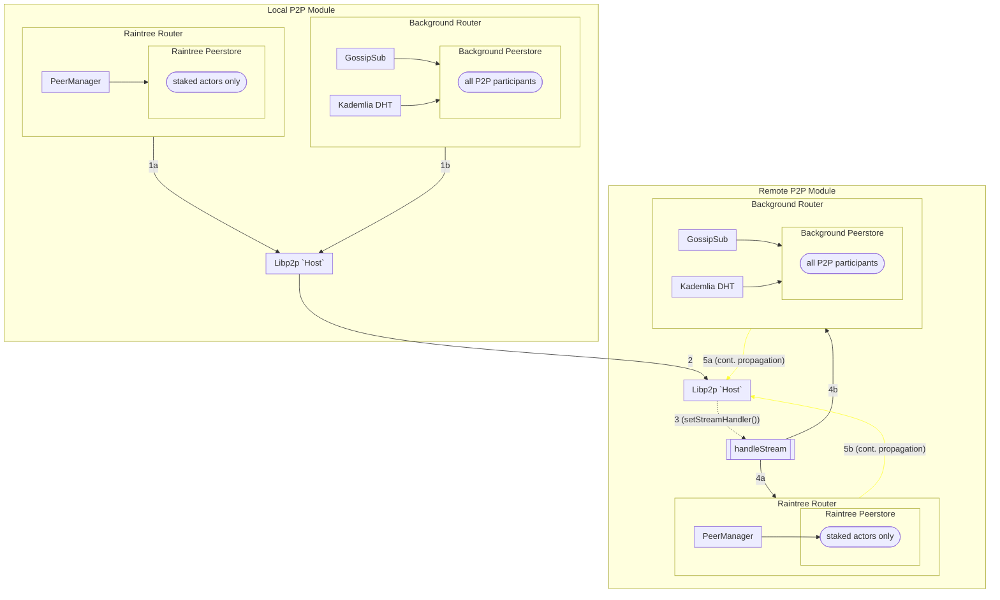

# P2P Module <!-- omit in toc -->

This document is meant to be a supplement to the living specification of [1.0 Pocket's P2P Specification](https://github.com/pokt-network/pocket-network-protocol/tree/main/p2p) primarily focused on the implementation, and additional details related to the design of the codebase and information related to development.

## Table of Contents <!-- omit in toc -->

- [Definitions](#definitions)
- [Interface](#interface)
- [Implementation](#implementation)
  - [Code Architecture - P2P Module](#code-architecture---p2p-module)
  - [Code Architecture - Network Module](#code-architecture---network-module)
  - [Code Organization](#code-organization)
- [Testing](#testing)
  - [Running Unit Tests](#running-unit-tests)
  - [RainTree testing framework](#raintree-testing-framework)
    - [Helpers](#helpers)
    - [Test Generators](#test-generators)

## Definitions

### "gossip"

When used generally, shorthand for "message propogation"; **not to be confused with "gossipsub"**.

### "gossipsub"

A specific ["pubsub"](https://pkg.go.dev/github.com/libp2p/go-libp2p-pubsub) router implementation/protocol which uses information (referred to internally as 'gossip' by LibP2P, **distinct from our definition**) about which peers have seen which messages to facilitate "gossip" (as per our definition).

### "raintree gossip"

A structured "gossip" protocol (and implementation) which uses the raintree algorithm for peer selection. Used between all staked actors to optimize for "gossip" speed.

### "background gossip"

A "gossip" protocol (implementation TBD) which facilitates "gossip" to all P2P participants, including non-staked actors (e.g. full-nodes).

## Interface

This module aims to implement the interface specified in `pocket/shared/modules/p2p_module.go` using the specification above.

## Implementation

### P2P Module Architecture


`Routers` is where [RainTree](https://github.com/pokt-network/pocket/files/9853354/raintree.pdf) (or the simpler basic approach) is implemented. See `raintree/router.go` for the specific implementation of RainTree, but please refer to the [specifications](https://github.com/pokt-network/pocket-network-protocol/tree/main/p2p) for more details.

### Raintree Router Architecture

_DISCUSS(team): If you feel this needs a diagram, please reach out to the team for additional details._
_TODO(olshansky, BenVan): Link to RainTree visualizations once it is complete._

### Message Propagation

Given `Local P2P Module` has a message that it needs to propagate:

<ul style="list-style-type: none;">
    <li>1a. <code>Raintree Router</code> selects targets from the <code>Pokt Peerstore</code>, <strong>which only includes staked actors</strong></li>
    <li>1b. <code>Background Router</code> selects targets from the libp2p <code>Peerstore</code>, <strong>which includes all P2P participants</strong></li>
    <li>2. Libp2p <code>Host</code> manages opening and closing streams to targeted peers</li>
    <li>3. <code>Remote P2P module</code>'s (i.e. receiver's) <code>handleStream</code> is called (having been registered via <code>setStreamHandler()</code>)</li>
    <li>4a. <code>handleStream</code> propagates message via <code>Raintree Router</code></li>
    <li>4b. <code>handleStream</code> propagates message via <code>Background Router</code></li>
    <li>5a. Repeat step 1a from <code>Remote P2P Module</code>'s perspective targeting its next peers</li>
    <li>5b. Repeat step 1b from <code>Remote P2P Module</code>'s perspective targeting its next peers</li>
</ul>



The `Network Module` is where [RainTree](https://github.com/pokt-network/pocket/files/9853354/raintree.pdf) (or the simpler basic approach) is implemented. See `raintree/network.go` for the specific implementation of RainTree, but please refer to the [specifications](https://github.com/pokt-network/pocket-network-protocol/tree/main/p2p) for more details.

### Code Organization

```bash
p2p
├── background
│   ├── kad_discovery_baseline_test.go  # Libp2p peer discovery via kademalia baseline example
│   ├── router.go                       # `BackgroundRouter` implementation of `Router` interface
│   └── router_test.go                  # `BackgroundRouter` functional tests
├── bootstrap.go                              # `p2pModule` bootstrap related method(s)
├── CHANGELOG.md
├── event_handler.go
├── module.go                                 # `p2pModule` definition
├── module_raintree_test.go                   # `p2pModule` & `RainTreeRouter` functional tests (routing)
├── module_test.go                            # `p2pModule` & `RainTreeRouter` integration tests
├── peer_test.go                              # `PeerList` unit test(s)
├── protocol
│   └── protocol.go                     # Common, pokt protocol-specific constants
├── providers
│   ├── current_height_provider
│   ├── peerstore_provider
│   └── providers.go
├── raintree
│   ├── nonce_deduper.go
│   ├── nonce_deduper_test.go
│   ├── peers_manager.go              # `rainTreePeersManager` implementation of `PeersManager` interface
│   ├── peers_manager_test.go
│   ├── peerstore_utils.go            # Raintree routing helpers
│   ├── router.go                     # `RainTreeRouter` implementation of `Router` interface
│   ├── router_test.go                # `RainTreeRouter` functional tests
│   ├── target.go                     # `target` definition
│   ├── types
│   │   └── proto
│   │       └── raintree.proto
│   └── utils_test.go
├── README.md
├── transport_encryption_test.go            # Libp2p transport security integration test
├── types
│   ├── errors.go
│   ├── libp2p_mocks.go
│   ├── mocks
│   ├── network_peer.go               # `NetworkPeer` implementation of `Peer` interface
│   ├── peer.go                       # `Peer` interface & `PeerList` definitions
│   ├── peer_manager.go               # `PeerManager` interface & `SortedPeerManager` implementation definitions
│   ├── peerstore.go                  # `Peerstore` interface & `PeerAddrMap` implementation definitions
│   ├── peers_view.go                 # `PeersView` interface & `sortedPeersView` implementation definitions
│   ├── peers_view_test.go
│   ├── raintree.pb.go
│   └── router.go                     # `Router` interface definition
├── utils
│   ├── config.go                     # `RouterConfig` definition
│   ├── host.go                       # Helpers for working with libp2p hosts
│   ├── logging.go                    # Helpers for logging
│   ├── peer_conversion.go            # Helpers for converting between "native" and libp2p peer representations
│   ├── url_conversion.go             # Helpers for converting between  "native" and libp2p network address representations
│   └── url_conversion_test.go
└── utils_test.go
```

## Testing

_TODO: The work to add the tooling used to help with unit test generation is being tracked in #314._

### Running Unit Tests

```bash
make test_p2p
```

### RainTree testing framework

The testing framework for RainTree is a work-in-progress and can be found in `module_raintree_test.go`.

The `TestRainTreeCommConfig` struct contains a mapping of `validatorId` to the number of messages it expects to process during a RainTree broadcast:

- `numNetworkReads`: the # of asynchronous reads the node's P2P listener made (i.e. # of messages it received over the network)
- `numNetworkWrites`: the # of asynchronous writes the node's P2P listener made (i.e. # of messages it tried to send over the network)
- NOTE: A `demote` does not go over the network and is therefore not considered a `read`.

#### Helpers

Given a specific `originatorNode` which initiates the broadcast, the `testRainTreeCalls` helper function can be used to configure all the nodes and simulate a broadcast.

#### Test Generators

The [rain-tree-simulator](https://github.com/pokt-network/rain-tree-sim/blob/main/python) library contains an example Golang implementation and a Python implementation of RainTree simulators.

You can read the documentation in the [python simulator](https://github.com/pokt-network/rain-tree-sim/blob/main/python) on how it can be used to generate the unit tests found in `module_raintree_test.go`.

<!-- GITHUB_WIKI: p2p/readme -->
