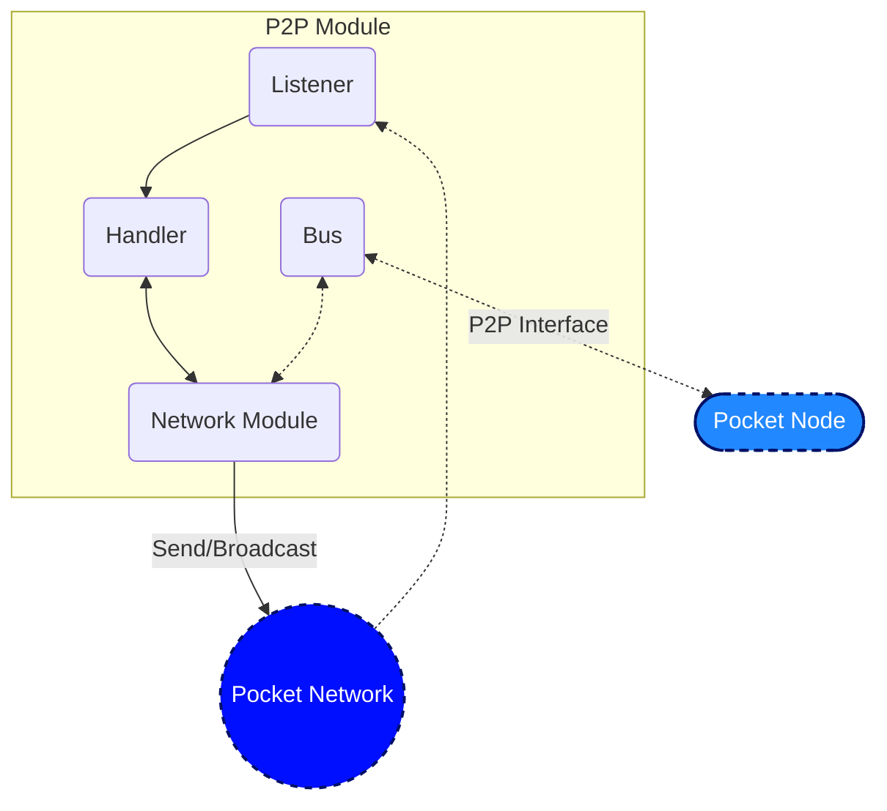

# P2P Module <!-- omit in toc -->

This document is meant to be a supplement to the living specification of [1.0 Pocket's P2P Specification](https://github.com/pokt-network/pocket-network-protocol/tree/main/p2p) primarily focused on the implementation, and additional details related to the design of the codebase and information related to development.

## Table of Contents <!-- omit in toc -->

- [Interface](#interface)
- [Implementation](#implementation)
  - [Code Architecture - P2P Module](#code-architecture---p2p-module)
  - [Code Architecture - Network Module](#code-architecture---network-module)
  - [Code Organization](#code-organization)
- [Testing](#testing)
  - [Running Unit Tests](#running-unit-tests)
  - [RainTree testing framework](#raintree-testing-framework)
    - [Helpers](#helpers)
    - [Considerations](#considerations)

## Interface

This module aims to implement the interface specified in `pocket/shared/modules/p2p_module.go` using the specification above.

## Implementation

### Code Architecture - P2P Module



### Code Architecture - Network Module

_DISCUSS(team): If you feel this needs a diagram, please reach out to the team for additional details._
_TODO(olshansky, BenVan): Link to RainTree visualizations once it is complete._

The `Network Module` is where [RainTree](https://github.com/pokt-network/pocket/files/9853354/raintree.pdf) (or the simpler basic approach) is implemented. See `raintree/network.go` for the specific implementation of RainTree, but please refer to the [specifications](https://github.com/pokt-network/pocket-network-protocol/tree/main/p2p) for more details.

### Code Organization

```bash
p2p
├── README.md                               # Self link to this README
├── transport.go                            # Varying implementations of the `Transport` (e.g. TCP, Passthrough) for network communication
├── module.go                               # The implementation of the P2P Interface
├── raintree
│   ├── addrbook_utils.go             # AddrBook utilities
│   ├── peers_manager.go              # peersManager implementation
│   ├── peers_manager_test.go         # peersManager unit tests
│   ├── network_test.go               # network unit tests
│   ├── network.go                    # Implementation of the Network interface using RainTree's specification
│   ├── utils.go
│   └── types
│       └── proto
│           └── raintree.proto
├── raintree_integration_test.go            # RainTree unit tests
├── raintree_integration_utils_test.go      # Test suite for RainTree
├── stdnetwork                              # This can eventually be deprecated once raintree is verified.
│   └── network.go                    # Implementation of the Network interface using Golang's std networking lib
├── telemetry
│   ├── metrics.go
├── types
│   ├── addr_book.go                  # addrBook definition
│   ├── addr_book_map.go              # addrBookMap definition
│   ├── addr_list.go                  # addrList definition
│   ├── network.go                    # Network Interface definition
│   ├── network_peer.go               # networkPeer definition
│   ├── proto                         # Proto3 messages for generated types
│   ├── target.go                     # target definition
└── utils.go
```

## Testing

_TODO: The work to add the tooling used to help with unit test generation is being tracked in #314._

### Running Unit Tests

```bash
make test_p2p
```

### RainTree testing framework

The testing framework for RainTree is a work-in-progress and can be found in `module_raintree_test.go`.

The `TestRainTreeCommConfig` struct contains a mapping of `validatorId` to the number of messages it expects to process during a RainTree broadcast:

- `numNetworkReads`: the # of asynchronous reads the node's P2P listener made (i.e. # of messages it received over the network)
- `numNetworkWrites`: the # of asynchronous writes the node's P2P listener made (i.e. # of messages it tried to send over the network)
- NOTE: A `demote` does not go over the network and is therefore not considered a `read`.

#### Helpers

Given a specific `originatorNode` which initiates the broadcast, the `testRainTreeCalls` helper function can be used to configure all the nodes and simulate a broadcast.

#### Considerations

- **Deterministic Private Key Generation**: Since RainTree is dependant on the lexicographic order of the addresses, the generation of the private keys (and in turn the public keys and addresses) is important and cannot be randomized for the time being.
- **Variable Coupling**:There is an implicit coupling between `validatorId`, `serviceUrl` and `genericParam` that requires understanding of the codebase. Reach out to @olshansk or @andrewnguyen22 for clarity on this.
