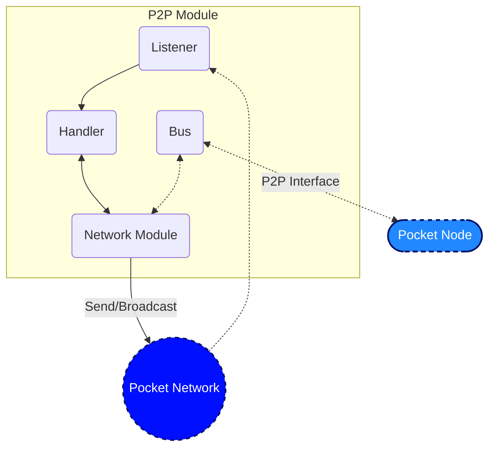

# Pre2P Module

_Note: This module will likely be upgraded to the official P2P module implementation in the near future._

This document is meant to be a supplement to the living specification of [1.0 Pocket's P2P Specification](https://github.com/pokt-network/pocket-network-protocol/tree/main/p2p) primarily focused on the implementation, and additional details related to the design of the codebase and information related to development.

## Interface

This module aims to implement the interface specified in `pocket/shared/modules/p2p_module.go` using the specification above.

## Implementation

### Code Architecture - P2P Module



### Code Architecture - Network Module

_DISCUSS(team): If you feel this needs a diagram, please reach out to the team for additional details._
_TODO(olshansky, BenVan): Link to RainTree visualizations once it is complete._

The `Network Module` is where RainTree (or the simpler basic approach) is implemented. See `raintree/network.go` for the specific implementation of RainTree, but please refer to the specifications for more details.

### Code Organization

```bash
p2p/pre2p
├── README.md                    # Self link to this README
├── conn.go                      # Varying implementations of the `TransportLayerConn` (e.g. TCP, Passthrough) for network communication
├── module.go                    # The implementation of the P2P Interface
├── raintree
│   ├── addrbook_utils.go        # AddrBook utilities
│   ├── addrbook_utils_test.go   # AddrBook utilities unit tests
│   ├── network.go               # Implementation of the Network interface using RainTree's specification
│   └── types
│       └── proto
│           └── raintree.proto
├── raintree_integration_test.go            # RainTree unit tests
├── raintree_integration_utils_test.go      # Test suite for RainTree
├── stdnetwork
│   └── network.go              # Implementation of the Network interface using Golang's std networking lib
├── types
│   ├── network.go              # Network Interface definition
└── utils.go
```

## Testing

### Testing Suite

The core utilities used for RainTree unit testing live in `raintree_utils_test.go`.

In addition, a lot of RainTree-related helpers (finding the target, etc...) live in `addrbook_utils_test.go`.

### Unit Tests

```bash
$ make test_pre2p           # All Pre2P tests
$ make test_pre2p_addrbook  # AddrBook tests
```

### Benchmarking Tests

```bash
$ make benchmark_pre2p_addrbook  # AddrBook benchmark
```

### DevNet

Pocket's development LocalNet uses RainTree by default, see `docs/development/README.md` on how to run it.
