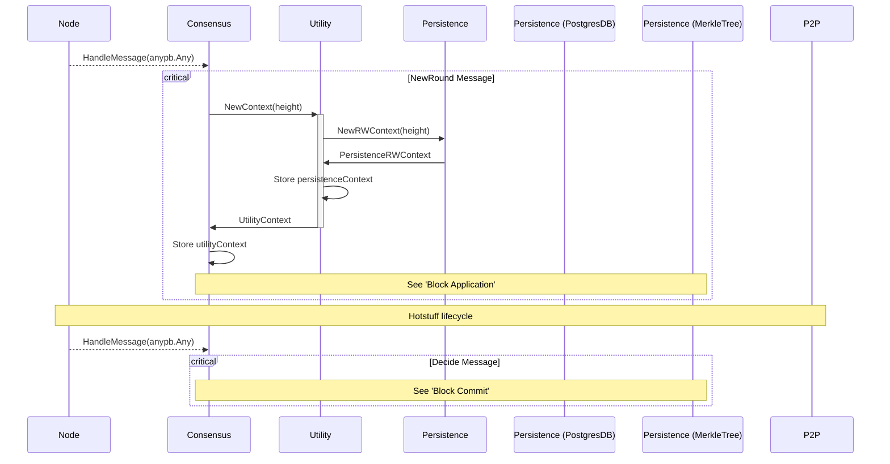
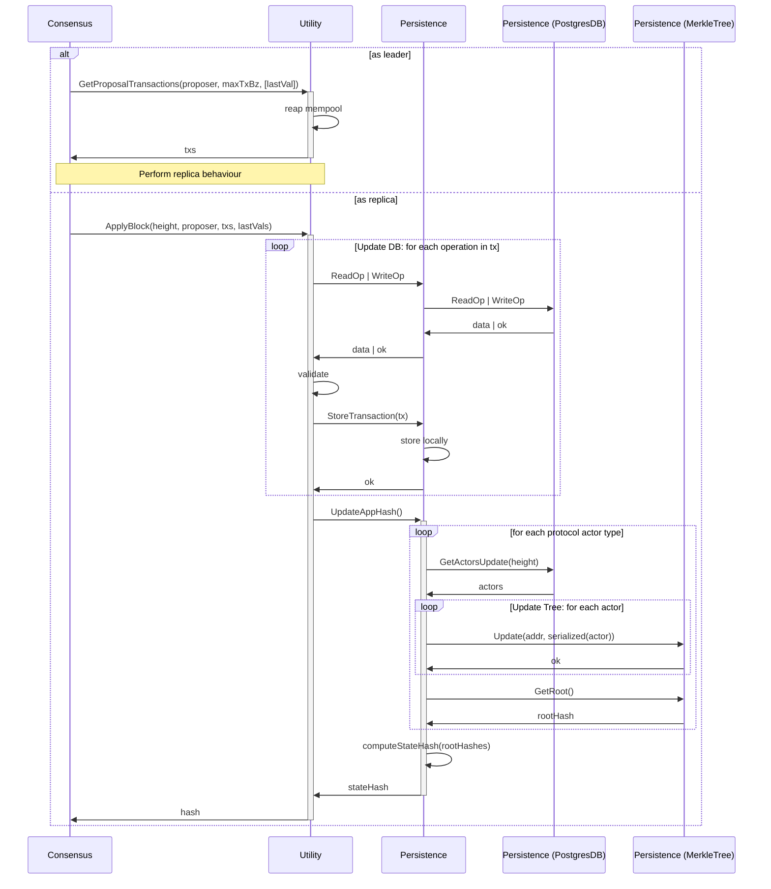
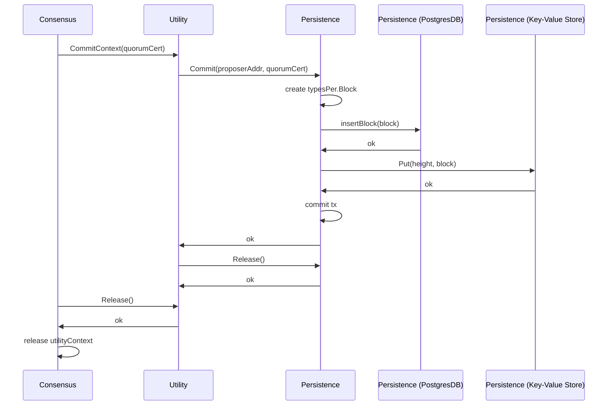

Remaining tasks:

1.  Simplify interfaces in utility & persistence (make it simple and clear)
2.  How do we revert changes to the merkle trees?
3.  Draw an end-to-end diagram of everything and the data flow

## References:

- https://github.com/cosmos/cosmos-sdk/discussions/9158
- https://github.com/cosmos/cosmos-sdk/pull/8012
- https://github.com/cosmos/cosmos-sdk/discussions/8297
- https://github.com/cosmos/cosmos-sdk/discussions/8297
- https://paper.dropbox.com/doc/State-commitments-and-storage-review--BpuF08OSksSkLeErjf66jrOAAg-wKl2RINZWD9I0DUmZIFwQ
- https://arxiv.org/pdf/1803.05069.pdf

## Open questions:

1. Review flows
2. How do we revert changes to the merkle trees?

# This discussion is aimed at:

1. Defining how we should compute the state hash
2. Identify potential changes needed in the current codebase
3. Propose next steps and actionable on implementation

## Goals:

- Define how the state hash will be computed
- Propose the necessary changes in separate tasks
- Implement each of the necessary pieces

## Non-goals:

- Choice/decision of Merkle Tree Design & Implementation
- Selection of a key-value store engine

## Primitives / non-negotiables:

- We will be using Merkle Trees (and Merkle Proofs) for this design (i.e. not vector commitments)
- We will be using a SQL engine for this (i.e. specifically PostgresSQL)
- We will be using Protobufs (not Flatbuffers, json, yaml or other) for the schema

## Necessary technical context:

### DB Engines

Insert table from here: [Merkle Tree Design & Implementation](https://tikv.org/deep-dive/key-value-engine/b-tree-vs-lsm/#summary)

- Most **Key-Value Store DB** Engines use **LSM-trees** -> good for writes
- Most **SQL DB** Engines use **B-Trees** -> good for reads

_Basically all but there can be exceptions_

### Addressable Merkle Trees

State is stored use an Account Based (non UTXO) based Modle

Insert image from: https://www.horizen.io/blockchain-academy/technology/expert/utxo-vs-account-model/#:~:text=The%20UTXO%20model%20is%20a,constructions%2C%20as%20well%20a%20sharding.

---

### Data Flow

## Basics:

1. Get each actor (flag, param, etc...) updated at a certain height (the context's height)
2. Compute the protobuf (the deterministic schema we use as source of truth)
3. Serialize the data struct
4. Update the corresponding merkle tree
5. Compute a state hash from the aggregated roots of all trees as per pokt-network/pocket-network-protocol@main/persistence#562-state-transition-sequence-diagram

## Q&A

Q: Can the SQL Engine be changed?
A: Yes

Q: Can the SQL Engine be removed altogether?
A: Yes, but hard

Q: Can the protobuf schema change?
A: Yes, but out-of-scope

Q: Can protobufs be replaced?
A: Maybe, but out-of-scope

---

Learnings / Ideas:

- Consolidate `UtilActorType` and `persistence.ActorType`
- `modules.Actors` interface vs `types.Actor` in persistenceGenesis

### Context Initialization

### Block Application

### Block Commit

