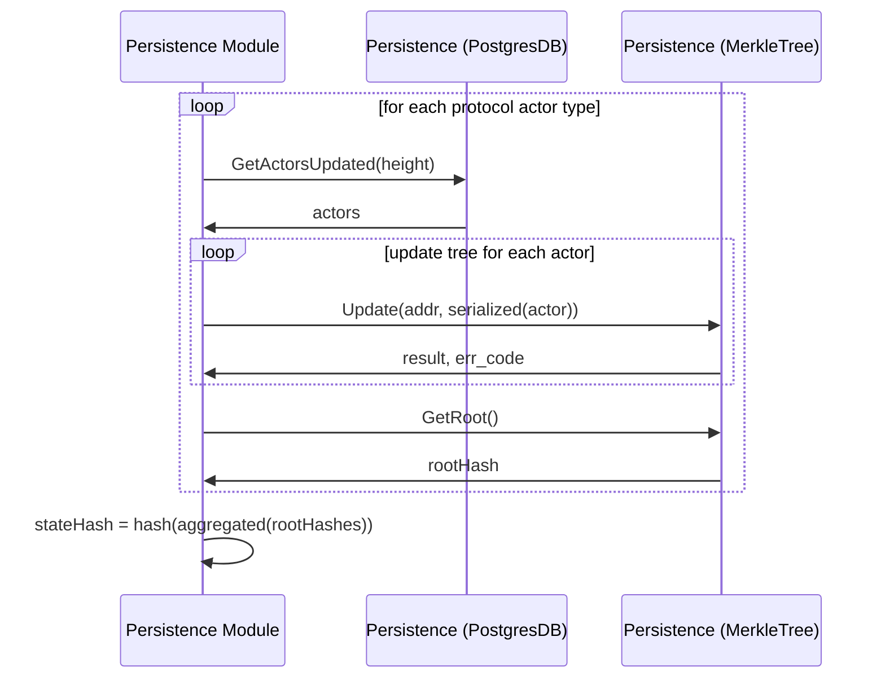
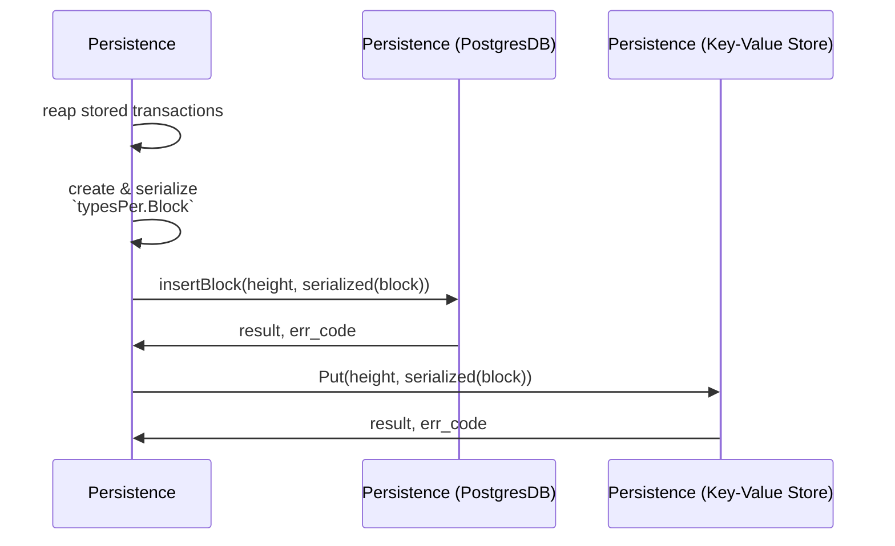

# AppHash <!-- omit in toc -->

## Update State Hash

This flow shows the interaction between the PostgresDB and MerkleTrees to compute the state hash.

## Store Block

This flow shows the interaction between the PostgresDB and Key-Value Store to compute the state hash.

