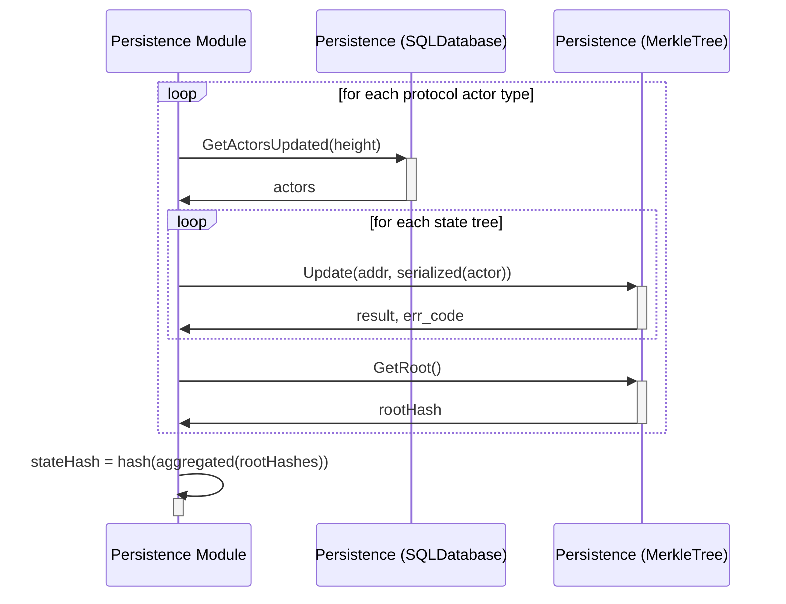
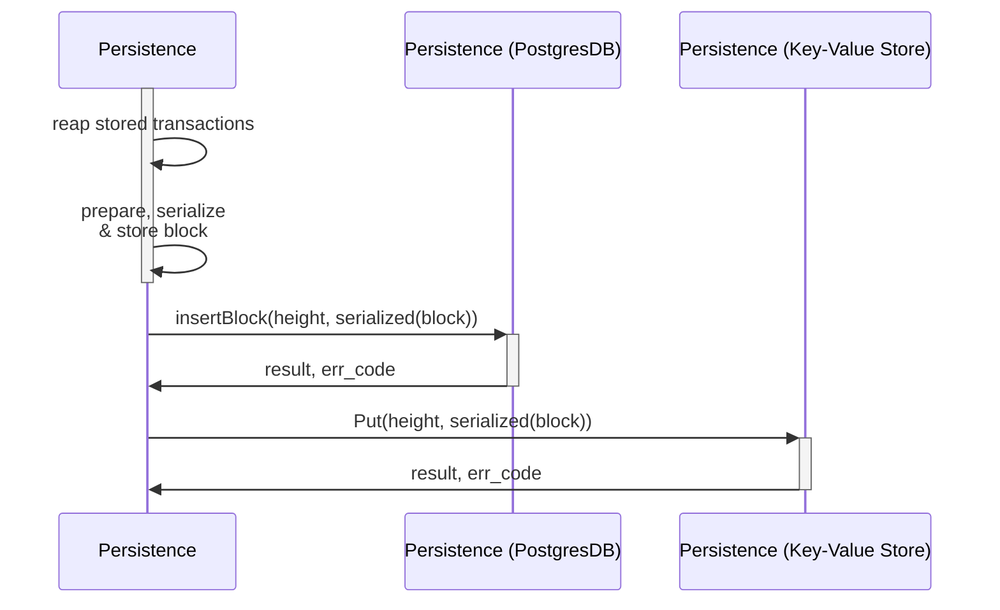

DO_NOT_REVIEW_THIS_YET

# AppHash <!-- omit in toc -->

This document describes the persistence module internal implementation of how the state hash is updated. Specifically, what happens once the `UpdateStateHash` function in [persistence module interface](../../shared/modules/persistence_module.go) is called.

## Update State Hash

This flow shows the interaction between the PostgresDB and MerkleTrees to compute the state hash.

## Store Block

This flow shows the interaction between the PostgresDB and Key-Value Store to compute the state hash.

