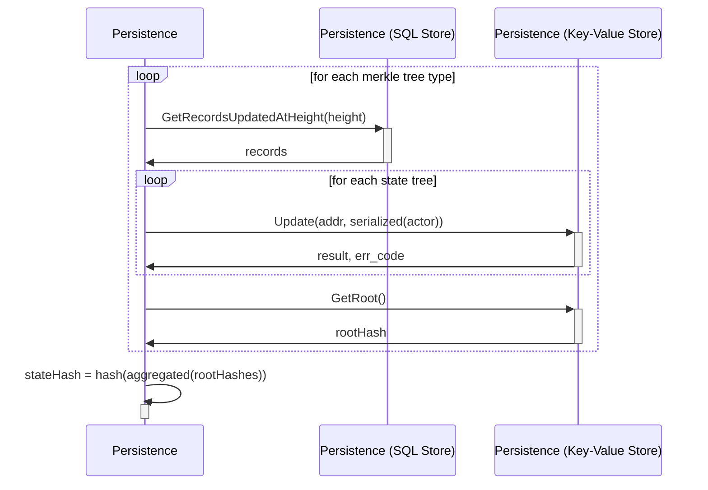
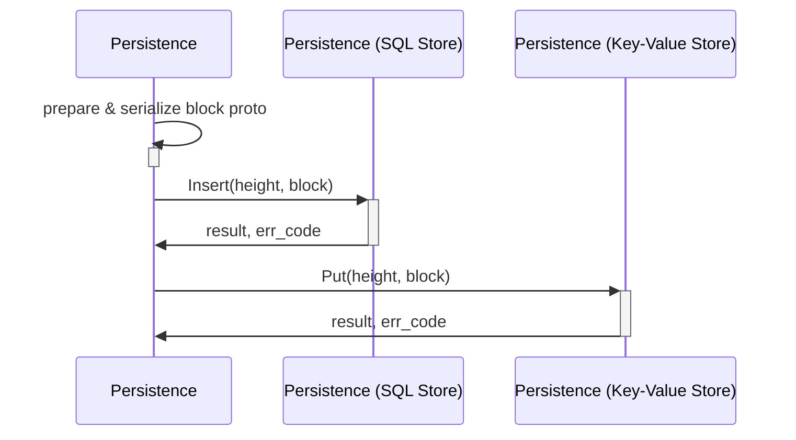

# State Hash <!-- omit in toc -->

This document describes the `Persistence` module's internal implementation of how the state hash is computed. Specifically, it defines the **'Compute State Hash'** flow in the shared architectural state hash flow defined [here](../../shared/docs/PROTOCOL_STATE_HASH.md).

Alternative implementation of the persistence module are free to choose their own **State Storage** engines (SQL, KV stores, etc) or their own **State Commitment** paradigms (Merkle Trees, Vector Commitments, etc), but the output hash **must** remain identical.

- [Introduction](#introduction)
- [Components & Data Types](#components--data-types)
  - [Block Proto](#block-proto)
  - [Trees](#trees)
  - [Transactions Hash (?? TODO_IN_THIS_COMMIT ??)](#transactions-hash--todo_in_this_commit-)
- [Transactions hash](#transactions-hash)
- [Compute State Hash](#compute-state-hash)
- [Store Block (i.e. Commit)](#store-block-ie-commit)

## Introduction

The state hash is a single 256 bit digest that takes a snapshot of the world state at any committed height. It is needed to guarantee to guarantee the integrity, and is what is references when building a _chain_ in any _blockchain_.

This document defines how Pocket V1 takes a snapshot of its world state. An introduction to the requirements, types and uses of hashes in blockchain systems is outside the scope of this document.

## Components & Data Types

| Component | Data Type | Implementation Option Examples | Implementation Selected | Examples | Use Case |

| Block message | Serialization Code | Amino, Protobuf, Thrift | Protobuf | Block protobuf | Serialized and inserted into the Block Store |
| Block Store | Key Value Store | LevelDB, BadgerDB,  | |
| SQL Tables | SQL Database / Engine | MySQL, SQLite, PostgreSQL | Account SQL Table, Tra |
| Merkle Trees | Sparse Merkle Trie backed by Key-Value Store | Celestia's SMT variation of Libra's JMT | Account SMT, Transactions SMT, etc... |
| Tx Indexer | Key Value Store |

### Block Proto

persistence/proto/block_persistence.proto

### Trees

- Sparse Merkle Tree
- KV Store

appMerkleTree
valMerkleTree
fishMerkleTree
serviceNodeMerkleTree

    //

accountMerkleTree
poolMerkleTree

    //

transactionsMerkleTree
paramsMerkleTree
flagsMerkleTree

### Transactions Hash (?? TODO_IN_THIS_COMMIT ??)

## Transactions hash

## Compute State Hash

This flow shows the interaction between the PostgresDB and MerkleTrees to compute the state hash.

_Note: `GetRecordsUpdatedAtHeight` is an abstraction for retrieving all the records from the corresponding SQL tables depending on the type of record (Actors, Transactions, Params, etc...)_

1. Loop over all of the merkle tree types
2. GetRecordsUpdatedAtHeight

## Store Block (i.e. Commit)

When the `Commit(quorumCert)` function is invoke, the current context is committed to disk. The `PersistenceContext` does the following:

1. Read data from its own in memory state
2. Prepare a instance of the `Block` proto & serialize it
3. Insert the `Block` into the `BlockStore`
4. Insert the `Block` into the SQL Store

