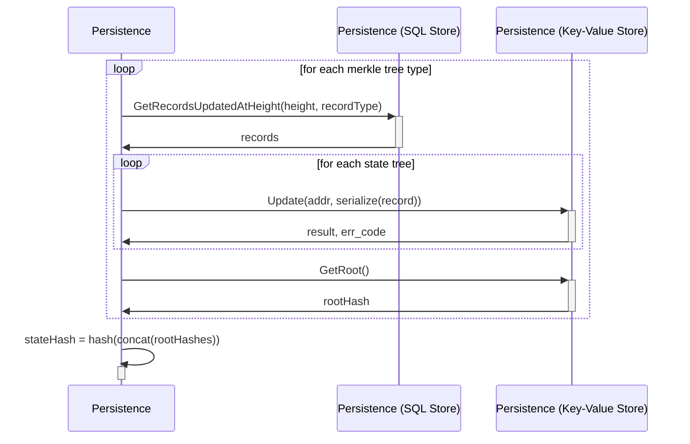
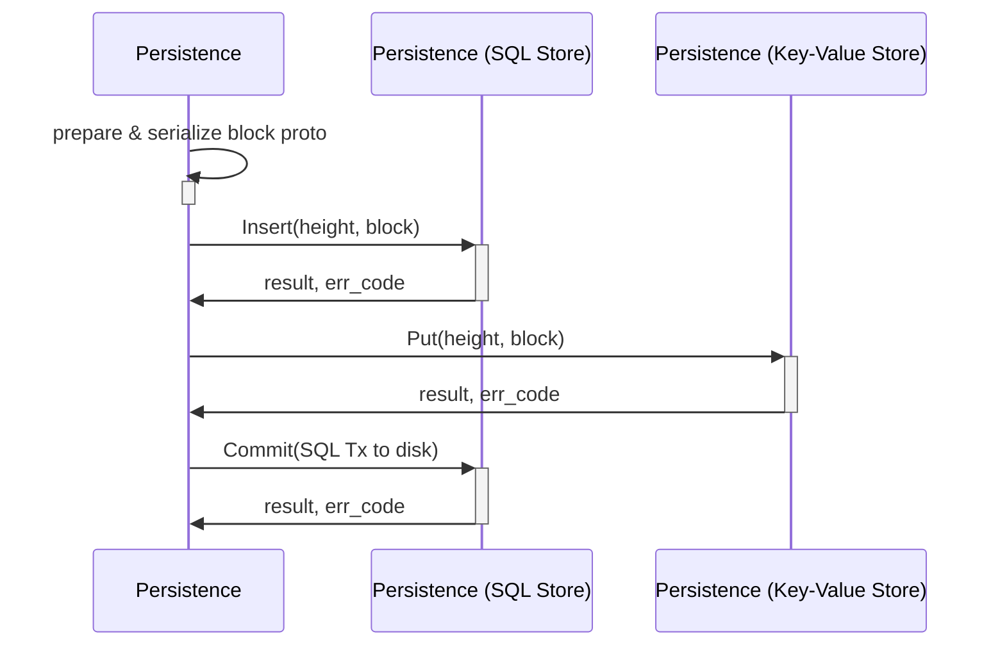

# State Hash <!-- omit in toc -->

This document describes the `Persistence` module's internal implementation of how the state hash is computed. Specifically, it defines the **'Compute State Hash'** flow in the shared architectural state hash flow defined [here](../../shared/docs/PROTOCOL_STATE_HASH.md).

Alternative implementation of the persistence module are free to choose their own **State Storage** engines (SQL, KV stores, etc) or their own **State Commitment** paradigms (Merkle Trees, Vector Commitments, etc), but the output hash **must** remain identical.

- [Introduction](#introduction)
- [Data Types](#data-types)
  - [Infrastructural Components](#infrastructural-components)
  - [Block Proto](#block-proto)
  - [Trees](#trees)
- [Compute State Hash](#compute-state-hash)
- [Store Block (Commit)](#store-block-commit)
- [Failed Commitments](#failed-commitments)

## Introduction

The state hash is a single 256 bit digest that takes a snapshot of the world state at any committed height. It is needed to guarantee and prove the integrity of the world state, and is what's referenced in every block header when building any _blockchain_.

This document defines how Pocket V1 takes a snapshot of its world state. An introduction to the requirements, types and uses of hashes in blockchain systems is outside the scope of this document.

## Data Types

### Infrastructural Components

| Component             | Data Type                             | Implementation Options - Examples                      | Implementation Selected - Current | Example             | Use Case                                                                         |
| --------------------- | ------------------------------------- | ------------------------------------------------------ | --------------------------------- | ------------------- | -------------------------------------------------------------------------------- |
| Data Tables           | SQL Database / Engine                 | MySQL, SQLite, PostgreSQL                              | PostgresSQL                       | Validator SQL Table | Validating & updating information when applying a transaction                    |
| Merkle Trees          | Merkle Trie backed by Key-Value Store | Celestia's SMT, Libra's JMT, Cosmos' IAVL, Verkle Tree | Celestia's SMT                    | Fisherman Trie      | Maintains the state of all account based trees                                   |
| Blocks                | Serialization Codec                   | Amino, Protobuf, Thrift, Avro                          | Protobuf                          | Block protobuf      | Serialized and inserted into the Block Store                                     |
| Objects (e.g. Actors) | Serialization Codec                   | Amino, Protobuf, Thrift, Avro                          | Protobuf                          | Servicer protobuf   | Serialized and inserted into the corresponding Tree                              |
| Block Store           | Key Value Store                       | LevelDB, BadgerDB, RocksDB, BoltDB                     | BadgerDb                          | Block Store         | Maintains a key-value store of the blockchain blocks                             |
| Transaction Indexer   | Key Value Store                       | LevelDB, BadgerDB, RocksDB, BoltDB                     | BadgerDB                          | Tx Indexer          | Indexes transactions in different ways for fast queries, presence checks, etc... |

### Block Proto

The block protobuf that is serialized and store in the block store can be found in `persistence/proto/block_persistence.proto`. This proto contains the `stateHash` along with the corresponding height.

### Trees

An individual Merkle Tree is created for each type of actor, record or data type. Each of these is backed by its own key-value store.

Note that the order in which the trees are defined (found in `persistence/state.go`) is important since it determines how the state hash is computed. _TODO(#361): Consider specifying the oder in a `.proto` `enum` rather than a `.go` `iota`._

**Actor Merkle Trees**:

- Applications
- Validators
- Fisherman
- Servicers

**Account Merkle Trees**:

- Accounts
- Pools

**Data Merkle Trees**

- Transactions
- Parameters
- Flags

## Compute State Hash

_Note: `GetRecordsUpdatedAtHeight` is an abstraction for retrieving all the records from the corresponding SQL tables depending on the type of record (Actors, Transactions, Params, etc...)_

This flow shows the interaction between the `PostgresDB` and `MerkleTrees` listed above to compute the state hash. Assuming the process of applying a proposal block to the current context (i.e. the uncommitted SQL state) is done, the following steps compute the hash of the new world state.

1. Loop over all of the merkle tree types
2. Use `GetRecordsUpdatedAtHeight` to retrieve all the records updated at the context's height
3. Serialize each record using the corresponding underlying protobuf
4. Insert the serialized record into the corresponding tree (which is back by a key-value store)
5. Compute the root hash of each tree
6. Aggregate all the root hashes by concatenating them together
7. Compute the new `stateHash` by taking a hash of the concatenated hash list

_IMPORTANT: The order in which the `rootHashes` are concatenated is based on the definition in which the trees are ordered in within `state.go`._

## Store Block (Commit)

When the `Commit(proposer, quorumCert)` function is invoked, the current context is committed to disk. The `PersistenceContext` does the following:

1. Read data from the persistence context's in-memory state
2. Prepare a instance of the `Block` proto & serialize it
3. Insert the `Block` into the `BlockStore`
4. Insert the `Block` into the SQL Store
5. Commit the context's SQL transaction to disk

_TODO: If an error occurs at any step, all of the operations must be reverted in an atomic manner._

## Failed Commitments

TODO: Failed commitments and the implementation of rollbacks is tracked in #327 and #329.

<!-- GITHUB_WIKI: persistence/state_hash_protocol -->
