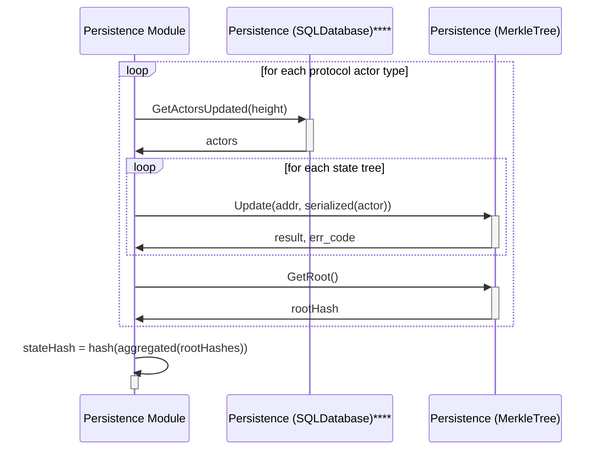

# State Hash <!-- omit in toc -->

This document describes the `Persistence` module's internal implementation of how the state hash is computed. Specifically, it defines the **'Compute State Hash'** flow in the shared architectural state hash flow defined [here](../../shared/docs/PROTOCOL_STATE_HASH.md).

Alternative implementation of the persistence module are free to choose their own **State Storage** engines (SQL, KV stores, etc) or their own **State Commitment** paradigms (Merkle Trees, Vector Commitments, etc), but the output hash **must** remain identical.

- [Introduction](#introduction)
- [Data Types](#data-types)
  - [Block Proto](#block-proto)
  - [Trees](#trees)
  - [Transactions Hash (?? TODO_IN_THIS_COMMIT ??)](#transactions-hash--todo_in_this_commit-)
- [Transactions hash](#transactions-hash)
- [Compute State Hash](#compute-state-hash)
- [Store Block (i.e. Commit)](#store-block-ie-commit)

## Introduction

The state hash is a single 256 bit digest that takes a snapshot of the world state at any committed height. It is needed to guarantee to guarantee the integrity, and is what is references when building a _chain_ in any _blockchain_.

This document defines how Pocket V1 takes a snapshot of its world state. An introduction to the requirements, types and uses of hashes in blockchain systems is outside the scope of this document.

## Data Types

### Block Proto

persistence/proto/block_persistence.proto

### Trees

### Transactions Hash (?? TODO_IN_THIS_COMMIT ??)

## Transactions hash

## Compute State Hash

This flow shows the interaction between the PostgresDB and MerkleTrees to compute the state hash.

## Store Block (i.e. Commit)

When the `Commit(quorumCert)` function is invoke, the current context is committed to disk. The `PersistenceContext` does the following:

1. Read data from its own in memory state
2. Prepare a instance of the `Block` proto & serialize it
3. Insert the `Block` into the `BlockStore`
4. Insert the `Block` into the SQL Store

