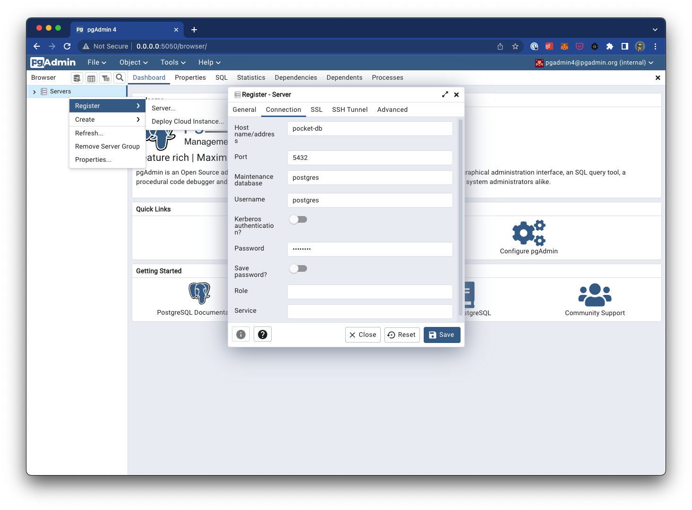
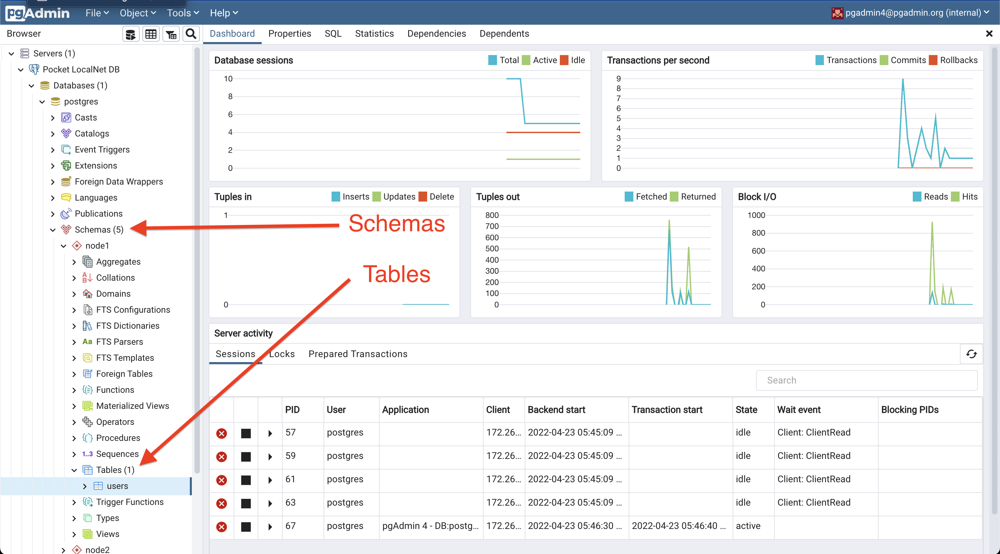

# Persistence Module <!-- omit in toc -->

This document is meant to be a supplement to the living protocol specification at [1.0 Pocket's Persistence Specification](https://github.com/pokt-network/pocket-network-protocol/tree/main/persistence) primarily focused on the design, implementation and testing details.

- [Database Migrations](#database-migrations)
- [Node Configuration](#node-configuration)
- [Debugging \& Development](#debugging--development)
  - [Code Structure](#code-structure)
  - [Makefile Helpers](#makefile-helpers)
    - [Populating the database](#populating-the-database)
    - [CLI Access - db_cli_node](#cli-access---db_cli_node)
    - [Admin View - db_admin](#admin-view---db_admin)
    - [Benchmarking - db_bench](#benchmarking---db_bench)
- [Testing](#testing)
  - [Unit Tests - All](#unit-tests---all)
  - [Unit Tests - State Hash](#unit-tests---state-hash)
  - [Dependencies](#dependencies)
  - [Setup](#setup)
    - [Setup Issue - Docker Daemon is not Running](#setup-issue---docker-daemon-is-not-running)
    - [Setup Issue - Port already allocated](#setup-issue---port-already-allocated)
- [\[OUTDATED\]Implementation FAQ](#outdatedimplementation-faq)
- [\[OUTDATED\] Implementation TODOs](#outdated-implementation-todos)

## Database Migrations

<!-- TODO(#77) -->

## Node Configuration

The config specification can be found at [persistence_config.proto](../../runtime/configs/proto/persistence_config.proto), and an example can be found at [config1.json](../../build/config/config1.json).

Note that the `node_schema` parameter **MUST** be unique for each node pointing to the same Postgres instance. There is currently no check or validation to guarantee this.

```json
  "persistence": {
    // ...
    "node_schema": "node1",
    // ...
  },
```

## Debugging & Development

### Code Structure

<!-- TODO(olshansky): Update and explain the code tree structure -->

```bash
persistence         # Directly contains the persistence module interface for each actor
├── docs
│   ├── CHANGELOG.md    # Persistence module changelog
│   ├── README.md       # Persistence module README
├── account.go
├── application.go
├── block.go
├── context.go      # Postgres context logic
├── debug.go        # For temporary LocalNet
├── db.go           # Helpers to connect and initialize the Postgres database
├── fisherman.go
├── genesis.go      # Populate genesis logic
├── gov.go
├── module.go       # Implementation of the persistence module interface
├── servicer.go
├── shared_sql.go   # Database implementation helpers shared across all protocol actors
└── validator.go
├── docs
├── kvstore         # Key value store for database
├── proto           # Proto3 message files for generated structures
│   ├── account.proto   # account structure
│   ├── actor.proto     # protocol actor structure (e.g. validator, servicer, etc...)
│   ├── config.proto    # configuration structure
│   ├── gov.proto       # params structure
│   ├── state.proto     # genesis state structure
├── types           # Directly contains the SQL schema and SQL query builders used by the files above
│   ├── migrations
│   ├── account.go
│   ├── application.go
│   ├── base_actor.go            # Implementation of the `protocol_actor.go` interface shared across all actors
│   ├── block.go
│   ├── fisherman.go
│   ├── gov.go
│   ├── persistence_genesis.go   # Implements shared genesis interface
│   ├── protocol_actor.go        # Interface definition for the schema shared across all actors
│   ├── servicer.go
│   ├── shared_sql.go            # Query building implementation helpers shared across all protocol actors
│   └── unstaking.go             # Implements shared unstaking interface
│   └── util.go
│   └── validator.go
└── test  # Unit & fuzzing tests
```

### Makefile Helpers

Running `make` from the root of the `pocket` repo will show several targets prefixed with `db_` to help with the design, development & debugging of this module.

A subset of these are explained below.

#### Populating the database

Any targets or helpers to configure and launch the database instances do not populate the actual database.

A LocalNet (see `make compose_and_watch`) must have been executed in order to trigger creation of schemas and hydration of the relevant tables.

#### CLI Access - db_cli_node

Open up a CLI to the postgres database via:

```bash
make db_cli # Connect to the DB before connecting to a specific schema
# OR
psqlSchema=node3 make db_cli_node # Immediately connect to the schema of node3
```

Then you can make use of the following SQL commands and explore:

```sql
SELECT schema_name FROM information_schema.schemata; // View all of the schemas available
SET search_path=node1; // Set the search path to a schema `node1`
/dt // View all available tables
```

#### Admin View - db_admin

<!--
# IMPROVE: Bind the login credentials to the postgres container so its automatically logged in and debug why the docker-compose configurations do not automatically prepare the server
-->

Running `make db_admin` should echo the following to your terminal:

```bash
echo "Open http://0.0.0.0:5050 and login with 'pgadmin4@pgadmin.org' and 'pgadmin4'.\n The password is 'postgres'"
```

If the `pgadmin` configs in our [docker-compose file](../../build/deployments/docker-compose.yaml) do not automatically bind, you might need to configure the server yourself as seen in the image below (you will also need to set a name in the `General` tab):



The following screenshot shows where the tables for each schema can be found:



#### Benchmarking - db_bench

TODO: Build on top of `make db_bench` to enable a proper suite for benchmarking the node

## Testing

### Unit Tests - All

Unit tests can be executed with:

```bash
make test_persistence
```

### Unit Tests - State Hash

Unit tests can be executed with:

```bash
make test_persistence_state_hash
```

### Dependencies

We use [dockertest](https://github.com/ory/dockertest) to configure a local Postgres Docker Daemon during unit testing.

### Setup

Make sure you have a Docker daemon running. See the [Development Guide](docs/development/README.md) for more references and links.

#### Setup Issue - Docker Daemon is not Running

```bash
not start resource: : dial unix /var/run/docker.sock: connect: no such file or directory
```

Double check your Docker Daemon is running. For example, on macOS, you can run:

```bash
open /Applications/Docker.app
```

#### Setup Issue - Port already allocated

```bash
Bind for 0.0.0.0:5432 failed: port is already allocated
```

Double check you don't already have a Postgres docker container running on your host machine. For example, on macOS, you can run:

```bash
lsof -i:5432
```

And kill the relevant process if one exists.

## [OUTDATED]Implementation FAQ

_NOTE: This section has not been reviewed/updated in a while and will nee to be re-reviewed by someone on the core team._

**Q**: Why do `Get` methods (e.g. `GetAccountAmount`) not return 0 by default?
**A**: This was done intentionally to differentiate between accounts with a history and without a history. Since accounts are just a proxy into a public key, they all "exist by default" in some senses.

**Q**: Why are amounts strings?
**A**: A lesson from Tendermint in order to enforce the use of BigInts throughout and avoid floating point issues when storing data on disk.

**Q**: Why not use an ORM?
**A**: We are trying to keep the module small and lean initially but are ope

**Q**: What is a `Param` in the `Gov` schema?
**A**: It represents a value associated with a name and a height that we can reference to represent governance settings. These settings have the power of altering the behaviour of various aspects of the network.

**Q**: What is a `Flag` in the `Gov` schema?
**A**: A flag is very much alike a `Param` with the difference that it also has a boolean flag to specify if that setting is enabled or not at any point in time (height). We are discussing if we should replace the boolean flag and allow multivariate feature flags.

## [OUTDATED] Implementation TODOs

_NOTE: This section has not been reviewed/updated in a while and will nee to be re-reviewed by someone on the core team._

These are major TODOs spanning the entire repo so they are documented in one place instead.

Short-term (i.e. simpler starter) tasks:

- [ ] DOCUMENT: Need to do a better job at documenting the process of paused apps being turned into unstaking apps.
- [ ] CLEANUP: Remove unused parameters from `the PostgresContext` interface (i.e. see where \_ is used in the implementation such as in `InsertFisherman`)
- [ ] IMPROVE: Consider converting all address params from bytes to string to avoid unnecessary encoding
- [ ] CLEANUP(#76): Review all the `gov_*.go` related files and simplify the code
- [ ] REFACTOR/DISCUSS: Should we prefix the functions in the `PersistenceModule` with the Param / Actor it's impacting to make autocomplete in implementation better?
- [ ] DISCUSS: Consider removing all `Set` methods (e.g. `SetAccountAmount`) and replace with `Add` (e.g. `AddAccountAmount`) by having it leverage a "default zero".
- [ ] REFACTOR(https://github.com/pokt-network/pocket/issues/102): Split `account` and `pool` into a shared actor (e.g. like fisherman/validator/servicer/application) and simplify the code in half
- [ ] CLEANUP: Remove `tokens` or `stakedTokens` in favor of using `amount` everywhere since the denomination is not clear. As a follow up. Consider a massive rename to make the denomination explicit.

Mid-term (i.e. new feature or major refactor) tasks:

- [ ] IMPROVE: Consider using prepare statements and/or a proper query builder
- [ ] TODO(https://github.com/pokt-network/pocket/issues/77): Implement proper DB SQL migrations
- [ ] INVESTIGATE: Benchmark the queries (especially the ones that need to do sorting)
- [ ] DISCUSS: Look into `address` is being computed (string <-> hex) and determine if we could/should avoid it

Long-term (i.e. design) tasks

- [ ] INVESTIGATE: Expand the existing fuzzing approach to push random changes in state transitions to its limit.
- [ ] INVESTIGATE: Use a DSL-like approach to design complex "user stories" for state transitions between protocol actors in different situations.

<!-- GITHUB_WIKI: persistence/readme -->
