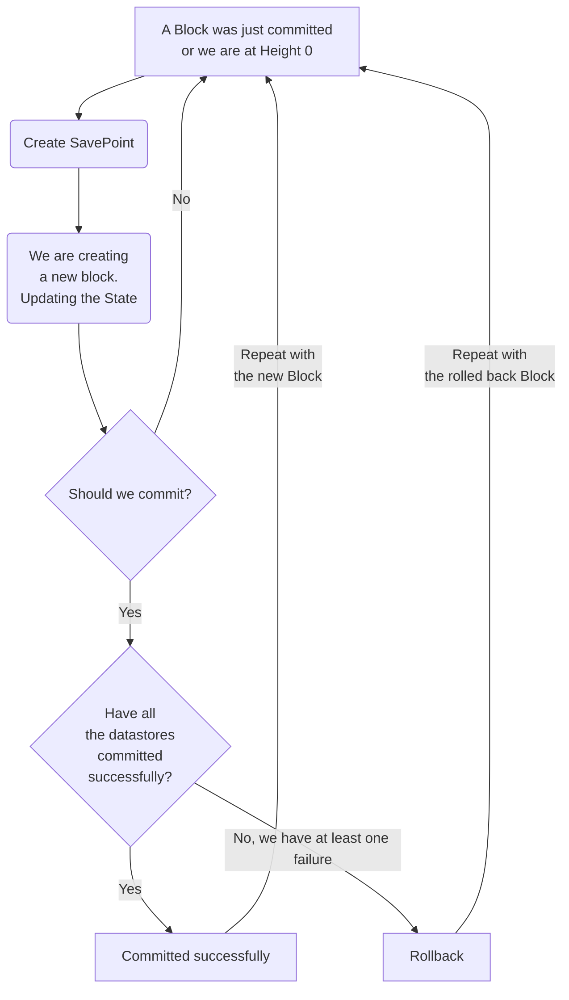

# Savepoints and Rollbacks Design <!-- omit in toc -->

This document is a design guideline that will be used as a technical reference for the implementation of the `Savepoints` and `Rollbacks`.

The entry points will be in the `Persistence` module but there are going to be points of integration with `Utility` as well.

- [Background](#background)
  - [Data Consistency (the "C" in CAP Theorem)](#data-consistency-the-c-in-cap-theorem)
- [Definitions](#definitions)
  - [Savepoints](#savepoints)
  - [Snapshots](#snapshots)
  - [Rollbacks](#rollbacks)
  - [Minimum Viable Product](#minimum-viable-product)
  - [Long-term (🚀 🌔) ideas](#long-term---ideas)
    - [Savepoints](#savepoints-1)
    - [Rollbacks](#rollbacks-1)
  - [Further improvements](#further-improvements)
- [Random thoughts](#random-thoughts)

## Background

At the time of writing, it seems that we identified the points within the codebase in which we should take some action to support savepoints and rollbacks.
This means that we probably know the **WHEN**s and **WHERE**s, the scope of this document is to identify the **WHAT**s and **HOW**s.

It might sound simple, but the ability to recover from a failure that would prevent the node from committing a block deterministically is a critical feature, and it's a non-trivial problem to solve.

As it stands we use multiple data stores (please refer to [PROTOCOL_STATE_HASH.md](../PROTOCOL_STATE_HASH.md) for additional information about their designs):

| Component             | Data Type                             | Underlying Storage Engine         |
| --------------------- | ------------------------------------- | --------------------------------- |
| Data Tables           | SQL Database / Engine                 | PostgresSQL                       |
| Transaction Indexer   | Key Value Store                       | BadgerDB                          |
| Block Store           | Key Value Store                       | BadgerDB                          |
| Merkle Trees          | Merkle Trie backed by Key-Value Store | BadgerDB                          |

Something worth mentioning specifically about `Merkle Trees` is the fact that we store a separate tree for each `Actor` type (i.e. `App`, `Validator`, `Fisherman`, etc.), for `Accounts` & `Pools` and for the data types such as `Transactions`, `Params` and `Flags`.

This means that each tree is a separate data store.

### Data Consistency (the "C" in CAP Theorem)

We cannot make the assumption, especially in this day and age, but in the simplest case, we could very much have a monolithic setup where the node is running on the same machine as the `PostgresSQL` database and the `BadgerDB` key-value stores, but that would not change the fact that we are dealing with a distributed system since each one of these components is a separate process that could fail independently.

Imagine a scenario in which the state is persisted durably (what happens after an sql `COMMIT` statement) to the `PostgresSQL` database but one/some of the `BadgerDB` key-value stores fails due to storage issues. What would happen next? That's **non-deterministic**.

Even a single node is a small distributed system because it has multiple separate components that are communicating with each other (on the same machine or via unreliable networks).

Since a node is part of a distributed network of nodes that are all trying to reach consensus on the "World State", we have to make sure that the data that we are storing is consistent internally in the first place.

In the event of a failure at any level during this process, we cannot commit state non-atomically. That would make the node inconsistent and put it in a non-deterministic state that is not recoverable unless we have a way to rollback to a previous, clean, state with all the implications that this would have on the network. (social coordination comes to mind)

We either **succeed** across **all** data stores or we **fail** and we have to be able to **recover** from that failure like if **nothing has happened**.

The following diagram illustrates the high-level flow:

## Definitions

### Savepoints

A savepoint is either the beginning of a database transaction (or distributed transaction) created right after a successful commit happened that allows recreating a perfect copy of the state at the time it was created.

### Snapshots

A snapshot is an artifact that encapsulates a savepoint. In V0 terms, it would be a shareable copy of the data directory. In V1 terms it's going to be a compressed archive that once decompressed and loaded into the node, it allows us to recover the state of the node at the height at which the snapshot was created.

### Rollbacks

A rollback is the process of cleanly reverting the state of the node to a previous state that we have saved in a savepoint.

### Minimum Viable Product

After having examined the `Persistence` and `Utility` modules, I have identified the following areas that we can consider as part of the MVP, these could be used as individual Github issues/deliverables potentially:

- [**State changes invalidation and rollback triggering**] We need some sort of shared and thread-safe reference that is available for us across the whole call-stack that we can use in the event of a failure to flag that we need to abort whatever we are doing and rollback. This could be achieved via the use of the [context](https://pkg.go.dev/context) package.

- [**Ensure atomicity across data stores**] We need to make sure that we are using transactions correctly and that we are not accidentally committing state ahead of time in any of the data-stores.

- [**Distributed commits across data-stores**] We need to implement a 2PC (two-phase commit) or 3PC (three-phase commit) protocol that should make sure that the state has been committed safely on **all** data stores before it is considered `valid`.

- [**Savepoints**] The simplest version could be the database transaction that can simply be discarded, basically the uncommitted transaction sits in memory until it's flushed to storage and rolling back to a savepoint would be as simple as discarding the non-pristine version of the state in memory.

- [**Rollbacks**] Rolling back to a savepoint would mean not only that the state has been restored to the previous savepoint but also that the node has to go back into a state that allows it to proceed with its normal operation (i.e. all the modules should behave as if nothing has happened)

- [**Extensive testing**] We need to make sure that we have a good test coverage for all the above scenarios and that we can simulate failures in a controlled environment.

- [**Tooling**] The CLI should provide ways to create savepoints and rollbacks. i.e.: `p1 persistence rollback --num_blocks=5`

### Long-term (🚀 🌔) ideas

Apart from internal failures that should resolve themselves automatically whenever possible, nodes might require a way to save their state and restore it later, not necessarily at the previous block height. This could be useful for a number of reasons:

- To allow nodes to recover from an unforeseen crash (bugs)
- To facilitate socially coordinated rollbacks of the chain to a specific block height in the case of a consensus failure/chain-halt
- To improve operator experience when managing and upgrading their fleet of nodes
- Governance transactions that enable rolling back state subsets
- And more...

Performing operations like: copying datadirs, compressing them, etc. is probably not the best approach.
Having a first-class support for savepoints and rollbacks would be, IMHO, a much better solution.

A more advanced/flexible version of **Savepoints** could be to efficiently serialize the state into an artifact (**Snapshot**) (non-trivial also because we have multiple data-stores but definitely possible), maybe leveraging previous savepoints to only store the changes that have been made since the last one and/or using some version of a WAL (Write-Ahead log that records the changes that happened).

**Snapshot** hash verification using the `genesis.json` file and [Mina protocol](https://minaprotocol.com/lightweight-blockchain)

#### Savepoints

A savepoint must have the following properties:

- It must be able to be created at any block height
- It must be self-contained and/or easy to move around (e.g. a file/archive)
- The action of creating a savepoint must be atomic (i.e. it must be impossible to create a savepoint that is incomplete)
- The action of creating a savepoint must be easy to perform (e.g. a CLI command and/or a flag being passed to the node binary when starting it)
- The action of creating a savepoint must be as fast as possible
- The operator should be informed with meaningful messages about the progress of the savepoint creation process (telemetry, logging and stdout come to mind)
- It should be, as much as possible, compact (i.e. zipped) to reduce the size and cost of disseminating snapshots
- A reduction in the snapshot size should be prioritized over its compression speed since it is an infrequent event
- It must have some form of integrity check mechanism (e.g. checksum/hash verification and even a signature that could be very useful in the case of a social rollback)

#### Rollbacks

The following are some of the properties that a rollback mechanism must have:

- If the operator requested a rollback, regardless of the internal state of the node, it must be able to rollback to the requested block height, provided a valid savepoint
- The rollback process must be atomic (i.e. it must be impossible to rollback to a block height has incomplete/invalid state)
- The rollback process must be easy to perform (e.g. a CLI command and/or a flag being passed to the node binary when starting it)
- The rollback process must be as fast as possible
- The operator should be informed in a meaningful way about the progress of the rollback process (telemetry, logging and stdout come to mind)

### Further improvements

- Savepoints could be disseminated/retrieved using other networks like Tor/IPFS/etc., this would free-up bandwidth on the main network and could be used in conjunction with `FastSync` to speed up the process of bootstrapping a new node without overwhelming the `P2P` network with a lot of traffic that is not `Protocol`-related. This could be very important when the network reaches critical mass in terms of scale. Hopefully soon.

  For example: a fresh node could be looking for the latest `Savepoint` signed by PNI available, download it from Tor, apply its state and resume the normal sync process from the other nodes from there.

- Building on top of the latter, when it comes to socially-coordinated rollbacks, the DAO/PNI could designate a `Savepoint` as the one that node-operators should use to rollback to by advertising it somewhere (this could be done in several ways, using alternative decentralized networks/protocols is preferable for increased resiliency: IPFS, Ethereum smart-contract interaction, etc.). This would allow node-operators to be notified, even programmatically, without having to rely on `Discord` (which is not decentralized anyway...) or other ways of coordination in order to "get the news" about the latest `Savepoint` that they should use to rollback to.

## Random thoughts

- I wonder if serialized, compressed and signed `Merkle Patricia Trie`s could be leveraged as a media for storing `Savepoint`s in a space-efficient and "blockchain-native" way 🤔.

