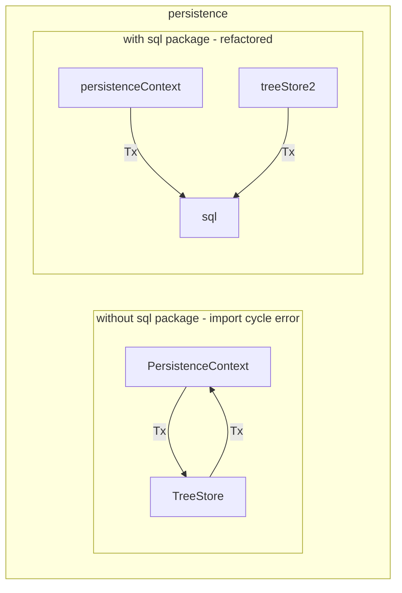

# SQL Package

The SQL package is a library of functions that all take a `pgx.Tx` as an argument and execute SQL queries on it.

- GetAccountsUpdated
- GetActors
- GetTransactions
- GetPools
- GetAccounts
- GetFlags
- GetParams

These functions are meant to abstract away the SQL row and error handling for components of the persistence package.

GetActors is used to get each of the actor types in the system: Applications, Validators, Watchers, and Servicers.

## Why a whole package?

If the SQL handling lives in the persistence package, the package submodules will run into import cycle errors when attempting to use the SQL handlers. Putting the SQL helpers into a package inside persistence avoids the import cycle.

