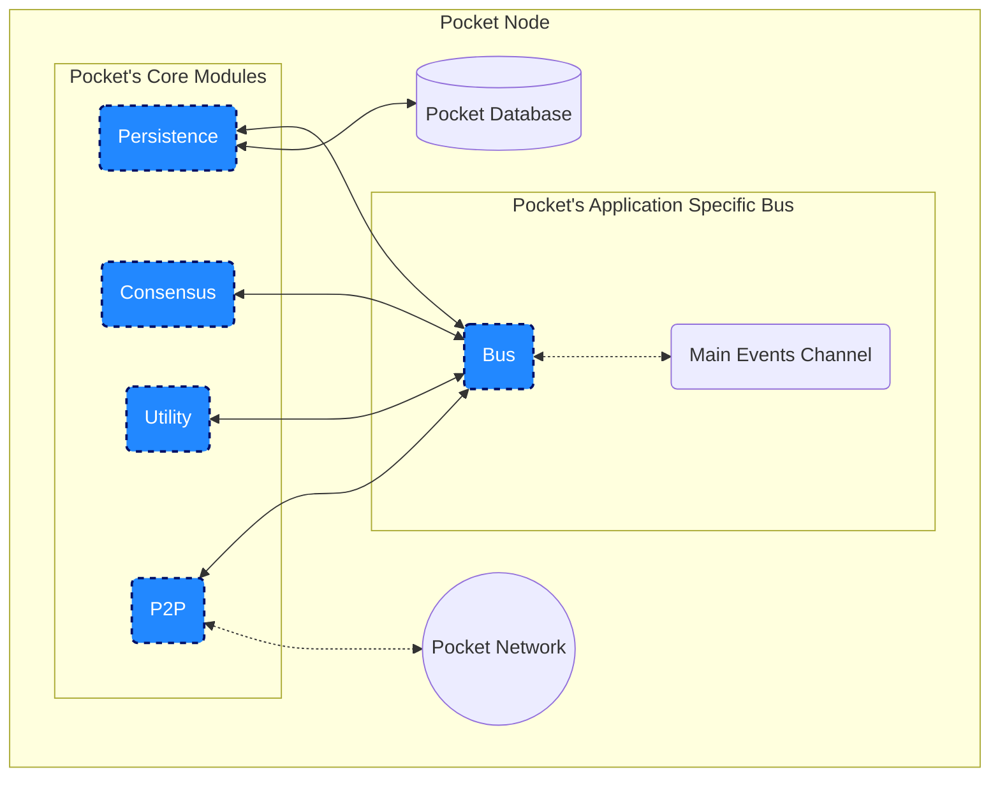

# Shared Module

- [Shared Module](#shared-module)
  - [Where Do I start?](#where-do-i-start)
  - [Code Structure](#code-structure)
  - [High Level Architecture](#high-level-architecture)
  - [Types](#types)
  - [Interfaces](#interfaces)

## Where Do I start?

1. Look at the high level architecture diagram below
2. Inspect `node.go` which is the main entrypoint to the node
3. Familiarize yourself with `modules/module.go` and all the other interfaces under module.
4. Ask a member of the team to walk you through `types`
5. Dive deep into the module of your choise

## Code Structure

```bash
shared             # [to-be-refactored] All of this is bound to change
├── config         # Utilities to load and verify Node configurations
├── crypto         # Shared crypto utilities specific to Pocket
├── modules        # Interfaces to the core Pocket modules
|   ├── module.go
|   ├── bus_module.go
|   ├── consensus_module.go
|   ├── p2p_module.go
|   ├── utility_module.go
|   ├── persistence_module.go
|   ├── telemetry_module.go
├── telemetry      # Cross-module telemetry
├── tests          # Cross-module and shared-utility tests
├── types          # Types (structs & protos) shared across modules
|   ├──            # Please reach out to the team if you need a walk-through for these
├── utils          # Various helper utilities used across the repo
├── node.go        # The main entrypoint to the Pocket Node
├── bus.go         # Implementation of the Bus module
```

## High Level Architecture

The key things to keep in mind are:

- Every **module** has a 2 way pointer with the **Bus**, through which it can:
  - Call methods defined by the interfaces of other modules
  - Receive asynchronous events from the **main events channel**
- The **Persistence** module is the only module that communicates with the local database
- The **P2P** module is the only one that communicates with the outside world

<!-- Though this flowchart could be made more explicit, it was implemented in mermaid to follow the Visualisation-As-Code paradigm and make it easier to maintain and upkeep. -->



## Types

Intentionally left blank for now. Reach out to the team if you have questions.

## Interfaces

Intentionally left blank for now. Reach out to the team if you have questions.
