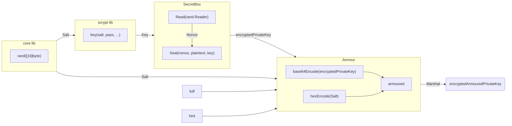
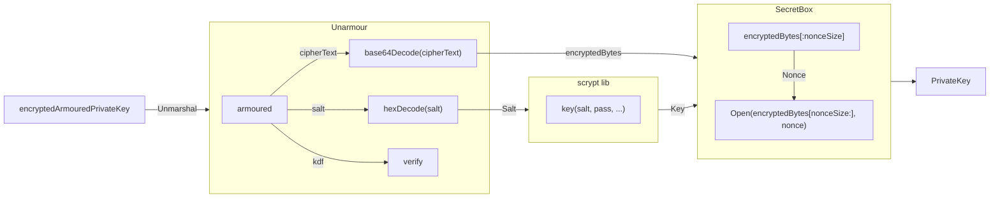
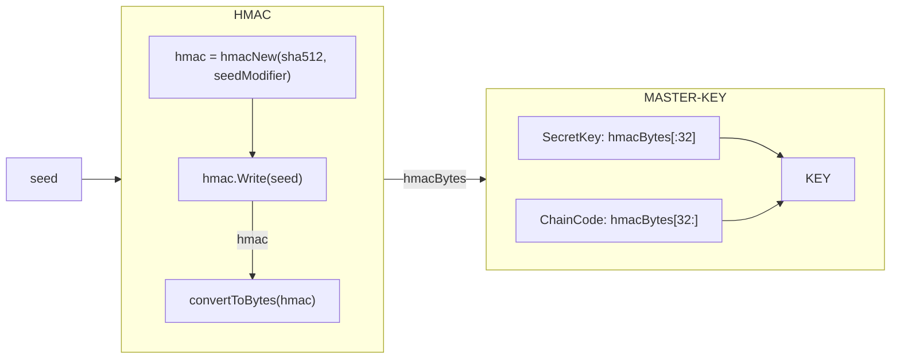
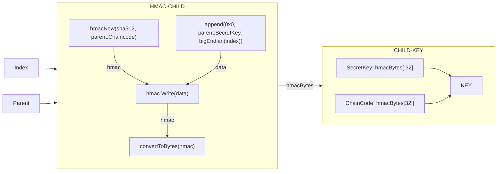

# Pocket Crypto <!-- omit in toc -->

- [KeyPair Interface](#keypair-interface)
  - [KeyPair Code Structure](#keypair-code-structure)
- [Encryption and Armouring](#encryption-and-armouring)
- [SLIP-0010 HD Child Key Generation](#slip-0010-hd-child-key-generation)

_DOCUMENT: Note that this README is a WIP and does not exhaustively document all the current types in this package_

## KeyPair Interface

The [KeyPair interface](./keypair.go) exposes methods related to operating on `PublicKey` types and `PrivKeyArmour` strings, such as:

- Retrieve the PublicKey or armoured PrivateKey JSON string
- Get PublicKey address `[]byte` or hex `string`
- Unarmour the PrivateKey JSON string
- Export the PrivateKey hex string or JSON as an armoured string
- Marshal or unmarshal the KeyPair to/from a `[]byte`

The [KeyPair](./keypair.go) interface is implemented by the `encKeyPair` struct which stores:

1. `PublicKey` of the KeyPair
2. `PrivateKey` armoured JSON string

The PrivateKey armoured JSON string is created after the [encryption step](#encryption-and-armouring) has encrypted the PrivateKey and marshalled it into a JSON string.

### KeyPair Code Structure

The KeyPair code is separated into two files: [keypair.go](./keypair.go) and [armour.go](./armour.go)

```bash
shared
└── crypto
    ├── armour.go
    └── keypair.go
```

## Encryption and Armouring

The passphrase provided or `""` (default) is used for encrypting and armouring new or imported keys.

Keys are encrypted using the `secretbox` library based on the NaCl (libsodium) primitives. Secretbox uses the `XSalsa20` stream cipher and `Poly1305` message authentication suite to encrypt and authenticate the key.

The following flowchart shows this process:



The process above is reversed when unarmouring and decrypting a key in the keybase:



## SLIP-0010 HD Child Key Generation

[SLIP-0010](https://github.com/satoshilabs/slips/blob/master/slip-0010.md) key generation from a master key or seed is supported through the file [slip.go](./slip.go)

The keys are generated using the BIP-44 path `m/44'/635'/%d'` where `%d` is the index of the child key - this allows for the deterministic generation of up to `2147483647` hardened ed25519 child keys per master key.
Master key derivation is done as follows:



Child keys are derived from their parents as follows:



<!-- GITHUB_WIKI: shared/crypto/readme -->
