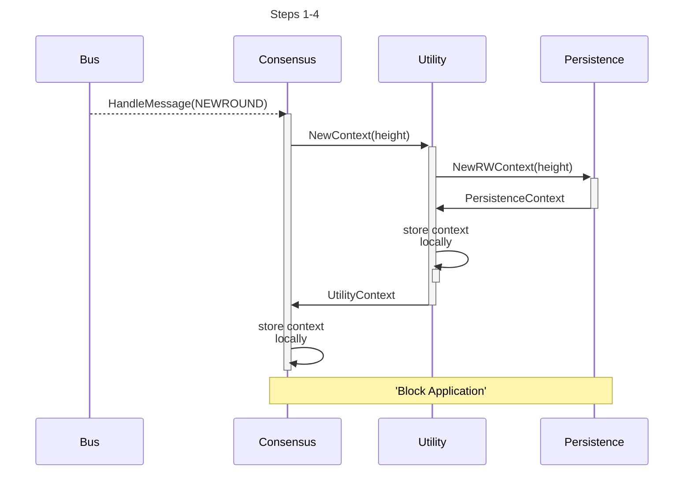
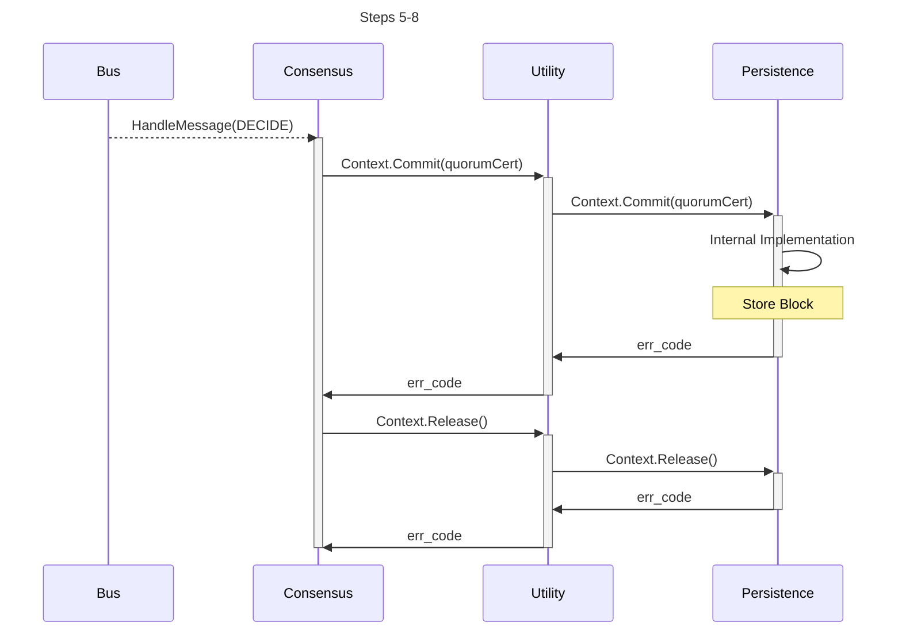
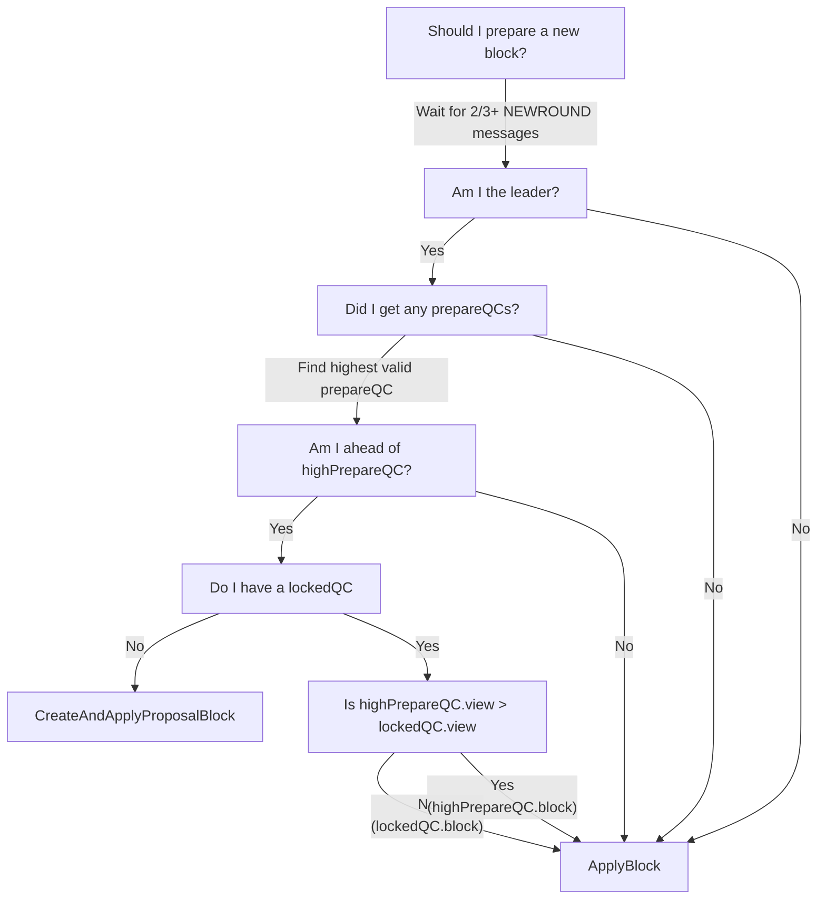
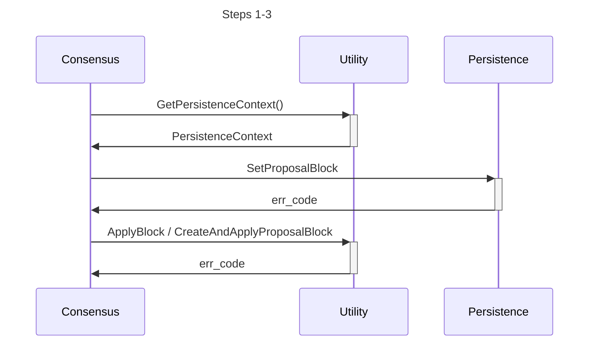
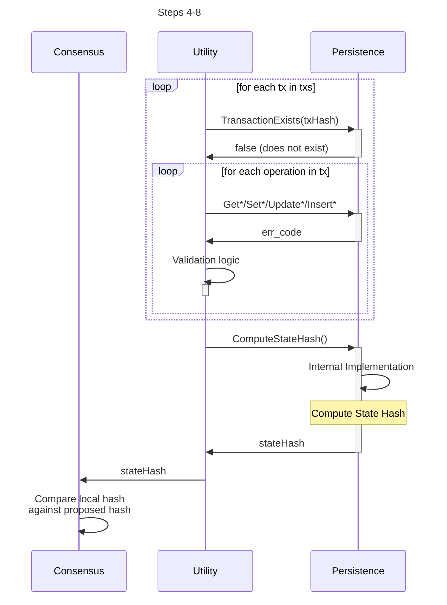

# State Hash <!-- omit in toc -->

This document describes the cross-module communication using the interfaces in [../shared/modules](../shared/modules) to compute a new state hash. See module specific documentation & implementation details inside each module respectively.

- [Context Management](#context-management)
- [Block Application](#block-application)

_NOTE: The diagrams below use some [Hotstuff specific](https://arxiv.org/abs/1803.05069) terminology as described in the [HotPOKT Consensus Specification](https://github.com/pokt-network/pocket-network-protocol/tree/main/consensus) but can be adapted to other BFT protocols as well._

<!-- See if there's an answer in this question to add links to notes: https://stackoverflow.com/questions/74103729/adding-hyperlinks-to-notes-in-mermaid-sequence-diagrams -->

## Context Management

The `Utility` and `Persistence` modules maintain a context (i.e. an ephemeral states) driven by the `Consensus` module that can be `released & reverted` (i.e. the block is invalid / no Validator Consensus reached) or can be `committed & persisted` to disk (i.e. the block is finalized).

On every round of every height:

1. The `Consensus` module handles a `NEWROUND` message
2. A new `UtilityContext` is initialized at the current height
3. A new `PersistenceRWContext` is initialized at the current height
4. The [Block Application](#block-application) flow commences

---

_The **Proposer** drives the **Validators** to agreement via the **Consensus Lifecycle** (i.e. HotPOKT)_

---

5. The `Consensus` module handles the `DECIDE` message
6. The `commitQC` is propagated to the `UtilityContext` & `PersistenceContext` on `Commit`
7. The persistence module's internal implementation for ['Store Block'](../../persistence/docs/PROTOCOL_STORE_BLOCK.md) must execute.
8. Both the `UtilityContext` and `PersistenceContext` are released

## Block Application

When applying the block during the `NEWROUND` message shown above, the majority of the flow is similar between the _leader_ and the _replica_ with one of the major differences being a call to the `Utility` module as seen below.

- `ApplyBlock` - Uses the existing set of transactions to validate & propose
- `CreateAndApplyProposalBlock` - Reaps the mempool for a new set of transaction to validate and propose

As either the _leader_ or _replica_, the following steps are followed to apply the proposal transactions in the block.

1.  Retrieve the `PersistenceContext` from the `UtilityContext`
2.  Update the `PersistenceContext` with the proposed block
3.  Call either `ApplyBlock` or `CreateAndApplyProposalBlock` based on the flow above

4. Loop over all transactions proposed
5. Check if the transaction has already been applied to the local state
6. Perform the CRUD operation(s) corresponding to each transaction
7. The persistence module's internal implementation for ['Compute State Hash'](../../persistence/docs/PROTOCOL_STATE_HASH.md) must be triggered
8. Validate that the local state hash computed is the same as that proposed

