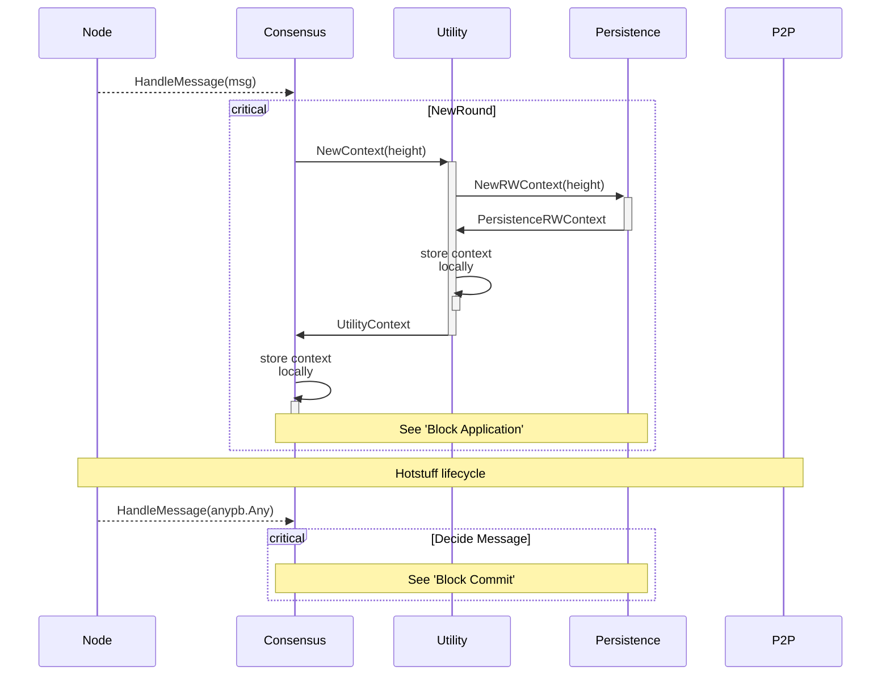
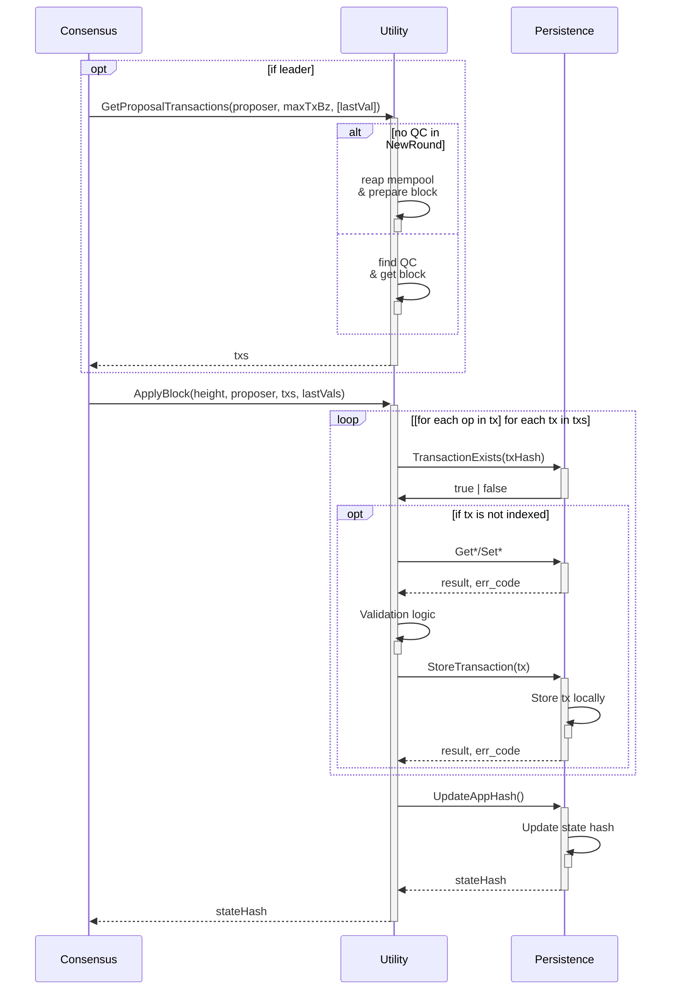
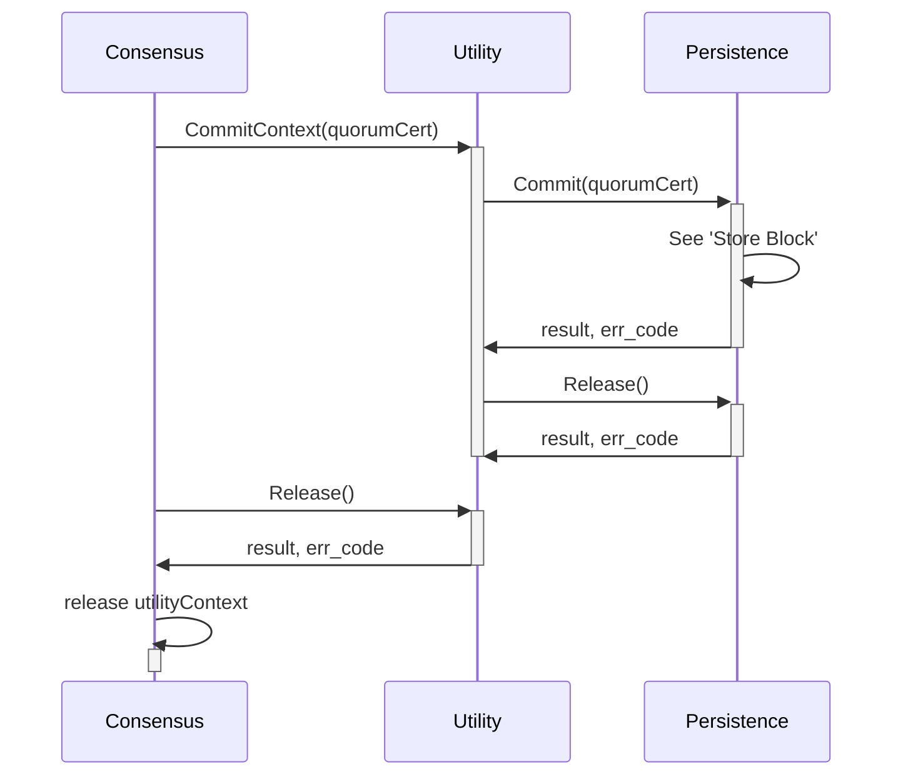

# State Hash <!-- omit in toc -->

- [1.Context Management](#1context-management)
- [Block Application](#block-application)
- [Block Commit](#block-commit)

<!-- See if there's an answer in this question to add links to notes: https://stackoverflow.com/questions/74103729/adding-hyperlinks-to-notes-in-mermaid-sequence-diagrams -->

Describes of the cross-module communication using the interfaces in [shared/modules](../shared/modules) to compute a new state hash.

See module specific documentation & implementation details inside each module respecively.their respective modules.

_NOTE: The diagrams below use some [Hotstuff specific](https://arxiv.org/abs/1803.05069) terminology as described in the [HotPOKT Consensus Specification](https://github.com/pokt-network/pocket-network-protocol/tree/main/consensus) but can be adapted to other BFT protocols as well._

NOTE:

## 1.Context Management

The `Utility` and `Persistence` modules maintain **ephemeral states** driven by the `Consensus` module that can be released & reverted as a result of various (e.g. lack of Validator consensus) before the state is committed and persisted to disk (i.e. the block is finalized).

The `Hotstuff lifecycle` part refers to the so-called `PreCommit` and `Commit` phases of the protocol.

## Block Application

This flow shows how the `leader` and the `replica`s behave in order to apply a `block` and return a `stateHash`.

The [V1 Persistence Specification](https://github.com/pokt-network/pocket-network-protocol/tree/main/persistence) outlines the use of a **PostgresDB** and **Merkle Trees** to implement the `Update State Hash` component. This is an internal detail which can be done differently depending on the implementation. For the core V1 implementation, see the flows outlined [here](../../../persistence/docs/AppHash.md).

## Block Commit

The [V1 Persistence Specification](https://github.com/pokt-network/pocket-network-protocol/tree/main/persistence) outlines the use of a **key-value store** to implement the `Create And Store Block` component. This is an internal detail which can be done differently depending on the implementation. For the core V1 implementation, see the flows outlined [here](../../../persistence/docs/AppHash.md).
