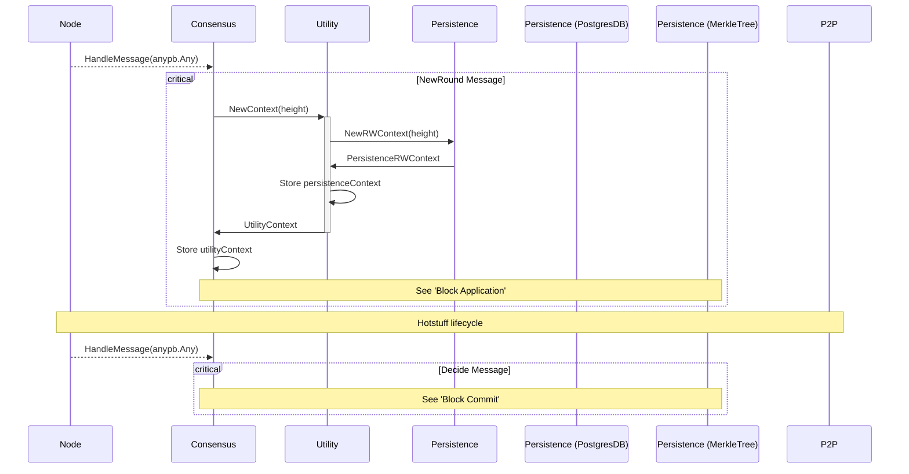
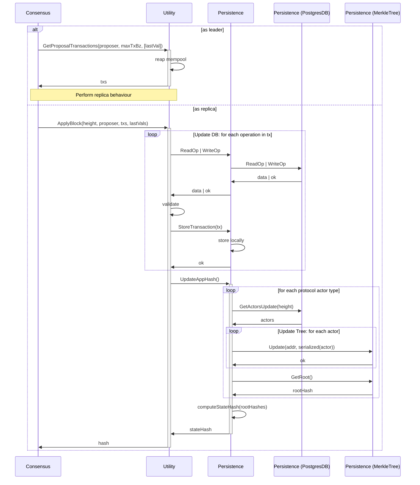
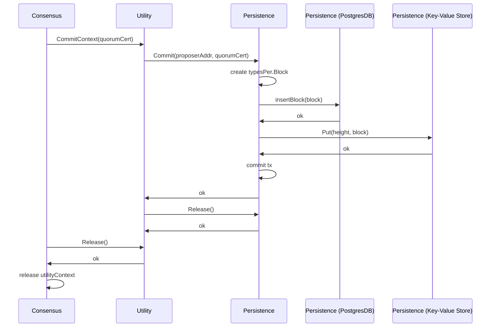

# AppHash

## Context Initialization

```mermaid
sequenceDiagram
    %% autonumber
    participant N as Node
    participant C as Consensus
    participant U as Utility
    participant P as Persistence
    participant PP as Persistence (PostgresDB)
    participant PM as Persistence (MerkleTree)
    participant P2P as P2P

    %% Should this be P2P?
    N-->>C: HandleMessage(anypb.Any)
    critical NewRound Message
        C->>+U: NewContext(height)
        U->>P: NewRWContext(height)
        P->>U: PersistenceRWContext
        U->>U: Store persistenceContext
        U->>-C: UtilityContext
        C->>C: Store utilityContext
        Note over C, PM: See 'Block Application'
    end
    Note over N, P2P: Hotstuff lifecycle
    N-->>C: HandleMessage(anypb.Any)
    critical Decide Message
        Note over C, PM: See 'Block Commit'
    end
```

### Block Application

```mermaid
sequenceDiagram
    participant C as Consensus
    participant U as Utility
    participant P as Persistence
    participant PP as Persistence (PostgresDB)
    participant PM as Persistence (MerkleTree)
    alt as leader
        C->>+U: GetProposalTransactions(proposer, maxTxBz, [lastVal])
        U->>U: reap mempool
        U->>-C: txs
        Note over C, U: Perform replica behaviour
    else as replica
        C->>+U: ApplyBlock(height, proposer, txs, lastVals)
        loop Update DB: for each operation in tx
            U->>P: ReadOp | WriteOp
            P->>PP: ReadOp | WriteOp
            PP->>P: data | ok
            P->>U: data | ok
            U->>U: validate
            U->>P: StoreTransaction(tx)
            P->>P: store locally
            P->>U: ok
        end
        U->>+P: UpdateAppHash()
        loop for each protocol actor type
            P->>PP: GetActorsUpdate(height)
            PP->>P: actors
            loop Update Tree: for each actor
                P->>PM: Update(addr, serialized(actor))
                PM->>P: ok
            end
            P->>PM: GetRoot()
            PM->>P: rootHash
        end
        P->>P: computeStateHash(rootHashes)
        P->>-U: stateHash
        U->>-C: hash
    end
```

### Block Commit

```mermaid
sequenceDiagram
    %% autonumber
    participant C as Consensus
    participant U as Utility
    participant P as Persistence
    participant PP as Persistence (PostgresDB)
    participant PK as Persistence (Key-Value Store)
    C->>U: CommitContext(quorumCert)
    U->>P: Commit(proposerAddr, quorumCert)
    P->>P: create typesPer.Block
    P->>PP: insertBlock(block)
    PP->>P: ok
    P->>PK: Put(height, block)
    PK->>P: ok
    P->>P: commit tx
    P->>U: ok
    U->>P: Release()
    P->>U: ok
    C->>U: Release()
    U->>C: ok
    C->>C: release utilityContext
```
