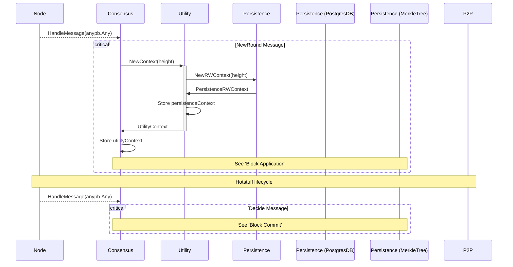
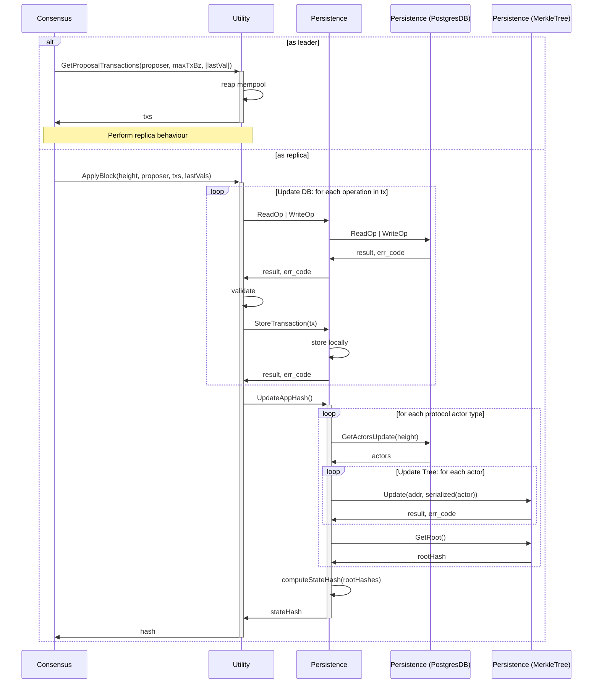
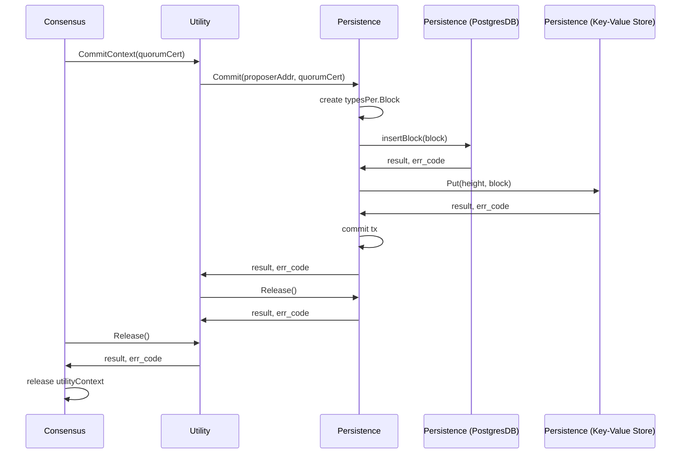

# AppHash <!-- omit in toc -->

- [Context Initialization](#context-initialization)
- [Block Application](#block-application)
- [Block Commit](#block-commit)

## Context Initialization

## Block Application

## Block Commit

