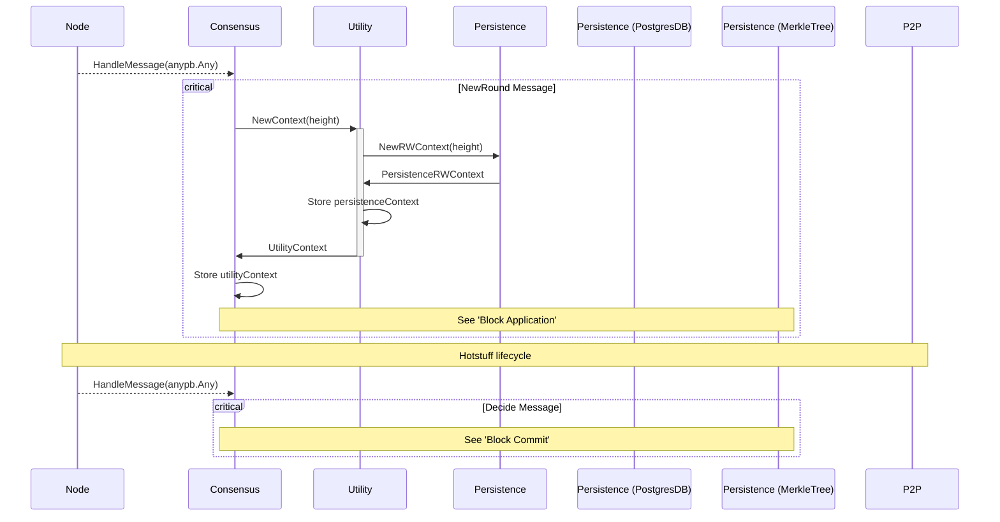

# AppHash

## Context Initialization

```mermaid
sequenceDiagram
    %% autonumber
    participant N as Node
    participant C as Consensus
    participant U as Utility
    participant P as Persistence
    participant PP as Persistence (PostgresDB)
    participant PM as Persistence (MerkleTree)
    participant P2P as P2P

    %% Should this be P2P?
    N-->>C: HandleMessage(anypb.Any)
    critical NewRound Message
        C->>+U: NewContext(height)
        U->>P: NewRWContext(height)
        P->>U: PersistenceRWContext
        U->>U: Store persistenceContext
        U->>-C: UtilityContext
        C->>C: Store utilityContext
        Note over C, PM: See 'Block Application'
    end
    Note over N, P2P: Hotstuff lifecycle
    N-->>C: HandleMessage(anypb.Any)
    critical Decide Message
        Note over C, PM: See 'Block Commit'
    end
```

## Block Application

TODO(olshansky): Add a sequenceDiagram here.

## Block Commit

TODO(olshansky): Add a sequenceDiagram here.
