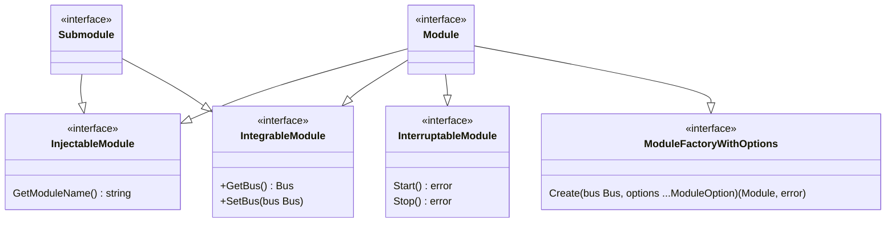
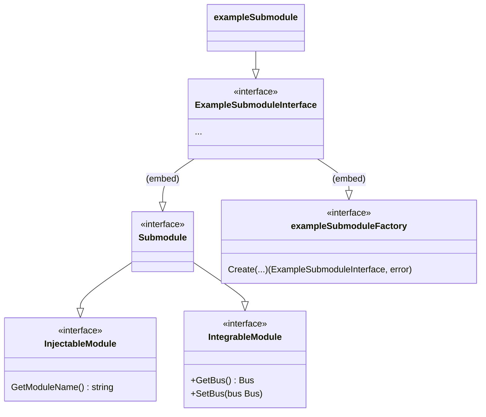

# Modules <!-- omit in toc -->

This document outlines how we structured the code by splitting it into modules, what a module is and how to create one.

<!-- IMPROVE: Add a PR example when a good example arises. -->

## Contents <!-- omit in toc -->

- [Definitions](#definitions)
	- [Shared module interface](#shared-module-interface)
	- [Module](#module)
	- [Module mock](#module-mock)
	- [Base module](#base-module)
- [Code Organization](#code-organization)
- [Modules in detail](#modules-in-detail)
	- [Module creation](#module-creation)
	- [Interacting \& Registering with the `bus`](#interacting--registering-with-the-bus)
		- [Modules Registry](#modules-registry)
			- [Modules Registry Example](#modules-registry-example)
	- [Start the module](#start-the-module)
	- [Add a logger to the module](#add-a-logger-to-the-module)
	- [Get the module `bus`](#get-the-module-bus)
	- [Stop the module](#stop-the-module)

## Definitions

### Requirement Level Keywords

The key words "MUST", "MUST NOT", "REQUIRED", "SHALL", "SHALL NOT", "SHOULD", "SHOULD NOT", "RECOMMENDED", "MAY", and "OPTIONAL" in this document are to be interpreted as described in [RFC 2119](https://www.ietf.org/rfc/rfc2119.txt).

### Class Diagram Overview



### Shared module interfaces

A shared module interface is an interface that defines the methods that we modelled as common to multiple modules.
For example: the ability to start/stop a module is pretty common and for that we defined the `InterruptableModule` interface.
There are some interfaces that are common to multiple modules and we followed the [Interface segregation principle](https://en.wikipedia.org/wiki/Interface_segregation_principle) and also [Rob Pike's Go Proverb](https://youtu.be/PAAkCSZUG1c?t=317):

> The bigger the interface, the weaker the abstraction.

These interfaces that can be embedded in modules are defined in `shared/modules/module.go`.
GoDoc comments will provide you with more information about each interface.

### Factory interfaces

In order to formalize and support the generalization of modules and submodule while still providing flexibility, we defined a set of generic factory interfaces which can be embedded or used directly to enforce consistent constructor semantics.
These interfaces are [defined in `shared/modules/factory.go`](../factory.go) and outlined convenience:

- `ModuleFactoryWithOptions`: Specialized factory interface for modules conforming to the "typical" signature above. Useful when creating modules that only require optional runtime configurations.
- `FactoryWithConfig`: A generic type, used to create a module with a specific configuration type.
- `FactoryWithOptions`: The generic form used to define `ModuleFactoryWithConfig`.
- `FactoryWithConfigAndOptions`: Another generic type which combines the capabilities of the previous two. Suitable for creating modules that require both specific configuration and optional runtime configurations.

### Module

A module is an abstraction (go interface) of a self-contained unit of functionality that carries out a specific task/set of tasks with the idea of being reusable, modular, replacable, mockable, testable and exposing a clear and concise API.

A module MAY implement 0..N common interfaces.

Each *shared* module MUST be registered with the module registry such that it can be retrieved via the bus.
You can find additional details in the [Modules in detail](#submodules-in-detail) section below.

### Module mock

A mock is a stand-in, a fake or simplified implementation of a module that is used for testing purposes.
It is used to simulate the behaviour of the module and to verify that the module is interacting with other modules correctly.
Mocks are generated using `go:generate` directives together with the [`mockgen` tool](https://pkg.go.dev/github.com/golang/mock#readme-running-mockgen).o

A global search of `mockgen` in the codebase will provide examples of where and how it's used.

### Base module

A base module is a module that implements a common interface, exposing the most basic logic.
Base modules are meant to be **embedded** in module structs which implement this common interface **and** don't need to override the respective interface member(s).

The intention being to improve DRYness (Don't Repeat Yourself) and to reduce boilerplate code.
You can find the base modules in the `shared/modules/base_modules` package.

### Submodule

A submodule is a self-contained unit of functionality which is composed by a module and is necessary for that module to function.
Each module SHOULD be registered with the module registry such that it can be retrieved via the bus.

### Example Submodule Class Diagram




## Code Organization

```bash
├── base_modules            # All the base modules are defined here
├── doc                     # Documentation for the modules
├── factory.go              # Factory interfaces (generic & module specific)
├── mocks                   # Mocks of the modules will be generated in this folder
├── module.go               # Common interfaces for the modules
├── [moduleName]_module.go  # These files contain module interface definitions
└── types                   # Common types for the modules
```

## (Sub)Modules in detail

We structured the code so that each module has its interface (and supporting interfaces, if any) defined in the `shared/modules` package, where the file containing the module interface follows the naming convention `[moduleName]_module.go`.
You can start by looking at the interfaces of the modules we already implemented to get a better idea of what a module is and how it should be structured.
You might notice that these files include `go:generate` directives, these are used to generate the module mocks for testing purposes.

### Module creation

Modules MUST implement the `ModuleFactoryWithConfig` flavor of [factory interfaces](#factory-interfaces), enforcing the following constructor signature:
```
Create(bus modules.Bus, options ...modules.ModuleOption) (modules.Module, error)
```
 
Where `options` is an (optional) variadic argument that allows for the passing of an arbitrary number options to the module.
This is useful to configure the module at creation time.

Each module constructor MUST receive this variadic option argument as all modules share this interface.
Additionally, each module MUST consider these options (i.e. loop over and call them) as support may be added for new options at any time.

See `ModuleFactoryWithOptions`, also defined in `shared/modules/factory.go`.

### Module options vs configs

Modules MAY depend on **optional** values; i.e. not necessary in order for a module to function properly.

An option function type MUST be defined for each optional value dependency.
Such option functions receive the module for option assignment by implementing `ModuleOption`.

Module MAY depend on some **required** values; i.e. necessary in order for a module to function properly.
Any such required values MUST be composed into a single config struct which can be received via the respective factory interface type.

Such a config type SHOULD implement a `#IsValid()` method which is likely called in the module constructor.

_(TODO: consider if it would be appropriate to enforce this via an interface)_

For modules, this config type MUST be defined as a protobuf type and incorporated into the [`runtime.Config`](../../../runtime/configs/config.go).
This automatically implies the following:
- config values can be set via the node's config file and overriden via environment variables
- config values MUST be serializable (i.e. no references to high-level objects in memory)

This serializable constraint on modules' configs will likely foster the creation of submodules through refactoring anywhere high-level, non-serializable, and non-submodule dependencies arise.

For examples of modules and options see:

- `Module`: [`p2pModule`](../../../p2p/module.go)
- `P2PConfig`: [`P2PConfig`](../../../runtime/configs/proto/p2p_config.proto)
- `ModuleOption`: [`WithHost`](../../../p2p/testutil.go)
- `ModuleOption`: [`WithStakedActorRouter`](../../../p2p/testutil.go)
- `ModuleOption`: [`WithUnstakedActorRouter`](../../../p2p/testutil.go)

### Submodule creation

Submodules MUST define their own concrete factory interface type derived from the most applicable [generic factory interface type](#factory-interfaces).
Depending on your submodule's requirements, you should choose the most suitable factory interface.

Each submodule factory interface type SHOULD return an interface type for the submodule; however it MAY be appropriate to return a concrete type in some cases.

### Submodule options

Submodules MAY depend on **optional** values.

An option function type MUST be defined for each optional value dependency.
Such option functions MUST receive the submodule for option assignment (similar to `ModuleOption`) in accordance with the respective factory interface type.

Option functions SHOULD be written in terms of interface submodule types but MAY instead be written in terms of concrete submodule types if they are only intended or only make sense to be used with a specific concrete submodule type.

Submodules SHOULD NOT consider options when none exist, this should be reflected in the respective factory interface type applied (i.e. no variadic options argument).

### Submodule configs

Submodules MAY also depend on some **required** values; i.e. necessary in order for a submodule to function properly.
Any such values MUST be composed in to a single config struct in accordance with the respective factory interface type.


### Comprehensive Submodule Example:
```go
var _ MySubmoduleInterface = &mySubmodule{}

type MySubmoduleInterface interface {
	modules.Submodule
	mySubmoduleFactory
}

type mySubmoduleConfig struct {
	someRequiredValue func(data []byte) error
}
type mySubmoduleOption func(*mySubmodule)
type mySubmoduleFactory = FactoryWithConfigAndOptions[
	MySubmoduleInterface,
	mySubmoduleConfig,
	mySubmoduleOption
]

type mySubmodule struct {
	someRequiredValue func(data []byte) error
	someOptionalValue string
}

func (*mySubmodule) Create(bus modules.Bus, cfg mySubmoduleConfig, opts ...mySubmoduleOption) (MySubmoduleInterface, error) {
	sub := &mySubmodule{
		someRequiredValue: cfg.someRequiredValue,
	}
	
	for _, opt := range opts {
		opt(sub)
	}
	return sub, nil
}

func WithSomeOption(someOption string) mySubmoduleOption {
	return func(s *mySubmodule) {
		s.someOptionalValue = someOption
	}
}
```

For more / real examples of submodules, see:

- `Submodule`: [`persistencePeerstoreProvider`](https://github.com/pokt-network/pocket/tree/main/p2p/providers/current_height_provider/rpc/provider.go)
- `Submodule`: [`rpcPeerstoreProvider`](https://github.com/pokt-network/pocket/tree/main/p2p/providers/current_height_provider/rpc/provider.go)

### Interacting & Registering with the `bus`

The `bus` is the specific integration mechanism that enables the greater application.

When a module is constructed via the `Create(bus modules.Bus, options ...modules.ModuleOption)` function, it is expected to internally call `bus.RegisterModule(module)`, which registers the module with the `bus` so its sibling modules can access it synchronously via a DI-like pattern.

#### Modules Registry

tl;dr Pocket module's version of dependency injection.

We implemented a [`ModulesRegistry` module](https://github.com/pokt-network/pocket/blob/19bf4d3f6507f5d406d9fafdb69b81359bccf110/runtime/modules_registry.go) that takes care of the module registration and retrieval.

This module is registered with the `bus` at the application level, it is accessible to all modules via the `bus` interface and it's also mockable as you would expect.

Modules register themselves with the `bus` by calling `bus.RegisterModule(module)`. This is done in the `Create` function of the module. (For example, in the [consensus module](https://github.com/pokt-network/pocket/blob/19bf4d3f6507f5d406d9fafdb69b81359bccf110/consensus/module.go#L146))

What the `bus` does is setting its reference to the module instance and delegating the registration to the `ModulesRegistry`.

```golang
func (m *bus) RegisterModule(module modules.Module) {
	module.SetBus(m)
	m.modulesRegistry.RegisterModule(module)
}
```

Under the hood, the module name is used to map to the instance of the module so that it's possible to retrieve a module by its name.

This is quite **important** because it unlocks a powerful concept **Dependency Injection**.

This enables the developer to define different implementations of a module and to register the one that is needed at runtime. This is because we can only have one module registered with a unique name and also because, by convention, we keep module names defined as constants.
This is useful not only for prototyping but also for different use cases such as the `p1` CLI and the `pocket` binary where different implementations of the same module are necessary due to the fact that the `p1` CLI doesn't have a persistence module but still needs to know what's going on in the network.

Submodules can be registered the same way full Modules can be, by passing the Submodule to the RegisterModule function. Submodules should typically be registered to the bus for dependency injection reasons.

##### Modules Registry Example

For example, see the `peerstore_provider` ([here](https://github.com/pokt-network/pocket/tree/19bf4d3f6507f5d406d9fafdb69b81359bccf110/p2p/providers/peerstore_provider)).

We have a `persistence` and an `rpc` implementation of the same module and they are registered at runtime depending on the use case.

Within the `P2P` module ([here](https://github.com/pokt-network/pocket/blob/19bf4d3f6507f5d406d9fafdb69b81359bccf110/p2p/module.go#L84-L88)), we check if we have a registration of the `peerstore_provider` module and if not we fallback to the default one (the `persistence` implementation).

### Start the module

Starting the module begins the service and enables operation.

Starting must come after creation and setting the bus.

```golang
err := newModule.Start()

if err != nil {
	// handle error
}
```

### Add a logger to the module

<!-- DISCUSS: I believe we should change this convention, to me it's more semantic if logging is configured during construction/initialization and not during `Start` (which some modules might not even have if they don't implement `InterruptableModule`). I believe that a better approach is summarized here: https://github.com/pokt-network/pocket/blob/8bee148f3b0e768154be4bce02e94813c9382aac/state_machine/module.go#L29-L32 -->

When defining the start function for the module, it is essential to initialise a namespace logger as well:

```golang
func (m *newModule) Start() error {
    m.logger = logger.Global.CreateLoggerForModule(u.GetModuleName())
    ...
}
```

### Get the module `bus`

The bus may be accessed by the module object at anytime using the `getter`

```golang
bus := newModule.GetBus()

# The bus enables access to interfaces exposed by other modules in the codebase
bus.GetP2PModule().<FunctionName>
bus.GetPersistenceModule().<FunctionName>
...
```

### Stop the module

Stopping the module, ends the service and disables operation.

This is the proper way to conclude the lifecycle of the module.

```golang
err := newModule.Stop()

if err != nil {
	// handle error
}
```

<!-- GITHUB_WIKI: shared/modules/readme -->
