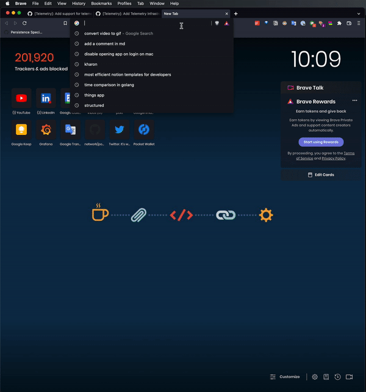
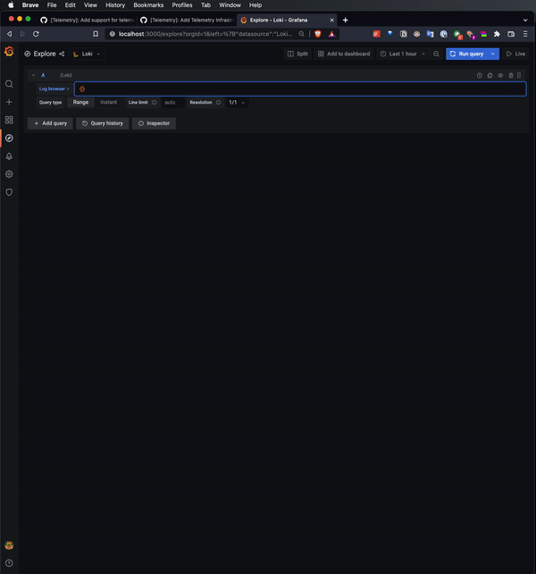
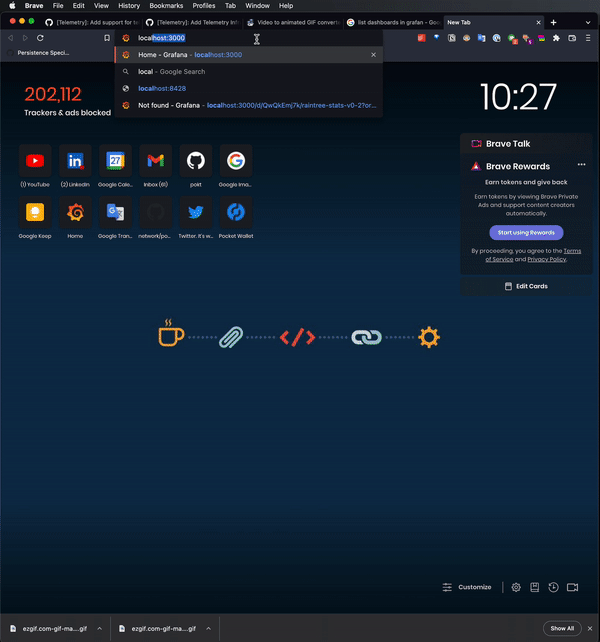

# Welcome to the Telemetry Module <!-- omit in toc -->

- [Introduction](#introduction)
- [Usage](#usage)
  - [Node Configuration](#node-configuration)
  - [Time Series Metrics](#time-series-metrics)
    - [How to collect time-series metrics?](#how-to-collect-time-series-metrics)
  - [Event Metrics](#event-metrics)
    - [How to use event metrics?](#how-to-use-event-metrics)
    - [Consuming logs in Loki](#consuming-logs-in-loki)
    - [Using Grafana](#using-grafana)
- [Defining your own metrics](#defining-your-own-metrics)
- [Defining your own metrics](#defining-your-own-metrics-1)

# Introduction

This module is used to collect telemetry data from the node.

We use two types of metrics:

- **Time Series metrics**: Metrics collected at regular intervals and stored in a database.
- **Event series metrics**: Event-driven (i.e. not time-driven) metrics that are stored in a database.
  - _INVESTIGATE(team): Replacing logs with a proper events solution for recording Event Metrics._

By leveraging:

- **Prometheus**: for time-series metrics
- **Plain Logs**: for event metrics
  - _INVESTIGATE(team): Might be substituted in the future with an events database._

# Usage

## Node Configuration

It is necessary to provide a telemetry configuration to your node in `config.json`:

```json
 "enable_telemetry": true,
 "telemetry": {
    "address": "0.0.0.0:9000",
    "endpoint": "/metrics"
  }
```

- `enable_telemetry`: configures node to expose telemetry if true.
- `address`: is the Prometheus server's address that the telemetry module will listen on.
- `endpoint`: the endpoint that Prometheus exposes through the telemetry module for other services to pull the metrics (i.e. usually referred to as the _scraping endpoint_).

## Time Series Metrics

If you are not familiar with the time-series concepts related to Prometheus, you can review [Prometheus Metrics](https://prometheus.io/docs/concepts/metric_types/).

Primarily, we use:

- Gauges

To keep track of:

- Block height
- Number of nodes online

### How to collect time-series metrics?

In your module, make sure you have access to the bus, then use the metrics you need as follows:

```go
// Retrieve the time-series agent:
timeSeriesTelemetry := module.GetBus().GetTelemetryModule().GetTimeSeriesAgent()

/* explore the methods you can use in shared/modules/telemetry_module.go */

// Increment a gauge by:
timeSeriesTelemetry.GaugeIncrement("gauge_name", 1)

/* ... */
```

## Event Metrics

In the current implementation, we are recording events through logs.

Loki and Grafana are used to parse the logs and generate the desired graphs.

### How to use event metrics?

In your module, make sure you have access to the bus, then use the metrics you need as follows:

```go
// Retrieve the event metrics agent:
eventMetricsTelemetry := module.GetBus().GetTelemetryModule().GetEventMetricsAgent()

/* explore the methods you can use in shared/modules/telemetry_module.go */

// Emit an event by:
eventMetricsTelemetry.EmitEvent(
    "namespace",
    "event_name",
    ... // any other fields you want to include
)

/* ... */
```

### Consuming logs in Loki

To test this out, [track an event in your code](#event-metrics), and then go to your [Grafana's local setup's link](#using-grafana), and to the the explore page.

Run the following LogQL query:

```sql
{host="desktop-docker"} |= "[EVENT] your_namespace your_event" | pattern `<datetime> <_> <time> <type> <event_name> <any> <aditional> <whitespaced> <items>` | logfmt
```

See the images below for an example of how to use the `Explore` functionality.

Go to the explore page:



Type in your query and play with the results:



You should see a log stream coming out where you can click a line to explore how you've used the `pattern` keyword in LogQL to parse the log line. Now you can reference your parsed fields per your needs.

**Example**: Counting how many events we've seen by type over 5m:

```sql
sum by (type) (count_over_time(
    {host="desktop-docker"}
    |= "[EVENT] your_namespace"
    | pattern `<datetime> <_> <time> <type> <event_name> <any> <aditional> <whitespaced> <items>`[5m]
))
```

**Example**: Counting how many events of a certain type have we seen over 5m:

```sql
sum (count_over_time(
  {host="desktop-docker"}
  |= "[EVENT] your_namespace your_event"
  | pattern `<datetime> <_> <time> <type> <event_name> <any> <aditional> <whitespaced> <items>`[5m]
))
```

### Using Grafana

To launch and start using Grafana, do the following:

0. Prepare environment (one-time setup)

If you haven't already, make sure you install all necessary pre-requisites in the [Development README](docs/development/README.md).
Make sure you've installed the docker Loki dependencies:

```bash
$ make docker_loki_install
```

1. Spin up the stack

```bash
$ make compose_and_watch
```

2. Wait a few seconds and **Voila!**
3. **Grafana**: Visit: `http://localhost:3000` and browse pre-configured dashboards by navigating to the sidebar on Grafana and clicking on `Search Dashboards` as shown below.
4. **Victoria Metrics**: Visit `http://localhost:8428/vmui`
5. Check to see if Victoria Metrics detects the Prometheus endpoint by checking [VM targets](http://localhost:8428/targets). You should see a section named: `pocket-nodes` with the Prometheus endpoint details and status underneath.

_NOTE: Make sure you use `http` and not `https` when developing locally._



# Defining your own metrics

We follow a specific pattern to define our metrics to guarantee consistency and ease of use.
Metric definitions for each module/domain/service are stored under a new folder called `telemetry` in the module's folder, in a file named `metrics.go`, and they respect the following rules:

- Every metric's name and description and any additional information about the metric should be defined as a constant.
- Constants relative to a metric's definition follow a naming pattern: `<metric_name>_<metric_type>_<metric_attribute>`
- # We keep the actual metric name value open for definition however the developer sees fit.

# Defining your own metrics

We follow a specific pattern to define our metrics to guarantee consistency and ease of use.
Metric definitions for each module/domain/service are stored under a new folder called `telemetry` in the module's folder, in a file named `metrics.go`, and they respect the following rules:

- Every metric's name and description and any additional information about the metric should be defined as a constant.
- Constants relative to a metric's definition follow a naming pattern: `<metric_name>_<metric_type>_<metric_attribute>`
- We keep the actual metric name value open for definition however the developer sees fit.

For example:

We want to define a metric of type: timeseries, with a name: `nodes_alive_counter`,

The constants definition will be as follows:

```go
// metric_name=NODES_ALIVE_COUNTER
// metric_type=TIME_SERIES
// metric_attribute=NAME
const NODES_ALIVE_COUNTER_TIME_SERIES_NAME = "nodes_alive_counter"
const NODES_ALIVE_COUNTER_TIME_SERIES_DESCRIPTION = "Number of nodes online"
```

This makes referencing the metrics easier, and makes it easy to change the name of the metric later on, in addition to the fact that it gathers metric definitions in a single file.
